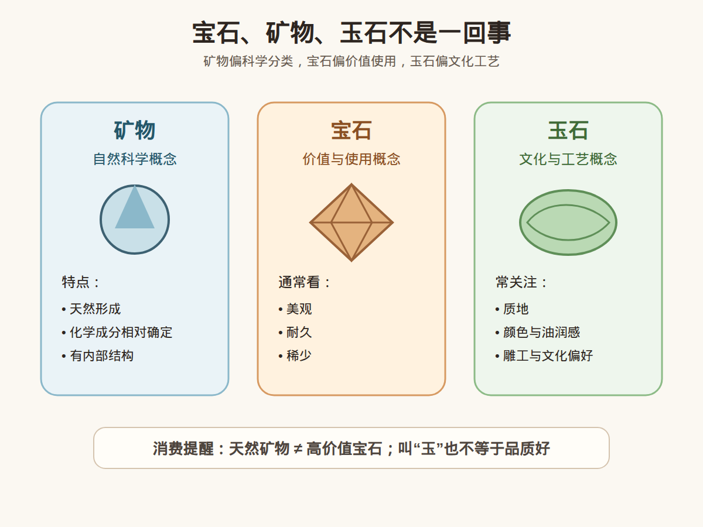

# 第 1 课：宝石、矿物、玉石的区别

## 1. 本课核心笔记

### 1.1 为什么先区分这三个概念

学习珠宝时，很容易把「宝石」「矿物」「玉石」混在一起。它们确实有交集，但不是同一个概念。

简单说：

- 矿物是自然界中具有一定化学成分和晶体结构的天然物质。
- 宝石是能被人类用于装饰、收藏或商业交易的材料，通常要求美观、稀少、耐久。
- 玉石是一个更偏文化和工艺使用的概念，常指适合雕琢、佩戴和欣赏的矿物集合体或岩石。

### 1.2 矿物：更偏自然科学概念

矿物通常具备几个特点：

1. 天然形成。
2. 有相对确定的化学成分。
3. 有相对稳定的内部结构。
4. 多数为无机物。

例如：

- 石英是一种矿物。
- 刚玉是一种矿物。
- 绿柱石是一种矿物。

但不是所有矿物都能成为宝石。大量矿物不够漂亮、不够稀少，或者不适合日常佩戴。

### 1.3 宝石：更偏价值和使用场景

宝石通常需要满足三类条件：

1. 美观：颜色、透明度、光泽、火彩、特殊光学效应等。
2. 耐久：硬度、韧性、稳定性能够支持加工和佩戴。
3. 稀少：产量有限，或者高品质材料相对少见。

常见宝石包括：

- 钻石
- 红宝石
- 蓝宝石
- 祖母绿
- 碧玺
- 尖晶石
- 珍珠

注意：珍珠、珊瑚、琥珀等并不完全符合典型矿物定义，但在珠宝体系中仍属于重要宝石材料。

### 1.4 玉石：更偏文化、工艺和集合体概念

玉石不一定是单一矿物。很多玉石是矿物集合体或岩石。

例如：

- 翡翠主要由硬玉矿物组成，但常表现为矿物集合体。
- 和田玉主要由透闪石、阳起石等矿物组成。
- 岫玉、独山玉等也有各自的矿物组成和文化语境。

玉石的评价不只看透明度或火彩，还常涉及：

- 颜色
- 质地
- 细腻度
- 油润感
- 工艺
- 题材
- 文化偏好

### 1.5 三者关系

可以这样理解：

```text
矿物：自然科学分类
宝石：珠宝使用和商业价值分类
玉石：文化、工艺和材料使用分类
```



它们有交集，但不能互相替代。

例如：

- 红宝石是宝石，也是刚玉这一矿物的红色宝石级品种。
- 翡翠是玉石，也属于重要珠宝材料，但通常不是单一晶体宝石。
- 石英是矿物，其中高品质紫水晶可以作为宝石，但普通石英不一定有珠宝价值。

## 2. 必背知识卡

### 卡片 1：矿物

矿物是自然界中形成的、具有相对确定化学成分和内部结构的天然物质。

### 卡片 2：宝石

宝石是可用于装饰、收藏或商业交易的珠宝材料，通常具有美观、耐久、稀少等特点。

### 卡片 3：玉石

玉石是适合雕琢、佩戴和欣赏的材料概念，常与文化审美、工艺和质地评价有关。

### 卡片 4：三者区别

矿物偏科学分类，宝石偏价值和使用场景，玉石偏文化与工艺语境。

### 卡片 5：消费提醒

商家说「这是天然矿物」不等于它一定是高价值宝石；说「这是玉」也不等于品质一定好。

## 3. 可交互作业

### 作业 1：分类练习

请把下面材料分别标注为「矿物」「宝石」「玉石」，可以多选：

1. 刚玉
2. 红宝石
3. 石英
4. 紫水晶
5. 翡翠
6. 和田玉
7. 珍珠

参考思路：

- 先判断它是不是自然科学意义上的矿物。
- 再判断它是否被用于珠宝装饰和交易。
- 最后判断它是否属于玉石文化和工艺语境。

### 作业 2：消费话术拆解

看到一句话：「这是天然矿物做的，很有收藏价值。」

请尝试回答：

1. 天然矿物是否自动等于宝石？
2. 收藏价值需要哪些证据支持？
3. 如果价格较高，应该要求什么资料？

建议答案方向：

- 天然不等于高价值。
- 收藏价值需要品质、稀少性、市场认可、证书或来源记录等支持。
- 高价购买建议查看权威证书，并考虑复检或咨询专业机构。

## 4. 自媒体内容草稿

### 标题备选

- 我学珠宝的第一课：宝石、矿物、玉石不是一回事
- 商家说「天然矿物」，为什么不等于它很值钱？
- 珠宝小白先搞懂：宝石、矿物、玉石到底差在哪

### 短视频/图文脚本

今天学珠宝第一课，我先把三个经常混用的词分清楚：宝石、矿物、玉石。

矿物更像自然科学概念，比如刚玉、石英、绿柱石。它们有相对确定的化学成分和内部结构。

宝石更看使用价值和商业价值，通常要美观、耐久、稀少。红宝石、蓝宝石、钻石就是典型宝石。

玉石则更偏文化和工艺语境，比如翡翠、和田玉。它们不一定是单一晶体，更常看质地、颜色、油润感和雕工。

所以新手听到「天然矿物」时，不要自动理解成「很值钱」。天然只是一个信息点，价值还要看品质、稀少性、工艺、证书和市场认可。

我现在还是学习者，不做鉴定和估价。高价购买建议看证书、做复检，必要时找专业机构判断。

### 评论区互动问题

你以前有没有把「矿物」「宝石」「玉石」当成同一个意思？最容易混淆的是哪个？

### 发布素材包

- [宝石、矿物、玉石区别图 PNG](../assets/lesson-01/gem-mineral-jade-comparison.png) / [SVG 源文件](../assets/lesson-01/gem-mineral-jade-comparison.svg)
- [第 1 课短视频分镜](../assets/lesson-01/video-shotlist.md)
- [第 1 课图文轮播稿](../assets/lesson-01/carousel-copy.md)

## 5. 学习档案更新

- 学习阶段：第 1 阶段，普通地质学、矿物学、晶体学、岩石学基础。
- 本课主题：宝石、矿物、玉石的区别。
- 已掌握：
  - 矿物、宝石、玉石的基本定义。
  - 三者之间有交集，但不能互相替代。
  - 天然矿物不等于高价值珠宝。
- 需要复习：
  - 常见宝石对应的矿物名称。
  - 玉石与单晶宝石在评价逻辑上的差异。
- 下一课：宝石的主要形成环境。
