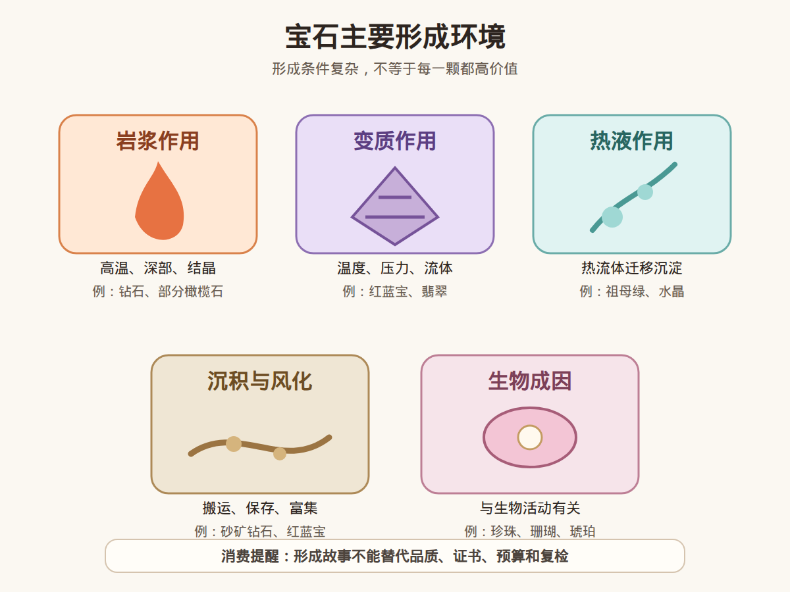

# 第 2 课：宝石的主要形成环境

## 1. 本课核心笔记

### 1.1 本课重要结论

这一课先记住 5 个结论：

1. 宝石形成和地球内部、地表环境有关，不是凭空出现的。
2. 岩浆作用、变质作用、热液作用、沉积风化和生物成因是入门要先理解的几类环境。
3. 形成环境可以解释一部分稀少性和复杂性。
4. 形成条件复杂不等于每一颗宝石都品质好、价值高。
5. 形成环境不能单独作为鉴定、估价或产地判断依据。

一句话总结：

> 形成环境帮助我们理解宝石从哪里来，但购买判断仍然要回到品质、证书、处理情况、预算和复检支持。

### 1.2 为什么要学宝石形成环境

宝石不是凭空出现的。它们的形成与地球内部和地表环境有关。理解宝石形成环境，可以帮助我们初步理解：

- 为什么有些宝石稀少。
- 为什么同一种矿物会有不同颜色和品质。
- 为什么产地、包裹体、处理方式会成为宝石学中的重要话题。
- 为什么普通消费者不能只靠肉眼或商家描述判断价值。

本课不做产地判断，只学习形成环境的基础框架。

### 1.3 岩浆作用环境

岩浆作用是地球内部高温熔融物质冷却、结晶的过程。部分宝石矿物可以在岩浆或与岩浆相关的环境中形成。

相关例子：

- 钻石常与深部地幔环境和金伯利岩、钾镁煌斑岩等岩浆通道有关。
- 部分橄榄石、锆石、长石等可与岩浆岩环境相关。
- 一些宝石级矿物可能在特殊化学条件下结晶。

对小白来说，重点不是背复杂岩石名称，而是理解：有些宝石来自高温、高压或深部地质过程，因此形成条件苛刻。

### 1.4 变质作用环境

变质作用是原有岩石在温度、压力和流体作用下发生矿物成分或结构变化的过程。很多重要宝石与变质环境有关。

相关例子：

- 红宝石和蓝宝石可与变质岩环境有关。
- 翡翠的形成与特殊高压低温地质环境有关。
- 石榴石、尖晶石、部分碧玺也可能出现在变质相关环境中。

变质环境告诉我们：同一种元素或矿物，在不同温压条件下可能形成不同矿物组合，也可能影响颜色、包裹体和品质。

### 1.5 热液作用环境

热液作用是富含矿物质的热流体在岩石裂隙中迁移、沉淀和结晶的过程。

相关例子：

- 祖母绿常与含铍流体和含铬、钒等元素环境有关。
- 水晶、玛瑙等二氧化硅类材料常与热液或低温流体活动有关。
- 一些矿脉型宝石也可能与热液活动有关。

热液环境的重点是：流体会带来成分，也会沿裂隙沉淀，因此宝石可能呈脉状、晶洞状或裂隙充填状出现。

### 1.6 沉积与风化环境

有些宝石不是直接在原生矿床中被开采，而是在风化、搬运、沉积后富集。

相关例子：

- 钻石可以从原生矿床风化后进入河流沉积物。
- 蓝宝石、红宝石、尖晶石等高硬度宝石可在砂矿中富集。
- 琥珀与古代树脂埋藏和地质转化有关。

沉积与风化环境说明：宝石能否被发现，不只取决于形成，还取决于后期是否被保存、搬运和富集。

### 1.7 生物成因材料

并非所有珠宝材料都是典型矿物。部分珠宝材料与生物活动有关。

相关例子：

- 珍珠来自贝类分泌物的层层沉积。
- 珊瑚来自珊瑚虫骨骼。
- 琥珀来自古代树脂。

这类材料在珠宝体系里很重要，但评价逻辑和矿物宝石不完全一样。

### 1.8 消费视角：形成环境不是购买结论

了解形成环境有助于理解宝石的稀少性和复杂性，但不能直接推出：

- 一定天然。
- 一定高价。
- 一定来自某产地。
- 一定未经处理。
- 一定值得收藏。

消费者购买时仍然需要结合：

- 证书
- 品质参数
- 预算
- 佩戴场景
- 商家信誉
- 是否支持复检

## 2. 必背知识卡

### 卡片 1：岩浆作用

岩浆作用与高温熔融物质冷却结晶有关，部分宝石矿物形成于岩浆或与岩浆相关的环境。

### 卡片 2：变质作用

变质作用是原有岩石在温度、压力和流体影响下发生变化，许多重要宝石与变质环境有关。

### 卡片 3：热液作用

热液作用是富含矿物质的热流体迁移、沉淀和结晶，常与矿脉、晶洞、裂隙充填有关。

### 卡片 4：沉积与风化

部分宝石形成后会被风化、搬运和富集，形成砂矿或次生矿床。

### 卡片 5：形成环境的边界

形成环境只能帮助理解来源和稀少性，不能单独作为鉴定、估价或产地判断依据。

## 3. 可交互作业

### 作业 1：形成环境连线

请尝试把下面材料和可能相关的形成环境连起来：

1. 钻石
2. 红宝石
3. 祖母绿
4. 水晶
5. 珍珠

可选环境：

- 岩浆或深部地质过程
- 变质作用
- 热液作用
- 生物成因

提示：现实中的宝石形成可能很复杂，本练习只帮助建立入门框架。

### 作业 2：消费判断练习

如果商家说：「这个宝石形成条件特别苛刻，所以一定值得收藏。」

请回答：

1. 形成条件苛刻是否等于品质好？
2. 收藏价值还需要哪些证据？
3. 如果价格较高，应如何降低风险？

建议答案方向：

- 形成条件苛刻不等于每一颗品质都好。
- 收藏价值还需要看颜色、净度、大小、处理情况、证书、市场认可等。
- 高价购买建议要求权威证书、支持复检，并咨询专业机构。

## 4. 自媒体内容草稿

### 标题备选

- 宝石到底从哪里来？我学到的 5 种形成环境
- 形成条件很苛刻，就一定值得买吗？
- 珠宝小白学习笔记：宝石不是凭空变贵的

### 短视频/图文脚本

今天继续学宝石学基础：宝石到底是怎么形成的？

我目前把它先理解成几个大类：岩浆作用、变质作用、热液作用、沉积风化，还有一些生物成因材料。

比如钻石和深部地质过程有关，红蓝宝可能和变质环境有关，祖母绿常和特殊流体活动有关，水晶、玛瑙可能和热液或低温流体有关，珍珠则和贝类生物活动有关。

但这里有一个消费提醒：形成条件复杂，不等于这颗宝石就一定贵，也不等于一定值得收藏。

真正买东西时，还要看颜色、净度、大小、处理情况、证书、预算和佩戴需求。尤其是高价货，不要只听故事，建议看证书、支持复检，必要时找专业机构判断。

我现在还在从零学习，不做鉴定、估价和产地结论，只记录自己怎么一步步理解珠宝。

### 评论区互动问题

你买珠宝时，更容易被「形成故事」打动，还是更看重证书和预算？

### 发布素材包

- [宝石主要形成环境图 PNG](../assets/lesson-02/formation-environments-map.png) / [SVG 源文件](../assets/lesson-02/formation-environments-map.svg)
- [第 2 课短视频分镜](../assets/lesson-02/video-shotlist.md)
- [第 2 课分屏视频脚本](../assets/lesson-02/split-screen-script.md)
- [第 2 课图文轮播稿](../assets/lesson-02/carousel-copy.md)

## 5. 学习档案更新

- 学习阶段：第 1 阶段，普通地质学、矿物学、晶体学、岩石学基础。
- 本课主题：宝石的主要形成环境。
- 已掌握：
  - 宝石形成与岩浆、变质、热液、沉积风化、生物成因等环境有关。
  - 形成环境可以解释一部分稀少性和复杂性。
  - 形成环境不能单独作为购买、鉴定、估价或产地判断依据。
- 需要复习：
  - 各类形成环境对应的典型宝石例子。
  - 原生矿床和次生富集的区别。
- 下一课：矿物的物理性质：硬度、解理、断口、光泽。
