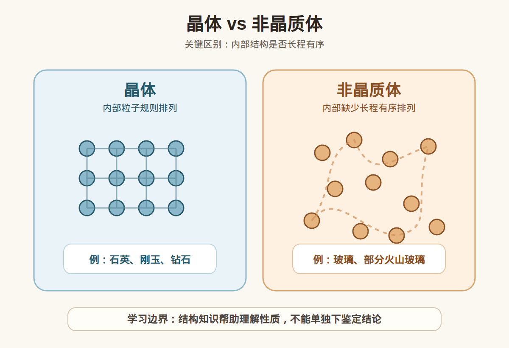
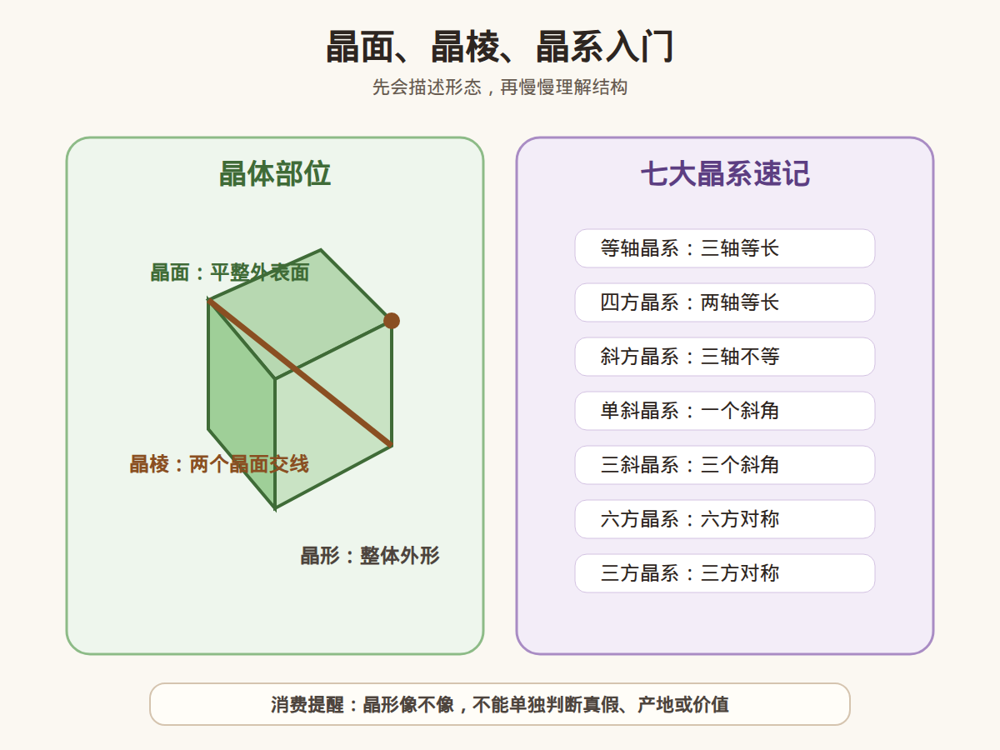

# 第 4 课：晶体、晶面和晶系入门

## 1. 本课核心笔记

### 1.1 本课重要结论

这一课先记住 7 个结论：

1. 晶体的核心不是“外形好看”，而是内部粒子具有规则、重复的排列。
2. 非晶质体没有长程有序的内部结构，典型例子包括玻璃和部分火山玻璃。
3. 晶面是晶体外部相对平整的面，晶棱是两个晶面相交形成的线，晶形是晶体整体外形。
4. 晶体结构会影响硬度、解理、光学性质等，但不能单独用来做真假、产地或价值判断。
5. 七大晶系是描述晶体对称和轴长关系的入门框架，不需要一开始就死背所有复杂参数。
6. 同一种矿物可能因为生长环境不同，外形不够“教科书”；外形不好看不等于不是晶体。
7. 面向消费场景时，“晶体感强”“晶形完整”只能作为观察描述，不能直接等于高品质或高价值。

一句话总结：

> 晶体看的是内部规则结构，晶面、晶棱、晶形帮助我们描述外部形态，晶系帮助我们理解分类，但这些都不能替代证书和专业检测。

### 1.2 为什么学习晶体

前几课我们已经学过：

- 宝石、矿物、玉石不是一回事。
- 宝石有不同形成环境。
- 硬度、解理、断口、光泽会影响观察和佩戴风险。

这一课开始接触晶体学。它的作用是帮助我们理解：

- 为什么矿物有固定形态倾向。
- 为什么有些矿物会沿特定方向解理。
- 为什么同一种矿物的物理性质比较稳定。
- 为什么宝石学里会反复提到晶体结构、晶系、光学方向。

但本课仍然是入门，不做复杂数学推导。

### 1.3 晶体和非晶质体

晶体指内部粒子具有规则、重复排列的固体。重点在“内部结构”，不是外表是否长得完美。

非晶质体则缺少长程有序排列。它可能也是固体，也可能透明、漂亮、能用于装饰，但内部结构和晶体不同。



| 类型 | 入门理解 | 例子 |
| --- | --- | --- |
| 晶体 | 内部粒子规则、重复排列 | 石英、刚玉、钻石、绿柱石 |
| 非晶质体 | 缺少长程有序结构 | 玻璃、黑曜石、部分人工玻璃材料 |

注意：有些宝石材料不是单个完整晶体，而是晶体集合体、隐晶质集合体或生物成因材料。比如翡翠、和田玉、玛瑙、珍珠，它们的评价逻辑不能简单套用“单晶宝石”的思路。

### 1.4 晶面、晶棱、晶形

观察晶体外形时，先学三个词：

- 晶面：晶体外部相对平整的面。
- 晶棱：两个晶面相交形成的线。
- 晶形：晶体整体外部形态。



可以把它理解成：

```text
晶面 = 面
晶棱 = 面和面交出来的线
晶形 = 整个晶体长出来的外形
```

例如，石英常见六方柱状晶形，萤石常见立方体或八面体形态，石榴石常见近似等轴晶体形态。但自然界中的晶体常常受到空间、温度、流体、杂质和生长速度影响，不一定长得很完整。

### 1.5 晶体结构为什么会影响性质

矿物的物理性质不是随机的，而是和内部结构有关。

#### 影响硬度

内部结合力强，结构稳定，通常会表现出较高硬度。钻石硬度高，和碳原子的强共价键网络有关。

但仍要记住：硬度不是韧性，硬度高不等于摔不坏。

#### 影响解理

如果晶体内部某些方向结合力较弱，受力时就可能沿这些方向裂开，这就是解理。

所以第 3 课讲的“解理”并不是表面现象，而是和内部结构有关。

#### 影响光学性质

晶体结构会影响光在宝石内部的传播方向。后面学习折射率、双折射、多色性时，会继续遇到这些概念。

这一课只需要先记住：

> 结构不同，性质可能不同；但性质观察不能随便升级成鉴定结论。

### 1.6 七大晶系入门

晶系是按晶体对称性和晶轴关系划分的基础分类。入门阶段先知道有七大晶系即可：

| 晶系 | 入门记忆 | 常见例子 |
| --- | --- | --- |
| 等轴晶系 | 三个轴等长，彼此垂直 | 钻石、石榴石、尖晶石、萤石 |
| 四方晶系 | 两个轴等长，一个轴不同 | 锆石、金红石 |
| 斜方晶系 | 三个轴不等长，彼此垂直 | 橄榄石、黄玉 |
| 单斜晶系 | 三个轴不等长，有一个斜角 | 透辉石、硬玉 |
| 三斜晶系 | 三个轴不等长，角度都不完全垂直 | 斜长石、绿松石 |
| 六方晶系 | 有六方对称特征 | 绿柱石、磷灰石 |
| 三方晶系 | 有三方对称特征 | 石英、刚玉、碧玺、方解石 |

入门不要被“轴长、轴角、对称元素”吓到。现在先把它当成矿物分类语言，后面遇到具体宝石时再慢慢对应。

### 1.7 消费视角：晶形好看不等于价值结论

商家可能会说：

- 晶体很完整。
- 晶形很漂亮。
- 晶体感很强。
- 这个结构一看就不一般。

这些说法可以是观察描述，但不能直接推出：

- 一定天然。
- 一定无处理。
- 一定高品质。
- 一定来自某个产地。
- 一定值得收藏。

更稳妥的消费判断应该结合：

1. 材料类别。
2. 品质参数。
3. 是否处理。
4. 证书和复检支持。
5. 预算和佩戴需求。
6. 商家售后和退换规则。

### 1.8 本课学习边界

这一课学习的是“描述和理解框架”，不是让我们直接用肉眼鉴定。

可以说：

> 这颗矿物表现出比较明显的晶面和晶棱，外形接近某种晶体习性。

不建议说：

> 这个晶形一看就是真的、产地很明确、肯定很值钱。

## 2. 必背知识卡

### 卡片 1：晶体

晶体是内部粒子具有规则、重复排列的固体；重点是内部结构，不是外形是否完美。

### 卡片 2：非晶质体

非晶质体缺少长程有序内部结构，玻璃和黑曜石是入门常见例子。

### 卡片 3：晶面

晶面是晶体外部相对平整的面。

### 卡片 4：晶棱

晶棱是两个晶面相交形成的线。

### 卡片 5：晶形

晶形是晶体整体外部形态，会受到生长空间、温度、流体和杂质等因素影响。

### 卡片 6：晶系

晶系是按晶体对称性和晶轴关系划分的基础分类，入门先记七大晶系。

### 卡片 7：消费边界

晶形、晶面和晶系知识可以帮助观察和理解，不能单独作为真假、产地、处理或价值判断依据。

## 3. 可交互作业

### 作业 1：概念判断

请判断下面说法是否准确，并说明理由：

1. 晶体一定要外形非常完整、晶面很漂亮。
2. 非晶质体就不能用于装饰。
3. 晶面是面，晶棱是线，晶形是整体外形。
4. 晶体结构会影响解理和光学性质。
5. 晶形完整就能说明这件宝石一定高价值。

参考方向：

- 第 1 句不准确，晶体核心是内部结构，外形可能不完整。
- 第 2 句不准确，非晶质材料也可能用于装饰，如玻璃、黑曜石。
- 第 3 句准确。
- 第 4 句准确。
- 第 5 句不准确，价值还要看品质、处理、证书、市场和预算。

### 作业 2：观察语言改写

把这句话改成更稳妥的小白学习表达：

> 这个晶体长得这么完整，一看就很值钱。

建议改写：

> 这个样品晶形比较完整，观察价值不错；但是否有商业价值，还要看材料种类、品质、处理情况、证书和市场认可。

### 作业 3：晶系入门记忆

请先不用死背复杂参数，只尝试把下面宝石和晶系连起来：

1. 钻石
2. 石英
3. 绿柱石
4. 黄玉
5. 硬玉

参考方向：

- 钻石：等轴晶系。
- 石英：三方晶系。
- 绿柱石：六方晶系。
- 黄玉：斜方晶系。
- 硬玉：单斜晶系。

## 4. 自媒体内容草稿

### 4.1 图文/短视频标题备选

- 我学珠宝第 4 课：晶体不是只看外形好不好看
- 晶面、晶棱、晶形，一次讲清楚
- 晶形完整就一定值钱吗？珠宝小白先别急着下结论
- 宝石为什么会有固定形状？晶体学入门第一课

### 4.2 短视频脚本

今天学珠宝第 4 课：晶体、晶面和晶系入门。

我以前以为晶体就是外形长得很规则、很漂亮的石头。但学完发现，晶体真正重要的是内部粒子有规则、重复的排列。

晶面是晶体外部相对平整的面，晶棱是两个晶面相交形成的线，晶形是晶体整体长出来的外形。

晶体结构会影响硬度、解理和光学性质。比如为什么有些矿物会沿特定方向裂开，和内部结构就有关系。

入门还会遇到七大晶系：等轴、四方、斜方、单斜、三斜、六方、三方。现在不用一下子背复杂参数，先把它当成矿物分类语言。

但消费上要注意：晶形完整、晶体感强，只能作为观察描述，不能直接说明天然、无处理、高品质或者高价值。高价购买还是要看证书、复检和专业机构判断。

### 4.3 图文结构

第 1 页：标题

- 晶体不是只看外形好不好看

第 2 页：晶体是什么

- 内部粒子规则排列
- 外形不完整也可能是晶体

第 3 页：非晶质体是什么

- 缺少长程有序结构
- 例：玻璃、黑曜石

第 4 页：晶面、晶棱、晶形

- 晶面 = 面
- 晶棱 = 面和面交出的线
- 晶形 = 整体外形

第 5 页：七大晶系

- 等轴、四方、斜方
- 单斜、三斜、六方、三方

第 6 页：消费提醒

- 晶形完整不等于一定值钱
- 结构知识不能替代证书
- 高价货建议复检

### 4.4 配图与视频建议

本课需要配图，不然“内部结构”和“晶面晶棱”会比较抽象。本仓库已准备：

- [晶体 vs 非晶质体 PNG](../assets/lesson-04/crystal-vs-amorphous.png) / [SVG 源文件](../assets/lesson-04/crystal-vs-amorphous.svg)
- [晶面、晶棱、晶系入门图 PNG](../assets/lesson-04/crystal-faces-edges-systems.png) / [SVG 源文件](../assets/lesson-04/crystal-faces-edges-systems.svg)
- [第 4 课短视频分镜](../assets/lesson-04/video-shotlist.md)
- [第 4 课分屏视频脚本](../assets/lesson-04/split-screen-script.md)
- [第 4 课图文轮播稿](../assets/lesson-04/carousel-copy.md)

### 4.5 评论区互动问题

你以前是不是也以为“晶体”主要看外形漂不漂亮？你想先认识哪一种宝石的晶体形态？

## 5. 学习档案更新

- 学习阶段：第 1 阶段，普通地质学、矿物学、晶体学、岩石学基础。
- 本课主题：晶体、晶面和晶系入门。
- 已掌握：
  - 晶体的核心是内部规则结构。
  - 非晶质体缺少长程有序排列。
  - 晶面、晶棱、晶形的基本含义。
  - 晶体结构会影响硬度、解理和光学性质。
  - 七大晶系是晶体分类的入门框架。
  - 晶形完整不能单独作为价值或鉴定结论。
- 需要复习：
  - 七大晶系名称。
  - 常见宝石对应晶系。
  - 晶体结构和解理的关系。
- 自媒体素材：
  - 本课适合做成 1 条 60-90 秒短视频。
  - 本课适合做成 6 页图文轮播。
  - 本课需要配图，至少包含晶体/非晶质体对比图和晶面/晶棱示意图。
- 下一课建议：岩石基础：岩浆岩、沉积岩、变质岩与宝石的关系。
