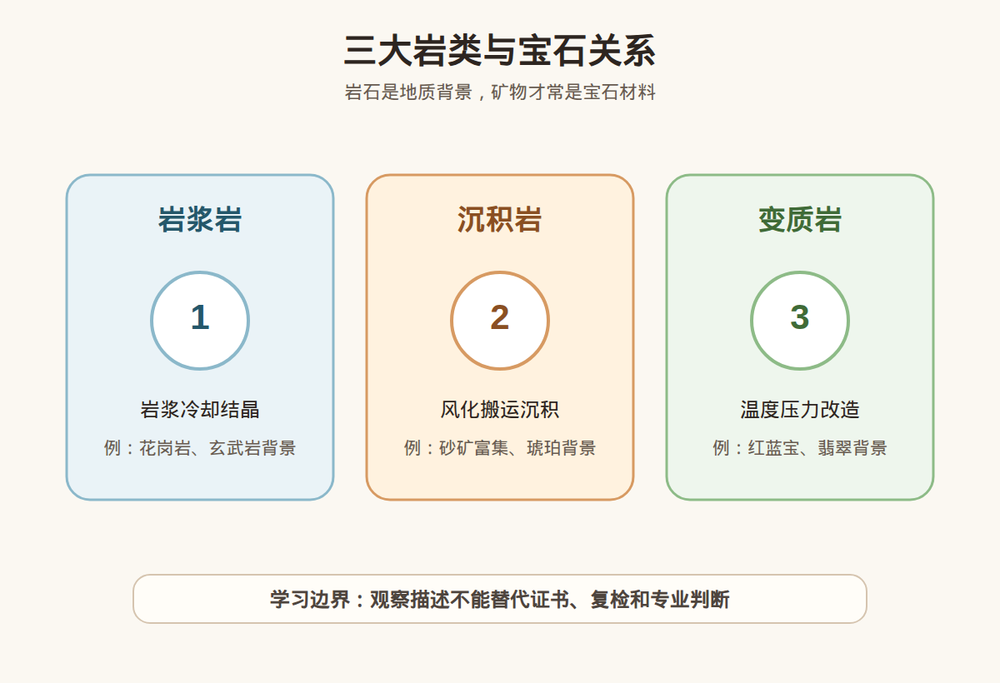

# 第 5 课：岩石基础：岩浆岩、沉积岩、变质岩与宝石的关系

## 1. 本课核心笔记

### 1.1 本课重要结论

这一课先记住 5 个结论：

1. 岩石是矿物集合体，矿物是构成岩石的重要单元。
2. 岩浆岩、沉积岩、变质岩是理解宝石形成环境的基础。
3. 宝石常常是岩石或矿床中的矿物，不等于整块岩石都能当宝石。
4. 原生矿床强调宝石形成和赋存位置，次生矿床强调后期风化、搬运和富集。
5. 岩石背景可以帮助理解来源，但不能单独判断产地、真假或价值。

一句话总结：

> 这一课的重点是建立观察和理解框架，不把单一地质、成分、颜色、光学或仪器信息夸大成鉴定、估价或产地结论。

### 1.2 为什么学习这一课

前面几课已经建立了宝石、矿物、形成环境、物理性质和晶体学的基础。第 5 课继续把这些知识连接到宝石观察和消费判断中，帮助你以后看珠宝时先问“证据是什么”，而不是被单一句话带着走。

### 1.3 岩石和矿物的区别

矿物通常有相对确定的化学成分和内部结构，岩石则常由一种或多种矿物组成。比如花岗岩可以包含石英、长石、云母等矿物。学习珠宝时要记住：很多宝石是矿物级材料，而不是随便一块岩石都能做宝石。

### 1.4 三大岩类

岩浆岩来自岩浆冷却结晶，沉积岩来自风化、搬运、沉积和固结，变质岩来自原有岩石在温度、压力和流体作用下发生变化。三大岩类像地球材料循环的三种状态。

### 1.5 和宝石形成的关系

钻石、橄榄石等可以和深部或岩浆相关背景有关；红蓝宝、翡翠等常需要理解变质环境；砂矿中的钻石、红蓝宝、尖晶石等则体现了沉积富集。

### 1.6 消费边界

“来自某种岩石背景”不能直接等于高品质。真正购买仍要看材料类别、颜色、净度、处理情况、证书、预算和复检支持。

## 2. 必背知识卡

### 卡片 1：岩石

由一种或多种矿物组成的天然集合体。

### 卡片 2：矿物

具有相对确定化学成分和内部结构的天然物质。

### 卡片 3：岩浆岩

岩浆冷却结晶形成的岩石。

### 卡片 4：沉积岩

风化、搬运、沉积并固结形成的岩石。

### 卡片 5：变质岩

原有岩石在温压和流体作用下改变形成的岩石。

### 卡片 6：消费边界

岩石背景不能单独作为产地、真假或价值结论。

## 3. 可交互作业

### 作业 1：概念判断

请回答下面问题，并尽量用“观察 + 边界”的方式表达：

1. 岩石和矿物是同一个概念吗？为什么？
2. 三大岩类分别是什么？
3. 砂矿中的宝石体现了哪个过程？
4. 商家说“地质背景很稀有”，能不能直接等于值得收藏？

### 作业 2：自媒体表达改写

把这句话改成更稳妥的小白学习表达：

> 这块石头来自很厉害的地质环境，所以肯定值钱。

建议改写：

> 这个材料的地质背景值得了解，但是否有商业价值，还要看具体矿物、品质、处理情况、证书和市场认可。

### 作业 3：消费场景思考

如果你在直播间或柜台听到类似说法，请补充三个问题：

1. 有没有证书？
2. 证书是否说明处理情况？
3. 是否支持复检或专业机构判断？

## 4. 自媒体内容草稿

### 4.1 图文/短视频标题备选

- 我学珠宝第 5 课：岩石基础：岩浆岩、沉积岩、变质岩与宝石的关系
- 珠宝小白别急着下结论：先看证据
- 这个知识点很基础，但能避开很多消费误区

### 4.2 短视频脚本

今天学珠宝第 5 课：岩石基础：岩浆岩、沉积岩、变质岩与宝石的关系。

我现在还是从零学习，所以这一课不会做鉴定、估价或产地结论，而是先建立一个更稳妥的观察框架。

岩石是矿物集合体，矿物是构成岩石的重要单元。

岩浆岩、沉积岩、变质岩是理解宝石形成环境的基础。

但消费上要注意：这些知识都只能帮助我们提出更好的问题，不能替代证书、复检和专业机构判断。尤其是高价货，不要只听一个故事、一个颜色、一个内部特征或一个仪器读数就下决定。

### 4.3 图文结构

第 1 页：标题

- 岩石基础：岩浆岩、沉积岩、变质岩与宝石的关系

第 2 页：本课核心概念

- 岩石是矿物集合体，矿物是构成岩石的重要单元。
- 岩浆岩、沉积岩、变质岩是理解宝石形成环境的基础。

第 3 页：为什么容易误解

- 新手容易把观察描述当成价值结论。
- 商业话术容易只强调一个好听信息。

第 4 页：正确学习方式

- 先理解概念。
- 再看证据。
- 最后明确边界。

第 5 页：消费提醒

- 不做真假鉴定结论。
- 不做估价结论。
- 高价货看证书、复检和专业机构。

第 6 页：互动问题

- 你之前有没有被类似说法打动过？

### 4.4 配图与视频建议

本课已准备发布素材包：

- [三大岩类与宝石关系 PNG](../assets/lesson-05/rock-cycle-gem-context.png) / [SVG 源文件](../assets/lesson-05/rock-cycle-gem-context.svg)
- [第 5 课短视频分镜](../assets/lesson-05/video-shotlist.md)
- [第 5 课图文轮播稿](../assets/lesson-05/carousel-copy.md)

### 4.5 评论区互动问题

你最想把这一课里的哪个概念做成短视频？你在买珠宝时最容易被哪类说法影响？

## 5. 学习档案更新

- 材料状态：已备课，待后续正式学习。
- 本课主题：岩石基础：岩浆岩、沉积岩、变质岩与宝石的关系。
- 学习时重点确认：
- 岩石是矿物集合体，矿物是构成岩石的重要单元。
- 岩浆岩、沉积岩、变质岩是理解宝石形成环境的基础。
- 宝石常常是岩石或矿床中的矿物，不等于整块岩石都能当宝石。
- 原生矿床强调宝石形成和赋存位置，次生矿床强调后期风化、搬运和富集。
- 岩石背景可以帮助理解来源，但不能单独判断产地、真假或价值。
- 学习后需要复习：
  - 本课关键术语。
  - 本课和前几课之间的联系。
  - 如何把观察描述和鉴定结论分开。
- 已准备自媒体素材：
  - 本课适合做成 1 条 60-90 秒短视频。
  - 本课适合做成 6 页图文轮播。
  - 本课已配关键图和发布文案。
- 学完本课后的下一课建议：第 6 课：矿物的化学成分与致色元素入门。
