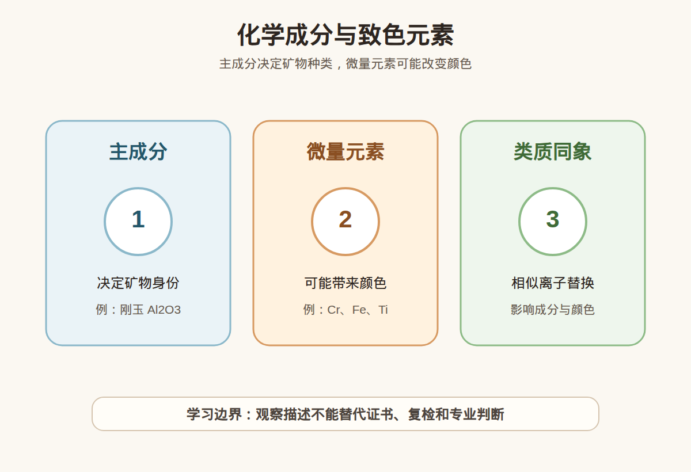

# 第 6 课：矿物的化学成分与致色元素入门

## 1. 本课核心笔记

### 1.1 本课重要结论

这一课先记住 6 个结论：

1. 主量成分和晶体结构共同帮助定义矿物“是什么”。
2. 微量元素含量很少，却可能显著影响颜色。
3. Cr、Fe、Ti、V、Cu 等常见元素会出现在致色讨论中，但效果取决于具体矿物体系。
4. 成分信息可以解释颜色来源，却不能直接等于品质、价值、天然无处理或产地。
5. 同一种矿物可能因致色因素不同形成不同宝石品种，例如刚玉中的红宝石和蓝宝石。
6. 消费中听到“含某元素”时，要追问检测依据、证书备注、处理情况和价格逻辑。

一句话总结：

> 化学成分能解释宝石为什么是这种材料、为什么可能呈现某种颜色，但成分不是价值结论，也不是无处理证明。

### 1.2 为什么学习矿物的化学成分与致色元素入门

彩宝销售常用“铬致色”“铁钛致色”“铜致色”来增加专业感。这些说法可能有宝石学依据，也可能只是把专业词变成营销标签。本课要先分清主量成分、微量元素和致色元素。

学习成分不是为了听到一个元素就判断价格，而是为了知道该继续问什么：信息来自哪份报告，证书是否说明处理，颜色是否真的优秀，价格有没有同类对比，是否支持复检。

### 1.3 主量成分：先回答它是什么

主量成分是构成矿物主体的化学成分。比如刚玉的主体是氧化铝，石英主要是二氧化硅。判断材料身份时，不能只看颜色，因为不同材料可以长得很像；化学成分和晶体结构共同构成更可靠的身份基础。

但主量成分不能单独替代完整鉴定。同一种成分框架可能有不同颜色、不同处理状态和不同商业品种；相似外观也可能来自完全不同材料。消费中听到“成分是某某”，要继续问检测机构、证书名称、处理备注和样品对应关系。

### 1.4 微量元素：少量也可能改变颜色

微量元素含量可能很低，却能改变光吸收，影响我们看到的颜色。铬、铁、钛、钒、铜、锰等都可能参与宝石致色讨论。入门阶段不必背复杂谱线，但要知道元素影响颜色的方式和矿物结构、价态、配位环境、共存元素有关。

最危险的误会是“某元素 = 某颜色 = 某价值”。含铜不等于自动高价，铬致色不等于必买，铁多也不一定更好。元素只是解释颜色的原因之一。

### 1.5 同一种矿物为什么会有不同颜色

刚玉可以有红宝石和蓝宝石，绿柱石可以有祖母绿、海蓝宝石、摩根石等品种。这说明材料身份和颜色名称不是完全等号。颜色差异可能来自微量元素、色心、结构因素，也可能受到处理影响。

理解这件事可以防止两个误会：颜色不同不一定是完全不同材料；同属一种矿物也不代表价值差不多。具体价格仍要看颜色、净度、大小、切工、处理、证书和市场。

### 1.6 成分信息的消费用法

听到成分相关说法时，先拆成三个问题：这是主量成分还是微量元素？信息来自证书、实验室报告还是口头描述？它能解释颜色，还是被商家拿来直接证明价值？把这三个问题问清，比背元素表更实用。

### 1.7 消费视角：把术语转成问题

| 观察或术语 | 入门理解 | 消费中怎么用 |
| --- | --- | --- |
| Cr 铬 | 常与红宝石红色、祖母绿色调讨论相关 | 具体价值要看材料体系、颜色等级和处理 |
| Fe 铁 | 很多宝石颜色都可能涉及铁 | 铁多不一定更好，可能影响明度和色调 |
| Ti 钛 | 常与 Fe 共同讨论某些蓝色成因 | 不能凭铁钛组合判断天然或产地 |
| V 钒 | 可参与部分绿色或变色讨论 | 需结合具体矿物和检测结果 |
| Cu 铜 | 常出现在某些蓝绿色宝石商业叙事中 | 铜致色不等于自动高价或无处理 |

易混点：

- 微量元素含量少，不代表影响小。
- 同一种元素在不同矿物中可能呈现不同颜色效果。
- 颜色原因不是无处理证明。
- 元素稀有不等于样品价格一定合理。

本课红线：不凭成分做鉴定结论，不凭致色元素做估价结论，不凭元素组合做产地结论。 高价购买仍要看可靠证书、核对样品一致性，并保留复检和售后空间。

### 1.8 消费案例拆解：元素话术怎么落地

假设销售说：“这颗颜色好是因为含某种稀有元素，所以价格贵。”小白可以把这句话拆成四步。第一，确认这个元素信息来自哪里：证书、实验室报告，还是销售口头判断。第二，确认它解释的是颜色原因，还是被用来证明价值。第三，回到可见品质：颜色是否明亮、饱和、均匀，净度和切工是否匹配价格。第四，看处理备注，因为处理也可能改变颜色表现。

如果没有检测依据，就不要把“含某元素”当事实；如果有检测依据，也不要把元素当成价格公式。更稳妥的表达是：这个元素可能参与致色，但我还需要看证书、处理、颜色级别、同类价格和复检支持。

| 销售说法 | 可接受的学习含义 | 还要追问 |
| --- | --- | --- |
| 铬致色 | 可能解释红或绿的颜色来源 | 证书和颜色级别是什么 |
| 铁钛相关 | 可能参与某些蓝色成因 | 是否处理、颜色是否发暗 |
| 铜致色 | 可能解释蓝绿色调 | 是否有检测依据，价格是否合理 |

## 2. 必背知识卡

### 卡片 1：主量成分

构成矿物主体的化学成分，帮助回答它是什么，但不能回答值多少钱。

### 卡片 2：微量元素

含量少却可能显著影响颜色；少量不等于不重要，也不等于必然高价。

### 卡片 3：致色元素

Cr、Fe、Ti、V、Cu 等可能参与宝石致色，具体效果取决于矿物体系和检测结果。

### 卡片 4：同矿物多品种

同一种矿物可因致色因素不同形成不同宝石品种，如刚玉中的红宝石和蓝宝石。

### 卡片 5：成分与处理

颜色可能天然形成，也可能受处理影响；元素信息不能证明天然无处理。

### 卡片 6：学习边界

成分信息是证据线索，不做鉴定、估价或产地结论。

## 3. 可交互作业

### 作业 1：元素话术判断

1. 红宝石和蓝宝石都属于刚玉，所以价格一定差不多。
2. 微量元素含量少，所以对颜色影响可忽略。
3. 含铜的蓝绿色宝石一定高价。
4. 颜色好看也要看处理情况和证书。

参考方向：

- 同属刚玉不等于品质和价格相同。
- 微量元素可能显著改变颜色。
- 铜致色只是线索，不能直接等于价值。
- 第 4 句准确。

### 作业 2：成分信息改写

1. 这个颜色是某元素造成的，所以一定是顶级货。

参考方向：

- 可改为：颜色可能和某些致色因素有关，但品质和价值还要看颜色级别、净度、大小、处理、证书和市场对比。

### 作业 3：购买前追问

1. 销售强调微量元素稀有，请写出 5 个追问。

参考方向：

- 元素信息来自哪份报告？证书是否说明处理？颜色级别如何？同类价格如何？是否支持复检？

## 4. 自媒体内容草稿

### 4.1 图文/短视频标题备选

- 含某元素，不等于一定值钱
- 铬、铁、钛、铜到底能说明什么？
- 红宝石和蓝宝石为什么都叫刚玉？
- 颜色科学很重要，但不能替你做购买决定

### 4.2 短视频脚本

今天学珠宝第 6 课：化学成分与致色元素。以前听到铬致色、铁钛致色、铜致色会觉得很高级，现在知道要先分清主量成分和微量元素。主量成分帮助判断矿物身份，微量元素含量少却可能影响颜色。但含某元素不等于一定高价，颜色漂亮也不等于天然无处理。我会问信息来自证书还是口头，是否有处理备注，价格是否有同类对比。我还是学习者，不做鉴定、估价或产地结论。

### 4.3 图文结构

第 1 页：标题

- 含某元素，不等于一定值钱

第 2 页：本课核心概念

- 主量成分和晶体结构共同帮助定义矿物“是什么”。
- 微量元素含量很少，却可能显著影响颜色。

第 3 页：为什么容易误解

- 微量元素含量少，不代表影响小。
- 同一种元素在不同矿物中可能呈现不同颜色效果。

第 4 页：正确学习方式

- 先理解概念属于哪一类证据。
- 再看证书、样品一致性和复检支持。
- 最后明确哪些结论不能由本课信息单独推出。

第 5 页：消费提醒

- 不做真假鉴定结论。
- 不做估价结论。
- 不做产地判断。
- 高价货看证书、复检和专业机构。

第 6 页：互动问题

- 你听过哪些元素致色的话术？

### 4.4 配图与视频建议

本课已准备发布素材包：

- [化学成分与致色元素 PNG](../assets/lesson-06/composition-trace-elements.png) / [SVG 源文件](../assets/lesson-06/composition-trace-elements.svg)
- [第 6 课短视频分镜](../assets/lesson-06/video-shotlist.md)
- [第 6 课分屏视频脚本](../assets/lesson-06/split-screen-script.md)
- [第 6 课图文轮播稿](../assets/lesson-06/carousel-copy.md)

### 4.5 评论区互动问题

你听过哪些元素致色的话术？

## 5. 学习档案更新

- 材料状态：已备课，待学习。
- 本课主题：矿物的化学成分与致色元素入门。
- 学习时重点确认：
  - 主量成分和晶体结构共同帮助定义矿物“是什么”。
  - 微量元素含量很少，却可能显著影响颜色。
  - Cr、Fe、Ti、V、Cu 等常见元素会出现在致色讨论中，但效果取决于具体矿物体系。
  - 成分信息可以解释颜色来源，却不能直接等于品质、价值、天然无处理或产地。
  - 不凭成分做鉴定结论，不凭致色元素做估价结论，不凭元素组合做产地结论。
- 需要复习：
  - 本课关键术语和对应消费问题。
  - 本课易混点和红线边界。
  - 如何把观察描述和鉴定、估价、产地结论分开。
- 自媒体素材：
  - 适合做 1 条 60-90 秒短视频。
  - 适合做 6 页图文轮播。
  - 重点画面是本课主图和“线索/问题/红线”对照。
- 下一课建议：第 7 课：宝石颜色成因：自色、他色、色心与处理。
