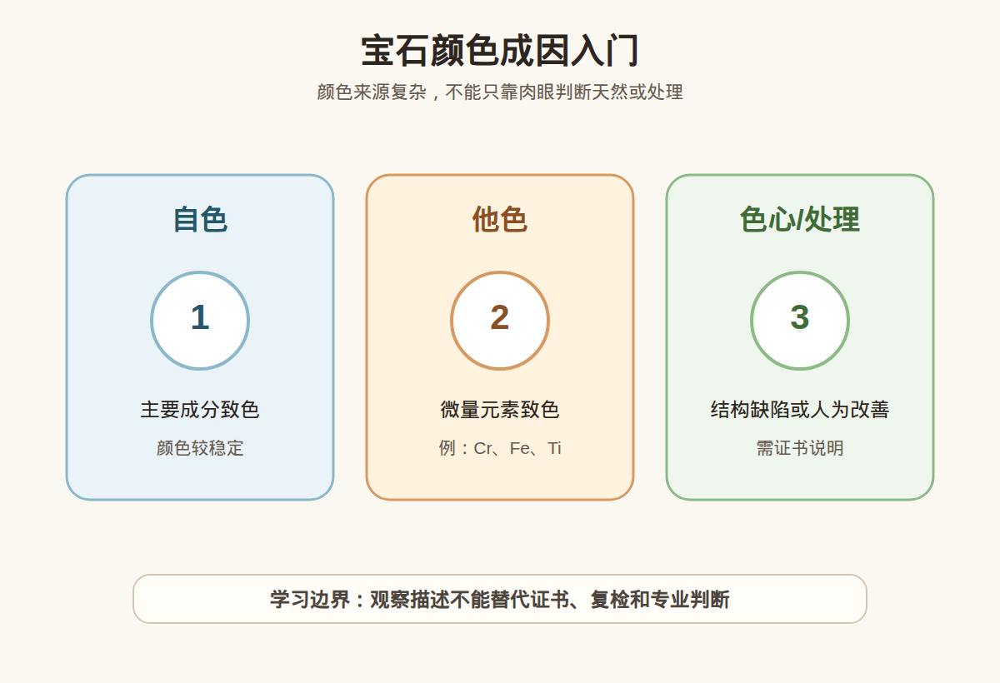

# 第 7 课：宝石颜色成因：自色、他色、色心与处理

## 1. 本课核心笔记

### 1.1 本课重要结论

这一课先记住 5 个结论：

1. 宝石颜色可能来自主要成分、微量元素、结构缺陷或处理。
2. 自色矿物的颜色来自主要化学成分，他色矿物常由微量元素致色。
3. 色心与晶体缺陷、辐照等因素有关，概念上要和处理问题区分。
4. 热处理、染色、扩散等都可能改变颜色表现。
5. 肉眼看到颜色好，不等于天然、无处理或高价值。

一句话总结：

> 这一课的重点是建立观察和理解框架，不把单一地质、成分、颜色、光学或仪器信息夸大成鉴定、估价或产地结论。

### 1.2 为什么学习这一课

前面几课已经建立了宝石、矿物、形成环境、物理性质和晶体学的基础。第 7 课继续把这些知识连接到宝石观察和消费判断中，帮助你以后看珠宝时先问“证据是什么”，而不是被单一句话带着走。

### 1.3 自色和他色

自色矿物的颜色和主要成分有关；他色矿物的颜色常来自微量杂质或致色元素。很多重要宝石属于他色体系，所以同一种矿物可以有多种颜色。

### 1.4 色心是什么

色心可以粗略理解为晶体结构缺陷影响光吸收，从而产生颜色。它可能天然形成，也可能和辐照等处理有关，不能凭肉眼简单下结论。

### 1.5 常见处理和颜色

热处理、染色、扩散、辐照等方式可能改变宝石颜色。处理本身不一定都不可接受，关键是是否披露、是否稳定、价格是否匹配。

### 1.6 消费边界

颜色是价值重要因素，但不是唯一因素。购买高价彩宝时，要关注证书是否说明处理情况，并考虑复检。

## 2. 必背知识卡

### 卡片 1：自色

颜色来自矿物主要成分。

### 卡片 2：他色

颜色主要来自微量元素或杂质。

### 卡片 3：色心

结构缺陷影响光吸收产生颜色。

### 卡片 4：热处理

通过加热改善或改变颜色、净度等表现。

### 卡片 5：染色

外来颜色物质进入材料改善外观。

### 卡片 6：消费边界

颜色好看不等于无处理。

## 3. 可交互作业

### 作业 1：概念判断

请回答下面问题，并尽量用“观察 + 边界”的方式表达：

1. 自色和他色的区别是什么？
2. 色心是不是一定代表人工处理？
3. 热处理是否一定不能接受？
4. 颜色好能不能直接判断价值高？

### 作业 2：自媒体表达改写

把这句话改成更稳妥的小白学习表达：

> 这个颜色这么浓，一定天然无处理。

建议改写：

> 这个颜色饱和度看起来较高，但是否天然无处理需要看证书和检测结果，不能只靠肉眼判断。

### 作业 3：消费场景思考

如果你在直播间或柜台听到类似说法，请补充三个问题：

1. 有没有证书？
2. 证书是否说明处理情况？
3. 是否支持复检或专业机构判断？

## 4. 自媒体内容草稿

### 4.1 图文/短视频标题备选

- 我学珠宝第 7 课：宝石颜色成因：自色、他色、色心与处理
- 珠宝小白别急着下结论：先看证据
- 这个知识点很基础，但能避开很多消费误区

### 4.2 短视频脚本

今天学珠宝第 7 课：宝石颜色成因：自色、他色、色心与处理。

我现在还是从零学习，所以这一课不会做鉴定、估价或产地结论，而是先建立一个更稳妥的观察框架。

宝石颜色可能来自主要成分、微量元素、结构缺陷或处理。

自色矿物的颜色来自主要化学成分，他色矿物常由微量元素致色。

但消费上要注意：这些知识都只能帮助我们提出更好的问题，不能替代证书、复检和专业机构判断。尤其是高价货，不要只听一个故事、一个颜色、一个内部特征或一个仪器读数就下决定。

### 4.3 图文结构

第 1 页：标题

- 宝石颜色成因：自色、他色、色心与处理

第 2 页：本课核心概念

- 宝石颜色可能来自主要成分、微量元素、结构缺陷或处理。
- 自色矿物的颜色来自主要化学成分，他色矿物常由微量元素致色。

第 3 页：为什么容易误解

- 新手容易把观察描述当成价值结论。
- 商业话术容易只强调一个好听信息。

第 4 页：正确学习方式

- 先理解概念。
- 再看证据。
- 最后明确边界。

第 5 页：消费提醒

- 不做真假鉴定结论。
- 不做估价结论。
- 高价货看证书、复检和专业机构。

第 6 页：互动问题

- 你之前有没有被类似说法打动过？

### 4.4 配图与视频建议

本课已准备发布素材包：

- [宝石颜色成因入门 PNG](../assets/lesson-07/gem-color-causes.png) / [SVG 源文件](../assets/lesson-07/gem-color-causes.svg)
- [第 7 课短视频分镜](../assets/lesson-07/video-shotlist.md)
- [第 7 课图文轮播稿](../assets/lesson-07/carousel-copy.md)

### 4.5 评论区互动问题

你最想把这一课里的哪个概念做成短视频？你在买珠宝时最容易被哪类说法影响？

## 5. 学习档案更新

- 材料状态：已备课，待后续正式学习。
- 本课主题：宝石颜色成因：自色、他色、色心与处理。
- 学习时重点确认：
- 宝石颜色可能来自主要成分、微量元素、结构缺陷或处理。
- 自色矿物的颜色来自主要化学成分，他色矿物常由微量元素致色。
- 色心与晶体缺陷、辐照等因素有关，概念上要和处理问题区分。
- 热处理、染色、扩散等都可能改变颜色表现。
- 肉眼看到颜色好，不等于天然、无处理或高价值。
- 学习后需要复习：
  - 本课关键术语。
  - 本课和前几课之间的联系。
  - 如何把观察描述和鉴定结论分开。
- 已准备自媒体素材：
  - 本课适合做成 1 条 60-90 秒短视频。
  - 本课适合做成 6 页图文轮播。
  - 本课已配关键图和发布文案。
- 学完本课后的下一课建议：第 8 课：宝石光学性质入门：透明度、折射、双折射和多色性。
