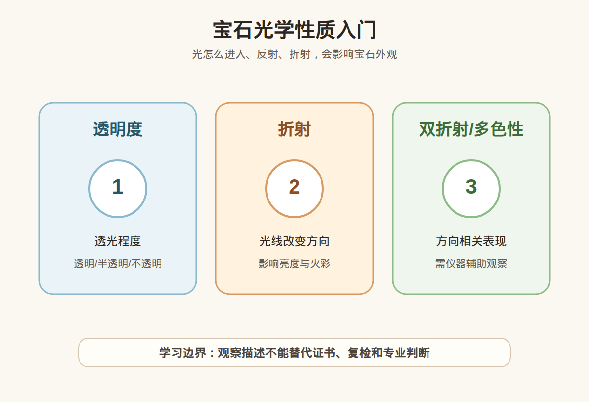

# 第 8 课：宝石光学性质入门：透明度、折射、双折射和多色性

## 1. 本课核心笔记

### 1.1 本课重要结论

这一课先记住 5 个结论：

1. 光学性质解释宝石为什么会亮、透、闪、显色。
2. 透明度描述透光程度，不等于价值高低。
3. 折射率是宝石学检测的重要参数之一。
4. 双折射和多色性与晶体结构和光传播方向有关。
5. 光学观察需要控制光源和角度，不能直接替代仪器检测。

一句话总结：

> 这一课的重点是建立观察和理解框架，不把单一地质、成分、颜色、光学或仪器信息夸大成鉴定、估价或产地结论。

### 1.2 为什么学习这一课

前面几课已经建立了宝石、矿物、形成环境、物理性质和晶体学的基础。第 8 课继续把这些知识连接到宝石观察和消费判断中，帮助你以后看珠宝时先问“证据是什么”，而不是被单一句话带着走。

### 1.3 透明度

透明度描述光能穿过材料的程度。透明、半透明、不透明都可能用于珠宝，关键看品类和审美体系。翡翠、和田玉、珍珠等不一定追求像钻石那样透明。

### 1.4 折射和亮度

光进入宝石时会改变方向，这和折射有关。切工、抛光、比例也会影响亮度和火彩，所以不能只看材料本身。

### 1.5 双折射和多色性

某些晶体中，光在不同方向传播表现不同，可能出现双折射或多色性。后续学习折射仪、偏光镜、二色镜时会继续用到。

### 1.6 消费边界

“很透”“很闪”“颜色会变”都只是观察描述。高价购买仍要看证书、处理情况和复检支持。

## 2. 必背知识卡

### 卡片 1：透明度

材料透过光线的程度。

### 卡片 2：折射

光从一种介质进入另一种介质时方向改变。

### 卡片 3：折射率

描述材料折射光能力的参数。

### 卡片 4：双折射

某些晶体中一束光分成两束传播的现象。

### 卡片 5：多色性

不同方向观察可能看到不同颜色。

### 卡片 6：消费边界

视觉效果不能替代仪器检测。

## 3. 可交互作业

### 作业 1：概念判断

请回答下面问题，并尽量用“观察 + 边界”的方式表达：

1. 透明度高是否一定更贵？
2. 折射和宝石亮度有什么关系？
3. 多色性是否能肉眼稳定判断？
4. 很闪能不能直接说明是真钻石？

### 作业 2：自媒体表达改写

把这句话改成更稳妥的小白学习表达：

> 这颗石头特别闪，所以肯定是真钻。

建议改写：

> 这颗石头亮度和闪光表现不错，但是否为钻石需要结合证书或专业检测，不能只靠“闪”下结论。

### 作业 3：消费场景思考

如果你在直播间或柜台听到类似说法，请补充三个问题：

1. 有没有证书？
2. 证书是否说明处理情况？
3. 是否支持复检或专业机构判断？

## 4. 自媒体内容草稿

### 4.1 图文/短视频标题备选

- 我学珠宝第 8 课：宝石光学性质入门：透明度、折射、双折射和多色性
- 珠宝小白别急着下结论：先看证据
- 这个知识点很基础，但能避开很多消费误区

### 4.2 短视频脚本

今天学珠宝第 8 课：宝石光学性质入门：透明度、折射、双折射和多色性。

我现在还是从零学习，所以这一课不会做鉴定、估价或产地结论，而是先建立一个更稳妥的观察框架。

光学性质解释宝石为什么会亮、透、闪、显色。

透明度描述透光程度，不等于价值高低。

但消费上要注意：这些知识都只能帮助我们提出更好的问题，不能替代证书、复检和专业机构判断。尤其是高价货，不要只听一个故事、一个颜色、一个内部特征或一个仪器读数就下决定。

### 4.3 图文结构

第 1 页：标题

- 宝石光学性质入门：透明度、折射、双折射和多色性

第 2 页：本课核心概念

- 光学性质解释宝石为什么会亮、透、闪、显色。
- 透明度描述透光程度，不等于价值高低。

第 3 页：为什么容易误解

- 新手容易把观察描述当成价值结论。
- 商业话术容易只强调一个好听信息。

第 4 页：正确学习方式

- 先理解概念。
- 再看证据。
- 最后明确边界。

第 5 页：消费提醒

- 不做真假鉴定结论。
- 不做估价结论。
- 高价货看证书、复检和专业机构。

第 6 页：互动问题

- 你之前有没有被类似说法打动过？

### 4.4 配图与视频建议

本课已准备发布素材包：

- [宝石光学性质入门 PNG](../assets/lesson-08/optical-properties-map.png) / [SVG 源文件](../assets/lesson-08/optical-properties-map.svg)
- [第 8 课短视频分镜](../assets/lesson-08/video-shotlist.md)
- [第 8 课图文轮播稿](../assets/lesson-08/carousel-copy.md)

### 4.5 评论区互动问题

你最想把这一课里的哪个概念做成短视频？你在买珠宝时最容易被哪类说法影响？

## 5. 学习档案更新

- 材料状态：已备课，待后续正式学习。
- 本课主题：宝石光学性质入门：透明度、折射、双折射和多色性。
- 学习时重点确认：
- 光学性质解释宝石为什么会亮、透、闪、显色。
- 透明度描述透光程度，不等于价值高低。
- 折射率是宝石学检测的重要参数之一。
- 双折射和多色性与晶体结构和光传播方向有关。
- 光学观察需要控制光源和角度，不能直接替代仪器检测。
- 学习后需要复习：
  - 本课关键术语。
  - 本课和前几课之间的联系。
  - 如何把观察描述和鉴定结论分开。
- 已准备自媒体素材：
  - 本课适合做成 1 条 60-90 秒短视频。
  - 本课适合做成 6 页图文轮播。
  - 本课已配关键图和发布文案。
- 学完本课后的下一课建议：第 9 课：包裹体与生长痕迹入门：为什么不能只靠肉眼下结论。
