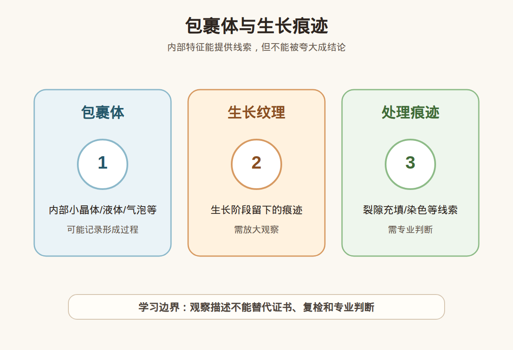

# 第 9 课：包裹体与生长痕迹入门：为什么不能只靠肉眼下结论

## 1. 本课核心笔记

### 1.1 本课重要结论

这一课先记住 6 个结论：

1. 包裹体是宝石内部或表面附近被包裹、捕获或形成的物质、空隙、裂隙和结构特征。
2. 生长痕迹记录形成或生长过程中的线索，如色带、生长线、分区和纹理。
3. 包裹体和生长痕迹是线索，不是判决书；单一特征很少能独立判断天然、合成、处理或产地。
4. 天然宝石可以有包裹体，合成和处理宝石也可能有各自特征。
5. 肉眼观察局限很大，显微镜、光源、经验、对照样本和证书才构成更可靠框架。
6. 观察内部特征的意义是发现风险、提出问题、要求证书和复检。

一句话总结：

> 包裹体像宝石内部的记录本，但小白只能先学会读目录，不能把一个字当成整本书的结论。

### 1.2 为什么学习包裹体与生长痕迹入门

很多珠宝内容会教小白看气泡辨真假、有棉就是天然、有生长纹就是老矿。这些口诀危险，因为它们把复杂显微特征简化成单一判断。

包裹体和生长痕迹对专业宝石学很有价值，但可能提供线索和小白肉眼能下结论完全不是一回事。本课要先学习如何记录，而不是抢着判决。

### 1.3 包裹体是什么

包裹体可以是小晶体、液体、气体、两相或三相包裹体、针状物、云雾状物、裂隙、愈合裂隙、空洞等。内部可见物不自动等于坏，也不自动等于真。

消费中至少看三个维度：美观影响、耐久影响、身份线索。身份线索需要专业判断，不能靠一句口诀。

### 1.4 生长痕迹

宝石在自然或人工环境中生长时，可能留下生长线、色带、分区、弯曲纹、生长阶梯等特征。某些特征组合对区分天然和合成有帮助，但必须结合具体材料。

表面抛光纹、裂隙、胶痕和内部生长线很容易被新手混淆。

### 1.5 天然、合成和处理线索

天然宝石可以有丰富包裹体，合成宝石也可能有特征，处理宝石还可能留下处理相关痕迹。专业判断看的是组合：类型、分布、与裂隙关系、颜色集中方式、光学反应和其他检测数据。

看到气泡感不等于玻璃仿品，看到内部很干净也不等于合成。

### 1.6 肉眼局限与记录

肉眼和手机视频会受倍率、焦点、光源、反光和画质压缩影响。10x 放大镜只是入门工具，显微观察还需要不同照明方式。新手最容易把反光、灰尘、表面划痕、胶水或金属阴影误看成内部特征。

### 1.7 消费视角：把术语转成问题

| 观察或术语 | 入门理解 | 消费中怎么用 |
| --- | --- | --- |
| 棉雾/云状物 | 包裹体、结构或愈合特征 | 写观察到内部雾状特征，需放大和证书判断 |
| 气泡感圆点 | 气泡、晶体、空洞或反光假象 | 不能肉眼直接说假 |
| 裂线 | 内裂、表面裂或愈合裂隙 | 记录是否到达表面和位置 |
| 色带/生长线 | 生长分区或颜色分布 | 可作线索，不做产地结论 |

易混点：

- 有包裹体不等于一定天然。
- 内部很干净不等于一定合成。
- 气泡感不等于可以直接说假。
- 生长痕迹不是产地判决。

本课红线：不凭包裹体做鉴定，不凭内部干净或有棉做估价，不凭生长痕迹做产地结论。 高价购买仍要看可靠证书、核对样品一致性，并保留复检和售后空间。

### 1.8 消费案例拆解：看到内部特征怎么说才安全

假设你在一颗宝石里看到一个圆点，第一反应可能是“气泡”。但安全表达应该是“我观察到一个圆点或气泡感特征”。因为它可能是气泡，也可能是负晶形、小晶体、空洞、反光、灰尘或拍摄压缩造成的视觉假象。名称一旦说错，后面的真假判断就会跟着错。

更可靠的记录需要四个维度：位置在台面下、边部还是裂隙附近；形态是点状、针状、云雾状还是线状；是否随转动消失或改变；是否到达表面并影响耐久。高价样品应把这些记录交给证书或显微复检，而不是在直播间凭一帧画面下判决。

| 记录维度 | 示例 | 用途 |
| --- | --- | --- |
| 位置 | 台面下、腰围边、爪位附近 | 判断是否影响美观和耐久 |
| 形态 | 点状、线状、云雾状、片状 | 便于后续专业沟通 |
| 边界 | 是否到达表面 | 判断裂隙风险 |

补充复盘：正式学习时可以练习把“气泡”“棉”“生长纹”这些口语词改写成中性描述。先写形态，再写位置，再写不确定性。只要没有显微镜、对照经验和证书支持，就不要把内部特征命名得太绝对。越是高价样品，越要让专业机构读这本“内部记录本”。

还要提醒自己：包裹体既可能降低净度和美观，也可能在专业研究中很有价值。消费端关心的重点是它是否肉眼明显、是否影响耐久、是否被商家夸大成真假证据。把这三件事分开，沟通会更稳。

如果商家拿内部特征做强承诺，比如“这个生长纹证明某产地”或“这个包裹体证明无处理”，要特别谨慎。产地和处理判断通常需要特征组合、数据库和实验室经验，不是单张手机图能完成。小白可以把这类话术记录下来，作为复检时重点询问的问题。

## 2. 必背知识卡

### 卡片 1：包裹体

内部或表面附近的物质、空隙、裂隙或结构特征，是线索不是判决书。

### 卡片 2：生长痕迹

形成过程中留下的生长线、色带、分区和纹理，需要结合材料理解。

### 卡片 3：天然也有包裹体

包裹体不必然是缺点，要看美观、耐久和证据意义。

### 卡片 4：合成和处理也有特征

判断要看特征组合和专业检测。

### 卡片 5：肉眼局限

手机视频和肉眼容易误判气泡、裂隙、反光和灰尘。

### 卡片 6：边界

内部特征用于提问和记录，不做鉴定、估价或产地结论。

## 3. 可交互作业

### 作业 1：口诀纠偏

1. 有包裹体就一定天然。
2. 内部特别干净就一定合成。
3. 看到气泡感就能直接说假。
4. 包裹体可以作为线索，但需要证书和专业观察。

参考方向：

- 天然、合成、处理都可能有内部特征。
- 高净度天然宝石存在。
- 肉眼看到的不一定是气泡。
- 第 4 句准确。

### 作业 2：观察记录改写

1. 这里面有气泡，一定是假的。

参考方向：

- 可改为：观察到内部有圆点或气泡感特征，但肉眼不能确定性质，需要放大观察、证书和专业检测。

### 作业 3：包裹体记录

1. 选择公开显微图片，写 5 条位置、形态、范围和下一步问题。

参考方向：

- 记录台面下、边部、裂隙附近等位置；不写天然、合成或产地结论。

## 4. 自媒体内容草稿

### 4.1 图文/短视频标题备选

- 包裹体是线索，不是判决书
- 有棉就真？有气泡就假？太危险
- 珠宝内部特征先记录，别急着鉴定
- 生长痕迹能说明什么？

### 4.2 短视频脚本

今天学珠宝第 9 课：包裹体和生长痕迹。以前我也听过有气泡就是假、有棉就是天然，但现在知道太简单了。包裹体可以是小晶体、液体、气体、空洞、裂隙或其他内部特征。生长痕迹可能包括色带、生长线和分区。它们能提供线索，但读懂需要放大设备、光源、经验和证书。我会记录位置、形态、是否到达表面、是否影响耐久，然后问证书和复检。我还是学习者，不凭肉眼内部特征做鉴定、估价或产地结论。

### 4.3 图文结构

第 1 页：标题

- 包裹体是线索，不是判决书

第 2 页：本课核心概念

- 包裹体是宝石内部或表面附近被包裹、捕获或形成的物质、空隙、裂隙和结构特征。
- 生长痕迹记录形成或生长过程中的线索，如色带、生长线、分区和纹理。

第 3 页：为什么容易误解

- 有包裹体不等于一定天然。
- 内部很干净不等于一定合成。

第 4 页：正确学习方式

- 先理解概念属于哪一类证据。
- 再看证书、样品一致性和复检支持。
- 最后明确哪些结论不能由本课信息单独推出。

第 5 页：消费提醒

- 不做真假鉴定结论。
- 不做估价结论。
- 不做产地判断。
- 高价货看证书、复检和专业机构。

第 6 页：互动问题

- 你听过哪些看包裹体辨真假的口诀？

### 4.4 配图与视频建议

本课已准备发布素材包：

- [包裹体与生长痕迹 PNG](../assets/lesson-09/inclusions-growth-features.png) / [SVG 源文件](../assets/lesson-09/inclusions-growth-features.svg)
- [第 9 课短视频分镜](../assets/lesson-09/video-shotlist.md)
- [第 9 课分屏视频脚本](../assets/lesson-09/split-screen-script.md)
- [第 9 课图文轮播稿](../assets/lesson-09/carousel-copy.md)

### 4.5 评论区互动问题

你听过哪些看包裹体辨真假的口诀？

## 5. 学习档案更新

- 材料状态：已备课，待学习。
- 本课主题：包裹体与生长痕迹入门：为什么不能只靠肉眼下结论。
- 学习时重点确认：
  - 包裹体是宝石内部或表面附近被包裹、捕获或形成的物质、空隙、裂隙和结构特征。
  - 生长痕迹记录形成或生长过程中的线索，如色带、生长线、分区和纹理。
  - 包裹体和生长痕迹是线索，不是判决书；单一特征很少能独立判断天然、合成、处理或产地。
  - 天然宝石可以有包裹体，合成和处理宝石也可能有各自特征。
  - 不凭包裹体做鉴定，不凭内部干净或有棉做估价，不凭生长痕迹做产地结论。
- 需要复习：
  - 本课关键术语和对应消费问题。
  - 本课易混点和红线边界。
  - 如何把观察描述和鉴定、估价、产地结论分开。
- 自媒体素材：
  - 适合做 1 条 60-90 秒短视频。
  - 适合做 6 页图文轮播。
  - 重点画面是本课主图和“线索/问题/红线”对照。
- 下一课建议：第 10 课：宝石学仪器入门：放大镜、折射仪、偏光镜和二色镜。
