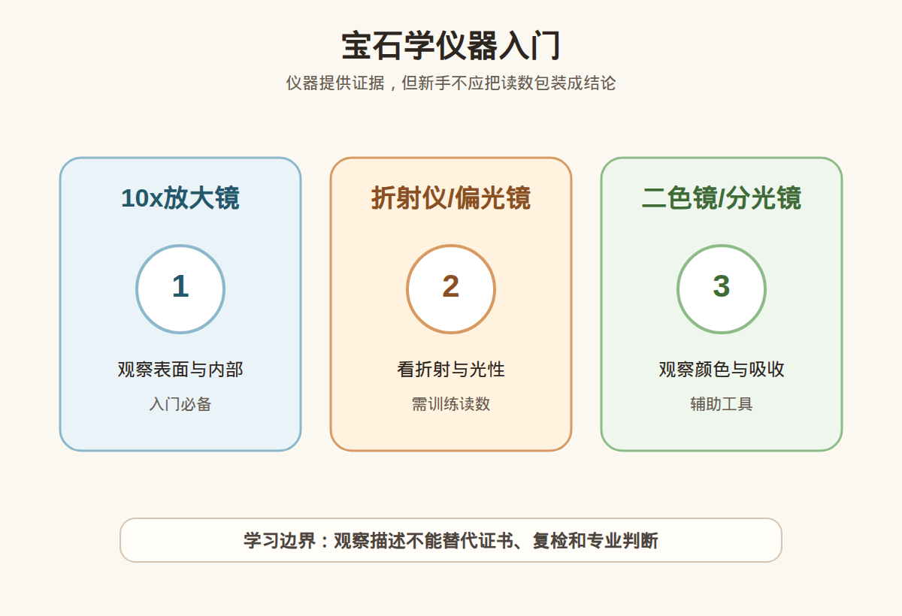

# 第 10 课：宝石学仪器入门：放大镜、折射仪、偏光镜和二色镜

## 1. 本课核心笔记

### 1.1 本课重要结论

这一课先记住 6 个结论：

1. 宝石学仪器用于收集和验证线索，不是让新手一秒变鉴定师的魔法工具。
2. 10x 放大镜适合观察表面磨损、崩口、镶嵌状态、裂隙和部分内部特征。
3. 折射仪用于测折射率，但需要样品条件、接触液、读数训练和边界意识。
4. 偏光镜辅助观察单折射、双折射、异常消光等光性表现；二色镜辅助观察多色性。
5. 仪器读数要和外观、显微特征、光谱、证书、处理检测等证据组合使用。
6. 会使用基础仪器不等于具备收费鉴定资格。

一句话总结：

> 仪器能让观察更有依据，但仪器不是资格证；小白可以学会看线索，不能把自学读数包装成鉴定结论。

### 1.2 为什么学习宝石学仪器入门

从肉眼观察进入仪器学习，是宝石学很重要的一步。仪器可以让一部分特征更可重复，例如放大内部特征、读取折射率、观察光性或多色性。

但仪器也有样品条件、操作方法和解释边界。读数错误、样品镶嵌遮挡、表面弧面、接触不良、光源不对，都可能让结果偏离真实。

### 1.3 10x 放大镜

10x 放大镜便携、便宜，能快速观察表面和部分内部特征。它适合看刻面边缘是否崩口、表面是否磨损、腰围是否有裂隙、爪镶是否松动、包边是否压紧、内部是否有明显特征。

但倍率和景深有限，镶嵌金属会遮挡，一些处理、合成特征和微小组合不是 10x 就能读懂。

### 1.4 折射仪

折射仪用于测量折射率，常见于宝石鉴定训练。折射率范围对材料识别很有帮助，也能观察单折射、双折射和双折率等信息。

它需要平整抛光面、合适接触、接触液、正确光源和读数方法。弧面宝石、镶嵌宝石、表面不平或 RI 超范围时，读数可能困难。

### 1.5 偏光镜和二色镜

偏光镜可辅助观察单折射、双折射、集合体反应、异常消光等。二色镜用于观察多色性，依赖样品方向、颜色深浅、光源和操作者经验。

看到亮暗变化或颜色差异，只说明存在可观察线索，不等于可以直接判断价值或产地。

### 1.6 仪器与资格边界

专业实验室有标准流程、校准设备、经验人员、复核机制和责任边界；个人学习工具没有这些保障。会用工具和具备出具鉴定结论的资格之间有很大距离。

### 1.7 消费视角：把术语转成问题

| 观察或术语 | 入门理解 | 消费中怎么用 |
| --- | --- | --- |
| 10x 放大镜 | 放大表面、镶嵌、裂隙、包裹体 | 不能独立完成复杂鉴定 |
| 折射仪 | 测折射率和相关光性 | 需要平整面和规范读数 |
| 偏光镜 | 观察偏光反应和光性线索 | 解释依赖训练和样品条件 |
| 二色镜 | 观察多色性 | 需要方向、光源和颜色条件 |
| 分光镜 | 观察吸收光谱线索 | 不能孤立使用 |

易混点：

- 仪器不是自动给答案。
- 单一读数不能解决所有鉴定问题。
- 样品条件和操作错误会影响结果。
- 会用工具不等于能收费鉴定。

本课红线：不凭单一仪器做鉴定，不凭读数做估价，不凭基础工具做产地结论，更不能把自学观察当收费鉴定资格。 高价购买仍要看可靠证书、核对样品一致性，并保留复检和售后空间。

### 1.8 消费案例拆解：听到“仪器测过”怎么追问

假设柜台说：“这件我们用仪器测过，没问题。”小白不要把这句话当终点，而要把它拆成起点。第一，是什么仪器：放大镜、折射仪、偏光镜、二色镜，还是商用筛查设备？第二，测的是什么指标：折射率、导热、荧光、偏光反应，还是只是放大观察？第三，样品是否适合这个工具：镶嵌是否遮挡，表面是否平整，颜色是否太深。第四，结果有没有记录，是否能和证书互相支持。

仪器最怕“名称很专业，过程很模糊”。如果没有读数、照片或操作条件，只说仪器测过，信息量其实很低。即使有读数，也要和其他证据组合，不应替代复检。

| 追问 | 为什么问 |
| --- | --- |
| 用了什么仪器 | 不同工具回答不同问题 |
| 测了什么指标 | 防止把观察说成鉴定 |
| 样品条件是否合适 | 避免读数无效 |
| 是否支持复检 | 高价交易要有退出机制 |

补充复盘：正式学习时建议把每个工具都配一句边界话术：10x 只能做基础观察，折射仪读数要看样品条件，偏光镜和二色镜需要方向和光源，分光镜需要训练。这样遇到“仪器测过”的说法时，就能先问工具和指标，而不是被“仪器”两个字吓住。

如果未来真的系统学习仪器，也要同步学习校准、误差、样品限制和记录格式。没有记录的仪器观察很难复查，也很难和证书沟通。消费端最有用的不是炫工具，而是知道每个工具回答不了什么问题。

仪器学习还要区分筛查和鉴定。某些便携设备适合快速排除一部分可能性，但筛查通过不等于完整鉴定通过；筛查异常也不等于一定是假。消费端听到设备名称时，要问它解决的是哪个问题、不能解决哪些问题，以及最终是否仍以正规证书为准。

## 2. 必背知识卡

### 卡片 1：仪器定位

用于收集证据和验证线索，不是自动答案机。

### 卡片 2：10x 放大镜

看表面、镶嵌、裂隙、崩口和部分内部特征。

### 卡片 3：折射仪

测折射率，需平整面、接触液、光源和训练。

### 卡片 4：偏光镜

辅助观察光性和偏光反应，解释依赖样品条件。

### 卡片 5：二色镜

辅助观察多色性，依赖方向、光源和颜色深浅。

### 卡片 6：资格边界

会用基础仪器不等于具备收费鉴定资格。

## 3. 可交互作业

### 作业 1：仪器定位判断

1. 10x 没看出问题，就证明一定没问题。
2. 折射仪读数是材料识别的重要线索。
3. 二色镜看到颜色差异，就能判断产地。
4. 自学会用仪器，不等于可以收费鉴定。

参考方向：

- 放大镜有倍率和经验限制。
- 第 2 句准确，但要规范操作。
- 多色性不是产地结论。
- 第 4 句准确。

### 作业 2：仪器话术改写

1. 我用仪器看过，所以百分百准确。

参考方向：

- 可改为：做过基础仪器观察，但还要结合仪器类型、读数记录、样品条件、证书、处理检测和复检支持。

### 作业 3：工具选择

1. 爪镶是否松动、折射率、多色性、高价最终判断分别该用什么？

参考方向：

- 爪镶先用 10x；折射率用折射仪；多色性用二色镜；高价最终判断需要证书、复检和专业机构。

## 4. 自媒体内容草稿

### 4.1 图文/短视频标题备选

- 仪器不是魔法鉴定器
- 10x、折射仪、偏光镜、二色镜能看什么？
- 会用仪器就能收费鉴定吗？
- 柜台说仪器测过时，我会追问这 6 件事

### 4.2 短视频脚本

今天学珠宝第 10 课：仪器入门。仪器很重要，但不是魔法鉴定器。10x 放大镜看表面磨损、崩口、裂隙、镶嵌和部分内部特征；折射仪测折射率；偏光镜看光性线索；二色镜看多色性。但每个工具都有条件和误差。我不会说拿仪器看过就百分百。我会问用什么仪器、测什么指标、有没有记录、是否和证书一致、是否支持复检。我还是学习者，不做鉴定、估价或产地结论。

### 4.3 图文结构

第 1 页：标题

- 仪器不是魔法鉴定器

第 2 页：本课核心概念

- 宝石学仪器用于收集和验证线索，不是让新手一秒变鉴定师的魔法工具。
- 10x 放大镜适合观察表面磨损、崩口、镶嵌状态、裂隙和部分内部特征。

第 3 页：为什么容易误解

- 仪器不是自动给答案。
- 单一读数不能解决所有鉴定问题。

第 4 页：正确学习方式

- 先理解概念属于哪一类证据。
- 再看证书、样品一致性和复检支持。
- 最后明确哪些结论不能由本课信息单独推出。

第 5 页：消费提醒

- 不做真假鉴定结论。
- 不做估价结论。
- 不做产地判断。
- 高价货看证书、复检和专业机构。

第 6 页：互动问题

- 你最想先学哪种宝石学工具？

### 4.4 配图与视频建议

本课已准备发布素材包：

- [宝石学仪器入门 PNG](../assets/lesson-10/gemology-instruments-intro.png) / [SVG 源文件](../assets/lesson-10/gemology-instruments-intro.svg)
- [第 10 课短视频分镜](../assets/lesson-10/video-shotlist.md)
- [第 10 课分屏视频脚本](../assets/lesson-10/split-screen-script.md)
- [第 10 课图文轮播稿](../assets/lesson-10/carousel-copy.md)

### 4.5 评论区互动问题

你最想先学哪种宝石学工具？

## 5. 学习档案更新

- 材料状态：已备课，待学习。
- 本课主题：宝石学仪器入门：放大镜、折射仪、偏光镜和二色镜。
- 学习时重点确认：
  - 宝石学仪器用于收集和验证线索，不是让新手一秒变鉴定师的魔法工具。
  - 10x 放大镜适合观察表面磨损、崩口、镶嵌状态、裂隙和部分内部特征。
  - 折射仪用于测折射率，但需要样品条件、接触液、读数训练和边界意识。
  - 偏光镜辅助观察单折射、双折射、异常消光等光性表现；二色镜辅助观察多色性。
  - 不凭单一仪器做鉴定，不凭读数做估价，不凭基础工具做产地结论，更不能把自学观察当收费鉴定资格。
- 需要复习：
  - 本课关键术语和对应消费问题。
  - 本课易混点和红线边界。
  - 如何把观察描述和鉴定、估价、产地结论分开。
- 自媒体素材：
  - 适合做 1 条 60-90 秒短视频。
  - 适合做 6 页图文轮播。
  - 重点画面是本课主图和“线索/问题/红线”对照。
- 下一课建议：第 11 课：宝石证书入门：证书能告诉你什么，不能告诉你什么。
