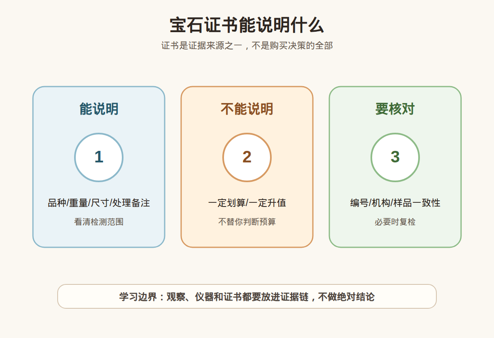

# 第 11 课：宝石证书入门：证书能告诉你什么，不能告诉你什么

## 1. 本课核心笔记

### 1.1 本课重要结论

这一课先记住 6 个结论：

1. 证书提供第三方检测信息，降低信息不对称，但不会替你决定是否购买。
2. 证书通常能说明样品品种、重量、尺寸、照片或编号、部分处理情况和检测备注。
3. 证书通常不能说明价格是否划算、未来是否升值、是否适合你的预算和佩戴场景。
4. 不同机构、不同证书类型的检测范围、表述习惯和市场认可度可能不同。
5. 看证书必须核对样品一致性：编号、照片、重量、尺寸、腰码或实物特征要能对应。
6. 证书不是升值承诺，也不是产地营销的万能证明；高价货要考虑复检、合同备注和售后责任。

一句话总结：

> 证书能告诉你这件送检样品被检测到了什么，但不能替你判断这个价格该不该买、以后会不会涨。

### 1.2 为什么学习宝石证书入门

证书是珠宝消费里最重要的风险控制工具之一，但小白也容易误解：有的人以为有证书就闭眼买，有的人只看封面机构名，不看样品是否一致、处理备注和检测范围。

证书是检测机构对送检样品在一定条件下出具的文件。它能帮助确认信息，但价格、审美、佩戴需求、售后政策、市场流动性和预算取舍仍要消费者自己判断。

### 1.3 证书通常能说明什么

不同品类证书格式不同，但常见信息包括证书编号、检测机构、检测日期、样品照片、品种名称、重量、尺寸、形状、颜色描述、处理备注、二维码或官网查询入口。钻石报告还可能包括 4C、切工、抛光、对称、荧光和比例图。

不要只看最大字号的名称，真正有用的信息常在备注里。

### 1.4 证书不能告诉你什么

大多数证书不负责告诉你这件货是否买贵，不保证未来升值，不保证你转卖时有人接盘，也不替商家承担所有售后责任。证书可能说明处理情况，但不一定覆盖所有商业宣传点。

证书也不能替代样品核对，真证书配错货或截图被挪用是实际风险。

### 1.5 机构差异与证书类型

不同机构的市场认可度、检测项目、表述方式和费用不同。基础鉴定、分级报告、带产地意见的报告不是同一种东西。有些证书不做产地，有些做产地意见但仍有条件和边界。

小白不必背完所有机构，但要建立机构差异意识：是否官网可查，证书类型是什么，检测范围是否覆盖你关心的风险。

### 1.6 样品一致性核对

购买时最实用的一步是核对样品和报告是否一致。编号、官网、照片、重量、尺寸、主石数量、腰码、备注栏和出证时间都要看。高价货最好在付款前约定复检和不一致处理方式。

### 1.7 消费视角：把术语转成问题

| 观察或术语 | 入门理解 | 消费中怎么用 |
| --- | --- | --- |
| 证书编号 | 官网查询和核对 | 防止只看截图 |
| 品种名称 | 判断材料身份 | 名称表述要看机构规则 |
| 重量尺寸 | 核对样品一致性 | 与实物和镶嵌状态核对 |
| 处理备注 | 判断处理披露 | 备注不能跳过 |
| 照片/腰码 | 对应样品 | 防止证书和货不匹配 |

易混点：

- 有证书不等于价格合理。
- 有证书不等于一定升值。
- 国际机构、国内机构、商家卡片不是同一个概念。
- 证书写天然也要看具体指材料、颜色还是处理。

本课红线：不把证书当估价书，不把证书当升值承诺，不凭证书截图做最终判断，不凭证书之外的故事做产地结论。 高价购买仍要看可靠证书、核对样品一致性，并保留复检和售后空间。

### 1.8 消费案例拆解：证书和实物怎么对应

假设你收到一张证书截图，页面显示品种名称正确、机构也听过，但这还不够。你需要先到官网或二维码页面核对编号，再看报告照片是否和实物的形状、颜色、镶嵌款式一致；如果是裸石，要核对重量和尺寸；如果是钻石，要尽量核对腰码或净度特征；如果是彩宝，要认真看处理备注和检测限制。

证书最怕“真证书配错货”。截图可以被重复使用，老证可能对应旧状态，镶嵌后也可能增加观察限制。高价交易前，最好把复检规则写清楚：送哪家机构，费用谁承担，结果不一致如何退款或处理。证书是证据，不是信任的替代品。

| 核对项 | 要看什么 | 常见风险 |
| --- | --- | --- |
| 编号 | 官网信息是否一致 | 截图挪用或假证 |
| 照片 | 形状、颜色、镶嵌 | 证货不符 |
| 重量尺寸 | 是否匹配商品 | 套证或换货 |
| 备注 | 处理和限制 | 只看名称忽略风险 |

补充复盘：正式学习时可以拿一张样例证书做逐项标注：编号在哪里、官网怎么查、照片如何对应实物、重量尺寸怎么核对、备注栏有没有处理或限制、证书类型是否覆盖产地或分级。这个练习比背机构名字更实用，因为真正出问题时往往是证货不符或备注没读懂。

证书还要和交易文件一起看。发票、商品描述、售后条款、复检约定和证书内容最好能互相对应。只有证书没有售后承诺，高价交易仍然有风险；只有口头承诺没有书面记录，也很难维权。

## 2. 必背知识卡

### 卡片 1：证书作用

提供第三方检测信息，降低信息不对称，但不替消费者做购买判断。

### 卡片 2：证书能说明

通常说明品种、重量、尺寸、照片或编号、部分处理和备注。

### 卡片 3：证书不能说明

通常不说明价格是否划算、未来是否升值或是否适合你。

### 卡片 4：机构差异

不同机构和证书类型的检测范围、表述和市场认可度不同。

### 卡片 5：样品一致性

核对编号、官网、照片、重量、尺寸、腰码、备注和实物特征。

### 卡片 6：边界

证书不是估价书或升值保证，高价购买要复检和售后支持。

## 3. 可交互作业

### 作业 1：证书误区判断

1. 有证书就说明一定买得划算。
2. 证书编号能官网查询是重要步骤。
3. 备注可以不看，只看品种名。
4. 高价货付款前约定复检更稳妥。

参考方向：

- 证书不负责价格和预算。
- 第 2 句准确。
- 备注常有处理和限制信息。
- 第 4 句准确。

### 作业 2：闭眼买改写

1. 这个有证书，所以闭眼买，肯定会升值。

参考方向：

- 可改为：有证书是重要信息，但还要核对编号、样品一致性、处理备注、机构类型、价格和售后；证书不等于升值承诺。

### 作业 3：证书核对

1. 购买彩宝戒指前写 6 个核对动作。

参考方向：

- 官网查编号，核对照片重量尺寸，读处理备注，问复检规则，保留交易记录和售后承诺。

## 4. 自媒体内容草稿

### 4.1 图文/短视频标题备选

- 有证书，也不能闭眼买
- 证书能说明什么？不能说明什么？
- 买珠宝先核对样品一致性
- 证书不是升值承诺

### 4.2 短视频脚本

今天学珠宝第 11 课：宝石证书。证书很重要，但有证书不等于闭眼买。证书通常能告诉我们品种、重量、尺寸、照片或编号、部分处理情况和备注；它能降低信息不对称，但不能告诉你价格一定划算，也不能保证未来升值。我会核对编号、官网、样品照片、重量尺寸、处理备注和检测限制。高价货不能只看截图，要约定复检和售后。我还是学习者，不做鉴定、估价或产地结论。

### 4.3 图文结构

第 1 页：标题

- 有证书，也不能闭眼买

第 2 页：本课核心概念

- 证书提供第三方检测信息，降低信息不对称，但不会替你决定是否购买。
- 证书通常能说明样品品种、重量、尺寸、照片或编号、部分处理情况和检测备注。

第 3 页：为什么容易误解

- 有证书不等于价格合理。
- 有证书不等于一定升值。

第 4 页：正确学习方式

- 先理解概念属于哪一类证据。
- 再看证书、样品一致性和复检支持。
- 最后明确哪些结论不能由本课信息单独推出。

第 5 页：消费提醒

- 不做真假鉴定结论。
- 不做估价结论。
- 不做产地判断。
- 高价货看证书、复检和专业机构。

第 6 页：互动问题

- 你看证书时会读备注栏吗？

### 4.4 配图与视频建议

本课已准备发布素材包：

- [宝石证书能说明什么 PNG](../assets/lesson-11/certificate-reading-basics.png) / [SVG 源文件](../assets/lesson-11/certificate-reading-basics.svg)
- [第 11 课短视频分镜](../assets/lesson-11/video-shotlist.md)
- [第 11 课分屏视频脚本](../assets/lesson-11/split-screen-script.md)
- [第 11 课图文轮播稿](../assets/lesson-11/carousel-copy.md)

### 4.5 评论区互动问题

你看证书时会读备注栏吗？

## 5. 学习档案更新

- 材料状态：已备课，待学习。
- 本课主题：宝石证书入门：证书能告诉你什么，不能告诉你什么。
- 学习时重点确认：
  - 证书提供第三方检测信息，降低信息不对称，但不会替你决定是否购买。
  - 证书通常能说明样品品种、重量、尺寸、照片或编号、部分处理情况和检测备注。
  - 证书通常不能说明价格是否划算、未来是否升值、是否适合你的预算和佩戴场景。
  - 不同机构、不同证书类型的检测范围、表述习惯和市场认可度可能不同。
  - 不把证书当估价书，不把证书当升值承诺，不凭证书截图做最终判断，不凭证书之外的故事做产地结论。
- 需要复习：
  - 本课关键术语和对应消费问题。
  - 本课易混点和红线边界。
  - 如何把观察描述和鉴定、估价、产地结论分开。
- 自媒体素材：
  - 适合做 1 条 60-90 秒短视频。
  - 适合做 6 页图文轮播。
  - 重点画面是本课主图和“线索/问题/红线”对照。
- 下一课建议：第 12 课：10 倍放大镜实操：表面、镶嵌、裂隙和包裹体观察。
