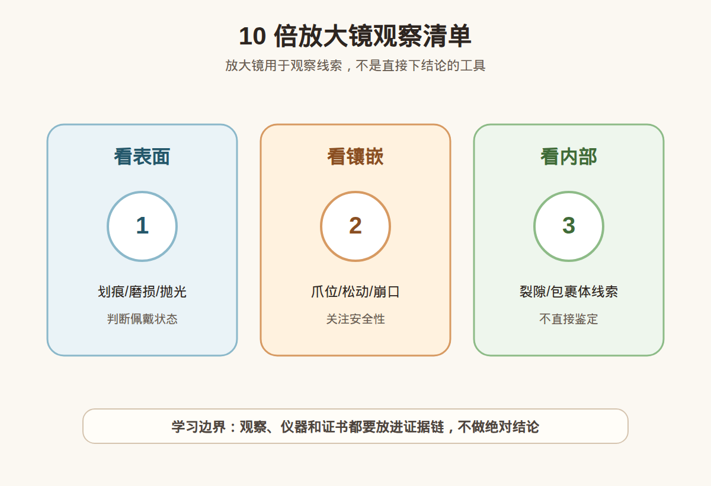

# 第 12 课：10 倍放大镜实操：表面、镶嵌、裂隙和包裹体观察

## 1. 本课核心笔记

### 1.1 本课重要结论

这一课先记住 6 个结论：

1. 10 倍放大镜适合做基础观察和记录，帮助发现表面、镶嵌、裂隙和部分内部特征。
2. 实操观察要有顺序：先整体，再表面和刻面边缘，再镶嵌结构，最后看裂隙与包裹体。
3. 表面磨损、崩口、裂隙、松动镶嵌会影响佩戴风险、售后沟通和是否继续购买。
4. 包裹体观察需要记录位置、形态、范围和不确定性，不能看到一个特征就判断真假。
5. 好记录比快结论更重要；要写光源、角度、倍率、观察位置、是否到达表面和下一步问题。
6. 10x 观察不是鉴定、估价或产地判断；高价货、争议货和处理复杂材料仍要证书和复检。

一句话总结：

> 10x 放大镜最适合把我觉得有问题变成我观察到哪里、什么形态、需要问什么，而不是把观察变成最终鉴定。

### 1.2 为什么学习10 倍放大镜实操

10x 放大镜对消费者最现实的价值不是鉴定真假，而是发现购买前后容易引发纠纷的问题：主石边缘有没有崩口，爪位是否压紧，表面是否有磨损，裂隙是否接近表面。

很多小白拿到放大镜后会马上往内部看，想找天然证据或造假证据。更稳妥的顺序是先看影响佩戴安全和售后的外部问题，再记录内部线索。

### 1.3 准备工作：光源、姿势和安全

先准备稳定光源、干净桌面、软布或托盘，避免样品掉落。手持放大镜时，让放大镜靠近眼睛，再移动样品到清晰位置。观察镶嵌首饰时，不要用力撬动宝石。

光源可用自然光、桌面白光或小型手电，但要避免过强反光。必要时换角度观察同一位置，并记录光源和方向。

### 1.4 观察顺序：从外到内

建议使用整体、表面、边缘、镶嵌、裂隙、内部的顺序。先看主石是否居中、是否有肉眼大裂；再看台面、刻面边缘、腰围是否磨损或崩口；再看爪位、包边和群镶小石；最后才看内部包裹体。

这个顺序把佩戴安全和售后风险放在前面，避免一上来就陷入看不懂的内部特征。

### 1.5 怎么记录

好的记录不是有瑕疵三个字，而是写清楚光源、倍率、位置、形态、范围、影响和边界。例如：桌面白光，10x，主石 6 点钟腰围，疑似小崩口，肉眼不明显，需要询问是否影响耐久和售后，仅为观察记录。

### 1.6 观察边界和购买决策

处理痕迹、合成特征、产地判断、复杂充填、覆膜、染色、热处理等，往往需要更高倍率、特殊光源、光谱、化学分析或专业机构。镶嵌成品还会被金属遮挡。10x 最适合预筛和记录，不适合最终判决。

### 1.7 消费视角：把术语转成问题

| 观察或术语 | 入门理解 | 消费中怎么用 |
| --- | --- | --- |
| 整体 | 歪斜、明显裂、颜色大面差异 | 决定是否继续细看 |
| 表面 | 划痕、磨损、抛光、污渍 | 判断新旧和保养状态 |
| 边缘 | 崩口、尖角损伤、腰围问题 | 影响耐久和售后 |
| 镶嵌 | 爪松、包边缝隙、缺石 | 影响佩戴安全 |
| 裂隙/包裹体 | 位置、形态、是否到达表面 | 作为线索，不做鉴定 |

易混点：

- 放大镜没看出问题，不等于一定没问题。
- 有内部特征不等于可以判断真假。
- 只写有瑕疵不利于沟通。
- 不能用划刻、加热、滴酸等破坏性测试。

本课红线：观察不等于鉴定，不凭 10x 做估价，不凭包裹体或裂隙做产地结论，不用破坏性测试验证。 高价购买仍要看可靠证书、核对样品一致性，并保留复检和售后空间。

### 1.8 消费案例拆解：一条合格记录长什么样

不合格记录通常只有一句：“有瑕疵。”这句话无法沟通，因为它没有位置、形态、大小感和影响。更合格的记录应该像这样：光源为桌面白光，倍率 10x，位置在主石 6 点钟方向腰围，观察到疑似小崩口，放大下可见、肉眼不明显，需询问是否影响耐久和售后；该记录不作为鉴定或估价结论。

这样的记录有三个好处：第一，商家或维修师知道你说的是哪里；第二，售后沟通时能区分佩戴前已有问题还是后续损伤；第三，它不会把观察升级成不负责任的真假判断。对小白来说，放大镜最重要的能力不是“看穿一切”，而是把问题描述得准确、克制、可复查。

| 差记录 | 好记录 |
| --- | --- |
| 有裂 | 10x 下，台面右下方线状特征，无法判断是否到达表面 |
| 有瑕疵 | 腰围 3 点钟方向疑似小崩口，需问售后 |
| 是假的 | 观察到圆点特征，性质不明，建议证书或复检 |

补充复盘：正式学习时可以用低价练习样品写三条记录：一条表面记录、一条镶嵌记录、一条内部特征记录。每条都必须包含光源、倍率、位置、形态、影响和边界。只要记录还写不清，就先不要下判断；把观察写准确，本身就是 10x 实操的核心训练。

观察后还要拍照或画简图标位置，尤其是二手首饰、改圈前后、维修前后。位置记录能帮助判断问题是否扩大，也能让售后沟通更具体。不要用力测试松动，也不要自己拆镶，安全比好奇更重要。

## 2. 必背知识卡

### 卡片 1：10x 定位

用于基础观察和记录，不是最终鉴定工具。

### 卡片 2：观察顺序

先整体，再表面、边缘、镶嵌、裂隙和包裹体。

### 卡片 3：表面与边缘

磨损、划痕、崩口和腰围损伤会影响美观与耐久。

### 卡片 4：镶嵌状态

爪位、包边、群镶和金属结构影响佩戴安全。

### 卡片 5：记录方法

记录光源、倍率、位置、形态、范围、影响和不确定点。

### 卡片 6：边界

10x 不能替代证书和专业检测，不做鉴定、估价或产地结论。

## 3. 可交互作业

### 作业 1：观察顺序排序

1. 看内部包裹体。
2. 看整体是否歪斜或有大裂。
3. 看刻面边缘和腰围是否崩口。
4. 看爪位是否压紧。
5. 记录光源、位置和不确定点。

参考方向：

- 可按整体、边缘、镶嵌、内部、记录的顺序；先看外部耐久风险，再看内部线索。

### 作业 2：观察话术改写

1. 我用放大镜看过了，这颗一定没问题，也一定是真的。

参考方向：

- 可改为：10x 下未发现明显崩口或镶嵌松动，但不能证明一定没问题或一定为真，高价材料仍需证书和复检。

### 作业 3：完整记录

1. 用桌面白光、10x、主石 6 点钟腰围、疑似小崩口、肉眼不明显、需问售后写一条记录。

参考方向：

- 光源：桌面白光；倍率：10x；位置：主石 6 点钟腰围；形态：疑似小崩口；影响：需询问耐久和售后；边界：不做鉴定或估价。

## 4. 自媒体内容草稿

### 4.1 图文/短视频标题备选

- 10x 放大镜先看什么？
- 别一上来找真假证据
- 买戒指前用 10x 看这 6 个位置
- 放大镜观察记录怎么写？

### 4.2 短视频脚本

今天学珠宝第 12 课：10 倍放大镜实操。放大镜不是让我直接鉴定真假，而是帮我把问题看清楚、记清楚。我的顺序是先看整体，再看表面和刻面边缘，然后看镶嵌状态，比如爪位有没有翘起、群镶有没有缺石。接着看裂隙是否到达表面，最后才记录内部包裹体。记录时要写光源、倍率、位置、形态、范围、影响和不确定点。我还是学习者，不凭放大镜做鉴定、估价或产地结论。

### 4.3 图文结构

第 1 页：标题

- 10x 放大镜先看什么？

第 2 页：本课核心概念

- 10 倍放大镜适合做基础观察和记录，帮助发现表面、镶嵌、裂隙和部分内部特征。
- 实操观察要有顺序：先整体，再表面和刻面边缘，再镶嵌结构，最后看裂隙与包裹体。

第 3 页：为什么容易误解

- 放大镜没看出问题，不等于一定没问题。
- 有内部特征不等于可以判断真假。

第 4 页：正确学习方式

- 先理解概念属于哪一类证据。
- 再看证书、样品一致性和复检支持。
- 最后明确哪些结论不能由本课信息单独推出。

第 5 页：消费提醒

- 不做真假鉴定结论。
- 不做估价结论。
- 不做产地判断。
- 高价货看证书、复检和专业机构。

第 6 页：互动问题

- 你拿放大镜第一眼会看哪里？

### 4.4 配图与视频建议

本课已准备发布素材包：

- [10 倍放大镜观察清单 PNG](../assets/lesson-12/loupe-observation-checklist.png) / [SVG 源文件](../assets/lesson-12/loupe-observation-checklist.svg)
- [第 12 课短视频分镜](../assets/lesson-12/video-shotlist.md)
- [第 12 课分屏视频脚本](../assets/lesson-12/split-screen-script.md)
- [第 12 课图文轮播稿](../assets/lesson-12/carousel-copy.md)

### 4.5 评论区互动问题

你拿放大镜第一眼会看哪里？

## 5. 学习档案更新

- 材料状态：已备课，待学习。
- 本课主题：10 倍放大镜实操：表面、镶嵌、裂隙和包裹体观察。
- 学习时重点确认：
  - 10 倍放大镜适合做基础观察和记录，帮助发现表面、镶嵌、裂隙和部分内部特征。
  - 实操观察要有顺序：先整体，再表面和刻面边缘，再镶嵌结构，最后看裂隙与包裹体。
  - 表面磨损、崩口、裂隙、松动镶嵌会影响佩戴风险、售后沟通和是否继续购买。
  - 包裹体观察需要记录位置、形态、范围和不确定性，不能看到一个特征就判断真假。
  - 观察不等于鉴定，不凭 10x 做估价，不凭包裹体或裂隙做产地结论，不用破坏性测试验证。
- 需要复习：
  - 本课关键术语和对应消费问题。
  - 本课易混点和红线边界。
  - 如何把观察描述和鉴定、估价、产地结论分开。
- 自媒体素材：
  - 适合做 1 条 60-90 秒短视频。
  - 适合做 6 页图文轮播。
  - 重点画面是本课主图和“线索/问题/红线”对照。
- 下一课建议：第 13 课：折射率与折射仪入门。
