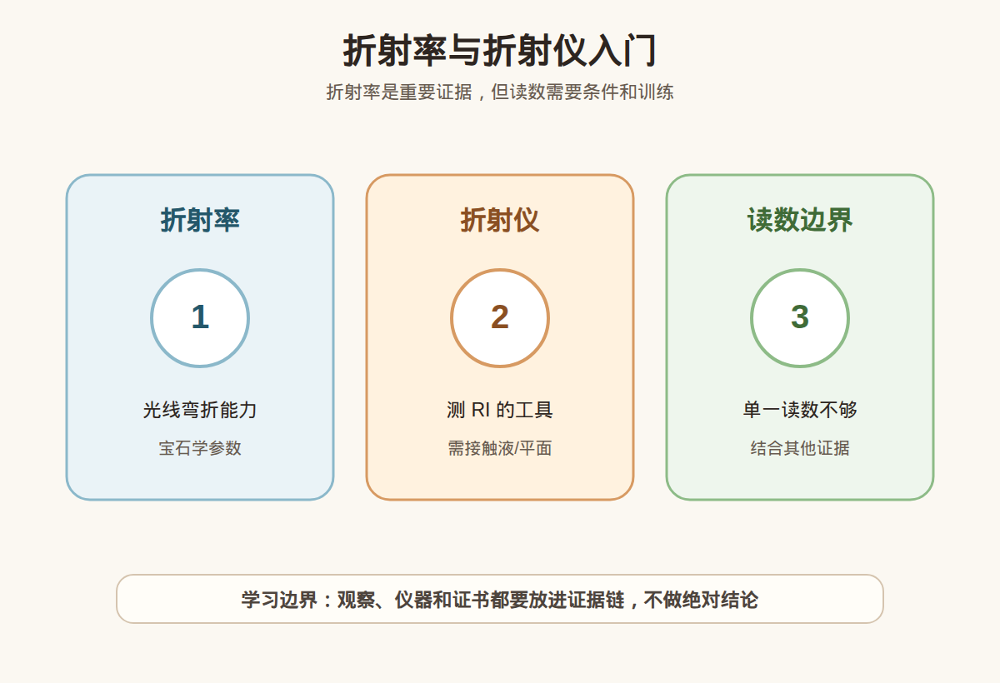

# 第 13 课：折射率与折射仪入门

## 1. 本课核心笔记

### 1.1 本课重要结论

这一课先记住 6 个结论：

1. 折射率 RI 描述光在宝石材料中传播速度和方向改变的程度，是宝石学鉴定里很重要的物理参数。
2. 折射仪读数依赖「平整抛光面 + 光学接触 + 合适光源 + 正确读线」，不是把宝石随便放上去就会自动给答案。
3. 点测法和普通平面测量都只是测量方法，适用场景不同；弧面、刻面太小、镶嵌成品都会明显增加读数难度。
4. 折射仪有测量范围和样品条件限制，超出范围、表面粗糙、接触液不匹配、材料多孔或拼合时，读数可能不稳定甚至不可用。
5. RI 读数是证据，不是鉴定结论；同一个 RI 区间可能对应多个材料，还要结合光性、双折射、比重、放大观察、光谱和证书。
6. 小白学习折射率，是为了听懂检测语言、识别过度营销和提出更好的复检问题，不是凭一个数字在直播间判真假。

一句话总结：

> 折射率能提供很有价值的材料线索，但「读数对上」不等于「鉴定完成」，尤其是镶嵌成品和高价货，要把 RI 放回完整证据链里。

### 1.2 为什么学习这一课

折射率是宝石学里很常出现的词。看教材会看到各种宝石的 RI 范围，看证书或检测说明也可能看到折射率、点测、双折射率等表述。它之所以重要，是因为不同材料和晶体结构会让光以不同方式传播；这种差异可以帮助鉴定人员缩小判断范围。

但对消费者来说，折射率也很容易被误用。常见误区包括：

- 把「折射率接近某宝石」听成「一定就是某宝石」。
- 把「仪器测到了一个数」听成「所有风险都排除了」。
- 把「店里现场点测」当成权威证书。
- 以为所有成品戒指、吊坠、蛋面、珠串都能像教材样品一样轻松测出清晰读数。

这一课的学习目标不是训练你独立操作仪器，而是建立一个稳妥的理解框架：RI 有用，但它必须在正确样品、正确方法和正确解释下才有意义。

### 1.3 折射率 RI 到底在说什么

光从空气进入宝石时，传播速度会改变，方向也可能发生偏折。折射率可以理解为材料让光「慢下来、弯过去」的程度。宝石材料的化学成分、晶体结构和光学方向不同，都会影响 RI。

入门时先把几个词分清：

| 术语 | 入门解释 | 消费中怎么理解 |
| --- | --- | --- |
| 折射 | 光从一种介质进入另一种介质时方向发生改变 | 宝石为什么会有亮度、火彩和边缘弯折感，和折射有关 |
| 折射率 RI | 描述材料折射能力的数值 | 是识别材料的线索之一，不是价格标签 |
| 单折射 | 光学性质各方向基本一致，常见一个主要 RI | 常见于等轴晶系宝石和非晶质材料，但可能有异常反应 |
| 双折射 | 不同方向有不同折射率，常见两个读数 | 需要结合偏光镜、转动样品等观察 |
| 双折射率 | 两个折射率之间的差值 | 可帮助区分材料，但对新手不宜孤立解读 |

举例理解：钻石、刚玉、石英、绿柱石、尖晶石、玻璃等材料的 RI 范围不同，所以 RI 可以帮助排除不可能选项。但现实样品会有颜色深浅、切工方向、表面状态和镶嵌遮挡，读到的结果不一定像表格那样理想。

### 1.4 折射仪如何测：平面读数和点测

常规宝石折射仪通常由高折射率棱镜、接触液、光源和刻度视窗组成。操作时，样品需要有一个足够平整、抛光良好的面，与棱镜通过接触液形成光学接触。观察者从视窗里看明暗交界线，读取对应刻度。

可以把测量分成两类来理解：

| 方法 | 需要什么样品 | 优点 | 局限 |
| --- | --- | --- | --- |
| 平面测量 | 足够大的平整抛光面，例如台面、底面或较大刻面 | 读线相对清楚，可转动样品观察双折射 | 对样品摆放、接触液、刻面大小要求高 |
| 点测法 | 弧面、蛋面、珠子或小面不便平放的样品 | 能在不规则表面获得近似 RI 线索 | 精度较低，更依赖经验，不能当成精确结论 |

平面测量比较像「把一个平整窗口贴在仪器上读刻度」。如果宝石刻面太小、表面有弧度、抛光差、底部有脏污，明暗边界就可能模糊。点测法则更像「用有限接触点获得参考数值」，适合学习和辅助筛查，但它的误差和解释空间更大。

新手特别要注意：折射仪读数不是手机扫码。读线时眼位、光源、接触液量、样品是否滑动、是否压坏棱镜、是否残留液体，都会影响结果。真正的检测训练包含仪器保护、样品清洁、重复读数和异常结果处理。

### 1.5 为什么读数会受限或出错

折射仪很重要，但它不是万能仪器。下面这些情况都会让结果变得不可靠：

| 情况 | 可能带来的问题 | 更稳妥的处理 |
| --- | --- | --- |
| 成品镶嵌 | 金属爪、包边或底托挡住可测平面 | 不强行拆改，优先看证书或交专业机构 |
| 刻面太小 | 明暗交界线短、模糊，读数难稳定 | 多角度尝试，必要时只记录「约值」 |
| 弧面或珠子 | 无法形成大面积光学接触 | 可点测，但要承认精度有限 |
| 表面粗糙/磨损 | 光线散射，读线不清 | 清洁后仍不清楚就不硬读 |
| 多孔或裂隙多 | 接触液可能进入裂隙或孔隙 | 谨慎使用，避免损伤样品 |
| 高 RI 超范围 | 仪器刻度读不到真实数值 | 用其他仪器和证据补充 |
| 拼合或覆膜 | 测到的可能只是表层材料 | 结合放大观察和证书判断 |

「成品镶嵌难测」尤其重要。很多消费者买到的是戒指、吊坠、耳钉，不是裸石。镶嵌会遮挡底面，爪镶会让样品无法平稳接触，封底会完全阻断测量。此时如果有人拿仪器随便碰一下就给出绝对结论，反而要警惕。

另外，RI 表格给的是材料范围，不是唯一身份证。天然宝石、合成宝石、仿制材料和玻璃之间可能出现数值接近，处理、拼合和表面涂层也会干扰读数。读数越接近边界，越需要其他证据支持。

### 1.6 RI 如何进入证据链

更稳妥的理解顺序是：

1. 先确认样品状态：裸石还是成品，是否有可测平面，是否适合接触液。
2. 再记录读数方式：平面测量、点测，还是无法测得清晰读数。
3. 结合光性：单折射、双折射、异常双折射、集合体反应。
4. 结合其他基础数据：比重、分光、放大观察、紫外荧光、包裹体、处理痕迹。
5. 对高价购买，回到权威证书、编号核验、复检和售后条款。

一个比较合格的表达应当是：「这个样品在当前条件下测得 RI 约为某范围，与某些材料的常见范围相符，但还需要结合其他检测。」不合格的表达是：「折射率对了，绝对真，马上买。」

### 1.7 消费边界和红线

本课的消费边界很清楚：

| 可以做 | 不建议做 |
| --- | --- |
| 听懂 RI 是材料线索 | 只凭一个 RI 数字判真假 |
| 询问测量方式和样品状态 | 把点测约值当精确鉴定 |
| 理解成品镶嵌为什么难测 | 要求商家在高价成品上强行操作 |
| 把 RI 和证书、复检结合 | 用现场仪器演示替代正规证书 |

红线包括：

- 直播间或柜台只展示一个模糊读数，就要求你立刻付款。
- 对镶嵌成品宣称「折射仪一测就百分百确定」。
- 不说明测量方式、样品限制和误差，却给出天然、无处理、高价值结论。
- 高价货不提供证书、不支持复检，只让你相信现场话术。

小白最实用的反应不是反驳仪器，而是追问证据链：「这是平面测量还是点测？样品是否镶嵌？还有哪些检测支持？证书编号能否核验？是否支持复检？」

## 2. 必背知识卡

### 卡片 1：折射率 RI

折射率描述光在材料中传播速度和方向改变的程度，是宝石材料识别的重要线索之一。

### 卡片 2：平面测量

折射仪常规读数需要足够平整、抛光良好的接触面；刻面太小、表面不平或接触不好都会影响读数。

### 卡片 3：点测法

点测法适合弧面、蛋面或不易平放的样品获得近似 RI 线索，但精度较低，不能当作完整鉴定结论。

### 卡片 4：成品限制

镶嵌成品常因金属遮挡、封底、爪位和样品无法稳定接触而难以测得可靠 RI。

### 卡片 5：双折射率

双折射率是两个折射率之间的差值，可帮助理解双折射材料，但需要结合光性和方向观察。

### 卡片 6：证据链

RI 读数必须和光性、比重、放大观察、光谱、处理信息和证书一起解释；读数不等于鉴定结论。

## 3. 可交互作业

### 作业 1：读数场景判断

请判断下面说法是否稳妥，并说明理由：

1. 裸石有大台面，折射仪读线清楚，可以把 RI 作为重要证据。
2. 一个封底戒指现场点测了一下，就能直接判断天然、无处理。
3. 点测法得到的是近似线索，不能和标准平面读数完全等同。
4. 折射率落在某宝石范围内，就可以不看证书。

参考方向：

- 第 1 句较稳妥，但仍要结合其他证据。
- 第 2 句不稳妥，封底和镶嵌会严重限制测量，且天然/处理需要更多证据。
- 第 3 句准确，点测有用但精度和解释空间有限。
- 第 4 句不准确，RI 只是证据之一，高价货仍需证书和复检。

### 作业 2：柜台追问练习

如果销售说：「我用折射仪测过，折射率对上了，绝对是真的。」请写出 5 个追问。

参考方向：

- 是裸石测量还是镶嵌成品点测？
- 测的是哪个面？读数是否重复稳定？
- 是否观察到单折射、双折射或异常现象？
- 还有哪些检测证据支持这个判断？
- 证书是哪家机构出的？编号能否官网核验？是否支持复检？

### 作业 3：自媒体表达改写

把这句话改成更稳妥的小白学习表达：

> 折射率对上了，所以这颗宝石一定是真的，价格也没问题。

建议改写：

> 折射率匹配是一个有用线索，说明它和某些材料的范围相符；但真假、处理、合成、仿制和价格都不能只靠一个读数判断，高价购买还要看证书、复检和完整检测证据。

## 4. 自媒体内容草稿

### 4.1 图文/短视频标题备选

- 我学珠宝第 13 课：折射率对上了，也不能直接闭眼买
- 折射仪不是扫码枪：RI 读数为什么只是证据之一
- 镶嵌成品为什么难测折射率？小白先懂这个边界
- 折射率、点测、证书：买珠宝别把一个数字当结论

### 4.2 短视频脚本

今天学珠宝第 13 课：折射率与折射仪。

折射率 RI 描述光进入宝石后传播速度和方向改变的程度，它确实是宝石学里很重要的材料线索。折射仪可以测 RI，但它不是把宝石放上去就自动判真假的机器。

常规测量需要平整抛光面、接触液、合适光源和清楚的明暗边界。弧面、珠子、蛋面可能只能点测；镶嵌成品还会被金属、封底和小刻面影响，读数不一定稳定。

所以我会把 RI 当作证据链的一环，而不是最终答案。折射率对上，只能说明它和某些材料的范围相符；还要结合光性、比重、放大观察、处理信息和证书。

我现在还是学习者，不凭一个数字做真假鉴定、估价或产地判断。高价购买建议看权威证书、支持复检，必要时交给专业机构。

### 4.3 图文结构

第 1 页：标题

- 折射率对上了，不等于鉴定完成

第 2 页：RI 是什么

- 光在材料中传播速度和方向改变的程度
- 是材料识别线索
- 不是价格和真假结论

第 3 页：折射仪需要条件

- 平整抛光面
- 接触液
- 合适光源
- 正确读明暗边界

第 4 页：点测和成品限制

- 点测是近似线索
- 弧面、珠子、蛋面读数更难
- 镶嵌、封底、爪位会干扰测量

第 5 页：证据链

- RI + 光性
- RI + 比重
- RI + 放大观察
- RI + 证书和复检

第 6 页：消费红线

- 不听「一个读数包真」
- 不把现场演示当权威证书
- 高价货必须核验证书并确认复检

### 4.4 配图、视频与分屏素材

本课已准备发布素材包：

- [折射率与折射仪入门 PNG](../assets/lesson-13/refractive-index-refractometer.png) / [SVG 源文件](../assets/lesson-13/refractive-index-refractometer.svg)
- [第 13 课短视频分镜](../assets/lesson-13/video-shotlist.md)
- [第 13 课分屏视频脚本](../assets/lesson-13/split-screen-script.md)
- [第 13 课图文轮播稿](../assets/lesson-13/carousel-copy.md)

### 4.5 评论区互动问题

你以前有没有听过「折射率对上就是真的」这种说法？如果要我下一条演示，我更适合讲点测限制，还是讲成品镶嵌为什么难测？

## 5. 学习档案更新

- 材料状态：已备课，待学习。
- 本课主题：折射率与折射仪入门。
- 学习时重点确认：
  - RI 是宝石材料识别的重要线索，但不是独立鉴定结论。
  - 常规折射仪测量依赖平整抛光面、接触液、光源和正确读线。
  - 点测适合不规则表面获得近似线索，不能等同精确读数。
  - 镶嵌成品、封底、弧面、小刻面和表面状态都会影响读数。
  - 高价购买必须把 RI 放入证据链，结合证书、复检和专业机构判断。
- 需要复习：
  - 折射率、双折射率、点测法的区别。
  - 折射仪常见误差来源。
  - 如何把「读数」改写成稳妥的消费表达。
- 自媒体素材：
  - 适合做 1 条 60-90 秒短视频。
  - 适合做 6 页图文轮播。
  - 重点画面是折射仪测量条件、点测限制和证据链。
- 下一课建议：第 14 课：偏光镜与光性：单折射、双折射和集合体。
