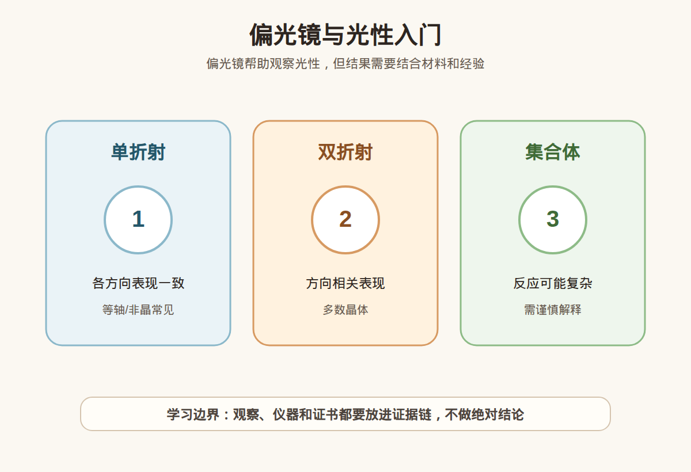

# 第 14 课：偏光镜与光性：单折射、双折射和集合体

## 1. 本课核心笔记

### 1.1 本课重要结论

这一课先记住 6 个结论：

1. 偏光镜用于观察宝石在偏振光下旋转时的明暗变化，帮助判断单折射 SR、双折射 DR、异常反应和集合体 AGG。
2. 单折射、双折射和集合体反应与材料的晶体结构、内部应力、颗粒组合和观察方向有关，不是简单的「亮就真、暗就假」。
3. 正交偏光下，单折射材料通常保持全暗；双折射材料旋转时可能出现四明四暗；集合体常呈现不规则明暗或斑驳反应。
4. 消光现象需要在正确操作条件下理解：上下偏光片要正交、样品要居中旋转、光源要稳定，样品不能太厚、太深或被镶嵌遮挡。
5. 集合体材料如翡翠、和田玉、玛瑙、绿松石等由许多微小颗粒组成，偏光镜下反应可能复杂，不能直接套用单晶规则。
6. 偏光镜是证据链的一环，不能单独完成真假、处理、合成、产地或估价判断。

一句话总结：

> 偏光镜能帮助我们看光性和消光反应，但看到 SR、DR 或 AGG 只是观察结果，不是最终鉴定结论。

### 1.2 为什么学习偏光镜与光性

折射率告诉我们光进入材料后如何传播，偏光镜则进一步帮助我们观察材料对偏振光的反应。很多宝石的光学性质和晶体结构密切相关：等轴晶系宝石常表现为单折射，非等轴晶系宝石常表现为双折射，集合体材料又会表现出更复杂的整体反应。

偏光镜的优势是直观、基础、成本相对低，适合教学中理解光性。但它也容易被过度营销。有些短视频会说「偏光镜一看就知道真假」，这句话不稳妥。偏光镜能告诉我们样品在特定条件下的光性表现，却不能单独说明它天然还是合成、是否经过处理、是不是高价值货。

学习这一课，是为了把观察语言说清楚：

- 我看到的是全暗、四明四暗，还是不规则明暗？
- 这个反应更像 SR、DR、异常双折射，还是 AGG？
- 样品状态和操作条件是否足够可靠？
- 还需要哪些证据继续判断？

### 1.3 偏光镜的基本结构和操作条件

偏光镜通常由下偏光片、上偏光片、光源和可旋转样品台组成。上下偏光片互相垂直时，称为正交偏光。没有样品时，视野应当接近黑暗；放入样品后，观察它旋转一周时明暗如何变化。

基础操作要点：

| 条件 | 为什么重要 | 如果没做好会怎样 |
| --- | --- | --- |
| 上下偏光片正交 | 形成标准暗背景 | 背景不暗，消光判断混乱 |
| 光源稳定 | 保证明暗变化来自样品 | 光源闪烁会被误认为反应 |
| 样品居中旋转 | 观察完整旋转变化 | 偏心移动导致明暗不稳定 |
| 样品清洁 | 减少油污、灰尘散射 | 可能出现假亮点或模糊反应 |
| 厚度和颜色适中 | 便于光线通过 | 太深太厚时难观察内部反应 |
| 避免镶嵌遮挡 | 金属会挡光或反光 | 成品结果可能不可解释 |

偏光镜观察不是把样品放上去看一眼。正确做法是旋转样品，观察一整圈；必要时换方向、换位置、加入辅助透镜或锥光镜继续判断。小白阶段只需要理解原理和边界，不需要把每个复杂图像都判到具体矿物。

### 1.4 SR、DR、AGG 分别是什么

入门时最常见的三个标签是 SR、DR、AGG：

| 术语 | 全称 | 典型表现 | 入门理解 |
| --- | --- | --- | --- |
| SR | Single Refraction 单折射 | 正交偏光下旋转时常保持全暗 | 光学性质各方向基本一致 |
| DR | Double Refraction 双折射 | 旋转时出现明暗交替，常说四明四暗 | 不同方向光学性质不同 |
| AGG | Aggregate 集合体 | 常见斑驳、颗粒状、不规则明暗 | 由许多小晶粒共同产生反应 |

单折射常见于等轴晶系宝石，如石榴石、尖晶石、钻石等，也包括玻璃这类非晶质材料。但要注意，某些单折射材料可能因内应力、应变、处理或内部结构出现异常双折射，看起来不是完全全暗。

双折射常见于非等轴晶系晶体，例如石英、刚玉、绿柱石、电气石等。旋转时出现明暗交替，是因为光在不同方向上的传播行为不同。这里的「四明四暗」是教学中常用的概括，实际观察会受到切工、方向、颜色深浅和样品厚度影响。

集合体不是单颗理想晶体，而是许多微小晶体或颗粒组合。翡翠、和田玉、玛瑙、绿松石、青金石等都可能呈现集合体相关反应。它们的偏光图像往往不是标准的全暗或四明四暗，而是局部亮、局部暗、斑驳、颗粒状或云雾状。

### 1.5 消光现象怎么理解

「消光」指样品在偏光镜下某些方向变暗或接近全暗。它不是一个神秘结论，而是光通过材料和偏光片后被阻挡或不再通过的结果。

常见观察可以这样拆：

| 观察到的现象 | 可能提示 | 不能直接推出 |
| --- | --- | --- |
| 旋转一圈始终暗 | 可能为 SR，或样品太深、光进不去 | 不能直接说一定是某宝石 |
| 旋转时有规律明暗交替 | 可能为 DR | 不能直接说天然或无处理 |
| 局部斑驳明暗 | 可能为 AGG 或内部结构复杂 | 不能直接判断具体品类和价格 |
| 单折射材料出现彩色亮斑 | 可能是异常双折射、应力或结构影响 | 不能单独判定处理方式 |
| 成品上金属反光明显 | 可能是镶嵌干扰 | 不宜强行解释为光性特征 |

消光现象要和样品方向一起看。有些双折射材料如果刚好沿特定方向观察，反应可能不明显；有些颜色很深的材料因为透光差，也难以得到清楚图像。样品太厚、包裹体多、裂隙多、表面污渍或镶嵌遮挡，都会让偏光镜结果不稳定。

### 1.6 集合体材料为什么容易干扰判断

集合体材料是本课的重点难点。新手很容易把偏光镜规则背成「全暗等于单折射、四明四暗等于双折射」，但翡翠、和田玉、玛瑙等材料常常不适合用这么直线的方式解释。

原因包括：

1. 它们不是一个方向一致的完整单晶，而是很多微小晶体交织、纤维化、颗粒化或层状组合。
2. 不同小颗粒的光学方向不同，旋转时局部明暗可能不同步。
3. 颜色、透明度和厚度会影响透光，深色或不透明区域看不到完整反应。
4. 裂隙、充填、染色、表面抛光和结构疏密都可能改变视觉效果。
5. 成品玉雕、手镯、珠串形状复杂，光路不如教材切片简单。

所以对集合体更稳妥的表达是：「偏光镜下呈现集合体样不规则明暗反应，说明材料内部不是单一理想晶体表现；具体品类、处理和价值仍需结合其他检测。」不应说：「偏光镜斑驳，所以一定是某某玉。」

### 1.7 偏光镜如何和其他证据配合

偏光镜最适合回答的是「光性表现是什么」。要形成更完整判断，还需要：

| 证据 | 解决的问题 | 与偏光镜的关系 |
| --- | --- | --- |
| 折射率 | 材料 RI 是否落在某范围 | SR/DR 可帮助解释读数数量 |
| 比重 | 材料密度是否匹配 | 排除外观相似但密度不同材料 |
| 放大观察 | 包裹体、结构、拼合、处理痕迹 | 解释异常反应来源 |
| 分光/滤色 | 颜色和吸收特征 | 辅助判断致色和材料 |
| 证书 | 机构综合检测结论 | 高价消费的主要依据 |

比如一颗样品在偏光镜下表现为 DR，这能排除一些典型 SR 材料，但不能直接说明它就是某个具体宝石。再比如一个样品表现为 AGG，这可能支持它是集合体材料的线索，但不能直接排除处理、染色或拼合。

### 1.8 消费边界和红线

本课消费边界：

- 可以用偏光镜学习 SR、DR、AGG 和消光现象。
- 可以把偏光镜结果作为追问商家的证据点。
- 不凭偏光镜单独判真假、天然/合成、处理、产地或价格。
- 不对成品镶嵌、厚重深色样品、复杂集合体做过度解释。

红线包括：

1. 商家只用偏光镜给你看一个画面，就要求你相信「保真、无处理、高品质」。
2. 不说明样品是否镶嵌、是否透光、是否有其他检测，就把偏光反应当最终结论。
3. 用偏光镜隔着视频、隔着屏幕让你判断高价珠宝。
4. 对集合体材料套用单晶规则，给出绝对真假判断。

更稳妥的追问是：「这个偏光反应说明的是 SR、DR 还是 AGG？有没有折射率、比重、放大观察和证书支持？如果是高价货，能否复检？」

## 2. 必背知识卡

### 卡片 1：偏光镜

偏光镜通过正交偏振光观察样品旋转时的明暗变化，主要用于辅助判断光性。

### 卡片 2：SR 单折射

SR 表示单折射，材料光学性质各方向基本一致，正交偏光下常见旋转保持全暗，但可能有异常反应。

### 卡片 3：DR 双折射

DR 表示双折射，不同方向光学性质不同，旋转时可能出现有规律的明暗交替。

### 卡片 4：AGG 集合体

AGG 表示集合体反应，常见不规则、颗粒状或斑驳明暗，不能简单套用单晶规则。

### 卡片 5：消光

消光是样品在特定方向变暗或接近全暗的现象，需要在正确操作条件和样品状态下解释。

### 卡片 6：证据边界

偏光镜结果必须结合折射率、比重、放大观察、光谱和证书；它不是独立鉴定器。

## 3. 可交互作业

### 作业 1：现象判断

请判断下面观察能说明什么、不能说明什么：

1. 某样品在正交偏光下旋转一圈基本全暗。
2. 某样品旋转时出现规律性明暗交替。
3. 某玉石样品出现斑驳、不规则明暗。
4. 镶嵌戒指在偏光镜下有金属反光和局部亮点。

参考方向：

- 第 1 项可能提示 SR 或透光受限，不能直接确定品种。
- 第 2 项可能提示 DR，但不能直接说明天然、无处理或高价值。
- 第 3 项可能提示集合体反应，要结合结构、比重、证书等判断。
- 第 4 项说明成品镶嵌可能干扰观察，不宜过度解释。

### 作业 2：术语配对

把下面术语和解释配对：SR、DR、AGG、消光、异常双折射。

参考方向：

- SR：单折射表现。
- DR：双折射表现。
- AGG：集合体反应。
- 消光：特定方向变暗的现象。
- 异常双折射：本应单折射的材料因应力等原因出现非典型明暗反应。

### 作业 3：自媒体表达改写

把这句话改成更稳妥的小白学习表达：

> 偏光镜一照就知道这件东西真假，根本不用看证书。

建议改写：

> 偏光镜可以提供 SR、DR 或集合体反应等光性线索，但真假、处理、合成、拼合和价值需要多项检测共同判断；高价购买仍要看证书、支持复检。

## 4. 自媒体内容草稿

### 4.1 图文/短视频标题备选

- 我学珠宝第 14 课：偏光镜不是一眼判真假
- SR、DR、AGG 是什么？偏光镜小白入门
- 为什么翡翠和和田玉不能简单套用四明四暗？
- 偏光镜看到明暗变化，只能说明到哪一步？

### 4.2 短视频脚本

今天学珠宝第 14 课：偏光镜与光性。

偏光镜不是独立鉴定器，它主要观察样品在正交偏光下旋转时的明暗变化。常见标签有 SR 单折射、DR 双折射和 AGG 集合体。

单折射材料常见全暗，双折射材料可能出现有规律的明暗交替，集合体材料常见斑驳、不规则反应。但这些都需要在正确操作条件下看：上下偏光片要正交，样品要能透光，要旋转观察，还要避开镶嵌金属和深色厚样品的干扰。

尤其是翡翠、和田玉、玛瑙这类集合体，反应可能很复杂，不能用一句「亮了」或「暗了」直接判真假。

我现在还是学习者，不凭偏光镜做鉴定、估价或产地判断。高价货还是要看折射率、放大观察、证书和复检。

### 4.3 图文结构

第 1 页：标题

- 偏光镜能看光性，但不能一眼判真假

第 2 页：三个关键词

- SR：单折射
- DR：双折射
- AGG：集合体

第 3 页：消光怎么理解

- 旋转样品观察明暗变化
- 全暗、明暗交替、斑驳都只是现象
- 现象需要解释条件

第 4 页：集合体为什么难

- 许多微小颗粒组合
- 方向不一致
- 反应不规则
- 翡翠、和田玉、玛瑙要谨慎

第 5 页：操作条件

- 偏光片正交
- 光源稳定
- 样品可透光
- 避免镶嵌遮挡

第 6 页：消费红线

- 不凭一个偏光画面付款
- 不隔屏幕做高价判断
- 高价货看证书和复检

### 4.4 配图、视频与分屏素材

本课已准备发布素材包：

- [偏光镜与光性入门 PNG](../assets/lesson-14/polariscope-optic-character.png) / [SVG 源文件](../assets/lesson-14/polariscope-optic-character.svg)
- [第 14 课短视频分镜](../assets/lesson-14/video-shotlist.md)
- [第 14 课分屏视频脚本](../assets/lesson-14/split-screen-script.md)
- [第 14 课图文轮播稿](../assets/lesson-14/carousel-copy.md)

### 4.5 评论区互动问题

你想先看 SR/DR 的演示，还是想看集合体材料为什么会出现斑驳反应？

## 5. 学习档案更新

- 材料状态：已备课，待学习。
- 本课主题：偏光镜与光性：单折射、双折射和集合体。
- 学习时重点确认：
  - 偏光镜观察的是偏振光下旋转时的明暗变化。
  - SR、DR、AGG 是光性和结构线索，不是最终鉴定结论。
  - 消光现象需要结合正确操作条件和样品状态解释。
  - 集合体材料反应复杂，不能简单套用单晶规则。
  - 偏光镜结果要与折射率、比重、放大观察、光谱和证书共同判断。
- 需要复习：
  - 正交偏光、消光、异常双折射的含义。
  - SR、DR、AGG 的典型表现和限制。
  - 对镶嵌成品和集合体材料如何表达观察边界。
- 自媒体素材：
  - 适合做 1 条 60-90 秒短视频。
  - 适合做 6 页图文轮播。
  - 重点画面是 SR/DR/AGG 对比和偏光镜操作条件。
- 下一课建议：第 15 课：二色镜、分光镜和滤色镜入门。
