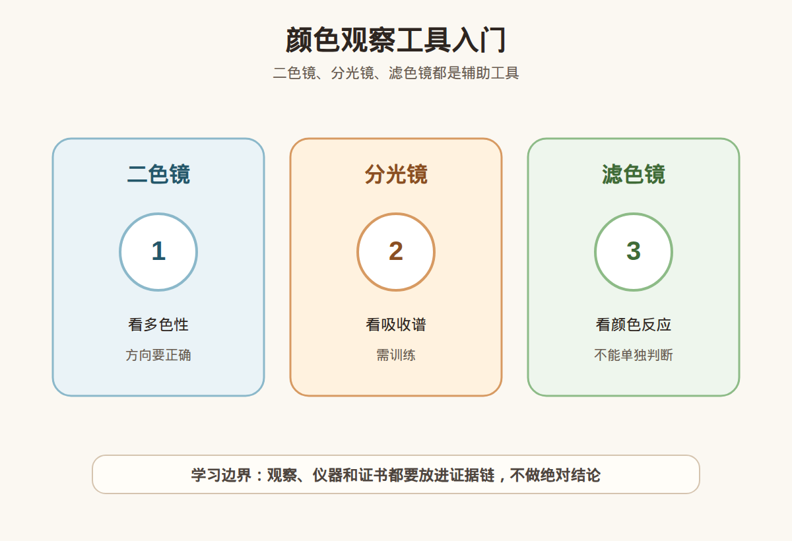

# 第 15 课：二色镜、分光镜和滤色镜入门

## 1. 本课核心笔记

### 1.1 本课重要结论

这一课先记住 5 个结论：

1. 二色镜、分光镜和滤色镜都与颜色和光吸收观察有关。
2. 二色镜可辅助观察多色性，但样品方向和颜色深浅会影响结果。
3. 分光镜观察吸收光谱，需要训练和合适光源。
4. 滤色镜只能作为辅助筛查，不能单独判断真假。
5. 颜色工具的结果必须和证书、显微观察、折射率等信息结合。

一句话总结：

> 本课材料已备好，正式学习时要把“观察线索”和“鉴定/估价/购买结论”分开，高价货继续回到证书、复检和专业机构判断。

### 1.2 为什么学习这一课

这一课属于宝石学基础与消费决策之间的连接课。它的目标不是让你立刻成为鉴定师，而是让你以后看证书、看仪器结果、看商家话术时，知道哪些是证据，哪些只是描述，哪些需要继续核实。

### 1.3 二色镜

二色镜用于观察某些宝石不同方向的颜色差异，适合学习多色性概念。但颜色太浅、切工方向不合适时可能不明显。

### 1.4 分光镜

分光镜用于观察宝石吸收光谱。某些元素或结构会产生特征吸收，但新手读谱容易误判。

### 1.5 滤色镜

滤色镜会让某些材料出现特定颜色反应，但相似反应可能来自不同原因，不能单独下结论。

### 1.6 消费边界

这些工具适合学习和辅助筛查，不适合当作“秒判真假”的营销工具。

## 2. 必背知识卡

### 卡片 1：二色镜

观察宝石不同方向颜色差异。

### 卡片 2：多色性

不同方向呈现不同颜色的现象。

### 卡片 3：分光镜

观察吸收光谱的工具。

### 卡片 4：吸收谱

材料吸收特定波段光形成的谱线或谱带。

### 卡片 5：滤色镜

用特定滤光片观察颜色反应。

### 卡片 6：消费边界

颜色反应不等于最终鉴定。

## 3. 可交互作业

### 作业 1：概念判断

请回答下面问题，并尽量说明理由：

1. 二色镜适合观察什么？
2. 分光镜为什么需要训练？
3. 滤色镜能不能单独判断真假？
4. 颜色观察工具应如何进入证据链？

### 作业 2：自媒体表达改写

把这句话改成更稳妥的小白学习表达：

> 滤色镜变色了，所以一定是真的。

建议改写：

> 滤色镜反应是一个观察线索，但需要结合材料、光源、其他仪器和证书，不能单独判断真假。

### 作业 3：消费场景追问

如果在柜台、直播间或私域里听到类似说法，请至少追问：

1. 证书或检测依据是什么？
2. 是否说明处理、合成、仿制或其他限制？
3. 价格和预算是否匹配？
4. 是否支持复检和售后？

## 4. 自媒体内容草稿

### 4.1 图文/短视频标题备选

- 我学珠宝第 15 课：二色镜、分光镜和滤色镜入门
- 珠宝小白先别急着下结论：这一课先学证据边界
- 这个知识点看似基础，但能避开很多消费误区

### 4.2 短视频脚本

今天学珠宝第 15 课：二色镜、分光镜和滤色镜入门。

我现在还是学习者，所以这节课不会做鉴定、估价或产地判断，而是先建立一个更稳妥的判断框架。

二色镜、分光镜和滤色镜都与颜色和光吸收观察有关。

二色镜可辅助观察多色性，但样品方向和颜色深浅会影响结果。

真正消费时，不能只听一个参数、一个故事、一个仪器反应或一张截图。高价货还是要看证书、核对样品，必要时复检或咨询专业机构。

### 4.3 图文结构

第 1 页：标题

- 二色镜、分光镜和滤色镜入门

第 2 页：核心概念

- 二色镜、分光镜和滤色镜都与颜色和光吸收观察有关。
- 二色镜可辅助观察多色性，但样品方向和颜色深浅会影响结果。

第 3 页：为什么容易误解

- 商业话术常把一个信息点包装成完整结论。
- 新手容易把“观察描述”听成“专业判断”。

第 4 页：正确学习方式

- 先理解概念。
- 再看证据链。
- 最后明确风险和预算。

第 5 页：消费提醒

- 不做真假鉴定结论。
- 不做估价结论。
- 不做产地判断。
- 高价货看证书、复检和专业机构。

第 6 页：互动问题

- 你最想把这一课里的哪个点做成短视频？

### 4.4 配图、视频与分屏素材

本课已准备发布素材包：

- [颜色观察工具入门 PNG](../assets/lesson-15/color-observation-instruments.png) / [SVG 源文件](../assets/lesson-15/color-observation-instruments.svg)
- [第 15 课短视频分镜](../assets/lesson-15/video-shotlist.md)
- [第 15 课分屏视频脚本](../assets/lesson-15/split-screen-script.md)
- [第 15 课图文轮播稿](../assets/lesson-15/carousel-copy.md)

### 4.5 评论区互动问题

你在买珠宝时最容易被哪类说法打动？你希望我下一条把哪个概念拆成小白版？

## 5. 学习档案更新

- 材料状态：已备课，待后续正式学习。
- 本课主题：二色镜、分光镜和滤色镜入门。
- 学习时重点确认：
- 二色镜、分光镜和滤色镜都与颜色和光吸收观察有关。
- 二色镜可辅助观察多色性，但样品方向和颜色深浅会影响结果。
- 分光镜观察吸收光谱，需要训练和合适光源。
- 滤色镜只能作为辅助筛查，不能单独判断真假。
- 颜色工具的结果必须和证书、显微观察、折射率等信息结合。
- 学习后需要复习：
  - 本课关键术语。
  - 本课和证书、仪器、预算之间的关系。
  - 如何把观察描述和鉴定结论分开。
- 已准备自媒体素材：
  - 关键配图 PNG 和 SVG 源文件。
  - 60-90 秒短视频分镜。
  - 分屏视频脚本。
  - 6 页图文轮播稿。
- 学完本课后的下一课建议：第 16 课：比重与密度：手感、静水称重和消费边界。
