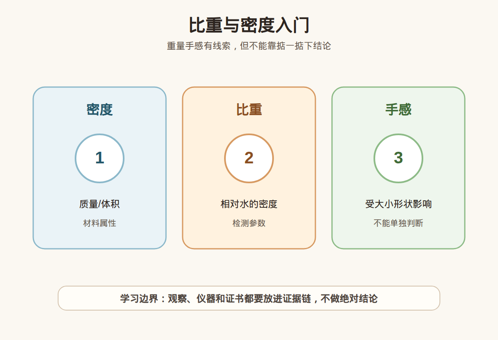

# 第 16 课：比重与密度：手感、静水称重和消费边界

## 1. 本课核心笔记

### 1.1 本课重要结论

这一课先记住 5 个结论：

1. 密度和比重能帮助理解材料重量感和鉴别证据。
2. “掂着重”不等于一定是真货或高价值。
3. 静水称重可以估算比重，但需要规范操作和合适样品。
4. 镶嵌成品、空心结构、裂隙和附属材料会影响判断。
5. 比重只是证据之一，必须结合其他检测。

一句话总结：

> 本课材料已备好，正式学习时要把“观察线索”和“鉴定/估价/购买结论”分开，高价货继续回到证书、复检和专业机构判断。

### 1.2 为什么学习这一课

这一课属于宝石学基础与消费决策之间的连接课。它的目标不是让你立刻成为鉴定师，而是让你以后看证书、看仪器结果、看商家话术时，知道哪些是证据，哪些只是描述，哪些需要继续核实。

### 1.3 密度和比重

密度描述单位体积的质量，比重是材料密度与水密度的相对关系。不同宝石材料有不同范围。

### 1.4 为什么手感不可靠

手感会被大小、形状、镶嵌金属、空心结构和心理预期影响。新手不应靠“压手”下结论。

### 1.5 静水称重

静水称重通过空气中重量和水中重量估算比重。这个方法需要样品适合、数据准确、操作规范。

### 1.6 消费边界

比重测试不适合所有成品珠宝，高价货仍要看证书和专业检测。

## 2. 必背知识卡

### 卡片 1：密度

单位体积质量。

### 卡片 2：比重 SG

相对于水的密度。

### 卡片 3：静水称重

用空气中和水中重量估算比重。

### 卡片 4：压手感

主观重量感，不能单独判断。

### 卡片 5：成品限制

镶嵌和附属材料会影响测量。

### 卡片 6：消费边界

比重不能替代完整检测。

## 3. 可交互作业

### 作业 1：概念判断

请回答下面问题，并尽量说明理由：

1. 为什么不能靠手感判断真假？
2. 静水称重需要哪些条件？
3. 镶嵌成品为什么会影响比重判断？
4. 比重数据应如何和其他证据结合？

### 作业 2：自媒体表达改写

把这句话改成更稳妥的小白学习表达：

> 这个特别压手，肯定是真的。

建议改写：

> 压手感只能作为主观观察，不能证明真假；还要结合材料、尺寸、镶嵌情况、证书和专业检测。

### 作业 3：消费场景追问

如果在柜台、直播间或私域里听到类似说法，请至少追问：

1. 证书或检测依据是什么？
2. 是否说明处理、合成、仿制或其他限制？
3. 价格和预算是否匹配？
4. 是否支持复检和售后？

## 4. 自媒体内容草稿

### 4.1 图文/短视频标题备选

- 我学珠宝第 16 课：比重与密度：手感、静水称重和消费边界
- 珠宝小白先别急着下结论：这一课先学证据边界
- 这个知识点看似基础，但能避开很多消费误区

### 4.2 短视频脚本

今天学珠宝第 16 课：比重与密度：手感、静水称重和消费边界。

我现在还是学习者，所以这节课不会做鉴定、估价或产地判断，而是先建立一个更稳妥的判断框架。

密度和比重能帮助理解材料重量感和鉴别证据。

“掂着重”不等于一定是真货或高价值。

真正消费时，不能只听一个参数、一个故事、一个仪器反应或一张截图。高价货还是要看证书、核对样品，必要时复检或咨询专业机构。

### 4.3 图文结构

第 1 页：标题

- 比重与密度：手感、静水称重和消费边界

第 2 页：核心概念

- 密度和比重能帮助理解材料重量感和鉴别证据。
- “掂着重”不等于一定是真货或高价值。

第 3 页：为什么容易误解

- 商业话术常把一个信息点包装成完整结论。
- 新手容易把“观察描述”听成“专业判断”。

第 4 页：正确学习方式

- 先理解概念。
- 再看证据链。
- 最后明确风险和预算。

第 5 页：消费提醒

- 不做真假鉴定结论。
- 不做估价结论。
- 不做产地判断。
- 高价货看证书、复检和专业机构。

第 6 页：互动问题

- 你最想把这一课里的哪个点做成短视频？

### 4.4 配图、视频与分屏素材

本课已准备发布素材包：

- [比重与密度入门 PNG](../assets/lesson-16/specific-gravity-density.png) / [SVG 源文件](../assets/lesson-16/specific-gravity-density.svg)
- [第 16 课短视频分镜](../assets/lesson-16/video-shotlist.md)
- [第 16 课分屏视频脚本](../assets/lesson-16/split-screen-script.md)
- [第 16 课图文轮播稿](../assets/lesson-16/carousel-copy.md)

### 4.5 评论区互动问题

你在买珠宝时最容易被哪类说法打动？你希望我下一条把哪个概念拆成小白版？

## 5. 学习档案更新

- 材料状态：已备课，待后续正式学习。
- 本课主题：比重与密度：手感、静水称重和消费边界。
- 学习时重点确认：
- 密度和比重能帮助理解材料重量感和鉴别证据。
- “掂着重”不等于一定是真货或高价值。
- 静水称重可以估算比重，但需要规范操作和合适样品。
- 镶嵌成品、空心结构、裂隙和附属材料会影响判断。
- 比重只是证据之一，必须结合其他检测。
- 学习后需要复习：
  - 本课关键术语。
  - 本课和证书、仪器、预算之间的关系。
  - 如何把观察描述和鉴定结论分开。
- 已准备自媒体素材：
  - 关键配图 PNG 和 SVG 源文件。
  - 60-90 秒短视频分镜。
  - 分屏视频脚本。
  - 6 页图文轮播稿。
- 学完本课后的下一课建议：第 17 课：常见优化处理总览：加热、染色、充填、扩散和辐照。
