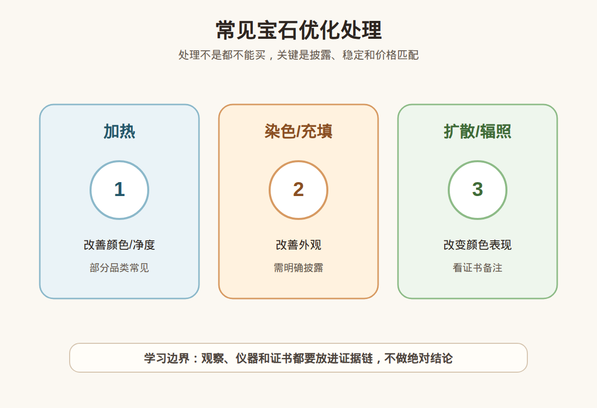

# 第 17 课：常见优化处理总览：加热、染色、充填、扩散和辐照

## 1. 本课核心笔记

### 1.1 本课重要结论

这一课先记住 5 个结论：

1. 优化处理是珠宝行业重要话题，不是所有处理都等于不能买。
2. 关键问题是是否披露、是否稳定、价格是否匹配。
3. 加热、染色、充填、扩散、辐照等处理方式影响不同。
4. 同一处理在不同品类中的接受度和价值影响不同。
5. 新手遇到高价货必须看证书处理备注并考虑复检。

一句话总结：

> 本课材料已备好，正式学习时要把“观察线索”和“鉴定/估价/购买结论”分开，高价货继续回到证书、复检和专业机构判断。

### 1.2 为什么学习这一课

这一课属于宝石学基础与消费决策之间的连接课。它的目标不是让你立刻成为鉴定师，而是让你以后看证书、看仪器结果、看商家话术时，知道哪些是证据，哪些只是描述，哪些需要继续核实。

### 1.2 为什么要学处理

很多宝石会经过不同程度的处理来改善颜色、净度或外观。了解处理能帮助你理解价格差异和风险。

### 1.3 常见处理方式

加热常用于改善颜色或净度；染色用于改变或增强颜色；充填用于改善裂隙外观；扩散和辐照可能改变颜色表现。

### 1.4 处理是否能接受

不是所有处理都不能买。关键看品类惯例、处理稳定性、是否披露、价格是否匹配和个人接受度。

### 1.5 消费边界

不要听“天然无处理”口头承诺就下单。高价彩宝、翡翠、祖母绿等尤其要看证书和复检。

## 2. 必背知识卡

### 卡片 1：加热

通过加热改善颜色或净度。

### 卡片 2：染色

外来颜色物质进入材料。

### 卡片 3：充填

用物质填充裂隙改善外观。

### 卡片 4：扩散

元素进入表层或内部改变颜色。

### 卡片 5：辐照

通过辐照改变颜色中心。

### 卡片 6：披露

处理信息应被清楚说明。

## 3. 可交互作业

### 作业 1：概念判断

请回答下面问题，并尽量说明理由：

1. 处理是否一定不能买？
2. 为什么披露很重要？
3. 染色和加热对价值影响一样吗？
4. 高价货如何核对处理情况？

### 作业 2：自媒体表达改写

把这句话改成更稳妥的小白学习表达：

> 处理过的宝石都不能买。

建议改写：

> 处理方式有很多，不能一概而论；关键看品类惯例、是否披露、稳定性、证书说明和价格是否匹配。

### 作业 3：消费场景追问

如果在柜台、直播间或私域里听到类似说法，请至少追问：

1. 证书或检测依据是什么？
2. 是否说明处理、合成、仿制或其他限制？
3. 价格和预算是否匹配？
4. 是否支持复检和售后？

## 4. 自媒体内容草稿

### 4.1 图文/短视频标题备选

- 我学珠宝第 17 课：常见优化处理总览：加热、染色、充填、扩散和辐照
- 珠宝小白先别急着下结论：这一课先学证据边界
- 这个知识点看似基础，但能避开很多消费误区

### 4.2 短视频脚本

今天学珠宝第 17 课：常见优化处理总览：加热、染色、充填、扩散和辐照。

我现在还是学习者，所以这节课不会做鉴定、估价或产地判断，而是先建立一个更稳妥的判断框架。

优化处理是珠宝行业重要话题，不是所有处理都等于不能买。

关键问题是是否披露、是否稳定、价格是否匹配。

真正消费时，不能只听一个参数、一个故事、一个仪器反应或一张截图。高价货还是要看证书、核对样品，必要时复检或咨询专业机构。

### 4.3 图文结构

第 1 页：标题

- 常见优化处理总览：加热、染色、充填、扩散和辐照

第 2 页：核心概念

- 优化处理是珠宝行业重要话题，不是所有处理都等于不能买。
- 关键问题是是否披露、是否稳定、价格是否匹配。

第 3 页：为什么容易误解

- 商业话术常把一个信息点包装成完整结论。
- 新手容易把“观察描述”听成“专业判断”。

第 4 页：正确学习方式

- 先理解概念。
- 再看证据链。
- 最后明确风险和预算。

第 5 页：消费提醒

- 不做真假鉴定结论。
- 不做估价结论。
- 不做产地判断。
- 高价货看证书、复检和专业机构。

第 6 页：互动问题

- 你最想把这一课里的哪个点做成短视频？

### 4.4 配图、视频与分屏素材

本课已准备发布素材包：

- [常见宝石优化处理 PNG](../assets/lesson-17/gem-treatment-overview.png) / [SVG 源文件](../assets/lesson-17/gem-treatment-overview.svg)
- [第 17 课短视频分镜](../assets/lesson-17/video-shotlist.md)
- [第 17 课分屏视频脚本](../assets/lesson-17/split-screen-script.md)
- [第 17 课图文轮播稿](../assets/lesson-17/carousel-copy.md)

### 4.5 评论区互动问题

你在买珠宝时最容易被哪类说法打动？你希望我下一条把哪个概念拆成小白版？

## 5. 学习档案更新

- 材料状态：已备课，待后续正式学习。
- 本课主题：常见优化处理总览：加热、染色、充填、扩散和辐照。
- 学习时重点确认：
- 优化处理是珠宝行业重要话题，不是所有处理都等于不能买。
- 关键问题是是否披露、是否稳定、价格是否匹配。
- 加热、染色、充填、扩散、辐照等处理方式影响不同。
- 同一处理在不同品类中的接受度和价值影响不同。
- 新手遇到高价货必须看证书处理备注并考虑复检。
- 学习后需要复习：
  - 本课关键术语。
  - 本课和证书、仪器、预算之间的关系。
  - 如何把观察描述和鉴定结论分开。
- 已准备自媒体素材：
  - 关键配图 PNG 和 SVG 源文件。
  - 60-90 秒短视频分镜。
  - 分屏视频脚本。
  - 6 页图文轮播稿。
- 学完本课后的下一课建议：第 18 课：天然、合成、仿制、拼合石的区别。
