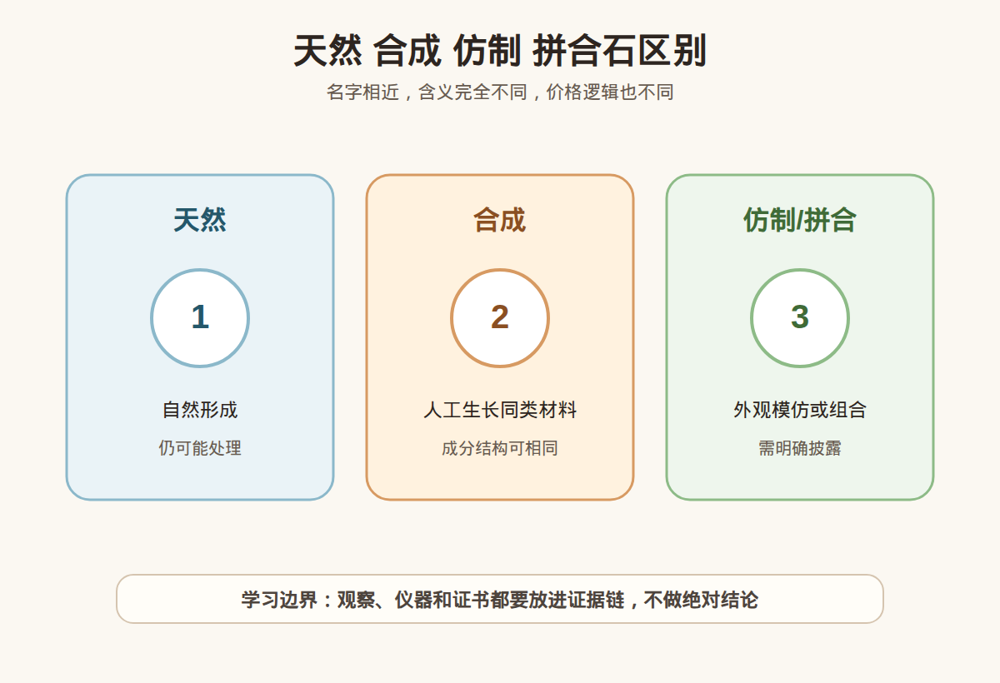

# 第 18 课：天然、合成、仿制、拼合石的区别

## 1. 本课核心笔记

### 1.1 本课重要结论

这一课先记住 6 个结论：

1. 天然、合成、仿制、拼合石是四个不同概念，不能用「真/假」两个字简单代替。
2. 天然宝石是在自然地质环境中形成，但天然不等于无处理，也不等于一定高品质或高价值。
3. 合成宝石是人工方法生长的对应材料，可能和天然宝石有相同化学成分和晶体结构；合成不是「假」，但必须披露。
4. 仿制品重点是模仿外观，材料本质可能完全不同，例如用玻璃、塑料或其他宝石模仿高价值宝石。
5. 拼合石由两层或多层材料组合，外观可能很像天然宝石，但结构不同，必须明确披露。
6. 消费判断要同时问来源类别、处理情况、证书表述、价格逻辑和个人用途，不要被「天然就好、合成就假」带偏。

一句话总结：

> 合成不等于假，仿制才是外观模仿，拼合是结构组合；真正的消费红线是概念混用和不披露。

### 1.2 为什么学习这些定义

很多珠宝纠纷不是因为消费者完全不懂美丑，而是因为基础概念被混用。销售说「真宝石」，消费者以为是天然无处理；销售说「实验室培育」，消费者以为是假货；销售说「同款效果」，消费者没有意识到可能是仿制材料；销售说「复合工艺」，消费者没听懂它可能是拼合结构。

这节课要建立一套清楚的分类语言：

- 这件材料是自然形成，还是人工生长？
- 它的化学成分和结构是否对应某天然宝石？
- 它只是长得像，还是材料本身就是对应品种？
- 它是否由多层材料组合？
- 它是否还经过加热、染色、充填等处理？

只有把这些问题分开，才能看懂证书、理解价格差异，也能避免把合成、仿制、处理、拼合全部混成「真假」。

### 1.3 天然宝石：自然形成，但不自动等于完美

天然宝石指在自然地质过程中形成的材料。它的形成环境、时间尺度和稀缺性，是天然宝石价格逻辑的重要部分。但「天然」只是说明来源，不自动说明品质、是否处理、是否适合购买。

天然宝石还需要继续看：

| 问题 | 为什么重要 |
| --- | --- |
| 品种是什么 | 不同宝石价值体系完全不同 |
| 品质如何 | 颜色、净度、切工、大小影响价格 |
| 是否处理 | 天然宝石也可能加热、染色、充填 |
| 证书如何写 | 高价货需要机构确认 |
| 是否适合用途 | 日常佩戴要看耐久性和保养 |

例如，一颗天然宝石颜色差、裂多、处理重，并不一定比一颗高品质合成宝石更适合某个消费者。反过来，如果消费者追求天然稀缺和收藏属性，那合成宝石就不能替代天然宝石的心理和市场逻辑。关键是不要把「天然」偷换成「无处理、高品质、保值」。

### 1.4 合成宝石：人工生长，不是仿制

合成宝石是通过人工方法生长出来的宝石材料。它和对应天然宝石可能具有相同或基本相同的化学成分、晶体结构和物理性质。比如合成红宝石、合成蓝宝石、合成祖母绿、培育钻石，都不是简单的玻璃仿品。

合成宝石的关键词是「人工生长的对应材料」：

| 项目 | 合成宝石 | 仿制品 |
| --- | --- | --- |
| 材料本质 | 通常对应天然宝石的成分和结构 | 可能完全不同 |
| 目标 | 人工生长同类材料 | 模仿外观 |
| 价格逻辑 | 与天然不同，通常更可控 | 取决于仿制材料本身 |
| 披露要求 | 必须说明合成/实验室培育 | 必须说明真实材料 |

合成不是假货，但如果把合成当天然卖，就是严重误导。消费者可以出于预算、环保、尺寸、颜色稳定或佩戴用途选择合成宝石；也可以出于天然稀缺、传统心理或转售考虑选择天然宝石。两者不是谁绝对高级，而是价格逻辑和购买目的不同。

### 1.5 仿制品：外观模仿，不是同种材料

仿制品的核心是「看起来像」。它不要求和被模仿对象有相同成分或结构，只要外观效果接近即可。玻璃可以仿钻，塑料可以仿琥珀，染色石英岩可以仿翡翠，尖晶石、锆石、立方氧化锆等也可能在不同场景中被用来模仿其他宝石外观。

仿制品并非一定不能买。很多仿制材料可用于低预算装饰、舞台饰品、日常搭配，只要清楚标明真实材料和价格合理，就可以作为普通饰品消费。问题在于把仿制品当高价值天然宝石出售。

常见风险：

| 风险 | 说明 |
| --- | --- |
| 名称混淆 | 用「某某玉」「某某钻」让消费者误会材料 |
| 价格错位 | 低成本仿制品按高价宝石卖 |
| 证书缺失 | 不提供明确材料鉴定 |
| 话术模糊 | 只说「同款」「天然感」「高冰感」不说真实材质 |

稳妥追问是：「它的真实材料名称是什么？证书写什么？是否只是外观模仿？价格是否按真实材质定？」

### 1.6 拼合石：结构组合必须披露

拼合石由两层或多层材料组合而成，可能是宝石与宝石、宝石与玻璃、薄片与底托、冠部与亭部等组合。常见形式包括二层石、三层石、贴片、覆底、夹层结构等。

拼合的目的可能是改善外观、增加颜色、节省高价值材料，或让低价值材料呈现更像高价宝石的视觉效果。拼合石最大的消费问题不是它一定不能佩戴，而是它的结构会影响价值、耐久性和检测方式，必须披露。

拼合石要关注：

| 问题 | 为什么重要 |
| --- | --- |
| 几层结构 | 影响检测和价值判断 |
| 每层材料是什么 | 决定真实成本和耐久性 |
| 粘接是否稳定 | 影响佩戴、清洁和维修 |
| 是否容易被镶嵌遮挡 | 成品可能不易发现拼合线 |
| 证书是否说明 | 高价购买必须清楚 |

拼合石常常需要放大观察、侧面观察、浸液观察或专业仪器判断。小白不要凭肉眼正面效果下结论，更不要接受「看起来一样所以价值一样」的说法。

### 1.7 天然、处理、合成、仿制、拼合怎么一起看

这些概念可以叠加，最容易让人混乱。例如：

- 天然宝石可以经过加热或充填。
- 合成宝石也可能经过处理。
- 仿制品可能被染色或覆膜。
- 拼合石可能由天然材料和人造材料组合。
- 一件成品可能既是镶嵌成品，又包含处理或拼合。

所以购买时不要只问「真不真」，而要问一组问题：

| 问题 | 目标 |
| --- | --- |
| 材料名称是什么？ | 确认品种 |
| 来源是天然还是合成？ | 确认形成方式 |
| 是否仿制其他宝石？ | 避免外观误导 |
| 是否拼合或复合结构？ | 确认结构 |
| 是否经过处理？ | 确认颜色、净度和稳定性 |
| 证书如何表述？ | 用机构语言核对 |
| 价格按哪种逻辑定？ | 判断预算是否匹配 |

### 1.8 消费边界和红线

本课消费边界：

- 可以买天然，也可以买合成或仿制饰品，前提是信息透明、价格匹配、用途清楚。
- 合成不是假货，但不能冒充天然。
- 仿制品可以作为装饰品，但不能冒充被模仿的高价宝石。
- 拼合石可以存在，但必须披露结构和材料。
- 天然仍要问处理，不能默认无处理。

红线包括：

1. 把合成宝石按天然宝石销售。
2. 把仿制品用模糊名称包装成高价天然宝石。
3. 拼合结构不披露，尤其是镶嵌后遮挡关键部位。
4. 用「真宝石」回避天然/合成/处理/拼合的具体问题。
5. 不提供证书、不支持复检，却用低价或故事催单。

小白最实用的表达是：「我不是只问真不真，我要知道它是天然、合成、仿制还是拼合，是否处理，证书怎么写，价格为什么这样定。」

## 2. 必背知识卡

### 卡片 1：天然

天然宝石在自然地质环境中形成，但天然不等于无处理、高品质或一定保值。

### 卡片 2：合成

合成宝石由人工方法生长，可能与天然对应物有相同成分和结构；合成不是假，但必须披露。

### 卡片 3：仿制

仿制品主要模仿外观，材料本质可能完全不同，价格应按真实材料和工艺判断。

### 卡片 4：拼合石

拼合石由两层或多层材料组合，结构会影响价值、耐久性和检测，必须明确披露。

### 卡片 5：处理叠加

天然或合成材料都可能经过加热、染色、充填等处理；来源和处理是不同问题。

### 卡片 6：消费披露

购买时要同时确认材料、来源、处理、拼合、证书和价格逻辑，不能只听「真」或「天然感」。

## 3. 可交互作业

### 作业 1：概念判断

请判断下面说法是否准确，并说明理由：

1. 合成宝石就是假货。
2. 天然宝石一定没有处理。
3. 仿制品只是外观模仿，真实材料可能完全不同。
4. 拼合石只要好看，就不需要披露。

参考方向：

- 第 1 句错误，合成是人工生长的对应材料，不等于假货。
- 第 2 句错误，天然宝石也可能经过处理。
- 第 3 句准确，仿制强调外观模仿。
- 第 4 句错误，拼合结构影响价值和耐久性，必须披露。

### 作业 2：购买追问练习

如果销售只说「这个是真的」，请写出 6 个更具体的问题。

参考方向：

- 真实材料名称是什么？
- 是天然还是合成？
- 是否是仿制其他宝石的材料？
- 是否有拼合或复合结构？
- 是否经过加热、染色、充填等处理？
- 证书是哪家机构出的，编号能否核验，是否支持复检？

### 作业 3：自媒体表达改写

把这句话改成更稳妥的小白学习表达：

> 合成就是假，天然就一定好，仿制都不能买。

建议改写：

> 合成、天然、仿制和拼合是不同概念。合成不是假，但不能冒充天然；天然也可能处理；仿制品可以作为装饰品购买，前提是真实材料、结构和价格清楚披露。

## 4. 自媒体内容草稿

### 4.1 图文/短视频标题备选

- 我学珠宝第 18 课：合成不是假，仿制才是外观模仿
- 天然、合成、仿制、拼合：买珠宝别只问真不真
- 实验室培育到底算不算假？小白先分清定义
- 拼合石为什么必须披露？结构不同，价格逻辑就不同

### 4.2 短视频脚本

今天学珠宝第 18 课：天然、合成、仿制、拼合石。

这一课最重要的是：不要只用「真」和「假」两个字概括所有珠宝。天然是自然形成，但天然不等于无处理；合成是人工生长的对应材料，可能和天然宝石有相同成分和结构，所以合成不是假，但必须披露。

仿制品就不一样，它重点是模仿外观，材料本质可能完全不同。拼合石则是两层或多层材料组合，外观可能很像高价值宝石，但结构、价值和耐久性都需要单独说明。

所以真正买的时候，我会问：材料是什么？天然还是合成？是否仿制？是否拼合？是否处理？证书怎么写？价格按什么逻辑定？

我现在还是学习者，不凭外观做真假和估价结论。高价货继续看证书、复检和专业机构。

### 4.3 图文结构

第 1 页：标题

- 别只问真不真：先分清四个词

第 2 页：天然

- 自然地质环境形成
- 不等于无处理
- 不等于一定高品质

第 3 页：合成

- 人工生长的对应材料
- 可能成分结构相同
- 不是假，但必须披露

第 4 页：仿制

- 模仿外观
- 材料本质可能不同
- 价格应按真实材料定

第 5 页：拼合

- 两层或多层组合
- 结构影响价值和耐久性
- 必须披露

第 6 页：消费追问

- 材料是什么？
- 来源是什么？
- 是否处理或拼合？
- 证书怎么写？

### 4.4 配图、视频与分屏素材

本课已准备发布素材包：

- [天然 合成 仿制 拼合石区别 PNG](../assets/lesson-18/natural-synthetic-imitation-assembled.png) / [SVG 源文件](../assets/lesson-18/natural-synthetic-imitation-assembled.svg)
- [第 18 课短视频分镜](../assets/lesson-18/video-shotlist.md)
- [第 18 课分屏视频脚本](../assets/lesson-18/split-screen-script.md)
- [第 18 课图文轮播稿](../assets/lesson-18/carousel-copy.md)

### 4.5 评论区互动问题

你以前会把「合成」直接理解成假吗？下一条想看培育钻，还是看拼合石怎么被隐藏？

## 5. 学习档案更新

- 材料状态：已备课，待学习。
- 本课主题：天然、合成、仿制、拼合石的区别。
- 学习时重点确认：
  - 天然、合成、仿制、拼合是不同概念。
  - 合成宝石不是假货，但不能冒充天然。
  - 仿制品是外观模仿，真实材料可能完全不同。
  - 拼合石结构会影响价值和耐久性，必须披露。
  - 天然也可能经过处理，来源和处理要分开问。
- 需要复习：
  - 合成与仿制的区别。
  - 拼合石的结构和消费风险。
  - 如何把「真/假」问题拆成材料、来源、处理、结构和证书。
- 自媒体素材：
  - 适合做 1 条 60-90 秒短视频。
  - 适合做 6 页图文轮播。
  - 重点画面是四类概念对比表和购买追问清单。
- 下一课建议：第 19 课：钻石入门：4C 为什么是消费框架。
