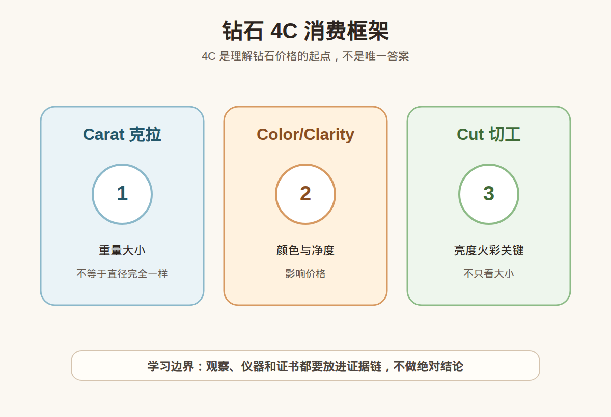

# 第 19 课：钻石入门：4C 为什么是消费框架

## 1. 本课核心笔记

### 1.1 本课重要结论

这一课先记住 5 个结论：

1. 4C 是钻石消费中最常见的基础框架。
2. 克拉是重量，不是直径；同克拉视觉大小可能不同。
3. 颜色和净度影响价格，但要结合预算和肉眼可见程度。
4. 切工会强烈影响亮度、火彩和视觉表现。
5. 买钻石不能只问几克拉，要综合证书、4C、荧光、奶咖绿、预算和用途。

一句话总结：

> 本课材料已备好，正式学习时要把“观察线索”和“鉴定/估价/购买结论”分开，高价货继续回到证书、复检和专业机构判断。

### 1.2 为什么学习这一课

这一课属于宝石学基础与消费决策之间的连接课。它的目标不是让你立刻成为鉴定师，而是让你以后看证书、看仪器结果、看商家话术时，知道哪些是证据，哪些只是描述，哪些需要继续核实。

### 1.2 4C 是什么

4C 包括 Carat 克拉、Color 颜色、Clarity 净度、Cut 切工，是理解钻石价格和品质的基础语言。

### 1.3 为什么不能只看克拉

克拉是重量。同样 1 克拉，切工比例不同，台面视觉大小和亮度可能不同。

### 1.4 颜色、净度和切工

颜色和净度会影响价格，但很多差异需要在特定条件下观察。切工直接影响亮不亮、闪不闪。

### 1.5 消费边界

4C 只是起点，还要看证书、荧光、奶咖绿、预算、佩戴需求和售后。

## 2. 必背知识卡

### 卡片 1：Carat

钻石重量单位。

### 卡片 2：Color

钻石颜色等级。

### 卡片 3：Clarity

内外部特征影响的净度等级。

### 卡片 4：Cut

切工等级和比例表现。

### 卡片 5：证书

核对 4C 的重要依据。

### 卡片 6：预算

4C 选择要服务于预算和用途。

## 3. 可交互作业

### 作业 1：概念判断

请回答下面问题，并尽量说明理由：

1. 克拉是不是直径？
2. 为什么切工很重要？
3. 颜色和净度是否越高越适合所有人？
4. 买钻石除了 4C 还要看什么？

### 作业 2：自媒体表达改写

把这句话改成更稳妥的小白学习表达：

> 买钻石只要买大克拉就行。

建议改写：

> 克拉很重要，但还要看切工、颜色、净度、证书、荧光、预算和佩戴需求，不能只按大小决定。

### 作业 3：消费场景追问

如果在柜台、直播间或私域里听到类似说法，请至少追问：

1. 证书或检测依据是什么？
2. 是否说明处理、合成、仿制或其他限制？
3. 价格和预算是否匹配？
4. 是否支持复检和售后？

## 4. 自媒体内容草稿

### 4.1 图文/短视频标题备选

- 我学珠宝第 19 课：钻石入门：4C 为什么是消费框架
- 珠宝小白先别急着下结论：这一课先学证据边界
- 这个知识点看似基础，但能避开很多消费误区

### 4.2 短视频脚本

今天学珠宝第 19 课：钻石入门：4C 为什么是消费框架。

我现在还是学习者，所以这节课不会做鉴定、估价或产地判断，而是先建立一个更稳妥的判断框架。

4C 是钻石消费中最常见的基础框架。

克拉是重量，不是直径；同克拉视觉大小可能不同。

真正消费时，不能只听一个参数、一个故事、一个仪器反应或一张截图。高价货还是要看证书、核对样品，必要时复检或咨询专业机构。

### 4.3 图文结构

第 1 页：标题

- 钻石入门：4C 为什么是消费框架

第 2 页：核心概念

- 4C 是钻石消费中最常见的基础框架。
- 克拉是重量，不是直径；同克拉视觉大小可能不同。

第 3 页：为什么容易误解

- 商业话术常把一个信息点包装成完整结论。
- 新手容易把“观察描述”听成“专业判断”。

第 4 页：正确学习方式

- 先理解概念。
- 再看证据链。
- 最后明确风险和预算。

第 5 页：消费提醒

- 不做真假鉴定结论。
- 不做估价结论。
- 不做产地判断。
- 高价货看证书、复检和专业机构。

第 6 页：互动问题

- 你最想把这一课里的哪个点做成短视频？

### 4.4 配图、视频与分屏素材

本课已准备发布素材包：

- [钻石 4C 消费框架 PNG](../assets/lesson-19/diamond-4c-framework.png) / [SVG 源文件](../assets/lesson-19/diamond-4c-framework.svg)
- [第 19 课短视频分镜](../assets/lesson-19/video-shotlist.md)
- [第 19 课分屏视频脚本](../assets/lesson-19/split-screen-script.md)
- [第 19 课图文轮播稿](../assets/lesson-19/carousel-copy.md)

### 4.5 评论区互动问题

你在买珠宝时最容易被哪类说法打动？你希望我下一条把哪个概念拆成小白版？

## 5. 学习档案更新

- 材料状态：已备课，待后续正式学习。
- 本课主题：钻石入门：4C 为什么是消费框架。
- 学习时重点确认：
- 4C 是钻石消费中最常见的基础框架。
- 克拉是重量，不是直径；同克拉视觉大小可能不同。
- 颜色和净度影响价格，但要结合预算和肉眼可见程度。
- 切工会强烈影响亮度、火彩和视觉表现。
- 买钻石不能只问几克拉，要综合证书、4C、荧光、奶咖绿、预算和用途。
- 学习后需要复习：
  - 本课关键术语。
  - 本课和证书、仪器、预算之间的关系。
  - 如何把观察描述和鉴定结论分开。
- 已准备自媒体素材：
  - 关键配图 PNG 和 SVG 源文件。
  - 60-90 秒短视频分镜。
  - 分屏视频脚本。
  - 6 页图文轮播稿。
- 学完本课后的下一课建议：第 20 课：钻石证书与预算：天然钻、培育钻和购买决策。
