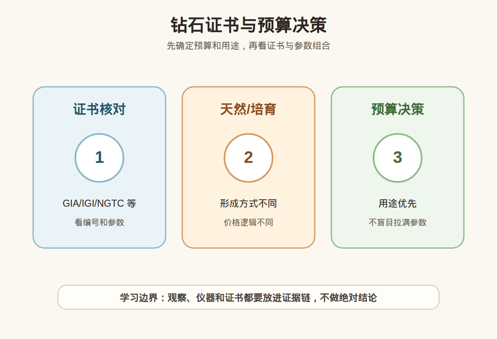

# 第 20 课：钻石证书与预算：天然钻、培育钻和购买决策

## 1. 本课核心笔记

### 1.1 本课重要结论

这一课先记住 6 个结论：

1. 买钻石要先明确预算、用途、佩戴频率和心理接受范围，再去筛选天然钻或培育钻。
2. 天然钻和培育钻都可以是钻石，但形成方式、稀缺逻辑、价格体系、转售预期和消费心理不同。
3. 钻石证书要核对机构、编号、4C、尺寸比例、荧光、净度图、备注、腰码和是否与实物一致。
4. 预算分配不是参数越高越好，而是让克拉、颜色、净度、切工、证书、镶嵌和售后服务于具体用途。
5. 高价钻石购买前要确认复检、退换、售后清洁维修、改圈、保险或保养政策，不要只看成交截图。
6. 小白不建议把「保值升值」作为买钻主理由；更稳妥的是为佩戴、纪念、审美和预算确定性付费。

一句话总结：

> 钻石购买不是只比参数，而是先做天然钻/培育钻决策，再核验证书和实物，最后让预算分配服务于用途和售后安全。

### 1.2 为什么学习证书与预算

第 19 课学习了 4C，但真正购买钻石时，消费者还会遇到更多问题：选天然钻还是培育钻？证书选哪家？预算先给克拉还是切工？颜色净度怎么取舍？强荧光能不能买？商家说能保值可信吗？复检不一致怎么办？

这些问题已经从知识点进入购买流程。钻石不像普通饰品，价格可能跨度很大，参数体系又复杂。如果没有预算框架，很容易在销售引导下不断升级：克拉再大一点、颜色再高一级、净度再高一级、证书再换一个、戒托再加预算。最后买到的不一定更适合自己，只是更贵。

本课目标是建立一个可执行的购买顺序：

1. 明确预算和用途。
2. 选择天然钻还是培育钻。
3. 确认证书机构和编号。
4. 核对 4C、比例、荧光、备注和实物。
5. 分配预算并确认售后复检。

### 1.3 天然钻和培育钻怎么决策

天然钻是在自然地质过程中形成的钻石；培育钻是在人工控制环境中生长的钻石。二者都可以具有钻石的化学成分和晶体结构，不能简单说培育钻是假钻。但它们的价格逻辑、稀缺逻辑和消费者心理完全不同。

对比理解：

| 维度 | 天然钻 | 培育钻 |
| --- | --- | --- |
| 形成方式 | 自然地质过程 | 实验室人工生长 |
| 价格逻辑 | 稀缺、传统市场、品牌和参数共同影响 | 生产可控，价格体系变化较快 |
| 心理属性 | 婚戒、纪念、天然稀缺感强 | 预算友好、可买更大更高参数 |
| 转售预期 | 普通消费者仍不宜高估保值 | 价格波动和转售预期更需谨慎 |
| 证书表述 | 标明天然钻石 | 标明实验室培育/合成/培育钻石 |
| 适合人群 | 重视天然属性和传统意义 | 重视佩戴效果、尺寸和预算效率 |

天然钻和培育钻不是绝对谁好，而是适合不同目标。如果你非常在意天然形成和传统婚戒心理，天然钻更符合预期；如果你主要在意日常佩戴视觉效果，希望同预算买更大或更高参数，培育钻可能更合适。关键是明确披露，不要把培育钻按天然钻卖，也不要把天然钻宣传成一定保值升值。

### 1.4 证书机构和证书字段怎么看

钻石证书是购买中的核心文件，但证书也要会看。不是有一张纸就万事大吉，而是要核对机构、编号、字段和实物。

常见需要关注的字段：

| 字段 | 要看什么 | 为什么重要 |
| --- | --- | --- |
| 证书机构 | GIA、IGI、HRD、NGTC 等机构名称 | 市场认可度和标准不同 |
| 证书编号 | 官网能否查询 | 防止截图或证书不对应 |
| Carat | 克拉重量 | 与价格和尺寸相关 |
| Color | 颜色等级 | 影响价格和观感 |
| Clarity | 净度等级 | 结合净度图看位置和类型 |
| Cut/Polish/Symmetry | 切工、抛光、对称 | 影响光表现 |
| Measurements | 尺寸 | 同克拉显大和比例判断 |
| Fluorescence | 荧光 | 可能影响观感和价格 |
| Comments/备注 | 额外说明 | 可能有处理、镭射、云状物等提示 |
| Inscription/腰码 | 腰部编号 | 核对实物与证书一致 |

小白要养成一个动作：不要只看商家发的截图，要到机构官网或官方渠道核验证书编号。购买时也要确认实物腰码和证书编号是否一致，尤其是高价钻石或线上交易。

### 1.5 证书不是全部：还要看实物和备注

证书把钻石信息标准化，但它不能替你感受所有视觉效果。比如同样颜色净度和切工等级的钻石，实物可能因为比例、荧光、奶咖绿、包裹体位置、拍摄光源和镶嵌方式表现不同。

需要特别留意：

| 项目 | 消费意义 |
| --- | --- |
| 荧光 | None/Faint/Medium/Strong 等，强荧光需结合实物看是否发朦 |
| 奶感 | 可能让钻石看起来不够通透 |
| 咖色 | 体色偏褐，影响白度观感 |
| 绿色调 | 影响颜色感受，需看实物 |
| 云状物 | 如果大量影响通透，要谨慎 |
| 切工比例 | 过深可能显小，过浅可能漏光 |
| 净度特征位置 | 台面下黑点或裂隙更影响观感 |

「奶咖绿」不是统一证书等级，但在消费沟通中很常见。它提醒我们：4C 字段之外仍有影响观感的因素。购买时可以要求自然光、普通室内光、珠宝店射灯下的视频，避免只看强光美化图。

### 1.6 预算怎么分配

预算分配要从用途出发，而不是从参数焦虑出发。

先问四个问题：

1. 这是日常佩戴、婚戒、礼物，还是收藏？
2. 我更在意天然属性、视觉大小、白度、干净度，还是闪耀感？
3. 我的预算上限是多少？是否包括戒托、税费、改圈和售后？
4. 我能否接受培育钻、略低颜色、略低净度，或不同形状？

预算分配示例：

| 目标 | 建议优先 | 可以取舍 |
| --- | --- | --- |
| 日常婚戒 | 证书可靠、切工稳定、售后好、肉眼干净 | 极高净度、极限高色 |
| 同预算显大 | 培育钻或异形钻、显钻镶嵌、好切工 | 天然稀缺属性 |
| 传统天然属性 | 天然钻、可靠机构证书、复检 | 克拉可能适度降低 |
| 预算有限 | 切工和证书优先，颜色净度取肉眼舒适 | 参数全部拉满 |
| 礼物 | 证书易懂、售后清楚、款式稳妥 | 太复杂的冷门参数 |

一个实用原则：预算有限时，先保底证书可靠、切工不差、肉眼观感舒服、售后清楚，再讨论克拉、颜色和净度的升级。不要为了纸面某个等级牺牲复检和售后。

### 1.7 复检、售后和交易安全

钻石购买尤其要重视复检和售后。复检不是对商家不信任，而是高价商品的风险控制。尤其线上交易、异地购买、二手交易、裸钻镶嵌前后，都要确认责任边界。

购买前应确认：

| 项目 | 要问清楚 |
| --- | --- |
| 复检 | 支持哪家机构复检，费用谁承担，不符如何处理 |
| 退换 | 几天内可退换，定制镶嵌是否影响退换 |
| 镶嵌 | 镶嵌前后是否拍照、核对腰码、是否保险 |
| 改圈 | 是否免费改圈，次数和范围 |
| 清洁维修 | 是否提供清洗、检查镶爪、翻新 |
| 发票凭证 | 参数、证书编号、天然/培育、金额是否写清 |
| 二手转售 | 商家是否回收，回收规则是否只是口头承诺 |

高价钻石不要只看聊天记录和美图。要把关键信息写进订单或票据：证书编号、重量、颜色、净度、切工、天然/培育、戒托材质、是否支持复检、复检不符处理方式。

### 1.8 保值升值话术要谨慎

很多人买钻石时会被「保值」「传承」「以后能升值」打动。对普通消费者来说，这些话术要非常谨慎。

原因包括：

- 零售买入价包含品牌、渠道、镶嵌、服务和利润。
- 普通规格钻石转售时不一定按购买价回收。
- 培育钻价格体系变化快，更不适合用保值逻辑购买。
- 钻石是否好转售受证书、规格、市场行情和渠道影响。
- 消费者买来佩戴的钻石，本质上更接近情感和审美消费。

稳妥表达是：「我可以为纪念意义、佩戴效果和预算内的品质付费，但不把保值升值作为小白购买的主要理由。」如果商家强调回收和升值，就要求写清规则、比例、期限和条件。

### 1.9 消费边界和红线

本课消费边界：

- 天然钻和培育钻都可以选择，但必须明确披露。
- 证书要核验编号和实物，不能只看截图。
- 预算要服务用途，不要被参数无限升级。
- 高价购买要确认复检、退换和售后。
- 不建议用保值升值作为新手购买主理由。

红线包括：

1. 不说明天然钻还是培育钻。
2. 证书编号无法官网核验，或实物腰码不让核对。
3. 只给强光视频，不给自然光或普通室内光表现。
4. 对荧光、备注、奶咖绿、净度图避而不谈。
5. 复检不支持，或复检不符责任不清。
6. 用「稳赚、升值、回收无忧」催促高价下单，却不写书面条款。

小白购买前可以直接用这句话收尾：「请把证书编号、天然/培育、4C、荧光、备注、腰码、戒托材质、复检和退换规则写清楚。」

## 2. 必背知识卡

### 卡片 1：天然钻

天然钻由自然地质过程形成，适合重视天然属性和传统意义的消费者，但普通购买不宜高估保值。

### 卡片 2：培育钻

培育钻由人工环境生长，也可以是钻石；价格逻辑和转售预期不同，必须明确披露。

### 卡片 3：证书核验

钻石证书要核对机构、编号、4C、尺寸、荧光、备注、净度图和官网查询结果。

### 卡片 4：腰码一致

腰码是刻在钻石腰部的编号，高价购买要核对实物腰码与证书编号是否一致。

### 卡片 5：预算分配

预算应服务用途，优先保证可靠证书、切工、肉眼观感、镶嵌安全和售后。

### 卡片 6：复检售后

复检、退换、改圈、清洁维修和凭证信息是钻石购买的重要安全边界。

## 3. 可交互作业

### 作业 1：天然钻与培育钻决策

请根据下面需求选择更适合继续看的方向，并说明理由：

1. A 想要传统婚戒意义，非常在意天然形成。
2. B 预算有限，但想要更大视觉效果和更高纸面参数。
3. C 主要日常佩戴，不考虑转售，但要求信息透明。
4. D 希望买了以后一定升值。

参考方向：

- A 更可能优先天然钻，但仍要看证书和预算。
- B 可考虑培育钻或不同形状方案，但要接受价格逻辑。
- C 天然或培育都可，关键是披露、证书和售后。
- D 需要降低预期，普通消费者不宜把升值作为主理由。

### 作业 2：证书核对清单

拿到一份钻石证书，请列出至少 8 个需要核对的信息。

参考方向：

- 机构名称。
- 证书编号和官网查询。
- 克拉、颜色、净度、切工。
- 抛光、对称。
- 尺寸比例。
- 荧光。
- 净度图和备注。
- 天然/培育表述。
- 腰码与实物一致性。

### 作业 3：自媒体表达改写

把这句话改成更稳妥的小白学习表达：

> 钻石肯定保值，买越贵越好，参数越高越不会亏。

建议改写：

> 钻石购买应先看预算、用途、天然或培育选择、证书核验、实物观感和售后复检。普通消费者不建议把保值升值作为主理由，参数升级也要服务佩戴需求和预算上限。

## 4. 自媒体内容草稿

### 4.1 图文/短视频标题备选

- 我学珠宝第 20 课：天然钻和培育钻，先按用途选
- 钻石证书别只看截图：编号、腰码、备注都要核对
- 买钻预算怎么分？别让参数把预算越推越高
- 钻石一定保值吗？小白先把复检和售后问清楚

### 4.2 短视频脚本

今天学珠宝第 20 课：钻石证书与预算。

买钻石之前，我先不急着问几克拉，而是先问预算、用途和天然钻还是培育钻。天然钻和培育钻都可以是钻石，但形成方式、价格逻辑、稀缺感和转售预期不同，必须明确披露。

证书也不能只看截图。我要核对机构、编号、4C、尺寸比例、荧光、净度图、备注，还有实物腰码是否一致。4C 之外，奶咖绿、强荧光、切工比例和售后也会影响购买体验。

预算分配不是参数越高越好。日常佩戴更要保证证书可靠、切工稳定、肉眼舒服、镶嵌安全和复检售后。

我现在还是学习者，不把保值升值当作小白买钻的主理由。高价购买一定看证书、实物、复检和书面售后条款。

### 4.3 图文结构

第 1 页：标题

- 买钻先别急着比参数

第 2 页：先做选择

- 天然钻：重视天然属性和传统意义
- 培育钻：同预算可买更大或更高参数
- 两者都必须披露

第 3 页：证书核对

- 机构
- 编号
- 4C
- 尺寸比例
- 荧光
- 备注

第 4 页：实物核对

- 腰码一致
- 自然光视频
- 普通室内光视频
- 净度特征位置

第 5 页：预算分配

- 用途优先
- 切工和证书优先
- 颜色净度看肉眼和预算
- 售后不要牺牲

第 6 页：消费红线

- 不说明天然/培育
- 编号不能核验
- 不支持复检
- 用保值升值催单

### 4.4 配图、视频与分屏素材

本课已准备发布素材包：

- [钻石证书与预算决策 PNG](../assets/lesson-20/diamond-certificate-budget.png) / [SVG 源文件](../assets/lesson-20/diamond-certificate-budget.svg)
- [第 20 课短视频分镜](../assets/lesson-20/video-shotlist.md)
- [第 20 课分屏视频脚本](../assets/lesson-20/split-screen-script.md)
- [第 20 课图文轮播稿](../assets/lesson-20/carousel-copy.md)

### 4.5 评论区互动问题

你会优先考虑天然钻还是培育钻？下一条想看证书字段怎么读，还是看预算分配案例？

## 5. 学习档案更新

- 材料状态：已备课，待学习。
- 本课主题：钻石证书与预算：天然钻、培育钻和购买决策。
- 学习时重点确认：
  - 天然钻和培育钻都可以是钻石，但价格逻辑和心理预期不同。
  - 证书要核对机构、编号、4C、尺寸比例、荧光、备注、净度图和腰码。
  - 预算分配要服务用途，而不是盲目追求参数拉满。
  - 高价钻石要确认复检、退换、镶嵌、改圈和售后清洁维修。
  - 不建议小白把保值升值作为钻石购买主理由。
- 需要复习：
  - 天然钻和培育钻的决策差异。
  - 钻石证书常见字段和官网核验流程。
  - 预算、参数、实物观感和售后的取舍顺序。
- 自媒体素材：
  - 适合做 1 条 60-90 秒短视频。
  - 适合做 6 页图文轮播。
  - 重点画面是天然/培育对比、证书核验清单和预算分配表。
- 下一课建议：第 21 课：钻石切工深入：比例、火彩、亮度和漏光。
