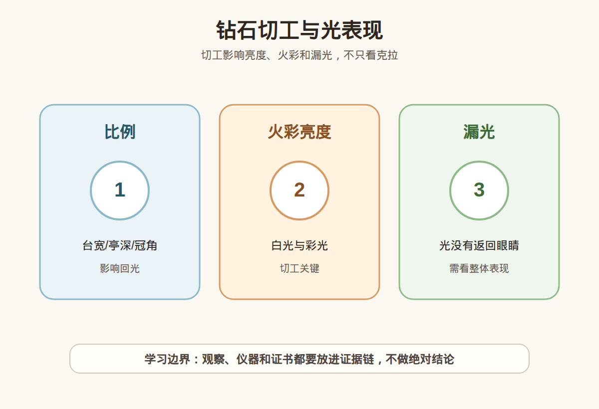

# 第 21 课：钻石切工深入：比例、火彩、亮度和漏光

## 1. 本课核心笔记

### 1.1 本课重要结论

这一课先记住 6 个结论：

1. 钻石切工不是只看「好不好看」，它会影响亮度、火彩、闪烁和漏光。
2. 台宽、亭深、冠角、亭角、全深比等比例参数，会改变光进入钻石后的返回路径。
3. Cut 等级是综合评价，不等于每一个比例都刚好适合自己的眼睛；同为 Ex，也可能有不同的实物光表现。
4. 克拉大只是重量信息，切工差的大钻可能显得暗、散、没有精神。
5. 证书能提供比例、抛光、对称和切工等级，但最终仍要结合实物在不同光线下的亮暗、火彩和闪烁。
6. 小白学习切工，是为了更会提问和筛选，不是凭比例表自己做鉴定、估价或产地判断。

一句话总结：

> 钻石「闪不闪」不能只靠克拉和 Cut 等级下结论，要把证书比例、切工等级和实物光表现放在一起看。

### 1.2 为什么学习钻石切工

钻石的商业讨论常围绕 4C：克拉、颜色、净度、切工。小白最容易先被「大」「白」「净」吸引，但真正戴在手上，第一眼看到的往往是光：亮不亮、有没有彩色火光、转动时是否灵动、有没有明显发暗区域。

切工就是把一颗钻石原石加工成刻面成品的方式。它既包含形状和比例，也包含刻面排列、抛光质量、对称程度。对圆形明亮式切工来说，证书上常见的台宽比、全深比、冠角、亭角等信息，都是理解光表现的入口。

这节课不要求把每个参数背成公式，而是建立一个消费框架：

| 看到的信息 | 小白要理解什么 | 消费中怎么用 |
| --- | --- | --- |
| Cut 等级 | 对圆钻切工的综合评级 | 作为初筛，不当成唯一答案 |
| 台宽比 | 台面相对钻石直径的大小 | 过大或过小都可能影响亮度和火彩平衡 |
| 亭深/亭角 | 钻石下半部分的深度和角度 | 关系到光能不能有效返回眼睛 |
| 冠角 | 钻石上半部分刻面的角度 | 影响火彩、亮度和整体观感 |
| 抛光 | 刻面表面是否平整细腻 | 影响光线反射的干净程度 |
| 对称 | 刻面排列是否规整 | 影响图案感、闪烁和整体协调 |

### 1.3 亮度、火彩和闪烁分别是什么

很多销售话术会把「闪」混成一个词，但学习时可以拆开：

| 概念 | 入门解释 | 观察方式 |
| --- | --- | --- |
| 亮度 | 白光返回眼睛的程度 | 正面看是否明亮、有没有大面积暗区 |
| 火彩 | 白光被色散后出现的彩色闪光 | 稍微转动时是否看到红、橙、蓝等彩光 |
| 闪烁 | 钻石或光源移动时明暗交替的动态效果 | 手轻轻晃动，观察光点是否灵动 |
| 漏光 | 光从亭部或侧面跑掉，没有返回眼睛 | 正面可能出现发灰、发暗或不集中 |

亮度好不等于火彩一定最强，火彩明显也不等于整颗钻石一定最亮。切工是在这些视觉效果之间取得平衡。对小白来说，比起追求一句「最闪」，更实用的是能说出自己看到的是白光亮、彩光明显，还是转动时闪烁好。

### 1.4 台宽、亭深、冠角怎么影响观感

可以把圆钻想象成一个让光进入、反射、再回到眼睛的微型结构。台面是光进入的重要窗口，冠部像上半个斜坡，亭部像下半个反射区域。如果比例配合不好，光可能没有按理想路径返回。

几个常见参数的学习重点：

1. **台宽比**：台面太大时，视觉可能偏白亮但火彩弱；台面太小时，火彩可能增加但整体亮度和视觉大小可能受影响。
2. **亭深/亭角**：亭部太深，钻石可能看起来偏暗，重量藏在下面；亭部太浅，容易出现漏光或鱼眼感。小白不用凭肉眼定性，只要知道它和回光关系很大。
3. **冠角**：冠部角度会影响彩光和白光的平衡。冠角、亭角需要配合看，不能只盯一个数字。
4. **全深比**：全深影响钻石正面直径和视觉大小。同样克拉，过深的钻可能正面显小。

易混点：

- 「切工 Ex」不是「这颗一定是全场最闪」。
- 「比例在某个推荐区间」不是「一定适合每个人审美」。
- 「火彩强」不是「颜色等级高」；颜色等级讲体色，火彩讲光的色散。
- 「克拉大」不是「视觉大」；如果切得太深，重量可能不体现在正面直径上。

### 1.5 Cut 等级和比例参数怎么一起看

证书上的 Cut 等级通常会综合多个方面，例如比例、对称、抛光以及光学表现相关指标。对圆形钻石来说，Excellent、Very Good、Good 等等级可以帮助初筛，但它不是替代实物观察的万能结论。

一个更稳妥的顺序是：

1. 先确认检测机构和证书编号，核对钻石信息是否对应。
2. 看 Cut、Polish、Symmetry 三项，不把单独一个 Excellent 当作全部。
3. 看台宽比、全深比、冠角、亭角等比例是否明显极端。
4. 看实物视频或现场光表现：自然光、室内散射光、珠宝店射灯下分别如何。
5. 如果价格较高，确认是否支持复检和合理售后。

消费视角里，切工是值得重视的预算项。预算有限时，与其盲目把钱全部推给更高颜色或更高净度，不如保留一部分预算给更稳定的切工表现。因为切工差带来的发暗、漏光、显小，往往比高一两级颜色更容易被肉眼感受到。

### 1.6 漏光：为什么有的钻看起来发暗

漏光可以理解为：进入钻石的光没有被有效反射回眼睛，而是从底部或侧面跑掉。漏光严重时，钻石正面可能出现暗区、灰感，或者在某些角度下不够通透。

造成视觉发暗的原因不一定只有切工，可能还包括：

- 光源太弱或角度不合适。
- 镶嵌方式遮挡了部分光线。
- 钻石表面有油污，影响反光。
- 拍摄视频曝光和滤镜改变了观感。
- 钻石比例确实导致回光不理想。

因此，小白不应该只凭一张图片说「这颗漏光严重」。更稳妥的表达是：这颗在当前图片或视频里看起来有暗区，我会继续看证书比例、不同光源视频和实物表现，再决定是否排除。

### 1.7 消费红线和提问清单

本课的边界很明确：不凭截图做真假鉴定，不凭比例表做估价，不凭 Cut 等级做产地或天然/培育判断。切工讨论只解决光表现和筛选问题，不能替代完整检测。

看钻石切工时可以追问：

1. 证书是哪家机构出的？编号能否核验？
2. Cut、Polish、Symmetry 分别是什么等级？
3. 台宽比、全深比、冠角、亭角是多少？
4. 有无自然光、室内普通光、射灯下的视频？
5. 同预算内，是否可以对比一颗切工更好但颜色或净度略降的钻？
6. 是否支持复检、退换和售后清洁检查？

对珠宝小白来说，学会这些问题，比背一组所谓「完美参数」更重要。

## 2. 必背知识卡

### 卡片 1：切工

钻石切工会影响亮度、火彩、闪烁和漏光，是决定视觉精神感的重要因素。

### 卡片 2：台宽比

台宽比是台面相对钻石直径的比例。它会影响白光亮度、火彩平衡和正面观感，不能脱离冠角、亭角单独判断。

### 卡片 3：亭深与亭角

亭部比例关系到光能否有效返回眼睛。过深可能发暗显小，过浅可能漏光，具体要结合证书和实物。

### 卡片 4：亮度、火彩、闪烁

亮度看白光，火彩看彩色闪光，闪烁看转动时的明暗变化。它们都属于光表现，但不是同一个概念。

### 卡片 5：Cut 等级

Cut 等级是重要初筛项，但同为 Excellent 的钻石也可能因比例组合、光源和实物差异呈现不同效果。

### 卡片 6：学习边界

小白可以用切工知识提问和筛选，但不凭参数做鉴定、估价或产地结论；高价购买仍要证书、实物和复检支持。

## 3. 可交互作业

### 作业 1：三颗钻的切工筛选

假设预算相近，有三颗圆钻：

1. A：克拉最大，但全深明显偏深，正面直径比同克拉小。
2. B：克拉略小，Cut/Polish/Symmetry 都较好，视频中白光和闪烁稳定。
3. C：颜色更高，但切工等级较低，正面有明显暗区。

你会优先继续看哪一颗？为什么？

参考方向：

- 不能只看克拉或颜色。
- B 可能更值得进入下一轮比较，因为切工和实物光表现更稳定。
- A 要警惕重量藏在深度里；C 要继续确认暗区是否由切工、拍摄或清洁导致。

### 作业 2：术语拆分

把「这颗钻很闪」拆成至少 3 个更具体的观察句。

参考方向：

- 正面白光亮不亮。
- 转动时有没有彩色火光。
- 明暗闪烁是否灵动。
- 是否有大面积发灰或发暗区域。

### 作业 3：柜台追问练习

如果销售说「这颗是 3EX，所以肯定最闪」，请写出 4 个追问。

参考方向：

- 证书编号能否核验？
- 台宽比、全深比、冠角、亭角是多少？
- 能否看自然光和普通室内光视频？
- 是否有同预算不同颜色/净度但切工表现更好的对比？

## 4. 自媒体内容草稿

### 4.1 图文/短视频标题备选

- 我学珠宝第 21 课：3EX 不等于闭眼买，钻石切工还要看实物光
- 钻石为什么有的很大却不闪？小白先看台宽、亭深和漏光
- 买钻别只问几克拉：亮度、火彩、闪烁不是一回事
- 切工 Ex 也要看比例？我用小白语言拆给你

### 4.2 短视频脚本

今天学珠宝第 21 课，我先纠正一个误会：钻石大，不一定最闪；证书写 Excellent，也不代表可以完全不看实物。

钻石的光表现可以拆成三件事：亮度是白光回到眼睛的感觉，火彩是转动时看到的彩色闪光，闪烁是明暗变化的灵动感。如果光没有有效返回，就可能出现漏光，看起来发暗、发灰。

证书上的台宽比、全深比、冠角、亭角，就是帮助我们理解光路的线索。但我现在还是学习者，不会凭一组数字给钻石估价，也不会做真假或产地判断。

真正买的时候，我会先看证书和编号，再看 Cut、抛光、对称和比例，最后一定看自然光、室内光、射灯下的实物视频。预算有限时，也会考虑把钱留给更好的切工表现，而不是盲目追更大克拉。

### 4.3 图文结构

第 1 页：标题

- 3EX 不等于闭眼买：钻石切工要看光

第 2 页：切工影响什么

- 亮度：白光亮不亮
- 火彩：彩色闪光多不多
- 闪烁：转动时灵不灵
- 漏光：有没有发暗发灰

第 3 页：比例看什么

- 台宽比
- 全深比
- 冠角
- 亭角
- 抛光和对称

第 4 页：容易混淆

- 克拉大不等于显大
- Cut Ex 不等于最闪
- 火彩强不等于颜色等级高

第 5 页：消费问法

- 证书编号能核验吗？
- 有不同光源视频吗？
- 同预算能否比较切工更好的？

第 6 页：边界

- 我是小白学习，不做鉴定、估价、产地结论
- 高价购买看证书、实物和复检

### 4.4 配图、视频与分屏素材

本课已准备发布素材包：

- [钻石切工与光表现 PNG](../assets/lesson-21/diamond-cut-light-performance.png) / [SVG 源文件](../assets/lesson-21/diamond-cut-light-performance.svg)
- [第 21 课短视频分镜](../assets/lesson-21/video-shotlist.md)
- [第 21 课分屏视频脚本](../assets/lesson-21/split-screen-script.md)
- [第 21 课图文轮播稿](../assets/lesson-21/carousel-copy.md)

### 4.5 评论区互动问题

你买钻石时更容易先看克拉、颜色，还是「闪不闪」？你想看我下一条拆 3EX 还是漏光？

## 5. 学习档案更新

- 材料状态：已备课，待学习。
- 本课主题：钻石切工深入：比例、火彩、亮度和漏光。
- 学习时重点确认：
  - 台宽、亭深、冠角、亭角与光表现的关系。
  - 亮度、火彩、闪烁和漏光的区别。
  - Cut 等级、抛光、对称和比例参数需要结合实物看。
  - 同为 Ex 切工，实物光表现仍可能不同。
  - 本课只用于学习提问和消费筛选，不做鉴定、估价或产地结论。
- 需要复习：
  - 证书中常见切工参数的位置和含义。
  - 不同光源下观察钻石亮度、火彩和闪烁的方法。
  - 如何用小白语言表达「观察到的光表现」。
- 自媒体素材：
  - 适合做 1 条 60-90 秒短视频。
  - 适合做 6 页图文轮播。
  - 重点画面是切工比例和光返回示意。
- 下一课建议：第 22 课：钻石颜色净度深入：肉眼可见与预算取舍。
