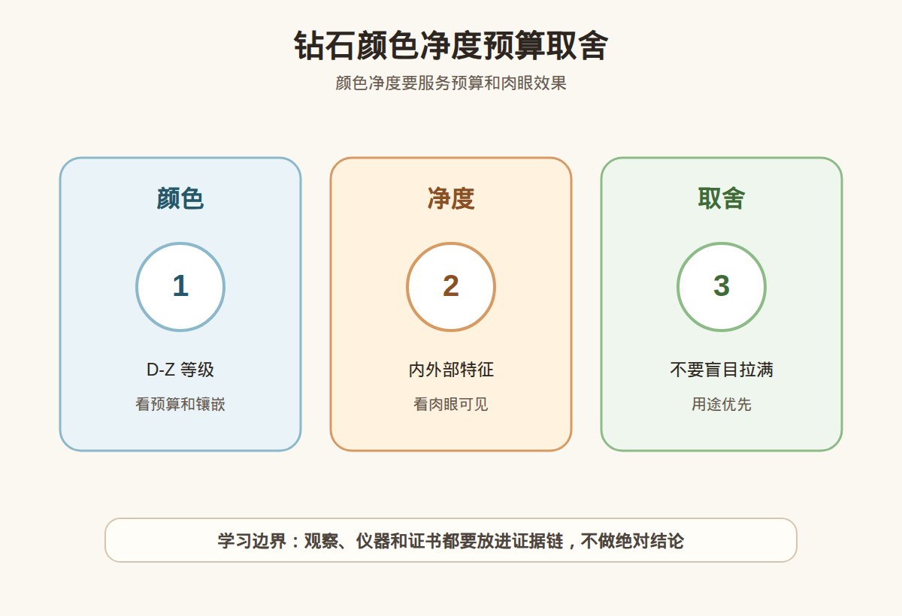

# 第 22 课：钻石颜色净度深入：肉眼可见与预算取舍

## 1. 本课核心笔记

### 1.1 本课重要结论

这一课先记住 6 个结论：

1. 钻石颜色 D-Z 是体色等级，D、E、F 更接近无色，越往后越容易出现淡黄色或淡褐色调。
2. 「肉眼无色」和「证书高色」不是同一件事；佩戴距离、钻石大小、切工和镶嵌金属都会影响感受。
3. 净度看的是内含物和表面特征，重点不只是等级名称，还要看类型、位置、大小、数量和是否影响耐久或肉眼观感。
4. VS、SI 不是自动等于好或差；小白要学会问「肉眼是否干净」「瑕疵在什么位置」「证书图怎么标」。
5. 预算有限时，不要盲目追最高颜色和最高净度，应先明确佩戴用途、视觉要求和可接受取舍。
6. 本课只建立消费筛选语言，不凭颜色净度等级做真假鉴定、估价或产地结论。

一句话总结：

> 颜色和净度都会影响价格，但小白买钻更应该问：肉眼看得出来吗、影响佩戴吗、预算换来的提升是否值得？

### 1.2 为什么颜色和净度容易让小白焦虑

颜色和净度是钻石 4C 里最容易被数字和字母制造焦虑的部分。D 色听起来比 G 色高级，FL 听起来比 VS 更完美，于是新手很容易把「等级更高」直接等同于「更适合我」。但实际消费中，等级提升带来的价格变化可能很明显，肉眼体验提升却未必同样明显。

这节课的学习目标不是背出每个等级的价格差，也不是告诉所有人买某个固定等级，而是建立一个取舍框架：

| 决策问题 | 要看的信息 | 小白提醒 |
| --- | --- | --- |
| 肉眼会不会黄 | 颜色等级、大小、切工、镶嵌金属 | 白金/铂金更显色，黄金/玫瑰金更包容 |
| 肉眼会不会脏 | 净度等级、瑕疵位置和类型 | 台面中央黑点比边缘白色羽裂更显眼 |
| 钱花在哪里更明显 | 克拉、切工、颜色、净度的组合 | 切工和大小常比极高净度更容易被看到 |
| 是否适合日常佩戴 | 瑕疵是否靠近腰棱、是否影响耐久 | 有风险要看专业意见，不自己下结论 |
| 是否值得加预算 | 实物对比和证书信息 | 不要只听「高一级更保值」 |

### 1.3 颜色 D-Z：等级高不等于所有人都要买最高

常见白钻颜色从 D 到 Z 分级。D-F 通常归入无色范围，G-J 常被理解为近无色，再往后颜色感会更明显。这里的颜色不是彩钻那种鲜明颜色，而是白钻体色中淡淡的黄、褐等倾向。

颜色观察会受很多因素影响：

- **钻石大小**：越大越容易看出体色，小钻的颜色差异相对不明显。
- **切工表现**：切工好、亮度强时，体色可能被光表现部分弱化；切工差时更容易显暗显色。
- **镶嵌金属**：白色金属会衬托钻石体色，黄色或玫瑰色金属对低一点颜色更友好。
- **观察角度**：实验室分级多从特定环境和角度比较，日常佩戴多从正面看。
- **个人敏感度**：有人对黄调敏感，有人更在意大小和火彩。

易混点：

- 「D 色」是颜色等级高，不代表切工、净度、奶咖绿、荧光都没有问题。
- 「G/H 肉眼无色」是消费语境下的常见说法，不等于证书无色等级。
- 「镶嵌后看不出」不是绝对保证，大小、款式和光线都会影响。

### 1.4 净度：不是越高越值得买

净度等级描述钻石内部和表面的特征，例如晶体包裹体、羽状纹、针点、云状物、天然面等。常见等级从高到低大致包括 FL、IF、VVS、VS、SI、I 等。等级越高，通常瑕疵越少或越难观察到，但价格也会提高。

小白看净度要从等级进一步追问：

| 追问 | 为什么重要 |
| --- | --- |
| 瑕疵是什么类型 | 黑色晶体、白色羽裂、云雾状特征的视觉影响不同 |
| 在什么位置 | 台面中央更容易被看见，边缘可能被镶嵌遮挡 |
| 大小和数量如何 | 一个明显黑点与多个细小白点观感不同 |
| 是否肉眼可见 | 证书等级不等于佩戴距离一定能看到 |
| 是否影响耐久 | 靠近腰棱或延伸明显的裂隙需要谨慎 |

VS 级别常被认为相对稳妥，但具体仍要看证书图和实物。SI 级别可能出现肉眼干净的个体，也可能有明显黑点或裂隙，不能只看「SI 性价比高」就下单。FL、IF 很稀少，价格高，但日常佩戴中未必比一颗肉眼干净、切工好的 VS 更能被旁人感知。

### 1.5 肉眼可见：把观察条件说清楚

「肉眼干净」和「肉眼无色」都不是严格证书术语，更像消费沟通语言。使用这些词时，要问清楚观察条件：

1. 是裸钻还是已经镶嵌？
2. 是自然光、室内普通光，还是强射灯？
3. 是正面看，还是侧面、背面看？
4. 观察距离是日常佩戴距离，还是贴近眼睛仔细找？
5. 视频有没有美颜、曝光、滤镜或过度补光？

如果销售说「绝对肉眼无瑕」，更稳妥的做法不是争论，而是请对方提供证书净度图、10 倍放大视频、普通光实拍和售后复检规则。小白可以表达「我希望日常佩戴距离看不出明显黑点或裂隙」，而不是要求自己像鉴定师一样判断每个内含物。

### 1.6 预算取舍：别把所有等级都拉满

买钻石常见的预算顺序误区是：先定最大克拉，再追最高颜色，再要求最高净度，最后发现切工和证书机构被迫妥协。更稳妥的思路是先问用途。

| 用途 | 可能更重视 | 可以讨论的取舍 |
| --- | --- | --- |
| 日常钻戒 | 切工、耐看、镶嵌安全 | 净度达到肉眼干净即可，不盲目追 FL |
| 求婚主钻 | 整体观感、证书、预算稳定 | 颜色与大小根据金属和审美平衡 |
| 耳钉/吊坠 | 正面亮度、大小协调 | 颜色净度可比戒指略放宽 |
| 学习样品 | 证书信息完整、特征清楚 | 不追求高等级，重在看懂差异 |

一个实用原则：如果预算固定，先保住可靠证书、稳定切工和可接受的肉眼效果，再决定颜色净度是否继续上调。不要为了追一个更高字母或更高净度，牺牲切工、证书可信度和售后。

### 1.7 消费红线和提问清单

本课不做真假鉴定、估价、产地判断，也不替任何具体商家背书。颜色净度等级必须来自可靠证书和实物核对，不能靠直播间一句话确认。

看颜色净度时可以追问：

1. 证书机构、编号和腰码是否能核验？
2. 颜色等级是什么？镶嵌金属是什么颜色？
3. 净度等级是什么？证书图标了哪些内含物？
4. 瑕疵是否在台面中央、腰棱附近或容易被看到的位置？
5. 有没有普通光、自然光和近距离放大视频？
6. 如果复检颜色或净度有争议，售后规则怎么处理？

## 2. 必背知识卡

### 卡片 1：D-Z 颜色

D-Z 是白钻体色等级，D-F 更接近无色，G-J 常被视为近无色。是否肉眼显色还受大小、切工和镶嵌影响。

### 卡片 2：肉眼无色

肉眼无色是消费观察说法，不等于证书最高颜色。要说明观察距离、光源、镶嵌状态和个人敏感度。

### 卡片 3：净度

净度看内含物和表面特征。等级之外，还要看类型、位置、大小、数量和是否影响耐久。

### 卡片 4：VS/SI

VS 通常肉眼更稳妥，SI 可能有性价比也可能肉眼可见瑕疵。不能只看缩写，要看证书图和实物。

### 卡片 5：预算取舍

预算固定时，先保可靠证书、切工和肉眼效果，再考虑颜色净度上调；不要盲目追最高级。

### 卡片 6：学习边界

颜色净度知识用于提问和筛选，不用于凭肉眼做真假鉴定、估价或产地结论。

## 3. 可交互作业

### 作业 1：预算排序

同样预算下，你更倾向哪种组合？说明理由。

1. A：颜色 D，净度 VVS，但切工一般，克拉较小。
2. B：颜色 G，净度 VS，切工稳定，克拉适中。
3. C：颜色 J，净度 SI，克拉更大，但台面有可见黑点。

参考方向：

- 不能简单认为 D/VVS 一定最适合。
- B 可能是更平衡的日常佩戴选择。
- C 需要确认颜色是否能接受、黑点是否明显、价格是否充分反映风险。

### 作业 2：肉眼描述练习

把「这颗颜色不高但看着还行」改成更清楚的小白表达。

参考方向：

> 这颗证书颜色不是最高，但在当前镶嵌和普通室内光下，正面佩戴距离没有明显黄感。我还需要看自然光视频、证书编号和同预算对比。

### 作业 3：净度追问清单

如果销售说「SI 很划算，肉眼绝对干净」，请列出 5 个追问。

参考方向：

- 瑕疵类型是什么？
- 位置在台面中央还是边缘？
- 有没有证书净度图？
- 能否提供普通光近距离视频？
- 复检后如果与描述不一致，如何处理？

## 4. 自媒体内容草稿

### 4.1 图文/短视频标题备选

- 我学珠宝第 22 课：买钻别被 D 色 FL 带焦虑
- 钻石颜色净度怎么取舍？先问肉眼看不看得出来
- VS 和 SI 到底能不能买？小白先看瑕疵位置
- 预算有限买钻：别把钱都花在看不见的等级上

### 4.2 短视频脚本

今天学珠宝第 22 课：钻石颜色和净度。我的收获是，等级越高通常越贵，但不代表每个人都必须买最高。

颜色 D-Z 说的是白钻体色。D、E、F 更接近无色，但日常佩戴时，大小、切工、金属颜色和光线都会影响你是否看得出黄感。

净度也一样。不是看到 VS、SI 就马上下结论，而是要问瑕疵是什么、在哪里、肉眼能不能看到、会不会影响耐久。台面中央黑点和边缘小白点，观感完全不同。

我现在还是珠宝小白，不做鉴定和估价。真正消费时，我会先看可靠证书和实物视频，再把预算分配给切工、克拉、颜色和净度，而不是盲目追最高字母。

### 4.3 图文结构

第 1 页：标题

- 钻石颜色净度：别被最高级带焦虑

第 2 页：颜色看什么

- D-Z 是体色等级
- 肉眼无色不等于证书最高色
- 镶嵌金属会影响观感

第 3 页：净度看什么

- 类型
- 位置
- 大小
- 数量
- 是否肉眼可见

第 4 页：VS/SI 怎么问

- 证书图在哪里？
- 黑点还是白点？
- 台面中央还是边缘？
- 有普通光视频吗？

第 5 页：预算取舍

- 先保切工和证书
- 再看肉眼效果
- 最后决定是否加钱上颜色净度

第 6 页：边界

- 我是学习者，不做真假、估价、产地结论
- 高价购买要复检和售后规则

### 4.4 配图、视频与分屏素材

本课已准备发布素材包：

- [钻石颜色净度预算取舍 PNG](../assets/lesson-22/diamond-color-clarity-budget.png) / [SVG 源文件](../assets/lesson-22/diamond-color-clarity-budget.svg)
- [第 22 课短视频分镜](../assets/lesson-22/video-shotlist.md)
- [第 22 课分屏视频脚本](../assets/lesson-22/split-screen-script.md)
- [第 22 课图文轮播稿](../assets/lesson-22/carousel-copy.md)

### 4.5 评论区互动问题

如果预算只能保一个，你更在意颜色、净度、切工还是克拉？你想看我下一条拆 VS/SI 还是 D-Z？

## 5. 学习档案更新

- 材料状态：已备课，待学习。
- 本课主题：钻石颜色净度深入：肉眼可见与预算取舍。
- 学习时重点确认：
  - D-Z 颜色分级和肉眼无色的区别。
  - 净度等级之外，还要看内含物类型、位置和肉眼可见度。
  - VS/SI 不能只看缩写，要结合证书图和实物。
  - 预算有限时，不应盲目追最高颜色和最高净度。
  - 本课只用于学习提问和消费筛选，不做鉴定、估价或产地结论。
- 需要复习：
  - D-F、G-J 等颜色区间的入门含义。
  - 常见净度等级的顺序和消费沟通方式。
  - 如何描述「肉眼看不看得出来」。
- 自媒体素材：
  - 适合做 1 条 60-90 秒短视频。
  - 适合做 6 页图文轮播。
  - 重点画面是颜色净度与预算取舍表。
- 下一课建议：第 23 课：钻石荧光、奶咖绿、证书备注与隐藏风险。
