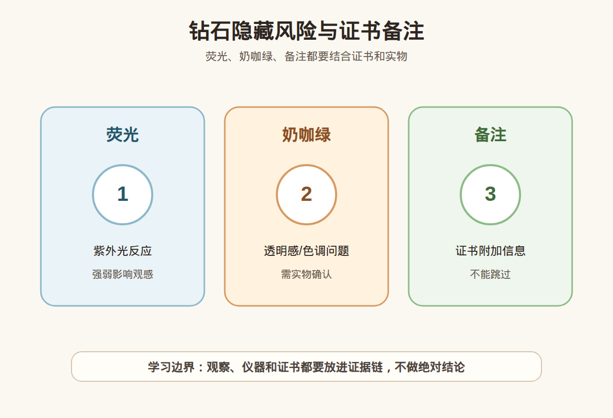

# 第 23 课：钻石荧光、奶咖绿、证书备注与隐藏风险

## 1. 本课核心笔记

### 1.1 本课重要结论

这一课先记住 6 个结论：

1. 钻石除了 4C，还要看荧光、奶感、咖调、绿调和证书备注等容易被忽略的信息。
2. 荧光是钻石在紫外光下的反应，常见强度从 None 到 Very Strong；强荧光不是自动不能买，但要确认是否影响通透感和价格。
3. Strong、Very Strong 荧光尤其需要看实物，不同钻石表现不同，不能只凭一个字段判断好坏。
4. 「奶」偏透明度和雾感问题，「咖」偏褐色调，「绿」偏绿调观感，它们可能让钻石看起来不够清爽。
5. 证书备注、净度图、腰码、实物视频和复检支持，是排查隐藏风险的重要证据链。
6. 本课不做真假鉴定、估价或产地判断，只学习如何发现需要继续追问的风险点。

一句话总结：

> 4C 好只是钻石筛选的一部分，荧光、奶咖绿和证书备注决定了很多「看起来不对劲但新手说不清」的风险。

### 1.2 为什么 4C 之外还要看隐藏风险

小白买钻石时，常会先看克拉、颜色、净度、切工。如果这四项看起来不错，就容易放松警惕。但实际消费里，有些钻证书等级不低，实物却显得发雾、发灰、发褐、发绿，或者在特殊光线下观感不稳定。这些问题往往不只靠 4C 四个字母就能说明。

这节课要建立的是「4C 之后再检查一遍」的习惯：

| 风险点 | 主要看哪里 | 小白要问什么 |
| --- | --- | --- |
| 荧光 | 证书 Fluorescence 字段 | 强度是什么？强荧光是否影响透明感？ |
| 奶感 | 实物通透度、证书备注、云状物 | 是否发雾、发蒙、光不清爽？ |
| 咖调 | 实物体色、视频、商家描述 | 是否有褐色调？和颜色等级是否匹配？ |
| 绿调 | 实物色调、不同光源表现 | 是否偏绿？自然光下是否明显？ |
| 备注 | Comments/Inscription 等 | 有没有额外说明、处理或限制信息？ |
| 腰码 | 钻石腰部镭射编号 | 是否和证书编号对应？ |

### 1.3 荧光：紫外光下的反应

荧光指钻石在紫外光照射下发出可见光的现象，常见颜色是蓝色，也可能有其他颜色。证书上通常会标注荧光强度，例如 None、Faint、Medium、Strong、Very Strong。

入门理解：

| 荧光强度 | 小白理解 | 消费提醒 |
| --- | --- | --- |
| None | 无明显荧光 | 通常争议较少，但不代表其他风险为零 |
| Faint | 弱荧光 | 多数情况下对日常观感影响有限 |
| Medium | 中等荧光 | 需要结合颜色、价格和实物看 |
| Strong | 强荧光 | 要重点看是否发雾、发蓝或影响通透 |
| Very Strong | 很强荧光 | 更需要实物、多光源视频和价格解释 |

强荧光不是一句「不能买」就能概括。有些较低颜色的钻石带蓝色荧光，可能在某些光线下弱化黄感；但也有强荧光钻会出现油雾感、发蒙感。对小白来说，重点不是争论强荧光好坏，而是问：这颗具体钻石在自然光、室内光、紫外光环境下看起来怎样？价格是否已经体现荧光影响？

### 1.4 奶感：为什么看起来不清透

「奶」是消费语境里的说法，通常指钻石看起来不够清透，有雾感、浑浊感、发白发蒙。它可能和净度特征有关，例如大量云状物、细小内含物分布，也可能和拍摄、油污、光线有关。

学习时要避免两个极端：

- 看到「cloud」就直接判定很奶。
- 视频里看着发雾就立刻认定钻石本身有问题。

更稳妥的步骤是：

1. 看证书净度等级和净度图，是否有云状物、针点密集等信息。
2. 看备注里是否出现影响透明度的说明。
3. 要求普通光、自然光、近距离和转动视频。
4. 确认样品是否清洁，油污会明显影响钻石表面反光。
5. 价格明显低于同参数时，追问原因是否与荧光、奶感或备注有关。

小白可以说「我担心这颗通透感不够，需要更多光线视频和证书备注确认」，不要直接说「这颗就是奶钻」。

### 1.5 咖调和绿调：不是颜色等级能完全覆盖

「咖」通常指钻石有褐色、棕色倾向；「绿」指钻石有绿色调或绿感。它们和 D-Z 颜色等级有关，但不是完全等同。两颗同样颜色等级的钻石，体色倾向可能不同：有的偏黄，有的偏褐，有的在特定光线下有不舒服的色调。

观察咖绿要注意：

| 场景 | 可能误判 | 更稳妥做法 |
| --- | --- | --- |
| 珠宝店强射灯 | 光太强，掩盖体色 | 看普通室内光和自然光 |
| 白底近拍 | 相机白平衡影响颜色 | 对比同色级样品或标准白背景 |
| 黄金戒托 | 金属颜色反射到钻石 | 看裸钻或白色背景视频 |
| 视频滤镜 | 美化或压低色调 | 要求无滤镜原视频 |

消费中，如果商家完全回避咖绿问题，只强调「证书颜色很高」，小白应继续追问实物色调。尤其是价格明显低、参数看似漂亮的钻，最好问清楚是否有奶、咖、绿、强荧光或备注原因。

### 1.6 证书备注：不要只截图 4C

很多人发证书只截取克拉、颜色、净度、切工，却忽略 Comments、Inscription、Clarity Characteristics 等部分。备注不是每次都有重大风险，但它是证据链的一部分。

需要关注的证书信息包括：

1. **Fluorescence**：荧光强度和颜色。
2. **Comments**：是否有额外说明，例如特征未完全绘制、处理相关提示、净度来源说明等。
3. **Clarity Characteristics**：内含物类型和分布。
4. **Inscription**：腰码或镭射编号说明。
5. **Report Type**：天然钻、培育钻、成品钻还是其他报告类型。

小白不要把备注看成「一有字就不能买」，也不要完全跳过。正确方式是：看到备注，先翻译成问题，再让证书、实物和复检共同回答。

### 1.7 消费红线和提问清单

本课特别强调边界：不凭荧光字段判定价格，不凭图片判断奶咖绿，不凭证书截图判断真假或产地。隐藏风险需要证书、实物、光源和售后共同确认。

追问清单：

1. 荧光强度是 None、Faint、Medium、Strong 还是 Very Strong？
2. 强荧光钻是否有自然光、室内光和紫外光视频？
3. 证书备注完整截图能否提供？
4. 净度图里主要特征是什么？是否有大量云状物？
5. 商家是否明确说明无明显奶、咖、绿？如何定义和售后？
6. 腰码是否能和证书编号核对？
7. 复检后如果发现描述不一致，退换规则是什么？

## 2. 必背知识卡

### 卡片 1：荧光

荧光是钻石在紫外光下的可见反应，强度常见 None、Faint、Medium、Strong、Very Strong。

### 卡片 2：强荧光

Strong/Very Strong 不代表一定不能买，但要看是否发雾、发蒙、发蓝，以及价格是否反映风险。

### 卡片 3：奶感

奶感是钻石不够清透、发雾发蒙的消费描述，可能与云状物、荧光、油污或拍摄有关，需要实物确认。

### 卡片 4：咖绿

咖调偏褐，绿调偏绿。它们会影响钻石是否清爽，不能只用颜色等级一句话带过。

### 卡片 5：证书备注

Comments、净度图、荧光字段、腰码信息都要看完整；只截 4C 容易漏掉关键信息。

### 卡片 6：学习边界

荧光、奶咖绿和备注用于发现追问点，不用于小白自行做鉴定、估价或产地结论。

## 3. 可交互作业

### 作业 1：强荧光判断

看到一颗钻石证书写着 Fluorescence: Very Strong Blue，颜色和净度都不错，价格也低于同参数。你会直接排除还是继续确认？写出理由。

参考方向：

- 不必只凭 Very Strong 直接下结论。
- 需要看是否有发雾、发蒙、蓝感过强等实物影响。
- 价格偏低要问是否由荧光、奶感或其他备注造成。

### 作业 2：奶咖绿表达改写

把这句话改成更稳妥的小白学习表达：

> 这颗证书好，肯定没有奶咖绿。

参考方向：

> 证书 4C 好是重要信息，但我还要看荧光、备注、净度图和不同光源视频，确认有没有明显雾感、褐调或绿调。

### 作业 3：证书截图检查

如果商家只发了证书首页和价格，请列出你还要补看的 5 项。

参考方向：

- Fluorescence 字段。
- Comments 完整内容。
- Clarity Characteristics 或净度图。
- 腰码/镭射编号。
- 自然光、普通室内光和紫外光下的实物视频。

## 4. 自媒体内容草稿

### 4.1 图文/短视频标题备选

- 我学珠宝第 23 课：4C 好，也别漏看荧光奶咖绿
- Strong 荧光钻能不能买？小白先问这 5 件事
- 钻石看着发雾发褐？可能问题不在克拉颜色净度
- 证书别只截 4C：Comments 和荧光也要看

### 4.2 短视频脚本

今天学珠宝第 23 课：钻石的荧光、奶咖绿和证书备注。我的收获是，4C 很重要，但不是完整检查表。

荧光是钻石在紫外光下的反应。证书可能写 None、Faint、Medium、Strong 或 Very Strong。强荧光不是一定不能买，但要看这颗具体钻石会不会发雾、发蒙，价格有没有体现风险。

奶感可以理解为不够清透，咖调偏褐，绿调偏绿。这些都可能让钻石看起来没那么清爽。只看证书首页和漂亮视频，很容易漏掉问题。

我现在还是学习者，不做真假鉴定和估价。真正消费时，我会要完整证书、备注、腰码、普通光和自然光视频，必要时复检。

### 4.3 图文结构

第 1 页：标题

- 4C 好，也别漏看荧光奶咖绿

第 2 页：荧光看什么

- None/Faint/Medium/Strong/Very Strong
- 强荧光要看通透感
- 价格低要问原因

第 3 页：奶感看什么

- 发雾
- 发蒙
- 不清透
- 可能和云状物、荧光、油污有关

第 4 页：咖绿看什么

- 咖：偏褐
- 绿：偏绿
- 要看普通光和自然光

第 5 页：证书别漏

- Fluorescence
- Comments
- 净度图
- 腰码
- Report Type

第 6 页：边界

- 我是小白学习，不凭截图下结论
- 高价购买要完整证据链和复检

### 4.4 配图、视频与分屏素材

本课已准备发布素材包：

- [钻石隐藏风险与证书备注 PNG](../assets/lesson-23/diamond-hidden-risk-notes.png) / [SVG 源文件](../assets/lesson-23/diamond-hidden-risk-notes.svg)
- [第 23 课短视频分镜](../assets/lesson-23/video-shotlist.md)
- [第 23 课分屏视频脚本](../assets/lesson-23/split-screen-script.md)
- [第 23 课图文轮播稿](../assets/lesson-23/carousel-copy.md)

### 4.5 评论区互动问题

你以前看钻石证书会看 Fluorescence 和 Comments 吗？想让我下一条拆「强荧光」还是「奶咖绿」？

## 5. 学习档案更新

- 材料状态：已备课，待学习。
- 本课主题：钻石荧光、奶咖绿、证书备注与隐藏风险。
- 学习时重点确认：
  - 荧光强度分级及 Strong/Very Strong 的消费风险。
  - 奶感、咖调、绿调分别影响什么观感。
  - 证书备注、净度图、腰码和实物视频都要纳入证据链。
  - 4C 好不代表隐藏风险为零。
  - 本课只用于学习提问和消费筛选，不做鉴定、估价或产地结论。
- 需要复习：
  - Fluorescence 字段常见表达。
  - Comments 和 Clarity Characteristics 的查看位置。
  - 不同光源下观察奶咖绿的方法。
- 自媒体素材：
  - 适合做 1 条 60-90 秒短视频。
  - 适合做 6 页图文轮播。
  - 重点画面是「4C 之后再检查」清单。
- 下一课建议：第 24 课：培育钻专题：HPHT、CVD、价格与披露。
