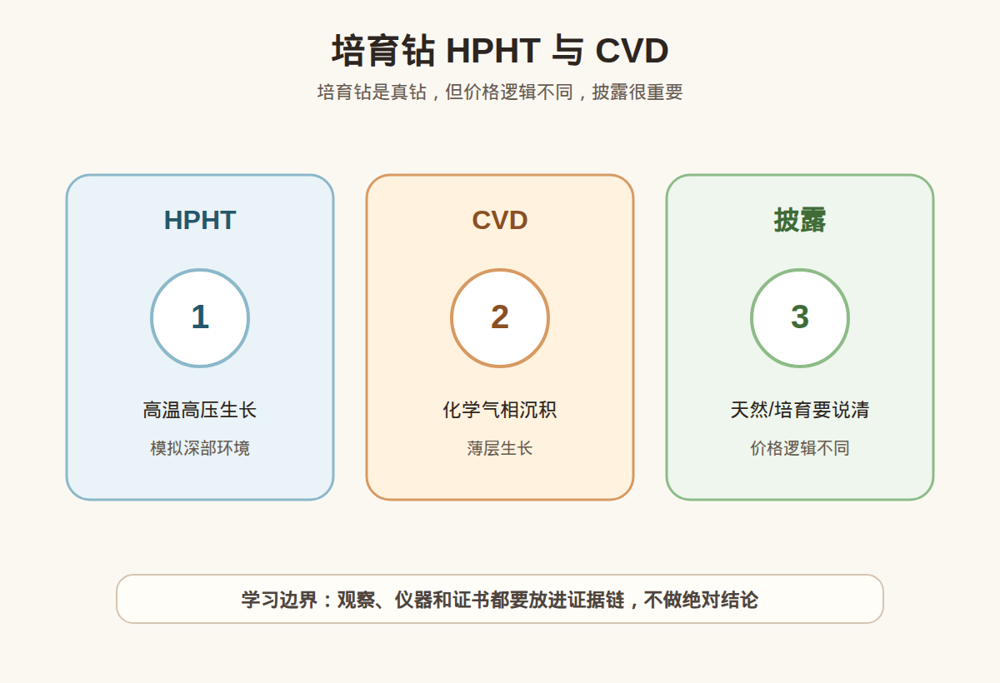

# 第 24 课：培育钻专题：HPHT、CVD、价格与披露

## 1. 本课核心笔记

### 1.1 本课重要结论

这一课先记住 6 个结论：

1. 培育钻是在人工控制环境中生长的钻石，不等于玻璃、锆石、莫桑石等仿钻。
2. 天然钻和培育钻都可以是碳元素构成、具有钻石晶体结构，但来源和市场逻辑不同。
3. HPHT 和 CVD 是常见培育钻生长方法，前者模拟高温高压环境，后者通过化学气相沉积生长。
4. 培育钻的购买框架不能照搬天然钻；它更像预算、佩戴效果、披露透明度和价格变动接受度的选择。
5. 披露是红线：销售、转赠、回收或二次流通时，都不应隐瞒培育属性。
6. 小白学习培育钻，是为了分清概念和消费边界，不凭肉眼或短视频做鉴定、估价或产地结论。

一句话总结：

> 培育钻不是仿钻，但也不是天然钻；买不买的关键不是争输赢，而是证书写清楚、价格逻辑想明白、披露不能含糊。

### 1.2 为什么培育钻容易吵起来

培育钻讨论常见两种极端：一种说「都是钻石，完全一样」；另一种说「人工的就是假」。这两种说法都不够适合小白学习。更稳妥的说法是：培育钻在材料属性上可以是钻石，但它的形成来源、稀缺逻辑、价格波动和消费决策，与天然钻不一样。

先把几个概念拆开：

| 名称 | 是什么 | 小白容易误会 |
| --- | --- | --- |
| 天然钻 | 地质环境中形成的钻石 | 天然不等于每颗都高价值 |
| 培育钻 | 实验室或工厂环境中生长的钻石 | 培育不等于仿钻 |
| 莫桑石 | 碳化硅材料，常作钻石替代品 | 闪不代表就是钻石 |
| 立方氧化锆 | 常见仿钻材料 | 便宜、像钻，不等于钻石 |
| 处理钻 | 天然或培育钻经过处理改善外观 | 是否处理要看证书披露 |

### 1.3 HPHT：高温高压生长

HPHT 是 High Pressure High Temperature 的缩写，可以理解为在人工设备中创造高温高压环境，让碳源在特定条件下形成钻石晶体。它的名字容易让人联想到天然钻形成的深部环境，但消费中不能把「模拟高温高压」说成「和天然形成过程完全一样」。

入门学习重点：

- HPHT 是一种培育方法，不是质量等级。
- HPHT 培育钻也要看颜色、净度、切工、克拉和证书。
- 有些 HPHT 培育钻可能涉及后续处理或特征检测，具体以证书和专业检测为准。
- 不能凭肉眼说一颗钻是 HPHT、CVD、天然或处理。

消费视角：如果商家强调「HPHT 更好」或「HPHT 才是真培育钻」，小白要追问证书怎么写、检测机构是谁、是否有处理说明、价格与同规格 CVD 或天然钻相比差异在哪里。

### 1.4 CVD：化学气相沉积生长

CVD 是 Chemical Vapor Deposition 的缩写，可以理解为在低压环境中让含碳气体分解，碳原子一层层沉积并长成钻石。因为有「一层层生长」的特点，CVD 培育钻可能出现与生长过程相关的特征，但具体判断需要专业仪器和证书。

学习时要记住：

| 项目 | HPHT | CVD |
| --- | --- | --- |
| 中文理解 | 高温高压 | 化学气相沉积 |
| 生长方式 | 在高温高压环境中结晶 | 气体分解后沉积生长 |
| 消费重点 | 方法不是价值保证 | 方法不是质量保证 |
| 判断方式 | 看证书和检测 | 看证书和检测 |

小白不需要因为听到 CVD 就焦虑，也不要因为听到 HPHT 就放心。真正影响购买体验的，仍然是证书披露、4C 表现、切工、价格、售后和自己是否接受培育属性。

### 1.5 培育钻的价格逻辑

天然钻的价格叙事常与稀缺性、开采、品牌和流通体系有关。培育钻的价格更多受生产技术、供应量、规格、品牌、证书、渠道和市场竞争影响。近年培育钻价格变化较快，所以它的消费逻辑更适合从佩戴和预算出发，而不是从保值想象出发。

一个小白决策框架：

| 问题 | 选择天然钻时 | 选择培育钻时 |
| --- | --- | --- |
| 主要动机 | 天然来源、传统婚恋符号、预算可承受 | 更大视觉效果、更低预算、接受人工生长 |
| 价格关注 | 同参数、证书、品牌溢价 | 同规格价格差、价格波动、披露透明度 |
| 心理预期 | 不应只听保值承诺 | 不应期待天然钻逻辑的稀缺溢价 |
| 证书重点 | 天然钻报告、4C、备注 | Lab-grown 披露、4C、处理备注 |
| 二次流通 | 仍有折价和不确定 | 折价和流动性更要谨慎预期 |

如果只是想用有限预算获得更大的日常佩戴视觉效果，培育钻可以纳入比较。如果购买背后有强烈的天然象征、家族传承或二次流通预期，就要把培育钻和天然钻分开决策，不要混用话术。

### 1.6 披露：天然和培育必须说清楚

披露是这节课最重要的红线。培育钻本身不是问题，隐瞒培育属性才是风险。无论是商家销售、个人转让、礼物沟通，还是未来维修回收，都应该明确说明「天然」或「培育」。

小白要看这些证据：

1. 证书标题或报告类型是否写明 Laboratory-Grown、Lab-Grown、Synthetic 或对应中文说明。
2. 证书编号能否在机构网站核验。
3. 腰码是否与证书对应，是否带有培育钻相关镭射标识。
4. 是否说明 HPHT、CVD 或处理信息。
5. 发票、订单、商品页面是否明确写出培育钻，不用「高科技钻」「环保钻」「真钻」等模糊词替代。

如果商家说「证书不用看，反正肉眼一样」，这不是专业自信，而是披露不足。小白可以喜欢培育钻，也可以选择天然钻，但前提是知道自己买的是什么。

### 1.7 消费红线和提问清单

本课不教小白用肉眼区分天然钻和培育钻，也不做具体价格判断。培育钻和天然钻的识别需要专业仪器、检测经验和证书体系。我们只学习消费前应该问清楚什么。

提问清单：

1. 这颗是天然钻还是培育钻？商品页面和发票是否写清楚？
2. 培育方法是 HPHT、CVD，还是证书未标明？
3. 证书机构和报告编号是什么？能否官网核验？
4. 是否有处理说明，例如颜色改善或其他处理？
5. 同预算下，天然钻和培育钻的尺寸、4C、证书差异是什么？
6. 售后、维修、改款、回收时是否按培育钻属性处理？
7. 如果作为礼物，接收方是否知道并接受培育属性？

## 2. 必背知识卡

### 卡片 1：培育钻

培育钻是在人工控制环境中生长的钻石，不等于仿钻；但它也不是天然形成的钻石。

### 卡片 2：HPHT

HPHT 是高温高压培育方法，模拟高温高压结晶环境。方法名称不等于质量保证。

### 卡片 3：CVD

CVD 是化学气相沉积培育方法，通过含碳气体分解沉积生长。方法名称不能替代证书检测。

### 卡片 4：价格逻辑

培育钻更适合从佩戴效果、预算和接受度出发，不应套用天然钻的稀缺和保值叙事。

### 卡片 5：披露红线

天然或培育必须明确披露，不能用「真钻」「高科技钻」等模糊词掩盖来源属性。

### 卡片 6：学习边界

小白不凭肉眼区分 HPHT、CVD、天然或处理；高价购买要看证书、核验编号和复检支持。

## 3. 可交互作业

### 作业 1：概念判断

请判断下面说法是否准确，并说明理由：

1. 培育钻是假钻，所以和钻石无关。
2. 培育钻和天然钻来源不同，所以购买逻辑不能完全一样。
3. HPHT 一定比 CVD 更高级。
4. 卖培育钻时只说「真钻」就够了。

参考方向：

- 第 1 句不准确，培育钻可以是人工环境中生长的钻石，不等于仿钻。
- 第 2 句准确，来源、价格和流通预期不同。
- 第 3 句不准确，方法名称不是质量等级。
- 第 4 句不准确，必须明确披露培育属性。

### 作业 2：购买场景选择

同样预算下：

- A：天然钻，克拉较小，证书清楚。
- B：培育钻，克拉更大，证书清楚，价格低很多。

如果用途分别是日常佩戴、求婚礼物、学习样品，你会怎么比较？

参考方向：

- 日常佩戴可比较视觉效果和预算。
- 求婚礼物要确认双方对天然/培育的接受度。
- 学习样品可重视证书完整和概念清楚。

### 作业 3：披露话术改写

把这句话改成更稳妥的小白表达：

> 这是实验室真钻，不用告诉别人是不是培育的。

参考方向：

> 培育钻可以是钻石，但来源属性必须说清楚。销售、转赠或二次流通时，都应该明确标注培育钻并提供对应证书。

## 4. 自媒体内容草稿

### 4.1 图文/短视频标题备选

- 我学珠宝第 24 课：培育钻不是仿钻，但披露不能省
- HPHT 和 CVD 是什么？小白先别用它们判断贵不贵
- 买培育钻前先想清楚：你买的是佩戴效果还是天然来源
- 「真钻」两个字不够：培育钻必须说清楚

### 4.2 短视频脚本

今天学珠宝第 24 课：培育钻。我的第一个收获是，培育钻不是玻璃、锆石、莫桑石那种仿钻，它是在人工环境中生长的钻石。

但第二个收获更重要：培育钻也不是天然钻。它和天然钻可以同样有钻石的材料属性，但来源、价格逻辑和消费预期不同。

HPHT 是高温高压，CVD 是化学气相沉积。对小白来说，听到方法名不要马上判断高级不高级，要看证书、4C、处理说明、价格和售后。

我现在还是学习者，不做鉴定和估价。我的红线是：买卖或送礼时，天然还是培育必须说清楚，不能只用「真钻」两个字模糊带过。

### 4.3 图文结构

第 1 页：标题

- 培育钻不是仿钻，但披露不能省

第 2 页：先分清

- 天然钻：地质环境形成
- 培育钻：人工环境生长
- 莫桑石/锆石：不是钻石

第 3 页：HPHT

- 高温高压
- 方法不是质量等级
- 看证书和处理说明

第 4 页：CVD

- 化学气相沉积
- 一层层生长
- 也要看证书和实物

第 5 页：决策框架

- 预算
- 佩戴效果
- 接受度
- 价格波动
- 售后规则

第 6 页：红线

- 天然/培育必须明说
- 不做肉眼鉴定
- 高价购买要证书核验

### 4.4 配图、视频与分屏素材

本课已准备发布素材包：

- [培育钻 HPHT 与 CVD PNG](../assets/lesson-24/lab-grown-diamond-hpht-cvd.png) / [SVG 源文件](../assets/lesson-24/lab-grown-diamond-hpht-cvd.svg)
- [第 24 课短视频分镜](../assets/lesson-24/video-shotlist.md)
- [第 24 课分屏视频脚本](../assets/lesson-24/split-screen-script.md)
- [第 24 课图文轮播稿](../assets/lesson-24/carousel-copy.md)

### 4.5 评论区互动问题

如果预算相同，你会选小一点的天然钻，还是大一点的培育钻？前提是证书和披露都清楚。

## 5. 学习档案更新

- 材料状态：已备课，待学习。
- 本课主题：培育钻专题：HPHT、CVD、价格与披露。
- 学习时重点确认：
  - 培育钻不是仿钻，但来源不同于天然钻。
  - HPHT 和 CVD 是生长方法，不是质量等级。
  - 培育钻和天然钻的价格逻辑、流通预期和决策框架不同。
  - 天然/培育属性必须明确披露。
  - 本课只用于学习提问和消费筛选，不做鉴定、估价或产地结论。
- 需要复习：
  - HPHT 和 CVD 的入门差异。
  - 培育钻证书中报告类型和备注的查看方式。
  - 培育钻、天然钻、莫桑石、锆石的概念区别。
- 自媒体素材：
  - 适合做 1 条 60-90 秒短视频。
  - 适合做 6 页图文轮播。
  - 重点画面是天然钻、培育钻、仿钻的概念对比。
- 下一课建议：第 25 课：钻戒镶嵌与日常佩戴：爪镶、包镶、戒托和保养。
