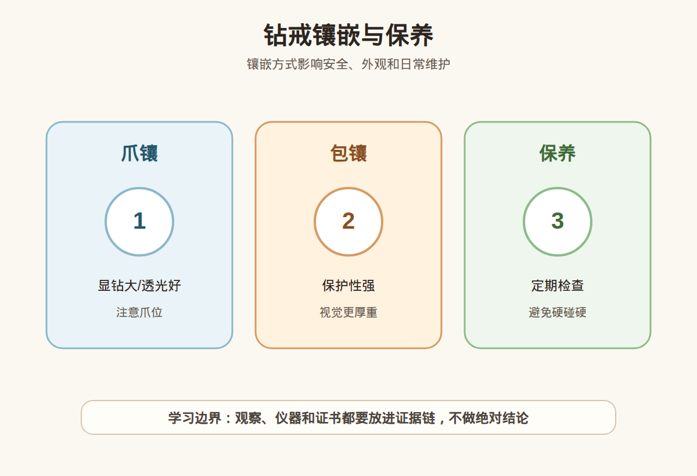

# 第 25 课：钻戒镶嵌与日常佩戴：爪镶、包镶、戒托和保养

## 1. 本课核心笔记

### 1.1 本课重要结论

这一课先记住 6 个结论：

1. 钻戒不只看主钻，镶嵌结构、戒托厚度、金属材质和佩戴习惯都会影响安全与耐用。
2. 爪镶显钻、透光、款式轻盈，但爪位会磨损、变形或挂到织物，需要定期检查。
3. 包镶保护性更强，能包住钻石边缘，但视觉更厚重，清洁和显钻效果也不同。
4. 轨道镶、密钉镶、排钻等款式好看，但小钻多、结构复杂，维修和掉石风险要提前问清。
5. 改圈、翻新、维修不是零风险操作，戒托太薄、钻石多、结构复杂时尤其要谨慎。
6. 本课只学习结构和保养常识，不做镶嵌质量鉴定、维修报价或真假估价结论。

一句话总结：

> 钻戒好不好戴，不只取决于钻石参数；镶嵌是否安全、戒托是否结实、售后是否清楚，决定了日常佩戴的长期体验。

### 1.2 为什么钻戒要学镶嵌和保养

很多小白买钻戒时，注意力集中在主钻：几克拉、什么颜色净度、证书是哪家。但钻戒是成品珠宝，主钻再漂亮，也要靠金属结构固定在手上。戒指每天接触桌面、门把手、衣物、洗手液、护肤品和各种磕碰，镶嵌结构如果不适合佩戴习惯，后续可能出现松动、变形、掉石、刮衣服、难清洁等问题。

入门先看这张表：

| 结构/部位 | 主要作用 | 小白要关注 |
| --- | --- | --- |
| 爪镶 | 用金属爪固定钻石 | 爪是否均匀、是否压牢、是否容易挂 |
| 包镶 | 金属边包住钻石边缘 | 保护性强，但视觉更厚重 |
| 轨道镶 | 小钻夹在两条金属轨之间 | 轨道是否平整，小钻是否松 |
| 密钉镶 | 许多小金属钉固定小钻 | 小钻多，后期维护更重要 |
| 戒托 | 承载主钻和手寸结构 | 厚度、宽度、变形风险 |
| 戒臂 | 手指两侧的金属环 | 是否太细，是否适合日常戴 |

### 1.3 爪镶：显钻但要看爪位

爪镶是钻戒里非常常见的结构，用几个金属爪把钻石固定住。四爪、六爪、双爪都属于常见设计。它的优点是遮挡少、透光好、主钻显眼，款式也比较经典。

但爪镶的风险也很具体：

- 爪尖可能随着佩戴磨薄。
- 爪位可能被外力撞歪。
- 爪子太高或太尖，可能挂头发、毛衣和口袋。
- 爪压得不均匀，钻石可能受力不平衡。
- 爪位松动时，轻晃戒指可能听到细小声音。

观察爪镶时，可以看：

1. 爪子数量是否适合钻石大小和形状。
2. 爪尖是否贴住钻石边缘，没有明显翘起。
3. 各个爪是否对称，不是一边高一边低。
4. 侧面看主钻是否过高，是否容易磕碰。
5. 售后是否包含定期紧爪和检查。

消费视角：爪镶不是不好，它只是更需要检查。日常通勤、经常做家务、容易磕碰的人，要把「显钻」和「安全」一起考虑。

### 1.4 包镶和轨道镶：保护与风格的取舍

包镶用金属边把钻石腰部或边缘包住，保护性通常比爪镶强，尤其适合边角更容易受力的形状，或者佩戴者想减少刮挂的场景。它的代价是金属存在感更强，视觉可能更厚重，钻石边缘被遮挡后，显钻效果和光线进入方式也会不同。

轨道镶常用于排钻或小钻装饰，两条金属轨夹住钻石，看起来整齐利落。它的优点是表面相对平滑，不像很多小爪那样明显；但一旦金属轨变形，小钻松动可能连续影响一排。

| 镶嵌方式 | 优点 | 需要问清 |
| --- | --- | --- |
| 爪镶 | 显钻、透光、经典 | 爪位检查、是否挂衣、能否紧爪 |
| 包镶 | 保护边缘、不易挂 | 是否显厚、清洁难度、遮挡比例 |
| 轨道镶 | 排列整齐、线条感强 | 轨道变形风险、小钻维修规则 |
| 密钉镶 | 闪点多、装饰感强 | 小钻掉石补配、清洁和售后周期 |

小白不要只被「显大」「满钻」「超闪」吸引，还要问：这些小钻怎么固定？掉一颗怎么处理？补石是否收费？维修后外观会不会变化？

### 1.5 戒托厚度、改圈和日常佩戴风险

戒托不是越细越好。细戒臂可能显得精致，但金属太薄会增加变形风险，尤其是主钻较大、镶嵌较高、佩戴频率高的人。戒托厚度、宽度、金属材质和手寸都会影响佩戴稳定性。

改圈也不是简单拉大拉小。改圈可能影响：

- 戒臂弧度和厚度。
- 排钻、轨道镶、小钻的稳定。
- 刻字和电镀层。
- 戒指整体对称性。
- 已经镶好的主钻和副钻受力。

日常场景风险清单：

| 场景 | 风险 | 建议 |
| --- | --- | --- |
| 搬重物、健身 | 戒托变形、爪位受力 | 摘下戒指 |
| 洗澡、泡温泉 | 清洁剂、温度和化学环境影响金属表面 | 不建议佩戴 |
| 做家务 | 碰撞、油污、清洁剂残留 | 摘下或戴手套 |
| 穿毛衣 | 爪尖挂线 | 检查爪尖是否翘起 |
| 睡觉 | 挤压变形、刮到皮肤或织物 | 高镶款不建议戴着睡 |

### 1.6 清洁、检查和售后

钻石亲油，日常护手霜、油脂和灰尘会让它变暗。很多时候钻戒不亮，不一定是切工问题，可能只是脏了。基础清洁可以用温和方式进行，但复杂镶嵌、有松动风险或高价戒指，最好交给门店或专业人员检查。

小白日常可以做的检查：

1. 轻轻晃动戒指，听主钻是否有异响。
2. 用眼睛观察爪尖是否翘起、磨薄或不对称。
3. 看小钻是否有缺失、歪斜或高低不平。
4. 检查戒臂是否变椭圆、变薄或有裂纹。
5. 定期回店清洁和紧固，尤其是高频佩戴的钻戒。

不建议做的事：

- 自己用尖锐工具撬爪。
- 用强酸强碱或不明清洁剂浸泡。
- 把所有珠宝都丢进同一个超声波清洗机。
- 戴着钻戒做重体力劳动。
- 在不了解结构的情况下随意改圈。

### 1.7 消费红线和提问清单

本课不评价具体戒指做工等级，不给维修报价，不凭图片判断是否一定会掉石。我们只建立小白看款式时的安全提问框架。

购买或定制钻戒时可以追问：

1. 主钻是什么镶法？爪数、爪形和高度如何？
2. 戒托最薄处大约多厚？适不适合日常高频佩戴？
3. 小钻是否容易补配？掉石售后规则是什么？
4. 是否支持定期清洗、紧爪和检查？
5. 改圈范围是多少？超过范围有什么风险？
6. 金属材质是什么？是否有电镀层，多久需要维护？
7. 如果主钻松动、戒托变形，维修流程和费用如何说明？

## 2. 必背知识卡

### 卡片 1：爪镶

爪镶显钻、透光、经典，但爪位会磨损或变形，需要定期检查是否松动、翘起或挂衣。

### 卡片 2：包镶

包镶用金属边保护钻石边缘，安全感较强，但视觉更厚重，清洁和显钻效果与爪镶不同。

### 卡片 3：轨道镶

轨道镶常用于排钻，小钻夹在金属轨之间。轨道变形可能影响小钻稳定，售后要问清。

### 卡片 4：戒托厚度

戒托太细太薄更容易变形。显细显精致和日常耐用之间要取舍，尤其是主钻较大时。

### 卡片 5：改圈风险

改圈可能影响弧度、小钻、刻字、电镀和镶嵌稳定。复杂款不要默认随便改。

### 卡片 6：保养边界

日常可观察松动和清洁状态，但不自行撬爪、估价或判断镶嵌质量等级；高价戒指找专业售后。

## 3. 可交互作业

### 作业 1：佩戴场景选择

下面三种人适合优先考虑哪类镶嵌？说明理由。

1. A：每天戴戒指，常做家务，容易磕碰。
2. B：主要拍照和重要场合佩戴，希望主钻显大。
3. C：喜欢一圈小钻的闪感，但担心后期掉石。

参考方向：

- A 可关注包镶、低一些的镶嵌或更结实的戒托。
- B 可比较爪镶的显钻效果，但仍要看爪位安全。
- C 要重点问小钻镶法、掉石补配和售后周期。

### 作业 2：款式话术改写

把这句话改成更稳妥的小白表达：

> 这个戒托特别细，显钻大，肯定最值得买。

参考方向：

> 细戒托和显钻是优点，但我还要确认戒托厚度、主钻高度、爪位安全、是否容易变形，以及后续改圈和维修规则。

### 作业 3：保养检查清单

请写出你每 1-3 个月可以做的一次钻戒自查清单。

参考方向：

- 看爪尖是否翘起或磨损。
- 轻晃是否有异响。
- 小钻是否缺失或歪斜。
- 戒臂是否变形。
- 是否需要回店清洁、紧爪或检查。

## 4. 自媒体内容草稿

### 4.1 图文/短视频标题备选

- 我学珠宝第 25 课：钻戒别只看主钻，爪子也会出问题
- 显钻大的戒托能买吗？先看厚度、爪位和改圈风险
- 爪镶、包镶、轨道镶怎么选？小白先按佩戴习惯看
- 钻戒突然不闪了？可能不是钻不好，是该清洁检查了

### 4.2 短视频脚本

今天学珠宝第 25 课：钻戒镶嵌和保养。我的收获是，钻戒不是只看主钻参数，金属结构也很重要。

爪镶显钻、透光、经典，但爪子会磨损、变形，也可能挂毛衣。包镶保护性更强，但视觉更厚重。轨道镶和密钉镶小钻多，很闪，但后期掉石和维修规则要提前问。

还有戒托厚度。戒臂太细可能很精致，但日常佩戴更容易变形。改圈也不是零风险，尤其是有排钻、小钻和复杂结构的款式。

我现在还是学习者，不做镶嵌质量鉴定和维修报价。真正买钻戒时，我会问爪位、厚度、改圈范围、掉石售后和定期清洁检查。

### 4.3 图文结构

第 1 页：标题

- 钻戒别只看主钻：镶嵌也会影响安全

第 2 页：爪镶

- 显钻
- 透光
- 但要查爪位松动和挂衣

第 3 页：包镶

- 保护性强
- 不易刮挂
- 但视觉更厚重

第 4 页：轨道镶/密钉镶

- 小钻多，很闪
- 要问掉石补配
- 维修规则要写清

第 5 页：戒托和改圈

- 太细可能变形
- 改圈影响小钻和弧度
- 复杂款更谨慎

第 6 页：保养

- 定期检查爪位
- 避免硬碰硬和化学品
- 高价戒指找专业售后

### 4.4 配图、视频与分屏素材

本课已准备发布素材包：

- [钻戒镶嵌与保养 PNG](../assets/lesson-25/diamond-ring-setting-care.png) / [SVG 源文件](../assets/lesson-25/diamond-ring-setting-care.svg)
- [第 25 课短视频分镜](../assets/lesson-25/video-shotlist.md)
- [第 25 课分屏视频脚本](../assets/lesson-25/split-screen-script.md)
- [第 25 课图文轮播稿](../assets/lesson-25/carousel-copy.md)

### 4.5 评论区互动问题

你选钻戒更在意显钻大，还是日常好戴不容易挂？你想看我下一条拆爪镶还是改圈风险？

## 5. 学习档案更新

- 材料状态：已备课，待学习。
- 本课主题：钻戒镶嵌与日常佩戴：爪镶、包镶、戒托和保养。
- 学习时重点确认：
  - 爪镶、包镶、轨道镶和密钉镶的优缺点。
  - 戒托厚度、主钻高度和佩戴习惯对耐用性的影响。
  - 松动检查、清洁保养和售后规则的重要性。
  - 改圈、维修和翻新不是零风险操作。
  - 本课只用于学习提问和消费筛选，不做镶嵌质量鉴定、维修报价或估价结论。
- 需要复习：
  - 常见镶嵌结构的识别方式。
  - 钻戒自查清单和日常摘戴场景。
  - 购买前关于掉石、改圈、清洁和紧爪的追问。
- 自媒体素材：
  - 适合做 1 条 60-90 秒短视频。
  - 适合做 6 页图文轮播。
  - 重点画面是爪镶、包镶、轨道镶与保养清单。
- 下一课建议：第 26 课：彩色宝石总览：颜色、产地、处理和证书。
