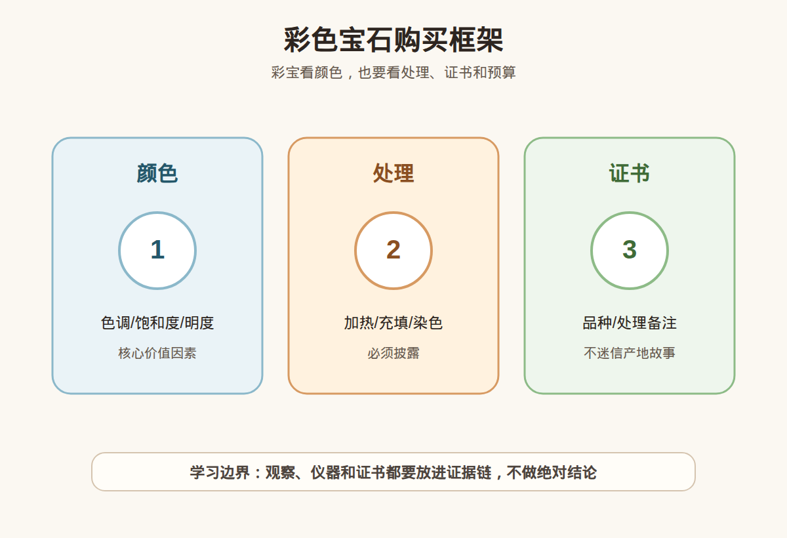

# 第 26 课：彩色宝石总览：颜色、产地、处理和证书

## 1. 本课核心笔记

### 1.1 本课重要结论

这一课先记住 6 个结论：

1. 彩色宝石的购买逻辑通常先看颜色，再看品种、处理、净度、切工、大小、证书和预算，不适合直接套用钻石 4C。
2. 颜色不是一句“好看”就够了，要拆成色调、饱和度、明度、均匀度和光源条件。
3. 处理在彩宝市场很常见，关键不是听到“处理”就否定，而是看处理类型、程度、稳定性、披露是否清楚。
4. 产地故事可以作为市场信息，但产地叙事不等于实验室证据，更不等于价值保证。
5. 证书要读字段，不只看封面结论；尤其要看品种、重量尺寸、处理备注、产地意见、报告日期和样品描述是否匹配。
6. 新手预算要先分层：学习样品、日常佩戴、礼物和高价收藏型购买，四种目标不能混在一起决策。

一句话总结：

> 彩宝消费先把“颜色好、产地好、无处理、证书好”拆开核对；高价购买要看权威证书、处理披露、复检支持和可接受的预算风险。

### 1.2 为什么要先学彩宝总览

彩色宝石不像钻石那样有高度标准化的 4C 消费框架。不同品种的关键风险完全不同：红宝石要特别关注热处理和玻璃充填，蓝宝石要关注加热和扩散处理，祖母绿要理解裂隙和注油，尖晶石要分清独立品种、市场认知和合成材料。先学总览，是为了避免后面每个品类都被单一话术带偏。

彩宝的难点不在于术语多，而在于同一个词在消费语境里可能被过度使用。例如“缅甸”“皇家蓝”“鸽血红”“无烧”“木佐绿”“绝矿”“老矿”“收藏级”，这些词有的可能出现在证书或行业描述里，有的只是营销表达。学习时要把它们放回证据链：谁说的、怎么证明、证书是否支持、处理是否披露、价格是否已经把风险算进去。

### 1.3 彩宝评价先看什么

入门可以把彩宝评价拆成 9 个问题：

| 维度 | 入门问题 | 消费含义 |
| --- | --- | --- |
| 品种 | 它到底是什么宝石品种？ | 先确认材料类别，避免把相似外观当成同一品种。 |
| 颜色 | 色调、饱和度、明度、均匀度如何？ | 多数彩宝以颜色为主要吸引力，颜色差异会明显影响价格。 |
| 净度 | 内部特征是否影响美观和耐久？ | 彩宝净度标准因品种而异，不能直接套钻石。 |
| 切工 | 是否漏光、偏窗、比例失衡？ | 切工影响亮度、颜色集中度和佩戴效果。 |
| 重量/尺寸 | 克拉数和实际尺寸是否匹配？ | 同克拉不同切工可能看起来大小差异很大。 |
| 处理 | 是否加热、扩散、充填、染色、注油等？ | 处理类型和程度会影响价值、耐久和保养。 |
| 产地 | 是否有实验室产地意见？ | 产地是市场信息，不是单独的购买理由。 |
| 证书 | 字段是否完整，样品是否匹配？ | 证书帮助降低信息不对称，但要读备注和限制。 |
| 用途 | 戒指、吊坠、耳饰还是收藏？ | 佩戴场景决定对耐久性和预算的要求。 |

这里最容易出错的是把“一个维度好”直接扩展成“整颗都值得买”。颜色漂亮但处理重，证书漂亮但实物切工漏光，产地有故事但证书没有产地意见，克拉数大但颜色灰暗，这些都可能改变消费判断。

### 1.4 颜色：彩宝最先被看见的价值因素

彩宝的颜色至少拆成四层：

| 概念 | 小白理解 | 看图和看实物时的提醒 |
| --- | --- | --- |
| 色调 | 偏红、偏蓝、偏绿、偏黄等基本颜色方向 | 商家常用“鸽血红”“皇家蓝”等词，但要看实际色相是否稳定。 |
| 饱和度 | 颜色浓不浓、鲜不鲜 | 饱和度高不等于一定贵，还要看明度、净度和处理。 |
| 明度 | 颜色亮还是暗 | 太暗可能发黑，太浅可能缺少存在感。 |
| 均匀度 | 颜色是否分布均匀 | 色带、色斑、边缘深浅差异会影响观感。 |
| 光源 | 日光、暖光、冷光、直播灯下的变化 | 只看直播强光或精修图很容易误判。 |

消费时要把颜色放在“真实观察条件”里。建议至少要求自然光、室内白光、不同角度的视频，避免只看一张高饱和图片。对高价货，颜色名称不应只来自直播间口播，最好看证书是否有相关颜色描述；即使证书有颜色描述，也仍要回到实物观感、预算和处理备注。

### 1.5 处理：常见不等于可以含糊

彩宝里的处理比钻石消费更复杂。常见处理包括：

| 处理类型 | 常见目的 | 消费时要问什么 |
| --- | --- | --- |
| 加热 | 改善颜色、净度或稳定外观 | 是否有加热迹象？证书如何表述？该品类加热是否常见？ |
| 扩散 | 通过元素扩散改变或增强颜色 | 是否为表面或晶格相关处理？证书是否明确披露？ |
| 充填 | 用玻璃、树脂等填充裂隙 | 充填物是否影响耐久？清洗、维修、改圈是否有风险？ |
| 注油 | 常见于祖母绿等裂隙发育材料 | 注油程度如何？是否稳定？后续保养限制是什么？ |
| 染色 | 改变或增强颜色 | 是否稳定？是否会褪色或污染皮肤、金属？ |
| 覆膜/镀膜 | 改变表面颜色或光泽 | 表面是否容易磨损？是否明确说明？ |

“处理”不是一个简单的好坏标签。某些品类的加热处理在市场上非常常见，购买时关键是价格是否按处理状态定价；而玻璃充填、重度染色、表面扩散等处理可能对价值和耐久影响很大，不能被一句“天然宝石”带过去。红线是：处理必须披露，证书备注必须读，售后和复检条件必须写清楚。

### 1.6 产地故事：能听，但不能当证据

彩宝市场很喜欢讲产地：缅甸、斯里兰卡、克什米尔、哥伦比亚、莫桑比克、坦桑尼亚、马达加斯加等。产地确实可能影响市场偏好，但新手要把三件事分开：

1. 实际地质来源：宝石从哪里形成并开采。
2. 实验室产地意见：检测机构根据包裹体、微量元素、光谱等证据给出的意见，通常也会有局限性。
3. 商业产地故事：销售环节围绕稀缺、老矿、名矿、历史名词包装出来的叙事。

产地不是每颗宝石都能可靠判定，也不是所有证书都提供产地意见。即使证书写了产地，也仍然要看颜色、净度、处理、大小、切工和价格。没有产地证书的“名产地口播”不应该支撑高溢价；有产地证书也不代表可以忽略处理和实物表现。

### 1.7 证书字段怎么读

看彩宝证书时，不要只看“天然”两个字。可以按下面顺序核对：

| 字段 | 应该读什么 | 容易误会的地方 |
| --- | --- | --- |
| Report No. / 编号 | 能否官网核验，日期是否合理 | 截图可能被挪用，编号要和实物、重量、尺寸对应。 |
| Item / Object | 裸石、戒指、吊坠还是其他样品 | 成品镶嵌可能限制检测项目。 |
| Species / Variety | 矿物种和宝石品种 | “Corundum / Ruby”与“red stone”不是一回事。 |
| Weight / Measurements | 重量、尺寸、形状 | 证书样品必须和实物对应，尤其是多石镶嵌。 |
| Color | 颜色描述或商业颜色名 | 颜色名不等于自动高价，也要看处理和整体品质。 |
| Transparency / Clarity | 透明度或内部特征描述 | 彩宝净度标准因品种而异。 |
| Treatment / Comments | 处理备注、处理迹象、限制说明 | “No indications”不等于绝对保证从未处理。 |
| Origin | 是否给产地意见 | 不是所有证书都有产地；产地意见也要看机构和限制。 |

高价购买时，最好要求卖家提供完整证书照片、官网核验方式、复检期限、复检不符的处理方案。证书不是让人停止思考，而是让问题变得可核对。

### 1.8 预算框架：先定用途，再定取舍

彩宝预算可以分成四档思路：

| 目标 | 适合策略 | 不适合做什么 |
| --- | --- | --- |
| 学习样品 | 低预算、信息透明、可接受普通颜色或常见处理 | 不用追名产地和稀缺故事。 |
| 日常佩戴 | 先看耐久性、镶嵌保护、颜色是否耐看 | 不为脆弱材料选择高风险戒指。 |
| 礼物 | 选择证书清楚、售后明确、外观稳定的成品 | 不买解释成本很高的重处理材料。 |
| 高价购买 | 权威证书、处理披露、复检支持、预算上限明确 | 不接受无证书高价、口头产地和升值承诺。 |

预算有限时，优先级通常是：喜欢的颜色、清楚的证书、可接受的处理状态、适合用途的耐久性，然后才是更大的克拉数和更响亮的故事。买彩宝不是追求每个指标都满分，而是在已知风险里做取舍。

### 1.9 易混点

- “天然”不等于“未处理”：天然宝石可能经过加热、注油、充填等处理。
- “无烧”不等于“更适合所有人”：无加热可能有溢价，但颜色、净度、价格仍要匹配。
- “产地好”不等于“这颗好”：同一产地也有品质高低。
- “证书有颜色名”不等于“必然顶级”：颜色名要结合实物、机构标准和市场语境。
- “大克拉”不等于“更值”：大而灰暗、切工差、处理重的宝石不一定适合高预算购买。
- “直播间看着亮”不等于“实物好”：强灯、背景、手机算法和滤镜都会影响颜色判断。

### 1.10 消费红线

1. 高价彩宝没有权威证书，不买。
2. 商家回避处理问题，或只说“天然”不说处理，不买。
3. 产地只靠口头故事，没有证书支持，却要求明显溢价，不买。
4. 不支持合理复检，复检不符也没有书面处理方案，不买。
5. 用“包升值”“错过就没了”“源头内幕价”推动冲动付款，要停下来。
6. 要求你绕开平台、绕开合同、绕开售后记录的交易，要特别谨慎。

## 2. 必背知识卡

### 卡片 1：彩宝评价顺序

彩宝通常先看颜色，再综合品种、处理、净度、切工、大小、证书、产地信息、用途和预算。单一亮点不能替代完整判断。

### 卡片 2：颜色四要素

颜色要拆成色调、饱和度、明度和均匀度，并在不同光源下观察。直播灯和精修图不能作为唯一依据。

### 卡片 3：处理披露

处理在彩宝市场很常见。消费重点是处理类型、程度、稳定性、价格是否匹配，以及证书和商家是否清楚披露。

### 卡片 4：产地边界

产地故事不是证据。产地意见需要看实验室证书；即使有产地意见，也不能单独推出高价值。

### 卡片 5：证书字段

彩宝证书要读品种、重量尺寸、颜色、处理备注、产地意见、报告日期、样品描述和限制说明，不能只看封面结论。

### 卡片 6：预算安全

新手应先确定用途和预算上限。学习样品、日常佩戴、礼物和高价购买，对证书、处理和售后的要求不同。

## 3. 可交互作业

### 作业 1：证书字段标注

找一张公开的彩宝证书样张，标出以下字段：品种、重量、尺寸、颜色、处理备注、产地意见、报告编号、报告日期。不要判断真假，只练习读字段。

参考方向：

- 如果证书没有产地字段，就写“未提供产地意见”，不要自行补充。
- 如果处理备注写的是“No indications of heating”一类表述，要理解为“未见加热迹象”的证书语言，不要改写成绝对的“从未处理”。
- 如果是镶嵌成品，要留意证书是否说明检测受镶嵌限制。

### 作业 2：把营销话术拆成问题

把下面三句话分别拆成至少 3 个追问：

1. “这颗是名产地，升值空间很大。”
2. “颜色特别正，证书也很好。”
3. “天然彩宝，只做过一点点优化。”

参考方向：

- 追问证书是否有产地意见、由哪个机构出具、能否官网核验。
- 追问“颜色好”是实物观察、证书描述还是商业名称。
- 追问“优化”具体是什么处理，程度如何，是否影响保养和价格。

### 作业 3：预算场景选择

假设预算有限，有 A、B、C 三个选择：A 颜色最好但无证书；B 证书清楚但颜色普通；C 产地故事强但不支持复检。你会把哪一个作为学习样品、哪一个排除在高价购买外？

参考方向：

- 学习样品可以接受普通颜色，但信息要清楚、价格要低。
- 高价购买不应接受无证书、不支持复检或处理含糊。
- 产地故事不能替代证书和复检机制。

## 4. 自媒体内容草稿

### 4.1 图文/短视频标题备选

- 我学珠宝第 26 课：彩宝先看颜色，但不能只看颜色
- 买彩宝最容易被哪句话带跑？先拆颜色、处理、产地和证书
- “名产地彩宝”值得买吗？小白先问这 6 个问题
- 彩宝证书别只看天然两个字：处理备注更关键

### 4.2 短视频脚本

今天学珠宝第 26 课：彩色宝石总览。彩宝最吸引人的地方是颜色，但消费时不能只听一句“颜色好”。

我会先把颜色拆成色调、饱和度、明度和均匀度，再看不同光源下是否稳定。然后继续问：这是什么品种？有没有加热、扩散、充填、注油或染色？证书怎么写？是否支持复检？

产地故事也要谨慎。名产地可能有市场偏好，但口头故事不是实验室证据，更不能单独证明高价值。

我现在还是学习者，不做鉴定、估价或产地结论。对高价彩宝，我的安全顺序是：完整证书、处理披露、样品匹配、复检支持、预算上限。少一个环节，就先不冲动。

### 4.3 图文结构

第 1 页：专属问题

- 买彩宝时，颜色、产地、处理和证书，到底先看哪一个？

第 2 页：颜色先拆开

- 色调：偏什么颜色
- 饱和度：浓不浓、鲜不鲜
- 明度：亮还是暗
- 均匀度：有没有色带和色斑

第 3 页：处理要问清

- 加热、扩散、充填、注油、染色、覆膜
- 常见不等于可以不披露
- 处理类型会影响价格和保养

第 4 页：产地故事的边界

- 口播产地不是证据
- 证书产地意见也不是价值保证
- 同产地也有品质差异

第 5 页：证书读字段

- 品种、重量、尺寸、颜色
- 处理备注、产地意见、报告编号
- 样品描述是否与实物一致

第 6 页：消费红线

- 高价无证书不买
- 处理含糊不买
- 不支持复检不买
- 预算被话术推高时先停

### 4.4 配图、视频与分屏素材

本课已准备发布素材包：

- [彩色宝石购买框架 PNG](../assets/lesson-26/colored-gemstone-overview.png) / [SVG 源文件](../assets/lesson-26/colored-gemstone-overview.svg)
- [第 26 课短视频分镜](../assets/lesson-26/video-shotlist.md)
- [第 26 课分屏视频脚本](../assets/lesson-26/split-screen-script.md)
- [第 26 课图文轮播稿](../assets/lesson-26/carousel-copy.md)

### 4.5 评论区互动问题

你买彩宝时最容易被哪个词吸引：颜色名、名产地、无烧、收藏级，还是证书机构？

## 5. 学习档案更新

- 材料状态：已备课，待学习。
- 本课主题：彩色宝石总览：颜色、产地、处理和证书。
- 学习时重点确认：
  - 彩宝评价要把颜色、处理、证书、产地信息和预算拆开。
  - 颜色需要用色调、饱和度、明度、均匀度和光源条件描述。
  - 处理常见但必须披露，不能用“天然”遮盖处理状态。
  - 产地故事不能替代实验室证据和复检。
  - 高价购买要看完整证书、处理备注、复检支持和书面售后。
- 需要复习：
  - 常见彩宝处理类型及其消费影响。
  - 彩宝证书字段的阅读顺序。
  - 学习样品、日常佩戴、礼物和高价购买的预算差异。
- 已准备自媒体素材：
  - 关键配图 PNG 和 SVG 源文件。
  - 60-90 秒短视频分镜。
  - 分屏视频脚本。
  - 6 页图文轮播稿。
- 下一课建议：第 27 课：红宝石入门：颜色、产地故事、热处理和证书边界。
