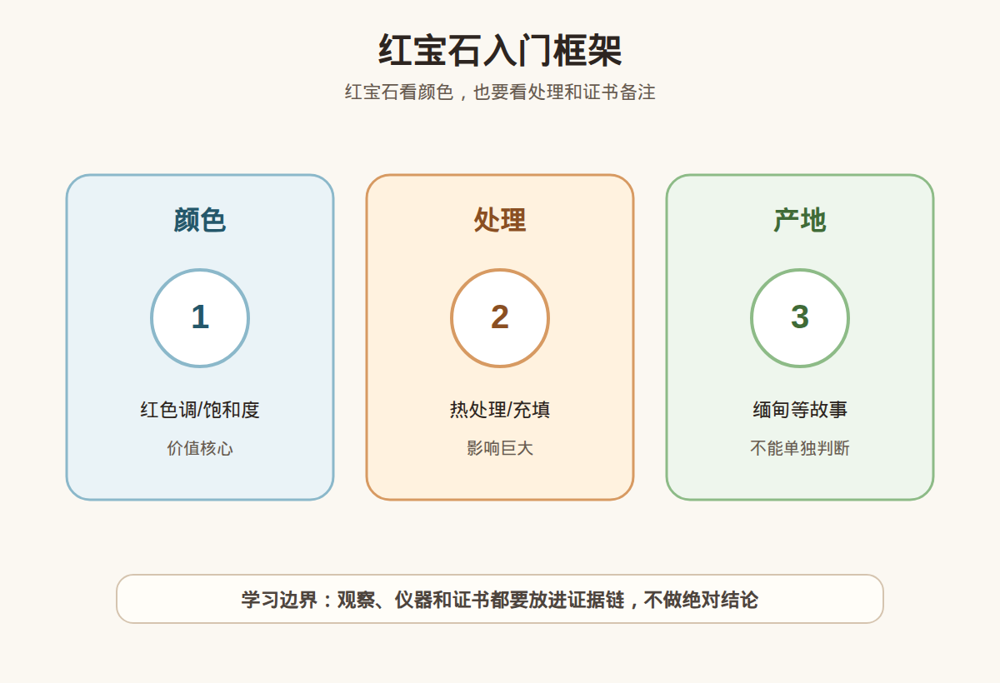

# 第 27 课：红宝石入门：颜色、产地故事、热处理和证书边界

## 1. 本课核心笔记

### 1.1 本课重要结论

这一课先记住 6 个结论：

1. 红宝石是刚玉族中的红色宝石品种，矿物基础是刚玉，红色通常与铬等致色因素有关。
2. 红宝石消费最容易被“鸽血红”“缅甸”“无烧”等词影响，但这些词都必须回到证书、实物和预算。
3. 热处理在红宝石市场常见，不能只用“烧”或“无烧”两字判断好坏，关键是证书怎么写、价格是否匹配。
4. 玻璃充填、裂隙充填等处理会明显改变价值和耐久风险，不能被包装成普通优化。
5. 产地故事有市场意义，但没有权威证书支持的产地口播不应支撑高价。
6. 高价红宝石要同时核对天然/合成、品种、颜色描述、处理备注、产地意见、复检和售后方案。

一句话总结：

> 红宝石要先确认它是天然红宝石，再看颜色、处理、净度、切工和证书；“鸽血红”和名产地都不能替代处理披露与复检。

### 1.2 为什么红宝石容易被话术放大

红宝石是传统贵重宝石之一，历史名气强，颜色情绪强，商业词汇也多。新手最容易在三类话术里失去判断：第一类是颜色词，比如“鸽血红”“正红”“火彩强”；第二类是产地词，比如“缅甸老矿”“莫谷”“无烧缅甸”；第三类是稀缺词，比如“收藏级”“投资级”“拍卖级”。

这些词并非都没有意义，但必须分层理解。颜色词需要看证书表述和实物颜色；产地词需要看实验室是否给出产地意见；稀缺词需要警惕，因为它往往绕开了处理、净度、切工、大小和价格的具体讨论。

### 1.3 刚玉与红宝石的基础概念

红宝石属于刚玉，刚玉的主要成分是氧化铝。宝石学上，刚玉家族里红色品种称为红宝石，其他颜色通常归入蓝宝石或彩色蓝宝石体系。红与粉的边界在不同实验室和市场语境里可能有差异，所以不要只凭肉眼把“粉红刚玉”直接说成高价红宝石。

| 概念 | 小白理解 | 消费提醒 |
| --- | --- | --- |
| 刚玉 | 红宝石和蓝宝石所属的矿物家族 | 先确认品种，不把红色石头都叫红宝石。 |
| 红宝石 | 刚玉中的红色宝石品种 | 颜色边界要看证书，不用自判。 |
| 合成红宝石 | 人工生长的刚玉材料 | 合成不等于仿制，但价值体系与天然不同，必须披露。 |
| 相似宝石 | 尖晶石、石榴石、玻璃等可能呈红色 | 外观相似不能代替检测。 |

红宝石硬度高，适合很多珠宝场景，但硬度不是唯一耐久指标。裂隙、充填物、镶嵌方式、日常磕碰和后期维修都会影响风险。

### 1.4 颜色与“鸽血红”的话术风险

红宝石颜色可以拆成：色调是否偏紫或偏橙，饱和度是否够强，明度是否过暗或过浅，颜色分布是否均匀。市场喜欢把高品质红色称为“鸽血红”，部分实验室也会在特定条件下给出类似颜色名称，但直播间口播的“鸽血红”和证书字段中的颜色描述不是一回事。

| 颜色说法 | 可能有用的信息 | 风险点 |
| --- | --- | --- |
| 鸽血红 | 可能指高饱和、较理想的红色范围 | 必须看证书是否写明，不能只听商家说。 |
| 正红 | 商业口语，表达不偏色的期待 | 没有统一检测标准，容易被滥用。 |
| 暗红 | 可能颜色浓但明度低 | 实物可能发黑，强灯下才显亮。 |
| 粉红 | 可能接近粉色刚玉边界 | 需要看证书品种和颜色描述。 |
| 荧光强 | 部分红宝石在紫外或日光下更鲜 | 荧光不是价值保证，也不是鉴定结论。 |

消费上，不要把“鸽血红”当成自动高价通行证。更稳妥的问法是：证书由哪个机构出具？颜色描述具体怎么写？是否天然红宝石？有无加热迹象？是否有残留物、充填或其他处理？实物在自然光和室内光下是否都喜欢？

### 1.5 热处理：常见，但要看证书语言

红宝石加热处理的目的通常是改善颜色、净度或减少某些内部特征。市场上热处理红宝石并不少见，购买时不必一听“加热”就否定，但要确保价格已经反映处理状态。

证书中可能出现类似“no indications of heating”“indications of heating”“heated with residues”等表述。新手要注意：

- “未见加热迹象”是检测语言，不是对历史的绝对保证。
- “加热”本身还要看是否有残留物、残留程度和机构表述。
- 不同机构对处理程度的描述方式可能不同，要读完整备注。
- 卖家如果只说“天然”却回避加热问题，信息不够完整。

### 1.6 玻璃充填与裂隙充填风险

红宝石中最需要警惕的处理之一是玻璃充填或裂隙充填，尤其是铅玻璃充填类材料。它可能让原本裂隙多、透明度差的材料看起来更通透，但充填物会影响价值、耐久和后续保养。

| 风险 | 具体表现 | 消费后果 |
| --- | --- | --- |
| 耐久风险 | 充填物可能受热、酸碱、超声波或维修影响 | 改圈、翻新、清洗时可能出问题。 |
| 价值差异 | 充填材料与优质天然红宝石不是同一价格体系 | 不能按“高端红宝石”逻辑付款。 |
| 披露风险 | 商家可能用“优化”“微处理”模糊表达 | 必须要求证书明确说明处理。 |
| 售后风险 | 后期损伤责任难界定 | 购买前要写明复检和售后。 |

红线很简单：如果证书或商家说明存在明显玻璃充填、重度裂隙充填等处理，新手不要用高价红宝石预算去买；如果商家不愿意说明处理状态，也不要继续被颜色吸引。

### 1.7 产地故事的边界

红宝石常见产地叙事包括缅甸、莫桑比克、泰国、斯里兰卡、越南等。不同产地的市场偏好不同，但产地本身不是价值结论。尤其是“缅甸”这个词，既可能是证书里的产地意见，也可能是销售话术。

要把产地拆成三步核对：

1. 证书是否有 origin 字段。
2. 出具机构是否具备彩宝产地判定经验。
3. 价格溢价是否同时有颜色、处理、净度、大小和切工支撑。

没有证书支持的“缅甸老矿”只是一段故事；有证书支持的产地意见，也仍然要看是否加热、是否有残留、是否有充填、实物颜色是否稳定。

### 1.8 红宝石证书要读什么

| 字段 | 应看内容 | 新手提醒 |
| --- | --- | --- |
| Species / Variety | Corundum / Ruby | 确认不是红色相似石、合成材料或描述含糊的样品。 |
| Natural / Synthetic | 天然或合成相关表述 | 合成红宝石必须明确披露。 |
| Color | 红色描述、可能的商业颜色名 | 颜色名要和实物及机构标准一起看。 |
| Weight / Measurements | 重量和尺寸 | 防止证书与实物不匹配。 |
| Treatment / Comments | 加热、残留、充填、扩散等说明 | 这是红宝石证书最关键字段之一。 |
| Origin | 产地意见 | 不是每张证书都有，也不是价值保证。 |
| Report Date | 报告日期 | 老证书最好结合复检。 |

高价红宝石建议选择可官网核验的权威证书，并在交易前约定复检。复检不符时如何退换、谁承担费用、是否有时间限制，都应写清楚。

### 1.9 易混点

- “红色宝石”不等于“红宝石”：尖晶石、石榴石、玻璃、合成材料都可能呈红色。
- “无烧”不等于“完美”：无加热也要看颜色、净度、裂隙、切工和价格。
- “鸽血红”不等于“随口可用”：要看证书机构、颜色条件和实际观感。
- “缅甸”不等于“贵”：名产地里的普通品质也可能不适合高价。
- “天然”不等于“未处理”：天然红宝石也可能加热或充填。
- “硬度高”不等于“不怕维修”：充填物和裂隙会改变保养风险。

### 1.10 消费红线

1. 高价红宝石没有权威证书，不买。
2. 证书未清楚说明处理，商家又拒绝解释，不买。
3. 用“鸽血红”口播要求高溢价，却没有证书字段支持，不买。
4. 玻璃充填材料按无处理或高端红宝石价格销售，不买。
5. 产地只靠故事，不支持复检，不买。
6. 卖家承诺升值、回购或拍卖级，但不写进合同，不作为购买依据。

## 2. 必背知识卡

### 卡片 1：红宝石与刚玉

红宝石是刚玉中的红色宝石品种。红色外观不足以证明品种，必须看证书或专业检测。

### 卡片 2：颜色评价

红宝石颜色要看色调、饱和度、明度、均匀度和光源表现。“鸽血红”不能只听口播。

### 卡片 3：热处理

热处理在红宝石市场常见。消费重点是证书如何表述、是否有残留、价格是否按处理状态定价。

### 卡片 4：玻璃充填

玻璃充填会明显影响价值和耐久，清洗、维修和佩戴风险更高，必须明确披露。

### 卡片 5：产地边界

产地故事需要证书支持；有产地意见也要继续看颜色、处理、净度、大小和价格。

### 卡片 6：高价购买规则

高价红宝石要有权威证书、处理披露、样品匹配、复检支持和书面售后，不做鉴定/估价/产地结论。

## 3. 可交互作业

### 作业 1：拆解“鸽血红”

看到一条文案：“缅甸鸽血红无烧红宝石，收藏级。”请把这句话拆成 5 个必须核对的问题。

参考方向：

- 证书是否写明 Ruby、颜色描述和是否无加热迹象。
- 产地是否为实验室 origin 意见，而不是商家口播。
- 是否有残留、充填或其他处理备注。
- “收藏级”是谁定义的，是否只是营销词。
- 是否支持复检，复检不符如何处理。

### 作业 2：处理风险排序

把以下三种情况按新手风险从低到高排序，并说明原因：A 证书清楚写加热；B 商家说无烧但没有证书；C 证书显示玻璃充填。

参考方向：

- A 至少处理信息透明，价格可按处理状态评估。
- B 最大问题是信息缺失，不能用口播替代证书。
- C 需要特别关注耐久、保养和价值体系，不能按普通高端红宝石购买。

### 作业 3：消费表达改写

把“这颗红宝石是缅甸鸽血红，闭眼买”改成更稳妥的小白表达。

参考方向：

> 这颗红宝石的卖点集中在颜色和产地，但我需要先看权威证书是否支持品种、颜色、处理和产地意见，再确认实物、价格、复检和售后。不做估价和产地结论，只做购买前的信息核对。

## 4. 自媒体内容草稿

### 4.1 图文/短视频标题备选

- 我学珠宝第 27 课：红宝石别只听“鸽血红”
- 缅甸红宝石一定贵吗？小白先看证书处理备注
- 红宝石的热处理和玻璃充填，差别到底在哪里
- 买红宝石前先问 6 句话：颜色、处理、产地、复检

### 4.2 短视频脚本

今天学珠宝第 27 课：红宝石。红宝石属于刚玉，是刚玉里的红色宝石品种，但不是所有红色石头都能叫红宝石。

这节课我最想记住的是：红宝石消费不能只听“鸽血红”“缅甸”“无烧”。这些词要回到证书字段：品种是不是 Ruby？有没有加热迹象？有没有残留或充填？产地是否有实验室意见？

热处理在红宝石市场比较常见，信息透明、价格匹配时可以纳入比较；但玻璃充填、重度裂隙充填一类处理，对价值和耐久影响很大，不能被包装成普通优化。

我现在还是学习者，不做鉴定、估价或产地结论。高价红宝石必须看权威证书、处理披露和复检支持。

### 4.3 图文结构

第 1 页：专属问题

- 听到“鸽血红缅甸红宝石”，你先激动还是先看证书？

第 2 页：红宝石是什么

- 刚玉家族的红色宝石品种
- 红色外观不等于红宝石
- 合成材料和相似宝石必须排除

第 3 页：颜色词要谨慎

- 鸽血红不是随口标签
- 正红、暗红、粉红都要看实物和证书
- 强灯视频不能替代实物观察

第 4 页：处理是关键

- 加热常见，要看证书语言
- 玻璃充填影响价值和耐久
- 天然不等于未处理

第 5 页：产地故事边界

- 缅甸等产地需要证书支持
- 有产地意见也要看处理和品质
- 口播产地不支撑高价

第 6 页：红线

- 无证书高价不买
- 处理含糊不买
- 不支持复检不买
- 升值承诺不作为依据

### 4.4 配图、视频与分屏素材

本课已准备发布素材包：

- [红宝石入门框架 PNG](../assets/lesson-27/ruby-basics-treatment-origin.png) / [SVG 源文件](../assets/lesson-27/ruby-basics-treatment-origin.svg)
- [第 27 课短视频分镜](../assets/lesson-27/video-shotlist.md)
- [第 27 课分屏视频脚本](../assets/lesson-27/split-screen-script.md)
- [第 27 课图文轮播稿](../assets/lesson-27/carousel-copy.md)

### 4.5 评论区互动问题

如果只能先学一个红宝石避坑词，你最想拆“鸽血红”“无烧”“缅甸”还是“玻璃充填”？

## 5. 学习档案更新

- 材料状态：已备课，待学习。
- 本课主题：红宝石入门：颜色、产地故事、热处理和证书边界。
- 学习时重点确认：
  - 红宝石是刚玉中的红色宝石品种，不能凭红色外观下结论。
  - “鸽血红”需要看证书和实物，不接受口播高溢价。
  - 热处理常见，但处理表述和价格匹配很重要。
  - 玻璃充填会影响价值、耐久和保养，是重要风险点。
  - 产地故事必须回到证书、处理和复检。
- 需要复习：
  - 刚玉、红宝石、粉色蓝宝石边界的基础概念。
  - 红宝石证书中的处理备注和产地字段。
  - 热处理与玻璃充填的消费差异。
- 已准备自媒体素材：
  - 关键配图 PNG 和 SVG 源文件。
  - 60-90 秒短视频分镜。
  - 分屏视频脚本。
  - 6 页图文轮播稿。
- 下一课建议：第 28 课：蓝宝石入门：颜色体系、加热、扩散和预算。
