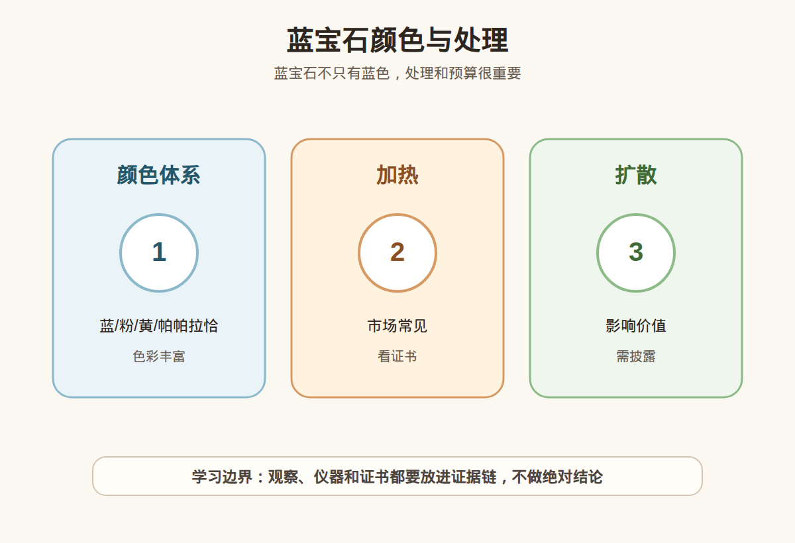

# 第 28 课：蓝宝石入门：颜色体系、加热、扩散和预算

## 1. 本课核心笔记

### 1.1 本课重要结论

这一课先记住 6 个结论：

1. 蓝宝石属于刚玉家族，商业上不只指蓝色；粉、黄、橙、紫、绿、变色等也属于彩色蓝宝石范围。
2. 蓝色蓝宝石要看色调、饱和度、明度、均匀度和切工带来的漏光或色带表现。
3. “皇家蓝”“矢车菊蓝”“帕帕拉恰”等名称很容易被营销化，必须看证书表述和实物效果。
4. 加热处理在蓝宝石市场常见，信息透明和价格匹配比单纯排斥更重要。
5. 扩散处理、铍扩散等对价值影响大，购买时必须要求证书和处理披露。
6. 预算有限时，要先决定用途：日常戒指、吊坠礼物、颜色收藏或学习样品，对取舍要求不同。

一句话总结：

> 蓝宝石的核心不是“越蓝越贵”这么简单，而是颜色体系、处理状态、证书字段、佩戴用途和预算取舍一起看。

### 1.2 为什么蓝宝石不能只按“蓝”理解

很多人第一次听到蓝宝石，会以为只有蓝色。宝石学和商业市场里的蓝宝石更复杂：红色刚玉称为红宝石，其他颜色的刚玉通常可以归入蓝宝石或彩色蓝宝石范畴。于是同样叫 sapphire，可能是蓝色、粉色、黄色、紫色、绿色、无色，也可能是变色蓝宝石。

这会带来两个消费误区：第一，把“蓝宝石”这个名字误解成“必须很蓝才好”；第二，把某个颜色名称当成价值结论。例如“皇家蓝”可能是证书中的颜色描述，也可能只是商家口播；“帕帕拉恰”在不同机构和市场语境里有边界争议，新手更要看证书和处理备注。

### 1.3 蓝宝石颜色体系

| 类型 | 入门理解 | 消费提醒 |
| --- | --- | --- |
| 蓝色蓝宝石 | 最常见、市场认知最高的蓝宝石方向 | 看色调是否偏紫/偏绿，明度是否过暗，饱和度是否足。 |
| 粉色蓝宝石 | 粉到粉紫色调的刚玉 | 与红宝石边界可能受实验室和市场语境影响。 |
| 黄色蓝宝石 | 黄色到金黄色刚玉 | 要关注是否加热或扩散处理。 |
| 紫色/绿色蓝宝石 | 颜色更小众，个性强 | 价格要和市场接受度、证书、颜色稳定性匹配。 |
| 帕帕拉恰 | 粉橙到橙粉色调的稀有商业类别 | 名称边界敏感，要看权威证书和处理说明。 |
| 变色蓝宝石 | 不同光源下颜色发生明显变化 | 要区分变色效果、光源条件和证书描述。 |

蓝色蓝宝石常见的颜色问题包括：颜色太黑、太灰、太浅、色带明显、切工漏窗导致中间发白。直播间强光可能让暗蓝看起来更亮，也可能让灰蓝显得更鲜；购买前最好看自然光、室内白光和手部佩戴视频。

### 1.4 颜色名称：皇家蓝、矢车菊蓝和商业表达

“皇家蓝”“矢车菊蓝”是蓝宝石市场里常见的颜色词。它们能帮助沟通颜色印象，但不是所有商家使用这些词时都具备同样标准。新手要把颜色名称拆成三层：

1. 证书是否写了相关颜色名称或描述。
2. 机构对该颜色名称是否有自己的适用条件。
3. 实物在不同光源下是否符合自己审美和预算。

如果证书没有写“皇家蓝”，商家却反复用这个词催促付款，就要谨慎。如果证书写了，也不代表这颗蓝宝石一定适合高价购买，因为还要看是否加热、是否扩散、净度、切工、尺寸和整体观感。

### 1.5 加热处理：常见但不能省略

蓝宝石加热处理通常用于改善颜色或内部特征。市场上加热蓝宝石很常见，尤其在中低到中高预算区间，消费者经常会遇到。入门判断不应该是“加热等于不好”，而是：

- 证书是否清楚写明有无加热迹象。
- 价格是否按加热状态定价。
- 卖家是否主动披露，而不是被问到才含糊回应。
- 是否还有其他处理，例如扩散、充填、染色、覆膜等。

“无烧”蓝宝石通常会有额外市场溢价，但无烧也不自动等于颜色好、切工好或适合预算。预算有限时，颜色漂亮、证书清楚的加热蓝宝石，可能比颜色差但挂着“无烧”标签的样品更适合日常佩戴。

### 1.6 扩散处理：必须重点追问

扩散处理是蓝宝石消费里的重要风险点。扩散处理通过外来元素进入宝石表层或晶格来改变颜色，常被提到的包括钛扩散、铍扩散等。不同扩散处理的表现和检测复杂度不同，但共同点是：必须披露，且价值体系与未扩散或普通加热材料不同。

| 处理 | 可能目的 | 新手风险 |
| --- | --- | --- |
| 普通加热 | 改善颜色或净度 | 常见，但要看证书和价格。 |
| 表面扩散 | 增强表面颜色 | 切磨或磨损后颜色可能受影响，价值差异大。 |
| 铍扩散 | 改变或增强整体颜色表现 | 需要可靠检测和披露，不能用普通加热带过。 |
| 充填/覆膜 | 改善外观 | 耐久和保养风险更高，必须问清。 |

如果商家用“只做过国际认可优化”来替代具体处理名称，新手不应接受。正确问法是：证书 treatment/comments 字段怎么写？是否有扩散迹象？是否支持复检？复检机构能否覆盖相关处理检测？

### 1.7 预算与用途

蓝宝石硬度高，整体耐久性较好，常用于戒指、吊坠、耳饰。但高硬度不代表不怕所有风险：尖角切割、镶嵌松动、内部裂隙、磕碰和后期维修都可能带来问题。预算选择时可以按用途分层：

| 用途 | 优先级 | 取舍建议 |
| --- | --- | --- |
| 日常戒指 | 耐久、镶嵌保护、颜色耐看 | 可接受证书清楚的常见加热，少追极端颜色名。 |
| 吊坠/耳饰 | 正面颜色、尺寸存在感 | 对磕碰要求略低，但仍要看处理和证书。 |
| 礼物 | 证书清楚、售后简单、颜色大众 | 避免复杂争议名词和难解释处理。 |
| 学习样品 | 低预算、信息透明、对比不同颜色 | 不追名产地和稀缺颜色名。 |
| 高价购买 | 权威证书、处理披露、复检、书面约定 | 不接受口播皇家蓝、口播无烧或不支持复检。 |

预算有限时，通常需要在颜色、大小、处理和证书之间做取舍。不要为了追求更大克拉牺牲证书和处理透明度，也不要为了一个颜色名买到明显超预算的样品。

### 1.8 蓝宝石证书要读什么

| 字段 | 应看内容 | 易错点 |
| --- | --- | --- |
| Species / Variety | Corundum / Sapphire | 确认是蓝宝石或彩色蓝宝石，不是相似材料。 |
| Color | Blue、Pink、Yellow、Padparadscha 等描述 | 颜色名要看机构表述，不只听销售话术。 |
| Weight / Measurements | 重量、尺寸、形状 | 同克拉视觉大小可能不同。 |
| Treatment / Comments | 加热、扩散、充填等备注 | 扩散处理必须特别留意。 |
| Origin | 产地意见 | 不是每张证书都有，产地不是价值保证。 |
| Report Date | 日期和可核验性 | 老证书或高价交易建议复检。 |

如果证书只写“natural sapphire”，但没有处理字段或备注说明，要追问检测范围。高价蓝宝石最好选择能覆盖加热和扩散检测的机构，并保留复检约定。

### 1.9 易混点

- “蓝宝石”不只蓝色：除红色刚玉外，很多颜色的刚玉都可能归入蓝宝石体系。
- “皇家蓝”不等于必然顶级：要看证书、实物、处理和价格。
- “无烧”不等于最适合预算：颜色差、切工差的无烧不一定更适合日常购买。
- “加热”不等于欺骗：披露清楚、价格匹配时可以纳入比较。
- “扩散”不能被普通加热带过：扩散处理价值影响大，必须看证书。
- “硬度高”不等于不用保养：镶嵌和磕碰仍会影响安全。

### 1.10 消费红线

1. 高价蓝宝石没有权威证书，不买。
2. 商家回避加热、扩散等处理问题，不买。
3. 只用“皇家蓝”“矢车菊蓝”“帕帕拉恰”口播催单，不买。
4. 证书和实物重量、尺寸、颜色明显对不上，不买。
5. 不支持复检，或复检不符没有书面处理方案，不买。
6. 用“无烧必涨”“稀缺颜色包升值”推动付款，要停止决策。

## 2. 必背知识卡

### 卡片 1：蓝宝石颜色体系

蓝宝石属于刚玉家族，不只蓝色。粉、黄、紫、绿、无色、变色等都可能是彩色蓝宝石。

### 卡片 2：蓝色评价

蓝色蓝宝石要看色调、饱和度、明度、均匀度、色带、漏窗和不同光源表现。

### 卡片 3：颜色名称边界

皇家蓝、矢车菊蓝、帕帕拉恰等词要看证书和机构标准，不能只听销售口播。

### 卡片 4：加热处理

加热在蓝宝石市场常见。披露清楚、价格匹配时可比较；无烧也不自动代表最优选择。

### 卡片 5：扩散处理

扩散处理会明显影响价值和购买风险，必须看证书 treatment/comments 字段并确认复检支持。

### 卡片 6：预算取舍

预算有限时，先定用途，再在颜色、大小、处理、证书和镶嵌之间取舍，不用追所有卖点。

## 3. 可交互作业

### 作业 1：颜色名称核对

看到“皇家蓝无烧蓝宝石”这句话，列出你要核对的 6 个信息。

参考方向：

- 证书是否写 Sapphire，以及颜色描述是否支持“皇家蓝”。
- 是否写明未见加热迹象，还是商家口播无烧。
- 是否排除扩散、充填或覆膜等其他处理。
- 实物是否在自然光和室内光下都能接受。
- 重量尺寸是否与证书匹配。
- 是否支持复检和复检不符处理。

### 作业 2：预算选择

同样预算下，A 是 2 克拉但颜色偏黑、证书清楚加热；B 是 1 克拉颜色明亮、证书清楚加热；C 是 1.2 克拉口播无烧但没有证书。你会如何排序？

参考方向：

- 学习时可以把证书清楚作为底线，先排除口播无证高价。
- 颜色偏黑的大克拉未必比颜色明亮的小克拉更适合佩戴。
- 加热不是自动排除项，关键看披露和价格。

### 作业 3：处理表达改写

把“这颗只是做过一点国际优化，不影响价值”改成更稳妥的提问。

参考方向：

> 请说明具体处理类型，是加热、扩散、充填还是其他处理？证书 treatment/comments 字段怎么写？这种处理是否影响价值、保养和后续复检？

## 4. 自媒体内容草稿

### 4.1 图文/短视频标题备选

- 我学珠宝第 28 课：蓝宝石不只蓝色
- 皇家蓝一定顶级吗？蓝宝石小白先看证书字段
- 蓝宝石加热常见，扩散处理才是重点追问
- 预算有限怎么买蓝宝石：颜色、大小、处理怎么取舍

### 4.2 短视频脚本

今天学珠宝第 28 课：蓝宝石。先纠正一个误会：蓝宝石属于刚玉家族，不只蓝色，粉色、黄色、紫色、绿色、变色等也可能属于蓝宝石体系。

蓝色蓝宝石要看色调、饱和度、明度和均匀度，不是越暗越高级，也不是强灯下越蓝越值得买。

处理方面，加热在蓝宝石市场比较常见，信息透明时可以纳入比较；但扩散处理价值影响更大，必须看证书和复检支持。

我现在还是学习者，不做鉴定、估价或产地结论。买高价蓝宝石，我会先看证书里的品种、颜色、处理备注和样品信息，再决定预算是否匹配。

### 4.3 图文结构

第 1 页：专属问题

- 蓝宝石只有蓝色吗？“皇家蓝”三个字够不够下单？

第 2 页：颜色体系

- 蓝、粉、黄、紫、绿、无色、变色
- 帕帕拉恰要看证书边界
- 红色刚玉另归红宝石

第 3 页：蓝色怎么拆

- 色调：偏紫还是偏绿
- 饱和度：鲜不鲜
- 明度：亮不亮、黑不黑
- 均匀度：有无色带和漏窗

第 4 页：处理怎么问

- 加热常见，要披露
- 扩散处理价值影响大
- 充填、覆膜也要读备注

第 5 页：预算怎么取舍

- 日常戒指看耐久和证书
- 礼物看售后和解释成本
- 学习样品看信息透明
- 高价购买要复检

第 6 页：红线

- 无证高价不买
- 处理含糊不买
- 口播颜色名不买高溢价
- 不支持复检先停

### 4.4 配图、视频与分屏素材

本课已准备发布素材包：

- [蓝宝石颜色与处理 PNG](../assets/lesson-28/sapphire-color-treatment-budget.png) / [SVG 源文件](../assets/lesson-28/sapphire-color-treatment-budget.svg)
- [第 28 课短视频分镜](../assets/lesson-28/video-shotlist.md)
- [第 28 课分屏视频脚本](../assets/lesson-28/split-screen-script.md)
- [第 28 课图文轮播稿](../assets/lesson-28/carousel-copy.md)

### 4.5 评论区互动问题

你更想看蓝色蓝宝石、粉色蓝宝石、黄色蓝宝石，还是帕帕拉恰的证书字段拆解？

## 5. 学习档案更新

- 材料状态：已备课，待学习。
- 本课主题：蓝宝石入门：颜色体系、加热、扩散和预算。
- 学习时重点确认：
  - 蓝宝石不只蓝色，属于刚玉家族的多颜色体系。
  - 蓝色蓝宝石要拆色调、饱和度、明度、均匀度和光源表现。
  - 皇家蓝、矢车菊蓝、帕帕拉恰等词要看证书和实物。
  - 加热常见但要披露，扩散处理必须重点追问。
  - 预算要按用途分层，不用追所有卖点。
- 需要复习：
  - 刚玉、红宝石、蓝宝石和彩色蓝宝石的关系。
  - 蓝宝石常见处理的证书表述。
  - 日常佩戴、礼物和高价购买的预算框架。
- 已准备自媒体素材：
  - 关键配图 PNG 和 SVG 源文件。
  - 60-90 秒短视频分镜。
  - 分屏视频脚本。
  - 6 页图文轮播稿。
- 下一课建议：第 29 课：祖母绿入门：裂隙、注油、净度和佩戴风险。
