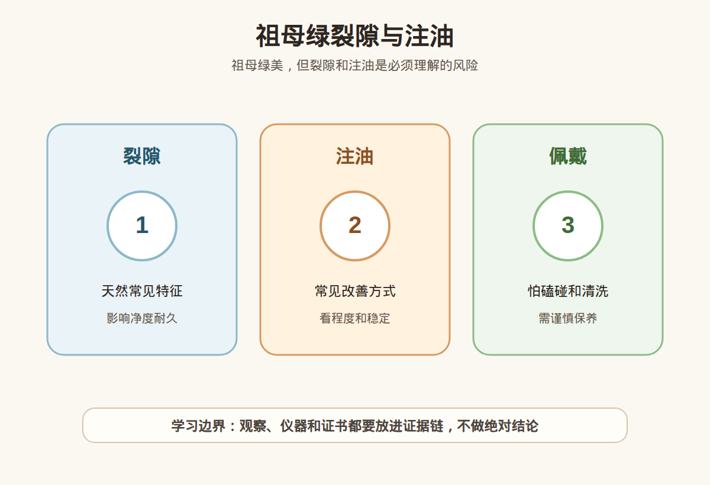

# 第 29 课：祖母绿入门：裂隙、注油、净度和佩戴风险

## 1. 本课核心笔记

### 1.1 本课重要结论

这一课先记住 6 个结论：

1. 祖母绿属于绿柱石家族，绿色通常与铬、钒等致色因素有关。
2. 祖母绿常见裂隙和内部特征，净度理解不能直接套钻石的“越干净越好”。
3. 注油或裂隙充填在祖母绿市场中常见，关键是处理材料、程度、稳定性和证书披露。
4. 祖母绿硬度不低，但因裂隙发育和处理特征，日常佩戴、清洗、维修都要谨慎。
5. “无油”“木佐绿”“哥伦比亚”等词容易被放大，必须回到证书、实物和复检。
6. 高价祖母绿要看权威证书处理备注，不接受无证书高价货或处理含糊的销售说法。

一句话总结：

> 祖母绿的美常常和内部特征共存；购买时要把颜色、裂隙、注油程度、佩戴风险和证书备注一起看。

### 1.2 为什么祖母绿不能按钻石净度理解

钻石消费里，净度常被讲成“越干净越好”。祖母绿如果这样理解，就会很容易误判。祖母绿天然生长环境复杂，常见裂隙、包裹体和内部特征，行业里甚至会用“花园感”来形容某些内部景观。对祖母绿来说，重点不是看到一点内部特征就否定，而是看这些特征是否影响整体美观、耐久和处理状态。

另一个难点是注油。很多祖母绿会通过油或其他充填材料改善裂隙可见度。新手如果只听“天然祖母绿”四个字，很可能忽略处理程度；如果一听“有油”就完全否定，又可能无法理解这个品类的市场现实。

### 1.3 绿柱石与祖母绿基础概念

祖母绿是绿柱石家族中的绿色宝石品种。绿柱石家族还包括海蓝宝石、摩根石等不同颜色品种。祖母绿的绿色常与铬、钒等元素有关，但消费时不需要自己做元素判断，重点是看证书品种和处理备注。

| 概念 | 小白理解 | 消费提醒 |
| --- | --- | --- |
| 绿柱石 | 一个矿物家族 | 祖母绿只是其中一个高关注品种。 |
| 祖母绿 | 绿柱石中的绿色宝石品种 | 绿色深浅和致色因素需看专业证书，不用自判。 |
| 合成祖母绿 | 人工生长的祖母绿材料 | 必须披露，价值体系不同于天然。 |
| 相似材料 | 绿色玻璃、绿色石英、绿色碧玺等 | 绿色外观不能证明祖母绿身份。 |

祖母绿的消费风险不只在真假，还在处理和耐久。即使是天然祖母绿，如果裂隙多、处理重、镶嵌高风险，也不一定适合作为高频佩戴戒指。

### 1.4 裂隙与净度：不是钻石逻辑

祖母绿常见裂隙和包裹体，评价时要看三个层面：

1. 美观：内部特征是否明显影响正面观感。
2. 耐久：裂隙是否到达表面，是否靠近尖角或镶爪受力位置。
3. 处理：裂隙是否经过油、树脂或其他材料改善。

| 观察点 | 可以说明什么 | 不能直接推出什么 |
| --- | --- | --- |
| 肉眼可见裂隙 | 可能影响净度、耐久和价格 | 不能直接说这颗一定很差。 |
| 内部包裹体 | 可能是天然生长特征之一 | 不能单独证明天然或产地。 |
| 表面裂隙 | 可能增加佩戴和清洗风险 | 不能凭照片判断处理程度。 |
| 高透明度 | 观感可能更干净 | 仍要排除合成、重处理或证书不清。 |

祖母绿的净度更像“可接受内部特征与美观耐久之间的平衡”。对新手来说，关键是不要把钻石净度等级照搬过来，也不要在没有证书的情况下自行判断裂隙性质。

### 1.5 注油与充填：看程度、材料和稳定性

祖母绿常见的净度改善包括注油、树脂或其他裂隙充填。证书可能会用 minor、moderate、significant 等程度词，也可能用不同机构自己的表述。消费时要关注：

| 问题 | 为什么重要 |
| --- | --- |
| 是油还是树脂等其他材料？ | 材料稳定性和保养风险可能不同。 |
| 程度是轻微、中等还是明显？ | 程度会影响价值和未来维护。 |
| 是否到达表面裂隙？ | 表面裂隙更容易受清洗、热和化学品影响。 |
| 证书是否写明 clarity enhancement？ | 处理披露是交易底线。 |
| 后续是否需要重新注油或维护？ | 影响长期佩戴成本和售后。 |

“有油”不是一个足够完整的描述，“无油”也不是可以随口承诺的词。高价祖母绿如果声称无油或极轻微注油，必须看权威证书和复检支持。商家把注油说成“保养油”“天然现象”来回避处理披露时，要停止交易。

### 1.6 佩戴和保养风险

祖母绿莫氏硬度约 7.5-8，听起来不低，但它的裂隙和处理让保养更谨慎。日常建议：

- 避免超声波清洗和蒸汽清洗。
- 避免高温、强光长时间暴晒、酸碱和强溶剂。
- 做家务、运动、搬重物时摘下戒指。
- 镶嵌尽量选择有保护的款式，尖角和薄边要谨慎。
- 维修、改圈、翻新前告知工匠这是祖母绿，并说明可能有注油或充填。
- 购买前问清售后是否覆盖松动、裂隙扩大、清洗损伤等情况。

祖母绿更适合把“美观”和“脆弱边界”一起接受。如果想要每天随意佩戴、频繁接触清洁剂和硬物，祖母绿戒指不是最省心的选择。

### 1.7 颜色、产地与市场词

祖母绿颜色通常关注绿色的色调、饱和度和明度。颜色太浅可能缺少祖母绿的浓郁感，太暗可能发黑，偏黄或偏蓝也会影响市场偏好。市场词里常见“木佐绿”“沃顿绿”“哥伦比亚”“赞比亚”等表达，但新手要分清：

- 颜色名可能是商业描述，不一定是证书标准。
- 产地可能影响市场偏好，但需要实验室产地意见支持。
- 同一产地也有颜色、净度、处理和切工差异。
- 名称漂亮不能掩盖注油程度和裂隙风险。

高价祖母绿如果主打产地或颜色名，必须同时提供处理程度清楚的权威证书。没有处理披露的名词堆叠，反而是风险信号。

### 1.8 证书字段怎么读

| 字段 | 应看内容 | 新手提醒 |
| --- | --- | --- |
| Species / Variety | Beryl / Emerald | 确认是祖母绿，不是相似绿色材料。 |
| Natural / Synthetic | 天然或合成相关说明 | 合成祖母绿必须披露。 |
| Weight / Measurements | 重量、尺寸、形状 | 证书与实物要对应。 |
| Color | 绿色描述 | 颜色名不是价值保证。 |
| Clarity Enhancement | 注油、树脂或其他净度改善 | 祖母绿证书重点字段。 |
| Degree | minor / moderate / significant 等程度 | 程度影响价值和保养。 |
| Origin | 产地意见 | 不是每张证书都有，产地不是购买结论。 |
| Comments | 限制说明或特殊备注 | 成品镶嵌可能影响检测。 |

高价祖母绿不建议只看商家证书截图。要核验编号，确认样品信息，必要时复检。复检时要问机构是否能评估净度改善程度。

### 1.9 易混点

- “有裂”不等于“没价值”：祖母绿常见内部特征，要看程度、位置和处理。
- “干净”不等于“天然高端”：过分干净也要排除合成或重处理可能。
- “有油”不等于一句话结束：要看材料、程度和证书表述。
- “无油”不应只听口播：高价无油必须有权威证书和复检支持。
- “硬度 7.5-8”不等于“很耐造”：裂隙和注油让清洗、维修更敏感。
- “哥伦比亚”不等于自动高价：产地要证书支持，品质和处理仍然关键。

### 1.10 消费红线

1. 高价祖母绿没有权威证书，不买。
2. 证书没有处理备注，商家却强调“天然高端”，不买。
3. 声称无油或极微油，但不支持复检，不买。
4. 明显裂隙多、镶嵌高风险，却被包装成日常通勤无压力，要谨慎。
5. 商家建议超声波清洗祖母绿，说明专业度不足。
6. 用产地、颜色名或升值故事掩盖注油程度，不买。

## 2. 必背知识卡

### 卡片 1：祖母绿归属

祖母绿属于绿柱石家族，绿色外观不能单独证明身份，必须看证书或专业检测。

### 卡片 2：裂隙常见

祖母绿常见裂隙和内部特征，净度理解不同于钻石，要看美观、耐久和处理状态。

### 卡片 3：注油与充填

注油或裂隙充填是祖母绿市场常见净度改善方式，要看材料、程度、稳定性和证书披露。

### 卡片 4：保养风险

祖母绿怕不当清洗、热、化学品和磕碰，尤其不建议超声波和蒸汽清洗。

### 卡片 5：颜色与产地

颜色名和产地故事不能替代处理备注。高价购买要同时看颜色、净度、注油程度、证书和复检。

### 卡片 6：购买红线

无证书高价、处理含糊、无油口播、不支持复检，是祖母绿购买的重点红线。

## 3. 可交互作业

### 作业 1：祖母绿净度判断练习

把“祖母绿有裂就一定很差”拆成更准确的 4 个判断维度。

参考方向：

- 裂隙是否影响正面美观。
- 裂隙是否到达表面或靠近受力位置。
- 是否经过注油、树脂或其他充填。
- 价格是否已经反映净度和处理程度。

### 作业 2：证书备注阅读

如果证书写着“Emerald, minor clarity enhancement”，你会向卖家继续追问什么？

参考方向：

- clarity enhancement 使用的材料是什么，机构是否说明。
- minor 是该机构的程度描述，不要自行改写成绝对无油。
- 是否支持复检，复检程度不一致时如何处理。
- 日常保养、清洗和维修有哪些限制。

### 作业 3：佩戴场景选择

祖母绿戒指、祖母绿吊坠、祖母绿耳饰，哪一种更适合粗心的新手？请按风险排序并说明原因。

参考方向：

- 戒指更容易磕碰、接触清洁剂和受力。
- 吊坠和耳饰通常磕碰少，但仍需避免热和化学品。
- 镶嵌保护、裂隙位置和处理程度会改变风险。

## 4. 自媒体内容草稿

### 4.1 图文/短视频标题备选

- 我学珠宝第 29 课：祖母绿有裂就不能买吗？
- 祖母绿注油到底是什么？小白先看证书程度
- 买祖母绿别套钻石净度：裂隙、注油和保养都要看
- 祖母绿为什么不建议超声波清洗？

### 4.2 短视频脚本

今天学珠宝第 29 课：祖母绿。祖母绿属于绿柱石家族，它的美很特别，但消费风险也很特别。

我以前容易把钻石净度逻辑套过来，以为越干净越好、有裂就很差。现在要改成：祖母绿常见裂隙和内部特征，重点看这些特征是否影响美观、耐久和处理状态。

祖母绿市场常见注油或裂隙充填，证书里可能会写 clarity enhancement 和程度。高价购买必须看处理备注，不能只听“天然”“无油”“哥伦比亚”。

我现在还是学习者，不做鉴定、估价或产地结论。对祖母绿，我会特别看证书、注油程度、复检支持和保养限制。

### 4.3 图文结构

第 1 页：专属问题

- 祖母绿有裂、有油，是不是就不能买？

第 2 页：祖母绿是什么

- 绿柱石家族
- 绿色常与铬、钒有关
- 绿色外观不等于祖母绿

第 3 页：净度别套钻石

- 裂隙和内部特征常见
- 看美观、耐久和处理
- 干净也要看是否合成或重处理

第 4 页：注油要读证书

- minor / moderate / significant
- 油、树脂或其他材料
- 处理程度影响价值和保养

第 5 页：佩戴保养

- 避免超声波和蒸汽
- 避免热、酸碱、强溶剂
- 戒指比吊坠更高风险

第 6 页：红线

- 无证高价不买
- 无油口播不买高溢价
- 处理含糊不买
- 不支持复检先停

### 4.4 配图、视频与分屏素材

本课已准备发布素材包：

- [祖母绿裂隙与注油 PNG](../assets/lesson-29/emerald-oil-fracture-care.png) / [SVG 源文件](../assets/lesson-29/emerald-oil-fracture-care.svg)
- [第 29 课短视频分镜](../assets/lesson-29/video-shotlist.md)
- [第 29 课分屏视频脚本](../assets/lesson-29/split-screen-script.md)
- [第 29 课图文轮播稿](../assets/lesson-29/carousel-copy.md)

### 4.5 评论区互动问题

你以前听到“祖母绿有油”会直接劝退，还是会继续看证书写的是轻微、中等还是明显？

## 5. 学习档案更新

- 材料状态：已备课，待学习。
- 本课主题：祖母绿入门：裂隙、注油、净度和佩戴风险。
- 学习时重点确认：
  - 祖母绿属于绿柱石家族，绿色外观不能直接证明身份。
  - 祖母绿常见裂隙和内部特征，净度不能套钻石逻辑。
  - 注油和裂隙充填要看材料、程度、稳定性和证书披露。
  - 祖母绿佩戴和保养要避开超声波、蒸汽、高温和化学品。
  - 高价购买要看权威证书、处理备注、复检支持和书面售后。
- 需要复习：
  - 绿柱石家族与祖母绿的关系。
  - 祖母绿证书中的 clarity enhancement 表述。
  - 裂隙位置、注油程度和佩戴场景之间的关系。
- 已准备自媒体素材：
  - 关键配图 PNG 和 SVG 源文件。
  - 60-90 秒短视频分镜。
  - 分屏视频脚本。
  - 6 页图文轮播稿。
- 下一课建议：第 30 课：尖晶石入门：红粉蓝紫与市场认知。
