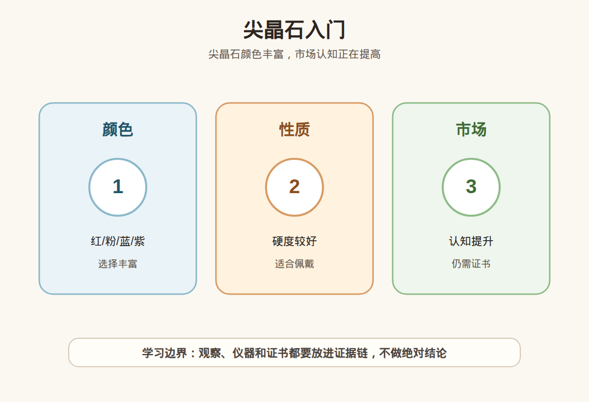

# 第 30 课：尖晶石入门：红粉蓝紫与市场认知

## 1. 本课核心笔记

### 1.1 本课重要结论

这一课先记住 6 个结论：

1. 尖晶石是独立宝石品种，不是红宝石、蓝宝石或“替代品”的别名。
2. 尖晶石历史上常被误认作红宝石，今天消费时更要用证书确认品种。
3. 尖晶石颜色丰富，红、粉、蓝、紫、灰、橙等都有市场讨论，不同颜色的价格逻辑差异很大。
4. 尖晶石常被宣传为相对少处理，但“少处理”不能说成“绝对无处理”，合成尖晶石也很常见。
5. 市场认知提升会带来关注度和价格波动，但不等于所有尖晶石都值得高价购买或能够升值。
6. 高价尖晶石要看天然/合成、品种、颜色、处理备注、产地意见、复检支持和预算匹配。

一句话总结：

> 尖晶石的重点是“独立品种、颜色丰富、市场升温但不神化”；消费时仍要看证书、处理披露和复检。

### 1.2 为什么尖晶石值得单独学

尖晶石很适合放在红宝石、蓝宝石之后学习，因为它既有历史误认，又有现代市场认知变化。许多历史上被称为红宝石的著名红色宝石，后来被确认是尖晶石。这说明一个重要道理：颜色相似不等于品种相同，名称传统不等于检测结论。

近几年尖晶石的市场关注度提高，红色、粉色、霓虹感、蓝色、钴尖晶石等词经常出现。新手容易从“以前被低估”跳到“现在闭眼买”，这也是风险。市场认知提高，只代表更多人开始关注，不代表每一颗都高品质，也不代表未来价格一定上涨。

### 1.3 尖晶石是什么

尖晶石是一个独立矿物和宝石品种，常见化学组成可理解为镁铝氧化物体系。它和刚玉不是同一个矿物，不能因为颜色像红宝石就叫红宝石。

| 概念 | 小白理解 | 消费提醒 |
| --- | --- | --- |
| 尖晶石 | 独立宝石品种 | 证书应明确写 Spinel。 |
| 红宝石 | 红色刚玉 | 红色外观不能区分尖晶石和红宝石。 |
| 合成尖晶石 | 人工生长材料，历史上很常见 | 必须披露，不能按天然尖晶石销售。 |
| 相似红色宝石 | 石榴石、红宝石、玻璃等 | 靠肉眼和照片不做品种判断。 |

尖晶石莫氏硬度约 8，整体耐久性不错，常见于戒指、吊坠、耳饰。但日常佩戴仍要注意镶嵌、尖角、磕碰和清洗方式，不要把“硬度较好”理解成随便造。

### 1.4 颜色丰富：红、粉、蓝、紫不只是好看

尖晶石的颜色范围很宽，不同颜色有不同市场偏好：

| 颜色方向 | 常见吸引点 | 风险提醒 |
| --- | --- | --- |
| 红色 | 容易联想到红宝石，历史故事强 | 必须确认是尖晶石，不要按红宝石话术购买。 |
| 粉色/霓虹粉 | 明亮、年轻化、社交媒体传播强 | 颜色名容易被夸张，实物光源要核对。 |
| 蓝色 | 较少见，钴相关话题热 | “钴尖晶石”要看证书和检测依据。 |
| 紫色/薰衣草色 | 个性强，价格跨度大 | 市场接受度不同，不要只听稀缺。 |
| 灰色/中性色 | 审美小众，设计感强 | 转售和礼物接受度要考虑。 |
| 橙色/橙粉 | 颜色活泼 | 要和帕帕拉恰蓝宝石等概念区分。 |

颜色评价仍然离不开色调、饱和度、明度和均匀度。尖晶石常被夸“火彩”“霓虹感”“绝美糖果色”，这些都是观感词，可以帮助描述喜欢，但不能直接推出天然、无处理、高价值或适合投资。

### 1.5 常被误认红宝石：历史故事与消费边界

尖晶石和红宝石都可能呈现漂亮红色，历史上在现代检测手段不完善时确实有误认。今天学习这个故事，不是为了说尖晶石低人一等，也不是为了说它能替代红宝石，而是为了建立品种意识。

消费时要特别注意三种说法：

1. “老红宝其实是尖晶石，所以尖晶石更值得买。”历史故事不能直接变成购买理由。
2. “这颗像红宝石，价格比红宝石便宜很多。”像不代表同品种，便宜也不代表划算。
3. “尖晶石是红宝平替。”这种说法会模糊尖晶石自己的审美和价值体系。

更稳妥的表达是：尖晶石是独立宝石，有自己的颜色、光泽、历史和市场；购买时看尖晶石本身的品质和证书，不拿红宝石的故事替它定价。

### 1.6 处理叙事：相对少处理，但不能绝对化

市场上常听到“尖晶石通常少处理”。这句话可以作为一个行业印象，但不能变成“尖晶石都无处理”。任何具体宝石都要看证书和检测范围。还要注意合成尖晶石历史悠久，曾大量用于仿制或替代场景。

| 信息点 | 应如何理解 | 消费问题 |
| --- | --- | --- |
| 相对少处理 | 与某些彩宝相比，常见处理讨论较少 | 具体样品仍要看证书 treatment 字段。 |
| 天然尖晶石 | 自然形成的尖晶石 | 证书是否写 natural spinel？ |
| 合成尖晶石 | 人工生长材料 | 是否明确披露？价格是否按合成材料？ |
| 钴尖晶石 | 与钴致色或颜色描述相关的市场热点 | 证书是否支持相关说法？ |
| 产地 | 缅甸、坦桑尼亚、越南等故事常见 | 产地意见需要证书，不是价值保证。 |

如果商家说“尖晶石基本没处理，所以不用看证书”，这本身就是红线。处理少不代表证书不重要，因为证书还要确认天然/合成、品种、重量尺寸和样品匹配。

### 1.7 市场认知变化：关注度不等于保值承诺

尖晶石从“被误认”到“被重新认识”，确实有很强的内容传播点。红色尖晶石、霓虹粉、绝地尖晶石、钴蓝尖晶石等词，会让人觉得正在赶上一轮市场变化。新手要把“市场认知提升”和“个人购买安全”分开。

| 市场说法 | 可以参考的部分 | 需要警惕的部分 |
| --- | --- | --- |
| 被低估 | 说明过去认知度可能较低 | 不代表现在价格一定便宜。 |
| 认知提升 | 说明讨论度增加 | 不代表每颗都值得高价。 |
| 稀缺颜色 | 某些颜色确实供应有限 | 稀缺不等于美、不等于适合你。 |
| 投资收藏 | 可能用于营销高品质稀缺样品 | 新手不应接受升值承诺。 |

彩宝流动性、审美趋势和买卖价差都很复杂。把尖晶石作为喜欢的佩戴宝石，可以重点看颜色、证书和预算；把它当投资标的，就超出了小白学习范围。

### 1.8 尖晶石证书要读什么

| 字段 | 应看内容 | 新手提醒 |
| --- | --- | --- |
| Species / Variety | Spinel | 确认不是 ruby、garnet、glass 或合成描述含糊。 |
| Natural / Synthetic | 天然或合成 | 合成尖晶石必须披露。 |
| Color | 红、粉、蓝、紫等描述 | 颜色名不能替代实物和处理备注。 |
| Weight / Measurements | 重量、尺寸、形状 | 证书样品要与实物匹配。 |
| Treatment / Comments | 处理备注或限制说明 | “少处理”叙事仍要看字段。 |
| Origin | 产地意见 | 有些证书提供，有些不提供；不是价值保证。 |
| Special Terms | cobalt、Jedi 等相关说法 | 要看机构是否支持，不接受单纯口播。 |

高价尖晶石建议看权威证书并支持复检。尤其是红色、霓虹粉、蓝色或主打特殊名称的样品，更要确认天然/合成和颜色描述。

### 1.9 易混点

- “像红宝石”不等于“红宝石”：尖晶石有自己的品种和价值体系。
- “尖晶石少处理”不等于“这颗无处理”：具体样品仍要看证书。
- “市场变热”不等于“买了会涨”：不做升值承诺。
- “钴蓝”不等于随口可用：要看证书或检测依据。
- “颜色霓虹”不等于天然高价：光源、拍摄、饱和度和证书都要核对。
- “硬度 8”不等于不用保养：戒指仍要避开硬碰硬和不当维修。

### 1.10 消费红线

1. 高价尖晶石没有权威证书，不买。
2. 商家用“尖晶石不用看处理”来拒绝证书，不买。
3. 天然/合成不说清楚，不买。
4. 把尖晶石包装成“红宝石平替必涨”，不买。
5. 特殊颜色名或“钴”相关说法没有证书支持，不买。
6. 不支持复检或复检不符没有书面方案，不买。

## 2. 必背知识卡

### 卡片 1：独立品种

尖晶石是独立宝石品种，不是红宝石或蓝宝石的别名。证书应明确写 Spinel。

### 卡片 2：历史误认

尖晶石历史上常被误认为红宝石，说明颜色相似不能代替检测和证书。

### 卡片 3：颜色范围

尖晶石颜色丰富，红、粉、蓝、紫、灰、橙等都有市场讨论，颜色名要结合实物和证书。

### 卡片 4：处理叙事

尖晶石相对少处理的说法不能绝对化。天然/合成、处理备注和样品匹配仍要看证书。

### 卡片 5：市场认知

市场关注度提高不等于所有尖晶石都值得高价，也不等于未来一定升值。

### 卡片 6：购买规则

高价尖晶石要看权威证书、天然/合成、颜色描述、处理备注、复检支持和预算匹配。

## 3. 可交互作业

### 作业 1：品种表达改写

把“这颗尖晶石像红宝石，所以很值”改成更稳妥的小白学习表达。

参考方向：

> 尖晶石和红宝石可能颜色相似，但它们是不同宝石品种。购买时要看证书是否写明天然尖晶石，再看颜色、大小、处理备注、市场价格和复检支持。

### 作业 2：市场话术拆解

看到“尖晶石现在市场很热，买了肯定涨”，列出 4 个反问。

参考方向：

- 这颗的证书是否确认天然尖晶石？
- 颜色、净度、切工和重量是否支撑当前价格？
- 是否有处理或合成风险需要排除？
- 升值承诺是否有书面回购条款，还是单纯营销？

### 作业 3：证书优先级排序

红色尖晶石、蓝色尖晶石、灰色尖晶石三类中，哪类你会更严格要求证书解释颜色和天然/合成？为什么？

参考方向：

- 高价、热门、特殊颜色名越多，越需要证书降低信息不对称。
- 蓝色或“钴”相关说法要看检测依据。
- 灰色等小众颜色也要确认品种，但市场话术压力可能不同。

## 4. 自媒体内容草稿

### 4.1 图文/短视频标题备选

- 我学珠宝第 30 课：尖晶石不是红宝石平替
- 尖晶石为什么常被误认红宝？小白先看证书
- 尖晶石现在很火，能闭眼买吗？
- 红粉蓝紫尖晶石怎么入门：颜色、处理和市场认知

### 4.2 短视频脚本

今天学珠宝第 30 课：尖晶石。尖晶石不是红宝石的别名，也不是只能当红宝石平替，它是独立宝石品种。

它有一个很有意思的历史点：一些著名红色宝石曾经被误认为红宝石，后来才确认是尖晶石。这提醒我，颜色像不等于品种相同。

尖晶石颜色很丰富，红、粉、蓝、紫、灰都有市场讨论。它常被说相对少处理，但不能说成绝对无处理；合成尖晶石也很常见，所以证书仍然重要。

我现在还是学习者，不做鉴定、估价或产地结论。高价尖晶石要看权威证书、天然/合成、颜色描述、处理备注和复检支持，也不要相信“买了肯定涨”。

### 4.3 图文结构

第 1 页：专属问题

- 尖晶石常被说像红宝石，现在市场变热，还能闭眼买吗？

第 2 页：它是独立品种

- 证书应写 Spinel
- 不是 Ruby 的替代名称
- 红色外观不能判断品种

第 3 页：颜色很多

- 红、粉、蓝、紫、灰、橙
- 霓虹感和特殊颜色名要看实物
- 钴相关说法要看证书

第 4 页：处理叙事别绝对

- 相对少处理不等于绝对无处理
- 合成尖晶石要披露
- 高价仍需复检

第 5 页：市场认知变化

- 关注度提高不等于每颗都贵
- 稀缺不等于适合你
- 不接受升值承诺

第 6 页：红线

- 无证高价不买
- 天然/合成含糊不买
- 特殊颜色名无证不买
- 不支持复检先停

### 4.4 配图、视频与分屏素材

本课已准备发布素材包：

- [尖晶石入门 PNG](../assets/lesson-30/spinel-basics-color-market.png) / [SVG 源文件](../assets/lesson-30/spinel-basics-color-market.svg)
- [第 30 课短视频分镜](../assets/lesson-30/video-shotlist.md)
- [第 30 课分屏视频脚本](../assets/lesson-30/split-screen-script.md)
- [第 30 课图文轮播稿](../assets/lesson-30/carousel-copy.md)

### 4.5 评论区互动问题

你对尖晶石最感兴趣的是红色历史误认、霓虹粉、钴蓝，还是“市场变热还能不能买”？

## 5. 学习档案更新

- 材料状态：已备课，待学习。
- 本课主题：尖晶石入门：红粉蓝紫与市场认知。
- 学习时重点确认：
  - 尖晶石是独立宝石品种，不能当红宝石或蓝宝石别名。
  - 历史误认说明颜色相似不能替代检测。
  - 尖晶石颜色丰富，但颜色名要看证书和实物。
  - 相对少处理不能绝对化，天然/合成和处理备注仍要核对。
  - 市场认知提升不等于升值承诺，高价购买要复检。
- 需要复习：
  - 尖晶石与红宝石、石榴石、合成尖晶石的区分边界。
  - 尖晶石证书中的 species、natural/synthetic、comments 字段。
  - 市场热度与个人购买安全之间的区别。
- 已准备自媒体素材：
  - 关键配图 PNG 和 SVG 源文件。
  - 60-90 秒短视频分镜。
  - 分屏视频脚本。
  - 6 页图文轮播稿。
- 下一课建议：第 31 课：碧玺入门：颜色丰富、帕拉伊巴、处理与预算。
