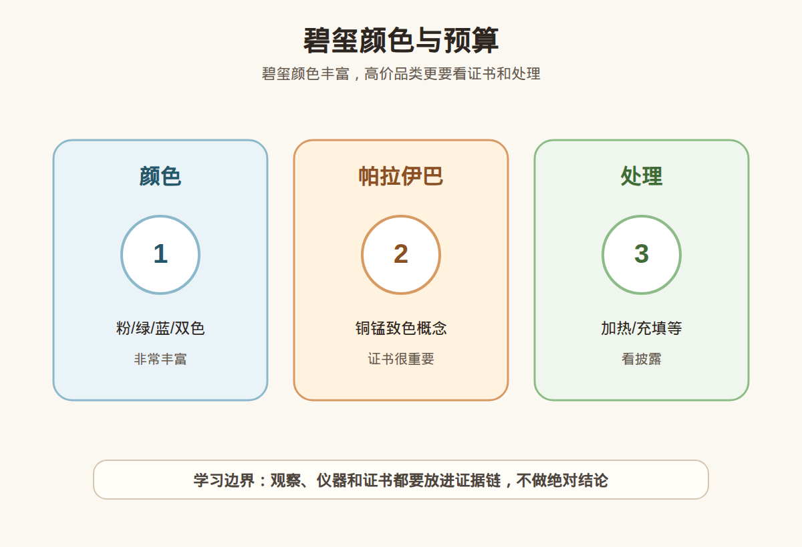

# 第 31 课：碧玺入门：颜色丰富、帕拉伊巴、处理与预算

## 1. 本课核心笔记

### 1.1 本课重要结论

这一课先记住 6 个结论：

1. 碧玺不是一种颜色，而是电气石族宝石的商业常用称呼；它的优势是颜色跨度大，难点也是颜色和名称太多。
2. 粉、红、绿、蓝、双色、西瓜碧玺都可能属于碧玺，但颜色名称不能自动等于高价值。
3. 帕拉伊巴碧玺的核心不是“像霓虹蓝绿”，而是含铜、锰等致色元素并被可靠证书支持；市场溢价很高，误用名称的风险也高。
4. 碧玺常见优化处理包括加热，部分裂隙较多的样品可能有充填或浸油等改善外观的情况，购买时要看披露和证书表述。
5. 碧玺莫氏硬度约 7-7.5，日常佩戴不算娇弱，但裂隙、解理不明显但脆性、细长切形和镶嵌受力都会影响耐久性。
6. 新手预算应先按“普通彩色碧玺、优质单色碧玺、双色/西瓜碧玺、帕拉伊巴”分层，不要用帕拉伊巴的故事去冲动购买普通蓝绿色碧玺。

一句话总结：

> 碧玺好玩在颜色，贵点常在稀少颜色和商业名称；真正花钱时，要把颜色、净度、处理、裂纹、证书和预算放在同一张表里看。

### 1.2 为什么学习碧玺

碧玺是彩色宝石入门里很适合训练“品类边界”的材料。它既有大众价位的粉碧玺、绿碧玺、双色碧玺，也有价格高度敏感的帕拉伊巴碧玺。对学习者来说，这一课要练的不是一眼判断真假，而是把一句销售话术拆成可验证的问题：它是不是电气石族？颜色由什么造成？有没有处理？裂隙对佩戴有什么影响？价格对应的是普通颜色、稀少颜色，还是帕拉伊巴名称溢价？

### 1.3 电气石族：为什么碧玺颜色这么多

碧玺对应矿物学中的电气石族，化学成分复杂，晶体结构中可以容纳多种元素。不同元素组合、价态和生长环境会带来丰富颜色，所以市场上能见到粉色、红色、绿色、蓝色、黄色、褐色、黑色以及多色分带的碧玺。

常见商业颜色可以先这样理解：

| 常见称呼 | 入门理解 | 消费注意 |
| --- | --- | --- |
| 粉碧玺 | 从浅粉到浓粉、玫红都有 | 颜色太浅可能显淡；浓艳、净度好、切工好的更受关注 |
| 红碧玺 / 卢比来 | 偏红到紫红的碧玺 | 名称有商业弹性，仍要看实际颜色、净度和证书 |
| 绿碧玺 | 从黄绿色到深绿色 | 过暗会影响火彩和通透感；不能因为绿色就类比祖母绿价格 |
| 蓝碧玺 | 蓝色或蓝绿色调 | “蓝绿像帕拉伊巴”不等于帕拉伊巴 |
| 双色 / 西瓜碧玺 | 同一晶体有明显颜色分带 | 图案完整、颜色对比和切割方向会影响观感 |
| 黑碧玺 | 常见不透明黑色电气石 | 多为矿物/饰品用途，不能用彩宝逻辑估价 |

碧玺的颜色常常有分带，这也是它的魅力之一。看裸石时不要只看正面照片，最好观察侧面和底部：有些颜色集中在局部，切工把颜色“带”到了台面；也有些石头正面漂亮，侧面能看到明显色带或色根。学习时可以把它当作“颜色分布”训练，不要把局部强色直接理解成整颗都高品质。

### 1.4 帕拉伊巴：铜致色、证书和市场溢价

帕拉伊巴碧玺最容易被误讲。狭义上，它最早因巴西帕拉伊巴州发现的霓虹蓝绿电气石而著名；后来莫桑比克、尼日利亚等地也有含铜、锰的蓝绿色电气石进入市场。今天消费语境中，关键不是卖家说“帕拉伊巴色”，而是证书如何定名、是否检测到铜等致色元素、是否说明产地或不作产地意见。

可把帕拉伊巴相关表述分成三层：

| 表述 | 能说明什么 | 不能说明什么 |
| --- | --- | --- |
| 帕拉伊巴色 | 颜色像霓虹蓝绿，是外观描述 | 不能证明是帕拉伊巴碧玺，也不能证明含铜 |
| 铜致色碧玺 / 含铜碧玺 | 有成分线索，接近专业判断 | 仍要看机构标准、颜色表现、处理和具体名称 |
| Paraiba tourmaline / 帕拉伊巴碧玺证书定名 | 对高价交易最有意义 | 不自动等于巴西产，也不自动等于无处理或顶级品质 |

帕拉伊巴的市场溢价来自稀少性、颜色饱和度、霓虹感、净度、大小、产地叙事和市场需求共同作用。小白最危险的误区是：看到蓝绿色就套用帕拉伊巴价格；或者听到“含铜”就忽略颜色、净度、裂隙和证书限制。高价帕拉伊巴应优先选择能明确宝石名称、颜色/处理信息清楚、可复检的样品；若卖点包括产地，产地意见必须来自能承担相应检测的机构，而不是口头故事。

### 1.5 处理、裂纹与佩戴耐久性

碧玺常见优化中，加热比较需要了解。部分碧玺通过加热改善颜色，例如让颜色更稳定、减弱不理想色调或改善观感。加热并不必然意味着“不能买”，关键是价格是否按处理情况体现，证书和商家是否披露。

更需要警惕的是裂隙相关问题。碧玺晶体常见生长纹、管状包裹体、裂隙和内部应力；某些样品为了改善净度外观，可能出现裂隙充填、浸油、树脂类填充等情况。充填材料可能影响耐久性，也会影响清洗方式和价值判断。

佩戴风险可以这样看：

| 场景 | 风险点 | 建议 |
| --- | --- | --- |
| 戒指日常通勤 | 台面和棱线容易磕碰，裂隙可能延展 | 选择裂少、镶嵌保护好的款式，避免做家务运动时佩戴 |
| 吊坠 / 耳饰 | 磕碰少，磨损低 | 可接受更丰富切形，但仍要避开明显贯穿裂 |
| 细长祖母绿切 / 长柱形 | 尖角和长边受力集中 | 镶嵌时注意包边或保护角位 |
| 多裂大颗粒 | 正面显大但稳定性差 | 不要只按克拉数兴奋，要看裂是否到表面 |
| 充填或疑似浸油 | 清洗、热、化学品可能影响填充物 | 避免超声波、蒸汽清洗和强溶剂 |

碧玺硬度约 7-7.5，抗划伤能力比许多有机宝石和较软彩宝好，但它不是“随便摔”。如果一颗碧玺已经有明显开放裂、边角崩口，做戒指的风险就比做吊坠高。预算有限时，宁可选小一点、裂少、颜色舒服的石头，也不要为了“显大”买裂隙很多的低价大颗。

### 1.6 预算分层和购买红线

购买碧玺可以先按预算目的分层，而不是直接问“哪种最值钱”：

| 预算目标 | 可以关注 | 不建议追求 |
| --- | --- | --- |
| 学习样品 | 普通粉、绿、双色小颗粒；颜色分带明显的标本 | 用学习样品当投资收藏 |
| 日常饰品 | 颜色合眼缘、裂少、镶嵌稳、价格能接受 | 过分追求商业名称 |
| 进阶收藏 | 颜色浓而不黑、净度好、切工好、有可靠证书 | 只看照片饱和度，不看实物暗不暗 |
| 高价帕拉伊巴 | 证书定名、成分依据、处理披露、复检支持 | 口头“帕拉伊巴色”“巴西老矿”就付款 |

红线清单：

1. 把“帕拉伊巴色”当成“帕拉伊巴碧玺”销售，但不能提供相应证书。
2. 高价货没有明确证书编号、样品照片、重量、尺寸和处理说明。
3. 裂隙明显到达表面，却只用“天然冰裂”“不影响佩戴”带过。
4. 只用强灯、滤镜、局部视频展示颜色，不给自然光和不同角度观察。
5. 承诺升值、稀缺到必须马上买，或拒绝合理复检。
6. 对充填、浸油、加热等处理含糊其辞，却按无处理高品质报价。

## 2. 必背知识卡

### 卡片 1：碧玺与电气石族

碧玺是电气石族宝石的常用商业名称。它的颜色丰富来自复杂成分和晶体结构，不是一个单一颜色品种。

### 卡片 2：颜色名称不是价值结论

粉、红、绿、蓝、双色都可能是碧玺。颜色名称只能帮助描述外观，价值还要看色调、饱和度、明度、净度、切工和大小。

### 卡片 3：帕拉伊巴要看证据

帕拉伊巴碧玺不能只凭“霓虹蓝绿”判断。高价交易要看证书定名、铜等致色元素依据、处理说明和复检条件。

### 卡片 4：处理不等于不能买

加热等处理在彩宝中并不少见。关键是是否披露、价格是否匹配，以及处理是否影响稳定性和后续保养。

### 卡片 5：裂纹影响佩戴

碧玺硬度不低，但裂隙、开放裂、边角崩口和细长切形会提高佩戴风险。戒指比吊坠更需要关注裂纹和镶嵌保护。

### 卡片 6：预算先分层

普通彩色碧玺、优质单色碧玺、双色/西瓜碧玺、帕拉伊巴碧玺的预算逻辑不同。不要用高端品类故事推动低信息购买。

## 3. 可交互作业

### 作业 1：概念判断

请判断下面说法是否稳妥，并说明理由：

1. “这颗是帕拉伊巴色，所以就是帕拉伊巴碧玺。”
2. “碧玺硬度 7 以上，做戒指完全不用担心。”
3. “加热碧玺一定不能买。”
4. “同样叫绿碧玺，也要看颜色是否过暗、净度和切工。”

参考方向：

- 第 1 句不稳妥，颜色像不等于证书定名，帕拉伊巴还涉及含铜等致色元素和机构表述。
- 第 2 句不稳妥，硬度主要是抗划伤，裂隙、崩口、镶嵌和佩戴场景仍会影响耐久性。
- 第 3 句过于绝对，处理要看类型、披露和价格；加热本身不等于假货。
- 第 4 句稳妥，同一商业颜色内部差异很大，不能只靠名称判断。

### 作业 2：购买前提问清单

假设你在直播间看到一颗蓝绿色碧玺，卖点是“帕拉伊巴感很强”。请写出至少 5 个购买前问题。

参考方向：

1. 证书上宝石名称写的是什么？有没有 Paraiba tourmaline 或类似定名？
2. 证书是否检测并说明铜、锰等相关元素？
3. 是否有加热、充填、浸油或其他处理披露？
4. 裂隙是否到表面？能否提供自然光、侧面、底部和放大视频？
5. 是否支持到约定机构复检？复检不符如何处理？
6. 价格是按普通蓝绿碧玺、含铜碧玺，还是帕拉伊巴碧玺逻辑报价？

### 作业 3：自媒体表达改写

把这句话改成更稳妥的小白学习表达：

> 这颗碧玺颜色很电光，肯定是帕拉伊巴，买到就是赚到。

建议改写：

> 这颗碧玺呈现比较明亮的蓝绿色，可以作为观察亮点；但是否属于帕拉伊巴碧玺，需要看证书定名、致色元素、处理披露和复检支持。价格较高时，不能只凭颜色和商家描述下结论。

## 4. 自媒体内容草稿

### 4.1 图文/短视频标题备选

- 我学珠宝第 31 课：碧玺不是一种颜色，帕拉伊巴也不是一句话
- 帕拉伊巴色不等于帕拉伊巴：碧玺小白先学这张表
- 买碧玺前先问 6 个问题：颜色、裂纹、处理、证书和预算
- 粉碧玺、绿碧玺、双色碧玺怎么先分层？

### 4.2 短视频脚本

今天学珠宝第 31 课，主题是碧玺。碧玺最吸引人的地方是颜色：粉色、绿色、蓝色、双色，甚至西瓜一样的分带都可能出现。

但颜色多，也代表商业名称很多。比如“帕拉伊巴色”只是外观描述，不能直接等于帕拉伊巴碧玺。真正高价的帕拉伊巴，要看证书定名、是否有铜等致色元素依据、处理说明和复检支持。

再看佩戴。碧玺硬度大约 7 到 7.5，不算软，但如果裂隙多、边角有崩口，做戒指就要谨慎。吊坠和耳饰风险相对低，戒指要更看镶嵌保护。

我的小白购买框架是：普通颜色先看合眼缘和裂少；进阶货看颜色、净度、切工和证书；帕拉伊巴这类高价货，先看证据，再谈预算。不要因为一句“很电光”就冲动付款。

### 4.3 图文结构

第 1 页：标题

- 碧玺入门：颜色丰富、帕拉伊巴、处理与预算

第 2 页：碧玺是什么

- 电气石族宝石的常用商业名称
- 颜色跨度非常大
- 同一颗也可能有颜色分带

第 3 页：帕拉伊巴别只看颜色

- “帕拉伊巴色”是外观描述
- 高价交易要看证书定名
- 关注铜等致色元素和处理披露

第 4 页：处理和裂纹

- 加热不必然不能买
- 充填、浸油要看披露
- 开放裂和崩口影响佩戴

第 5 页：预算分层

- 学习样品：普通颜色、双色小颗
- 日常饰品：裂少、镶嵌稳
- 高价帕拉伊巴：证书和复检优先

第 6 页：红线

- 只说“帕拉伊巴色”没有证书
- 高价拒绝复检
- 裂很多却只强调显大
- 滤镜灯光下只给单角度视频

### 4.4 配图、视频与分屏素材

本课适合用一张颜色与预算分层图做主视觉，再配自然光和强光下的颜色对比。仓库素材包括：

- [碧玺颜色与预算 PNG](../assets/lesson-31/tourmaline-paraiba-budget.png) / [SVG 源文件](../assets/lesson-31/tourmaline-paraiba-budget.svg)
- [第 31 课短视频分镜](../assets/lesson-31/video-shotlist.md)
- [第 31 课分屏视频脚本](../assets/lesson-31/split-screen-script.md)
- [第 31 课图文轮播稿](../assets/lesson-31/carousel-copy.md)

### 4.5 评论区互动问题

你见过“帕拉伊巴色”这个说法吗？如果预算只够买普通碧玺，你会优先选颜色、净度，还是佩戴款式？

## 5. 学习档案更新

- 材料状态：已备课，待学习。
- 本课主题：碧玺入门：颜色丰富、帕拉伊巴、处理与预算。
- 已掌握：
  - 碧玺是电气石族宝石的常用商业名称，颜色范围很宽。
  - 帕拉伊巴碧玺的关键在证书定名、含铜等致色元素依据和处理披露。
  - 加热、充填、浸油等处理要区分看待，披露和价格匹配很重要。
  - 裂隙、开放裂、崩口和镶嵌方式会影响日常佩戴安全。
  - 碧玺预算应按普通彩色、优质单色、双色/西瓜、帕拉伊巴分层。
- 需要复习：
  - 电气石族常见颜色和商业名称。
  - “帕拉伊巴色”“含铜碧玺”“帕拉伊巴碧玺”三种表述的差别。
  - 碧玺裂隙与充填处理对佩戴和清洗的影响。
- 自媒体素材：
  - 本课适合做成 1 条 60-90 秒短视频。
  - 本课适合做成 6 页图文轮播。
  - 本课主图使用碧玺颜色与预算分层素材。
- 下一课建议：石榴石族入门：不只有酒红色。
