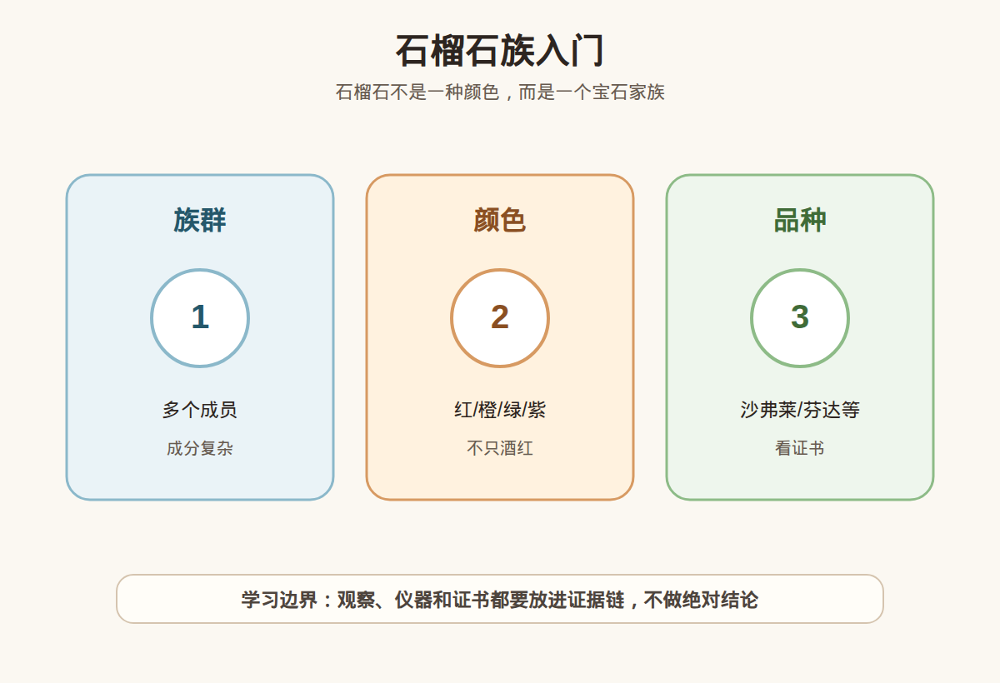

# 第 32 课：石榴石族入门：不只有酒红色

## 1. 本课核心笔记

### 1.1 本课重要结论

这一课先记住 6 个结论：

1. 石榴石不是“酒红色便宜珠子”的同义词，而是一整个宝石族，常见成员包括铁铝榴石、镁铝榴石、锰铝榴石、钙铝榴石、钙铁榴石等。
2. 石榴石的颜色和成分关系很密切：铁、镁、锰、钙、铬、钒等元素组合，会让它呈现红、橙、紫、绿、黄绿等不同外观。
3. 市场上常听到的沙弗莱、翠榴石、芬达石、紫牙乌、马来亚等名称，要回到具体品种和证书表述理解。
4. 石榴石多数情况下处理相对少，但不能绝对化；遇到异常鲜艳、价格异常或高价品种，仍要看证书、处理披露和复检。
5. 石榴石通常无明显解理，硬度多在 6.5-7.5 左右，日常佩戴性相对不错，但不同成员硬度、包裹体和脆性不同。
6. 购买石榴石要先问“是哪一种石榴石”，再谈颜色、净度、大小、切工和预算；不要只用“红色”“绿色”“芬达色”做购买结论。

一句话总结：

> 石榴石是一族宝石，不是一种酒红色；颜色越特别，越要把品种、成分、证书名称和市场叫法拆开看。

### 1.2 为什么学习石榴石族

很多小白第一次接触石榴石，是从深红色手串或低价戒面开始，于是容易形成“石榴石都便宜、都酒红”的印象。实际市场中，优质沙弗莱、翠榴石、芬达色锰铝榴石、紫色镁铝榴石-铁铝榴石系列都可能有很强的消费关注度。学习这一课的价值，是把“颜色印象”升级成“族群思维”：同样叫石榴石，矿物成员、颜色原因、稀少性、净度特征和价格逻辑都可能不同。

### 1.3 族群成员：先把名字分清楚

石榴石族可以用一个通式帮助理解：不同位置被不同阳离子占据，就形成不同端元和过渡成分。入门不用背复杂公式，但要知道它不是单一矿物名称。

常见成员和消费语境如下：

| 成员 / 系列 | 常见颜色 | 常见市场关联 | 入门提醒 |
| --- | --- | --- | --- |
| 铁铝榴石 | 深红、褐红、紫红 | 传统“酒红石榴石”常见 | 颜色过暗会显黑，价格通常更亲民 |
| 镁铝榴石 | 红、紫红、粉紫 | 紫牙乌、部分变色石榴石相关 | 好颜色可很漂亮，不等于低端代名词 |
| 锰铝榴石 | 橙、橙红、橙粉 | “芬达石”常指明亮橙色锰铝榴石 | 颜色鲜亮度和净度很重要 |
| 钙铝榴石 | 绿色、黄绿、无色等 | 沙弗莱属于含铬/钒的绿色钙铝榴石 | 优质绿色品种价格可高，需要证书 |
| 钙铁榴石 | 黄绿、绿色、褐色 | 翠榴石属于绿色钙铁榴石 | 可能有马尾状包裹体，火彩强但高价需谨慎 |
| 钙铬榴石 | 鲜绿 | 多为小颗粒或集合体 | 宝石级大颗少，不要混同沙弗莱 |

石榴石成员之间常有固溶关系，也就是成分不是永远 100% 端元。证书有时会写“石榴石”或具体品种，有时会给商业名称。新手要学会问：证书写的是 garnet、spessartine、grossular、demantoid，还是商家自己写的昵称？

### 1.4 颜色与成分：不只酒红

石榴石颜色丰富，背后是成分和微量元素共同作用。铁常带来红到褐红、暗红；锰常与橙色、橙红色相关；铬和钒能让钙铝榴石呈现鲜绿色，也让沙弗莱成为高关注品种；钙铁榴石中的翠榴石有高色散，切得好会有明显火彩。

颜色评价不能只看“浓”。尤其是红色石榴石，过深会在室内变黑，正面看不到层次。橙色锰铝榴石看重明亮、饱和、不过褐；绿色沙弗莱看重鲜明绿色、净度、切工和大小；翠榴石则常兼看绿色、火彩、大小和典型包裹体，但包裹体不是越多越好。

可以用下面的消费翻译表：

| 颜色表现 | 可能联想到的品种 | 购买时重点 |
| --- | --- | --- |
| 深酒红 | 铁铝榴石、镁铝榴石等 | 避免太黑，注意透明度和切工 |
| 紫红 / 玫紫 | 镁铝-铁铝系列等 | 看颜色是否闷、是否有明显灰调 |
| 明亮橙色 | 锰铝榴石 | 看是否偏褐、净度和证书名称 |
| 鲜绿色 | 沙弗莱、翠榴石、其他绿色石榴石 | 先分清品种，再谈价格 |
| 黄绿 / 褐绿 | 钙铝或钙铁系列 | 不要只听“绿色石榴石”就按沙弗莱估价 |
| 变色现象 | 部分石榴石可见 | 要说明光源条件，不能只靠视频滤镜 |

### 1.5 处理、佩戴和证书边界

石榴石的一个优点，是常见商业样品相对少见大规模处理；许多石榴石以天然颜色进入市场。但这句话必须谨慎：少处理不等于永远无处理，也不等于不用证书。不同产地、不同品种、不同价格层级，风险并不一样。高价沙弗莱、翠榴石、优质锰铝榴石、变色石榴石，仍应有可靠证书。

佩戴方面，石榴石通常无明显解理，硬度大致 6.5-7.5，适合不少日常饰品。相比有明显解理的宝石，它在磕碰方向上少一个典型风险；但它仍可能被更硬材料划伤，也可能因为内部裂隙、尖角切工和镶嵌受力而崩口。戒指和手链要避免与钻石、蓝宝石、金属硬物长期摩擦；吊坠和耳饰更友好。

证书重点：

1. 品种名称：是只写“石榴石”，还是写具体品种或商业名称？
2. 颜色描述：照片和实物是否一致，强光下和自然光下是否差别明显？
3. 处理说明：是否标注未见处理、未检测处理，或有其他备注？
4. 重量尺寸：彩宝价格常随大小变化明显，尤其优质绿色和橙色品种。
5. 复检支持：高价货要能把证书和实物一一对应。

### 1.6 消费边界和红线

石榴石适合小白入门，但也容易被商业名称带节奏。下面这张表可作为购买前快速判断：

| 购买对象 | 可以接受 | 需要谨慎 |
| --- | --- | --- |
| 普通红色石榴石 | 作为日常饰品或学习样品，重点看颜色别太黑 | 把“酒红”“老矿”包装成稀缺高价 |
| 芬达色锰铝榴石 | 颜色明亮、证书清楚、价格在预算内 | 只看橙色滤镜，不看偏褐和净度 |
| 沙弗莱 | 绿色鲜明、切工好、证书写明品种 | 把普通绿色石榴石都叫沙弗莱 |
| 翠榴石 | 火彩好、绿色佳、证书和复检明确 | 用“马尾包体”故事掩盖颜色差或裂多 |
| 变色石榴石 | 明确不同光源下颜色变化 | 只用剪辑视频证明变色，拒绝说明光源 |

红线清单：

1. 只要是绿色石榴石就称为沙弗莱或翠榴石。
2. 只要是橙色就称为芬达石，并按顶级锰铝榴石报价。
3. 用“石榴石都无处理”作为拒绝证书的理由。
4. 高价样品只有美颜视频，没有自然光、暗光、侧面和证书细节。
5. 把包裹体故事当作唯一价值证明，回避颜色、净度和切工。
6. 以“产地稀缺”“收藏级”催促付款，却不支持复检。

## 2. 必背知识卡

### 卡片 1：石榴石是族群

石榴石是一族宝石，不是单一颜色。常见成员包括铁铝、镁铝、锰铝、钙铝、钙铁等石榴石。

### 卡片 2：颜色与成分相关

铁、锰、钙、铬、钒等元素组合会影响颜色。红、橙、绿、紫都可能属于石榴石，但要看具体品种。

### 卡片 3：沙弗莱不是所有绿色石榴石

沙弗莱通常指绿色钙铝榴石，常与铬、钒致色相关。绿色外观不能自动等于沙弗莱。

### 卡片 4：芬达石看明亮橙色

“芬达石”常用于明亮橙色锰铝榴石的商业语境。偏褐、偏暗、净度差都会影响价值。

### 卡片 5：相对少处理但别绝对化

石榴石常见样品相对少处理，但高价品种仍要看证书、处理披露和复检，不能用“都天然”替代证据。

### 卡片 6：佩戴性相对友好

石榴石通常无明显解理，日常佩戴性不错；但硬度不是最高，戒指仍要避免硬碰硬和长期摩擦。

## 3. 可交互作业

### 作业 1：品种判断

请判断下面说法是否准确，并说明理由：

1. “红色的就是石榴石，石榴石就是红色。”
2. “绿色石榴石都可以按沙弗莱报价。”
3. “石榴石相对少处理，所以高价货也不需要证书。”
4. “同样叫石榴石，铁铝、锰铝、钙铝品种的市场逻辑可能完全不同。”

参考方向：

- 第 1 句不准确，石榴石有多种颜色，红色也不一定就是石榴石。
- 第 2 句不准确，绿色石榴石要分沙弗莱、翠榴石、其他绿色品种。
- 第 3 句不稳妥，相对少处理不等于不用证据，高价货仍要证书和复检。
- 第 4 句准确，族群成员、颜色原因和稀少性不同，价格逻辑不同。

### 作业 2：颜色消费分析

你看到三颗石榴石：A 深酒红，室内几乎发黑；B 明亮橙色但有明显裂；C 鲜绿色、证书写 grossular garnet。请分别写出购买前重点。

参考方向：

- A 要关注明度和切工，太暗会影响佩戴观感，不应只听“酒红经典”。
- B 要确认是否锰铝榴石、裂隙是否到表面、价格是否因裂调整。
- C 可进一步确认是否可称沙弗莱、颜色是否自然、净度和证书是否匹配预算。

### 作业 3：自媒体表达改写

把这句话改成更稳妥的小白学习表达：

> 这个绿色石榴石就是沙弗莱，绿色越浓越贵。

建议改写：

> 绿色只是外观线索，是否为沙弗莱要看石榴石的具体品种和证书表述。评价时还要看绿色是否鲜明、是否过暗、净度、切工、大小以及是否支持复检。

## 4. 自媒体内容草稿

### 4.1 图文/短视频标题备选

- 我学珠宝第 32 课：石榴石真的不只酒红色
- 沙弗莱、芬达石、翠榴石：先分清它们都属于谁
- 买石榴石别只问颜色：先问是哪一种石榴石
- “石榴石都便宜”？这一课先把族群讲清楚

### 4.2 短视频脚本

今天学珠宝第 32 课，主题是石榴石族。以前我以为石榴石就是酒红色手串，学完才发现它是一整个宝石族。

铁铝榴石常见深红、褐红；锰铝榴石可以有很明亮的橙色，市场上常听到“芬达石”；钙铝榴石里的优质绿色品种可能叫沙弗莱；钙铁榴石里的绿色品种可能是翠榴石。

所以看到红色、橙色、绿色，都不能直接下结论。绿色不一定是沙弗莱，橙色也不一定就是高品质芬达。要看证书写什么，颜色是否过暗，净度和切工怎么样，价格对应哪个品种。

石榴石的优点是很多样品相对少处理、佩戴性也不错，但不能把这句话说绝对。高价货还是要看证书、支持复检，尤其是沙弗莱、翠榴石、优质锰铝榴石这些更容易被名称影响价格的品种。

### 4.3 图文结构

第 1 页：标题

- 石榴石族入门：不只有酒红色

第 2 页：先记住族群

- 铁铝榴石：常见深红
- 镁铝榴石：红到紫红
- 锰铝榴石：可见明亮橙色
- 钙铝/钙铁：可见绿色高关注品种

第 3 页：颜色不是唯一答案

- 红色可能太暗
- 橙色要看是否偏褐
- 绿色要先分沙弗莱、翠榴石或其他

第 4 页：处理和佩戴

- 石榴石相对少处理
- 但不能说绝对无处理
- 通常无明显解理，佩戴相对友好

第 5 页：购买提问

- 证书写哪个品种？
- 商业名称是谁给的？
- 颜色在自然光下是否稳定？
- 是否支持复检？

第 6 页：红线

- 绿色都叫沙弗莱
- 橙色都叫芬达
- 用“都天然”拒绝证书
- 高价只给滤镜视频

### 4.4 配图、视频与分屏素材

本课适合用族群概览图做主视觉，再配不同颜色石榴石的名称拆解。仓库素材包括：

- [石榴石族入门 PNG](../assets/lesson-32/garnet-group-overview.png) / [SVG 源文件](../assets/lesson-32/garnet-group-overview.svg)
- [第 32 课短视频分镜](../assets/lesson-32/video-shotlist.md)
- [第 32 课分屏视频脚本](../assets/lesson-32/split-screen-script.md)
- [第 32 课图文轮播稿](../assets/lesson-32/carousel-copy.md)

### 4.5 评论区互动问题

你以前印象里的石榴石是什么颜色？如果让你选一颗入门石榴石，你会选酒红、橙色、紫色还是绿色？

## 5. 学习档案更新

- 材料状态：已备课，待学习。
- 本课主题：石榴石族入门：不只有酒红色。
- 已掌握：
  - 石榴石是宝石族群，不是单一酒红色宝石。
  - 铁铝、镁铝、锰铝、钙铝、钙铁等成员有不同颜色和市场逻辑。
  - 沙弗莱、翠榴石、芬达石等商业名称必须回到品种和证书。
  - 石榴石相对少处理，但不能绝对化，高价货仍要证书和复检。
  - 石榴石通常无明显解理，佩戴性相对友好但仍需避免硬碰硬。
- 需要复习：
  - 常见石榴石成员与颜色的对应关系。
  - 沙弗莱、翠榴石、锰铝榴石的消费差异。
  - “相对少处理”和“无需证书”之间的区别。
- 自媒体素材：
  - 本课适合做成 1 条 60-90 秒短视频。
  - 本课适合做成 6 页图文轮播。
  - 本课主图使用石榴石族概览素材。
- 下一课建议：海蓝宝、摩根石与绿柱石家族。
