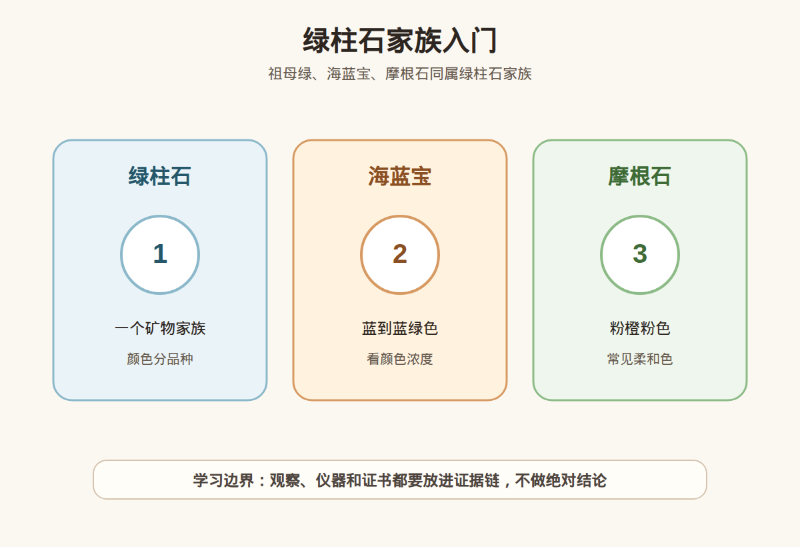

# 第 33 课：海蓝宝、摩根石与绿柱石家族

## 1. 本课核心笔记

### 1.1 本课重要结论

这一课先记住 6 个结论：

1. 祖母绿、海蓝宝、摩根石都属于绿柱石家族，但商业定位、处理方式、耐久性和价格逻辑差异很大。
2. 绿柱石本身是同一矿物家族，颜色差异常与微量元素有关：铬/钒带来祖母绿的绿色，铁与海蓝宝蓝色相关，锰与摩根石粉橙粉色相关。
3. 海蓝宝常见加热以改善蓝色或减弱绿色/黄色调，市场接受度较高，但仍应按披露和价格匹配理解。
4. 摩根石常见柔和粉色、粉橙色，颜色偏淡很常见；购买时不要只看“少女感”，还要看明度、灰调、净度和镶嵌衬色。
5. 祖母绿虽然同属绿柱石，但裂隙、油处理和佩戴风险更特殊，不能用海蓝宝的耐久性经验直接套用。
6. 绿柱石家族适合做佩戴场景训练：海蓝宝、摩根石相对适合日常轻度佩戴，祖母绿戒指要更谨慎，高价都要看证书和处理。

一句话总结：

> 同属绿柱石只说明“亲戚关系”，真正消费要分清祖母绿、海蓝宝、摩根石各自的颜色原因、处理习惯和佩戴风险。

### 1.2 为什么学习绿柱石家族

绿柱石家族是理解“同一矿物家族，不同宝石品种”的好例子。祖母绿可以非常昂贵，海蓝宝给人清透冷静的蓝色印象，摩根石常被设计成温柔粉色珠宝。它们有共同的矿物基础，却进入了不同的市场叙事。学习这一课，目标是避免两个误区：第一，认为同族宝石价格应该接近；第二，认为同族宝石的处理和保养规则完全一样。

### 1.3 绿柱石家族：祖母绿、海蓝宝、摩根石的关系

绿柱石是一类铍铝硅酸盐矿物，宝石级成员因颜色不同形成不同商业品种。入门可以先记这张表：

| 品种 | 常见颜色 | 主要致色理解 | 消费关键词 |
| --- | --- | --- | --- |
| 祖母绿 | 绿色到蓝绿色 | 通常与铬、钒相关 | 裂隙、油处理、证书、颜色和产地叙事 |
| 海蓝宝 | 浅蓝、蓝、蓝绿色 | 铁相关致色 | 颜色浓度、净度、加热、切工 |
| 摩根石 | 粉色、粉橙、桃粉 | 锰相关致色 | 柔和色、常偏淡、镶嵌衬色、是否加热/辐照等披露 |
| 金色绿柱石 | 黄色、金黄色 | 铁等因素 | 与海蓝宝、摩根石市场不同，别混名 |
| 红色绿柱石 | 红色 | 稀少品种 | 市场少见，高价需强证据 |

绿柱石家族的共同点包括硬度约 7.5-8、玻璃光泽、适合切磨成刻面宝石等。但共同点不能覆盖差异。祖母绿常有较多裂隙和充填/浸油处理；海蓝宝常见相对干净的大颗粒；摩根石颜色常柔和，需要设计衬托。学习时要把“矿物家族”与“商业品种”分开。

### 1.4 海蓝宝：颜色、加热和评价重点

海蓝宝的理想颜色通常是明亮、清爽、带一定饱和度的蓝色。很多海蓝宝颜色偏浅，尤其小颗粒在镶嵌后可能更淡；大颗粒更容易呈现颜色。评价海蓝宝时，不要只问克拉数，应该同时看：

| 维度 | 观察重点 | 消费提醒 |
| --- | --- | --- |
| 色调 | 蓝、蓝绿、偏灰蓝 | 偏绿不一定差，但市场常偏好更纯净蓝色 |
| 饱和度 | 颜色浓不浓 | 太浅可能上手存在感弱，强灯视频会放大颜色 |
| 明度 | 是否发暗 | 海蓝宝通常要清亮，过暗会降低清爽感 |
| 净度 | 是否肉眼干净 | 海蓝宝常见较高净度，明显裂隙会影响价格和佩戴 |
| 切工 | 台面、比例、漏光 | 浅色宝石切工差会更显空、显玻璃感 |
| 处理 | 是否加热 | 加热常见且市场接受，但高价仍应披露 |

海蓝宝加热的重点是“常见”而不是“无所谓”。它可能用于改善颜色，让蓝色更稳定或减少绿色、黄色调。多数消费者可以接受经合理披露的加热海蓝宝，但如果卖点是“无烧”“天然浓蓝”“收藏级”，就需要证书和价格逻辑支持。不要把“海蓝宝常加热”理解成所有海蓝宝都加热，也不要把“加热”自动理解成假货。

### 1.5 摩根石与祖母绿：同族不同脾气

摩根石的颜色常见粉色、粉橙色、桃粉色，很多样品颜色柔和甚至偏淡。它在珠宝设计中常搭配玫瑰金来增强暖粉感，所以看裸石和看成品可能差异明显。购买摩根石时要注意：颜色是否灰、是否太浅、切工是否漏光、成品镶嵌是否用金属颜色“托色”。大颗粒摩根石如果干净、颜色舒服，做吊坠和戒指都好看；但日常戒指仍要避免磕碰。

祖母绿则是绿柱石家族里最需要单独对待的成员。祖母绿常见裂隙和包裹体，油处理、树脂或其他充填处理在市场中非常重要。虽然它和海蓝宝同属绿柱石，硬度数字相近，但祖母绿因裂隙和处理更怕磕碰、超声波、蒸汽清洗和强烈温差。把“海蓝宝还挺耐戴”直接套到祖母绿戒指上，是很危险的学习偷懒。

三者对比：

| 项目 | 海蓝宝 | 摩根石 | 祖母绿 |
| --- | --- | --- | --- |
| 常见观感 | 清透蓝色 | 柔和粉橙粉色 | 浓郁绿色 |
| 常见处理关注 | 加热 | 加热、辐照等需看披露 | 浸油、充填等非常关键 |
| 净度期待 | 通常希望较干净 | 通常希望较干净 | 包裹体常见，但裂隙影响大 |
| 佩戴建议 | 日常轻度可行 | 日常轻度可行 | 戒指更谨慎，避免冲击和不当清洗 |
| 购买证书 | 中高价建议 | 中高价建议 | 高价必须重视 |

### 1.6 消费边界和红线

绿柱石家族购买可以按场景决定：

| 场景 | 更适合 | 注意事项 |
| --- | --- | --- |
| 日常通勤戒指 | 海蓝宝、摩根石中裂少且镶嵌保护好的款 | 避免做家务、运动、搬重物时佩戴 |
| 生日礼物 | 颜色讨喜、证书清楚、售后明确的海蓝宝或摩根石 | 不要只选大颗，忽略颜色太淡 |
| 高价收藏 | 优质祖母绿、浓色海蓝宝、优质摩根石等 | 证书、处理、复检和预算边界必须明确 |
| 新手学习样品 | 小颗不同颜色绿柱石 | 用于理解家族关系，不当投资承诺 |

红线清单：

1. 说“祖母绿、海蓝宝、摩根石同属绿柱石，所以价格应该差不多”。
2. 海蓝宝只用强光视频展示颜色，不给自然光、白底和上手效果。
3. 把加热说成“完全不影响价值”，或把加热说成“就是假货”，两种都过度简化。
4. 祖母绿不披露浸油/充填，却按高品质无处理逻辑报价。
5. 摩根石成品只靠玫瑰金托色，裸石本身颜色极淡却卖高价。
6. 高价绿柱石没有证书、拒绝复检，或证书与实物无法对应。

## 2. 必背知识卡

### 卡片 1：绿柱石是家族

祖母绿、海蓝宝、摩根石都属于绿柱石家族，但它们是不同商业品种，价格和风险不能简单相互套用。

### 卡片 2：颜色来自微量元素

祖母绿绿色常与铬/钒相关，海蓝宝蓝色与铁相关，摩根石粉橙粉色与锰相关。颜色名称要结合品种理解。

### 卡片 3：海蓝宝常见加热

海蓝宝常见加热以改善颜色，市场接受度较高；购买时应看披露、证书和价格是否匹配。

### 卡片 4：摩根石常偏淡

摩根石常见柔和粉色或粉橙色。评价时要看是否偏灰、太淡、漏光，以及镶嵌金属是否明显托色。

### 卡片 5：祖母绿要单独谨慎

祖母绿裂隙和浸油/充填处理很关键，不能只凭“同属绿柱石”套用海蓝宝的佩戴经验。

### 卡片 6：场景决定耐久要求

吊坠、耳饰风险较低；戒指更容易碰撞。绿柱石家族成品要按佩戴频率、镶嵌保护和处理情况选择。

## 3. 可交互作业

### 作业 1：关系判断

请判断下面说法是否稳妥，并说明理由：

1. “海蓝宝、摩根石、祖母绿同属绿柱石，所以价值差不多。”
2. “海蓝宝加热很常见，所以不需要问处理。”
3. “祖母绿和海蓝宝硬度接近，佩戴风险也完全一样。”
4. “摩根石成品好看，也要确认裸石颜色是否太淡。”

参考方向：

- 第 1 句不稳妥，同族不等于同价，颜色、稀少性、处理和市场需求都不同。
- 第 2 句不稳妥，常见不等于不用披露，价格和证书仍要对应。
- 第 3 句不准确，祖母绿裂隙和处理更特殊，佩戴和清洗更谨慎。
- 第 4 句稳妥，镶嵌金属和拍摄光线可能增强摩根石粉感。

### 作业 2：佩戴场景选择

请给下面三类宝石选择更合适的佩戴场景，并说明理由：

- A：裂少、颜色清爽的海蓝宝。
- B：颜色很淡但设计漂亮的摩根石。
- C：裂隙明显、疑似经过油处理的祖母绿。

参考方向：

- A 可考虑日常轻度戒指、吊坠或耳饰，但戒指仍要避免磕碰。
- B 更适合作为设计型饰品，购买时价格不应只按“大颗粉色”理解。
- C 更适合谨慎佩戴，吊坠风险低于戒指，清洗和维修必须避免不当方式。

### 作业 3：自媒体表达改写

把这句话改成更稳妥的小白学习表达：

> 海蓝宝加热很正常，所以只要颜色蓝就可以买。

建议改写：

> 海蓝宝加热较常见，市场接受度也较高，但购买仍要看颜色是否自然耐看、净度和切工是否合格、证书和处理披露是否清楚，以及价格是否符合预算。

## 4. 自媒体内容草稿

### 4.1 图文/短视频标题备选

- 我学珠宝第 33 课：海蓝宝、摩根石和祖母绿原来是亲戚
- 同属绿柱石，为什么祖母绿和海蓝宝不能按一个逻辑买？
- 海蓝宝常见加热，摩根石常偏淡：绿柱石小白课
- 买海蓝宝前别只问蓝不蓝，还要看这 5 点

### 4.2 短视频脚本

今天学珠宝第 33 课，主题是绿柱石家族。祖母绿、海蓝宝、摩根石其实是同一个矿物家族里的不同宝石品种。

它们的共同点是都属于绿柱石，但差异非常大。祖母绿靠绿色出名，裂隙和油处理很关键；海蓝宝是蓝到蓝绿色，常见加热来改善颜色；摩根石是粉色、粉橙色，很多样品颜色比较柔和，镶嵌后会被金属颜色衬托。

所以同族不等于同价，也不等于同样耐戴。海蓝宝、摩根石可以考虑日常轻度佩戴，但戒指还是要避免磕碰。祖母绿尤其要注意裂隙、处理和清洗方式。

我的购买问题是：证书写什么品种？有没有处理披露？颜色在自然光下够不够？裂隙会不会影响佩戴？如果是高价，是否支持复检？

### 4.3 图文结构

第 1 页：标题

- 海蓝宝、摩根石与绿柱石家族

第 2 页：它们是亲戚

- 祖母绿：绿色绿柱石
- 海蓝宝：蓝到蓝绿色绿柱石
- 摩根石：粉色到粉橙色绿柱石

第 3 页：颜色和处理

- 海蓝宝常见加热
- 摩根石常见柔和色
- 祖母绿常见浸油/充填讨论

第 4 页：别把经验套错

- 同族不等于同价
- 同硬度不等于同耐久
- 祖母绿要单独谨慎

第 5 页：佩戴场景

- 海蓝宝：日常轻度可行
- 摩根石：看颜色和设计
- 祖母绿：戒指更谨慎

第 6 页：红线

- 高价无证书
- 处理不披露
- 强光下才显色
- 用同族关系解释高价

### 4.4 配图、视频与分屏素材

本课适合用家族关系图做主视觉，再配三种品种的颜色与处理对照。仓库素材包括：

- [绿柱石家族入门 PNG](../assets/lesson-33/beryl-family-aquamarine-morganite.png) / [SVG 源文件](../assets/lesson-33/beryl-family-aquamarine-morganite.svg)
- [第 33 课短视频分镜](../assets/lesson-33/video-shotlist.md)
- [第 33 课分屏视频脚本](../assets/lesson-33/split-screen-script.md)
- [第 33 课图文轮播稿](../assets/lesson-33/carousel-copy.md)

### 4.5 评论区互动问题

你更喜欢海蓝宝的清爽蓝，还是摩根石的柔和粉？你以前知道它们和祖母绿属于同一个家族吗？

## 5. 学习档案更新

- 材料状态：已备课，待学习。
- 本课主题：海蓝宝、摩根石与绿柱石家族。
- 已掌握：
  - 祖母绿、海蓝宝、摩根石都属于绿柱石家族。
  - 微量元素差异会形成不同颜色和商业品种。
  - 海蓝宝常见加热，需看披露和价格匹配。
  - 摩根石颜色常柔和偏淡，设计和镶嵌会影响观感。
  - 祖母绿裂隙和油处理重要，不能套用海蓝宝佩戴逻辑。
- 需要复习：
  - 绿柱石家族主要品种与颜色关系。
  - 海蓝宝加热、祖母绿浸油、摩根石颜色偏淡的消费含义。
  - 不同佩戴场景对耐久性的要求。
- 自媒体素材：
  - 本课适合做成 1 条 60-90 秒短视频。
  - 本课适合做成 6 页图文轮播。
  - 本课主图使用绿柱石家族入门素材。
- 下一课建议：金绿宝石、亚历山大石和猫眼效应。
