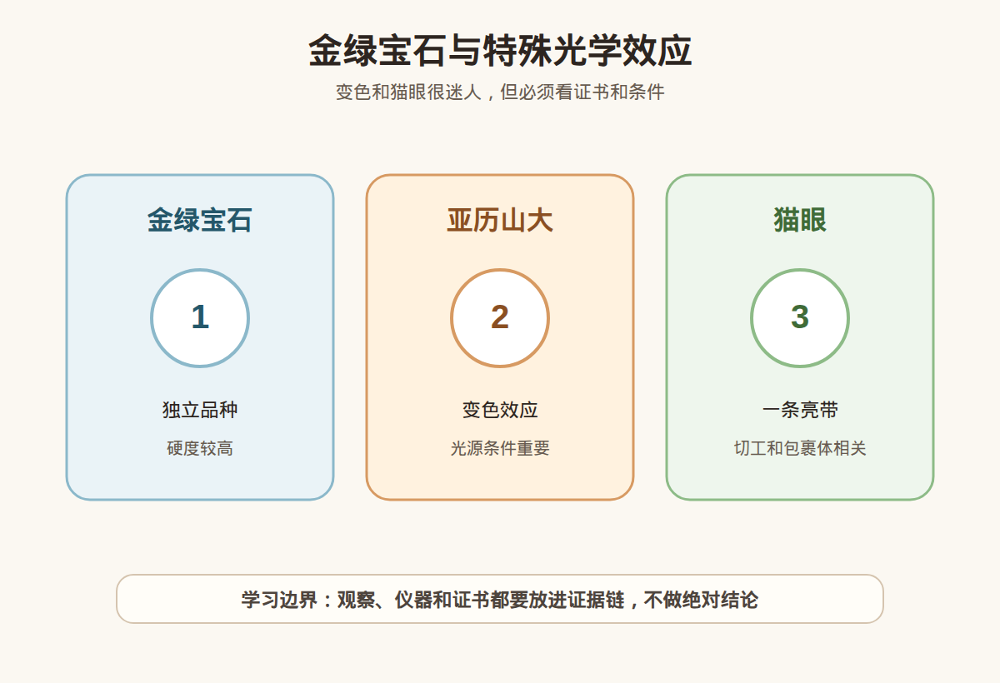

# 第 34 课：金绿宝石、亚历山大石和猫眼效应

## 1. 本课核心笔记

### 1.1 本课重要结论

这一课先记住 6 个结论：

1. 金绿宝石是独立矿物品种，英文 chrysoberyl，不是绿柱石 beryl；名字相似但矿物不同。
2. 普通金绿宝石、亚历山大石、金绿宝石猫眼属于同一矿物体系中的不同市场品类，价值重点完全不同。
3. 亚历山大石以变色效应著名，必须说明光源条件；“会变色”只是线索，不等于天然亚历山大石。
4. 猫眼效应来自平行排列的针状、管状或纤维状内含物与弧面切工共同作用；亮带要集中、清晰、移动灵活。
5. 金绿宝石硬度约 8.5，耐磨性较好，但高价亚历山大石和猫眼仍怕错误镶嵌、冲击和不当清洗。
6. 这个品类高价、稀少、仿冒和合成风险都高，证书不是加分项，而是交易前提。

一句话总结：

> 金绿宝石课的核心是“别被名字和光学效果带跑”：变色、猫眼都要看成因、光源、切工、天然/合成和证书。

### 1.2 为什么学习金绿宝石

金绿宝石很适合训练两个高级消费问题：第一，名字相似但矿物完全不同，金绿宝石不是绿柱石；第二，特殊光学效应会强烈影响价格，却也最容易被视频、灯光、仿冒材料和合成样品利用。亚历山大石和金绿宝石猫眼的市场门槛高，小白不应把这类品种当作“凭眼缘捡漏”的对象。

### 1.3 金绿宝石：先分清它不是绿柱石

金绿宝石的中文名容易让人误会，以为它和上一课的绿柱石家族有关。实际上：

| 中文名 | 英文 | 矿物关系 | 常见宝石品类 |
| --- | --- | --- | --- |
| 绿柱石 | beryl | 铍铝硅酸盐 | 祖母绿、海蓝宝、摩根石 |
| 金绿宝石 | chrysoberyl | 铍铝氧化物 | 普通金绿宝石、亚历山大石、金绿宝石猫眼 |

金绿宝石硬度约 8.5，折射率较高，耐磨性不错。普通黄色、黄绿色、绿色金绿宝石也可作为刻面宝石使用，但市场知名度最高的是两类特殊品种：亚历山大石和金绿宝石猫眼。学习时要避免把“金绿宝石”当成“带金色的绿柱石”，也不要把所有猫眼宝石都自动等同于金绿宝石猫眼。

### 1.4 亚历山大石：变色效应不是一句“会变色”

亚历山大石是含铬的变色金绿宝石，以不同光源下颜色变化著名。经典描述常说日光或日光等效光下偏绿，白炽灯或暖光下偏红到紫红，但实际样品变化范围很大，可能是蓝绿到紫红、绿到褐红、灰绿到紫灰等。评价时要记录光源，而不是只说“变色明显”。

变色要看三个维度：

| 维度 | 观察方式 | 消费含义 |
| --- | --- | --- |
| 颜色端点 | 日光/冷白光下是什么色，暖光下是什么色 | 端点颜色越悦目，市场认可度通常越高 |
| 变化强度 | 两种光源下差异是否明显 | 只是轻微偏色，不应按强变色报价 |
| 净度与大小 | 是否裂多、是否肉眼明显瑕疵 | 亚历山大石稀少，大颗干净更罕见 |

仿冒风险包括：变色玻璃、变色合成刚玉、合成亚历山大石、其他天然变色宝石。视频里用不同白平衡、强滤镜、灯光切换，也能夸大颜色变化。所以高价亚历山大石必须看权威证书，并确认样品重量、尺寸、照片和证书一致。如果卖点包括产地，产地意见更应谨慎。

### 1.5 猫眼效应：亮带、弧面切工和天然风险

猫眼效应是宝石表面出现一条集中亮带，随光源或宝石移动而移动，像猫眼瞳孔。它通常需要内部有大量平行排列的细小内含物，再配合弧面切工，让反射集中成线。不是所有有亮线的宝石都叫金绿宝石猫眼，石英、磷灰石、碧玺、透辉石等也可能有猫眼效应。

评价金绿宝石猫眼可以看“五点”：

| 观察点 | 好的表现 | 需要谨慎 |
| --- | --- | --- |
| 眼线 | 细、直、居中、明亮 | 宽散、断裂、偏边 |
| 开合 | 光源移动时眼线灵活开合 | 眼线死板或只在特定角度出现 |
| 蜜糖感 / 体色 | 体色均匀悦目 | 底色浑浊、灰暗或杂色重 |
| 弧面比例 | 高度和底部比例让眼线集中 | 太扁导致眼线弱，太厚显笨重 |
| 重量与净度 | 大小、完整度和表面状态匹配价格 | 裂隙、坑洞、底部处理不清 |

金绿宝石猫眼的“牛奶与蜜糖”效果常被提及：一侧偏乳白光感，一侧偏蜜糖色，随光源移动变化。但这个描述不能替代证书。高价猫眼要确认它是金绿宝石猫眼，而不是其他猫眼宝石；还要确认天然、处理、重量和切工情况。

### 1.6 消费边界、合成仿冒和红线

金绿宝石相关消费风险比普通入门彩宝更高，原因是：特殊效果强、价格高、天然大颗稀少、合成技术和替代材料存在、普通消费者难以凭肉眼分辨。购买边界可以这样设定：

| 品类 | 可以学习观察 | 高价购买前必须确认 |
| --- | --- | --- |
| 普通金绿宝石 | 颜色、净度、切工、硬度优势 | 证书名称是否为 chrysoberyl |
| 亚历山大石 | 两种光源下颜色变化 | 天然/合成、变色强度、处理、证书和复检 |
| 金绿宝石猫眼 | 眼线质量、弧面切工、体色 | 是否为金绿宝石猫眼、天然性、是否处理、证书 |
| 其他猫眼宝石 | 猫眼效应训练 | 不要按金绿宝石猫眼价格理解 |

红线清单：

1. 只凭“会变色”就认定亚历山大石。
2. 只凭“一条亮线”就认定金绿宝石猫眼。
3. 高价样品没有权威证书，或证书不含清晰照片、重量、尺寸对应。
4. 卖家用单一灯光视频展示变色，不说明光源类型。
5. 把合成亚历山大石、变色玻璃或其他猫眼材料包装成天然高价货。
6. 用“老矿、皇家、收藏级、稀缺捡漏”催促付款，同时拒绝复检。
7. 猫眼底部、侧面不展示，无法判断弧面比例、裂隙和抛光质量。

## 2. 必背知识卡

### 卡片 1：金绿宝石不是绿柱石

金绿宝石是 chrysoberyl，绿柱石是 beryl。二者名字相似，但矿物不同，不能混为一个家族。

### 卡片 2：亚历山大石看光源

亚历山大石以变色效应著名。描述变色必须说明光源条件，不能只用“会变色”判断天然或价值。

### 卡片 3：猫眼效应需要结构和切工

猫眼效应通常来自平行内含物与弧面切工共同作用。眼线要看是否细直、明亮、居中和灵活。

### 卡片 4：不是所有猫眼都是金绿宝石猫眼

多种宝石都可能有猫眼效应。金绿宝石猫眼是具体品类，高价时必须由证书确认。

### 卡片 5：合成和仿冒风险高

亚历山大石和猫眼品类存在合成、仿冒和替代材料。肉眼观察只能作为学习线索，不能替代检测。

### 卡片 6：证书是交易前提

高价金绿宝石、亚历山大石和猫眼必须看证书、复检和样品对应信息。没有证据，不谈收藏级。

## 3. 可交互作业

### 作业 1：概念判断

请判断下面说法是否准确，并说明理由：

1. “金绿宝石和绿柱石名字差不多，应该是同一个家族。”
2. “这颗宝石会变色，所以一定是天然亚历山大石。”
3. “有猫眼亮带的宝石都可以叫金绿宝石猫眼。”
4. “亚历山大石展示时应该说明光源条件。”

参考方向：

- 第 1 句不准确，金绿宝石和绿柱石是不同矿物。
- 第 2 句不准确，变色玻璃、合成亚历山大石、其他变色宝石都可能造成混淆。
- 第 3 句不准确，猫眼效应可见于多种宝石，金绿宝石猫眼需要证书确认。
- 第 4 句准确，没有光源条件的变色描述不完整。

### 作业 2：猫眼观察练习

看到一颗“金绿猫眼”戒面，商家只给正面强光视频。请列出至少 5 个补充信息要求。

参考方向：

1. 证书是否写明 chrysoberyl cat's eye 或相应金绿宝石猫眼名称？
2. 能否提供自然光、单点光源和不同角度视频？
3. 眼线是否居中、细直、连续，移动时是否灵活？
4. 底部和侧面是否有裂隙、坑洞或异常处理痕迹？
5. 重量、尺寸、弧面高度和镶嵌遮挡情况如何？
6. 是否支持复检，复检不符如何处理？

### 作业 3：自媒体表达改写

把这句话改成更稳妥的小白学习表达：

> 这颗灯一照会从绿变红，肯定是顶级亚历山大，赶紧买。

建议改写：

> 这颗宝石表现出变色现象，可以作为重要观察线索；但是否为天然亚历山大石、变色强度如何、是否合成或仿冒，都需要在明确光源条件下观察，并结合权威证书和复检判断。

## 4. 自媒体内容草稿

### 4.1 图文/短视频标题备选

- 我学珠宝第 34 课：金绿宝石不是绿柱石
- 会变色就一定是亚历山大石吗？先看光源和证书
- 一条亮线不等于金绿宝石猫眼：猫眼效应入门
- 亚历山大石和猫眼为什么不能靠视频捡漏？

### 4.2 短视频脚本

今天学珠宝第 34 课，主题是金绿宝石、亚历山大石和猫眼效应。

先纠正一个名字误区：金绿宝石不是绿柱石。绿柱石是祖母绿、海蓝宝、摩根石那个家族；金绿宝石是 chrysoberyl，是另一个矿物。

金绿宝石里最有名的两个方向，一个是亚历山大石，一个是金绿宝石猫眼。亚历山大石看变色，但必须说明光源。只说会变色，不足以证明天然，也不足以证明高价值。

猫眼效应则要看内部平行结构和弧面切工，好的眼线要细、直、亮、居中，还要能随光移动。更关键的是，不是所有猫眼宝石都是金绿宝石猫眼。

这类品种高价、稀少，也有合成和仿冒风险。我的结论很简单：学习可以看效果，高价购买必须看证书和复检。

### 4.3 图文结构

第 1 页：标题

- 金绿宝石、亚历山大石和猫眼效应

第 2 页：先分清名字

- 绿柱石：beryl
- 金绿宝石：chrysoberyl
- 名字像，不是同一种矿物

第 3 页：亚历山大石

- 重点是变色效应
- 必须说明光源条件
- 会变色不等于天然高价

第 4 页：猫眼效应

- 平行内含物 + 弧面切工
- 眼线看细、直、亮、居中
- 多种宝石都可能有猫眼

第 5 页：证书重点

- 天然还是合成
- 是否为金绿宝石
- 重量尺寸是否对应
- 变色/猫眼描述是否清楚

第 6 页：红线

- 只凭视频变色付款
- 一条亮线就叫金绿猫眼
- 高价无证书
- 拒绝复检还催促捡漏

### 4.4 配图、视频与分屏素材

本课适合用特殊光学效应图做主视觉，再用冷光/暖光和单点光源演示观察边界。仓库素材包括：

- [金绿宝石与特殊光学效应 PNG](../assets/lesson-34/chrysoberyl-alexandrite-catseye.png) / [SVG 源文件](../assets/lesson-34/chrysoberyl-alexandrite-catseye.svg)
- [第 34 课短视频分镜](../assets/lesson-34/video-shotlist.md)
- [第 34 课分屏视频脚本](../assets/lesson-34/split-screen-script.md)
- [第 34 课图文轮播稿](../assets/lesson-34/carousel-copy.md)

### 4.5 评论区互动问题

你更想看亚历山大石的变色演示，还是猫眼效应的单点光源演示？你以前会把金绿宝石和绿柱石混在一起吗？

## 5. 学习档案更新

- 材料状态：已备课，待学习。
- 本课主题：金绿宝石、亚历山大石和猫眼效应。
- 已掌握：
  - 金绿宝石是 chrysoberyl，不是绿柱石 beryl。
  - 亚历山大石的变色效应必须结合光源条件描述。
  - 猫眼效应需要内部平行结构和弧面切工共同表现。
  - 不是所有猫眼宝石都是金绿宝石猫眼。
  - 亚历山大石和猫眼存在合成、仿冒和替代材料风险，高价必须看证书。
- 需要复习：
  - 金绿宝石和绿柱石的英文与矿物差异。
  - 变色效应的观察条件和表述方法。
  - 猫眼效应的眼线评价维度。
- 自媒体素材：
  - 本课适合做成 1 条 60-90 秒短视频。
  - 本课适合做成 6 页图文轮播。
  - 本课主图使用金绿宝石与特殊光学效应素材。
- 下一课建议：欧泊入门：变彩、保养和拼合风险。
