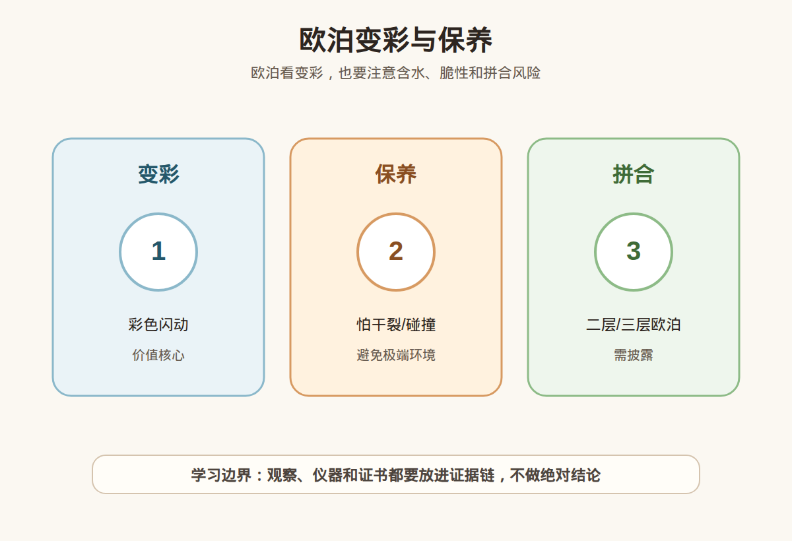

# 第 35 课：欧泊入门：变彩、保养和拼合风险

## 1. 本课核心笔记

### 1.1 本课重要结论

这一课先记住 6 个结论：

1. 欧泊是一类含水的非晶质二氧化硅材料，最迷人的特征是变彩，但并非所有欧泊都有强变彩。
2. 黑欧泊、白欧泊、火欧泊、晶质欧泊、砾背欧泊等类型，底色、透明度、变彩和价格逻辑都不同。
3. 欧泊价值不能只看“花不花”，还要看变彩亮度、色彩范围、图案、底色、透明度、厚度、裂纹、处理和是否拼合。
4. 二层、三层拼合欧泊必须明确披露；拼合不等于不能买，但价格、耐久性和保养边界要不同对待。
5. 欧泊相对怕干燥开裂、强温差、碰撞和化学品，超声波、蒸汽清洗、酒精/酸碱清洁剂都应避免。
6. 新手购买欧泊要优先问类型、天然/拼合/处理、变彩稳定性、裂纹、证书和售后，不要被“越花越值钱”一句话带跑。

一句话总结：

> 欧泊的美在变彩，风险在结构、含水和处理；买之前要分清类型、拼合、注胶/染色和保养边界。

### 1.2 为什么学习欧泊

欧泊和许多刻面彩宝不同，它不是靠透明度和火彩取胜，而是靠内部结构造成的变彩效果吸引人。它也不像钻石、蓝宝石那样适合粗放佩戴。欧泊的消费课必须同时讲审美和风险：黑欧泊可能因为深色底衬托出强变彩而价格高；白欧泊常见柔和底色；火欧泊可以橙红鲜艳但不一定有变彩；拼合欧泊看起来漂亮却属于组合结构。学习这一课，是为了把“好看”拆成类型、结构、处理和保养问题。

### 1.3 变彩：欧泊为什么会闪彩

欧泊的变彩来自内部微小二氧化硅球粒有序排列，对光产生衍射和干涉，从而出现随角度变化的彩色闪动。不是所有欧泊都有变彩：普通欧泊可能没有明显变彩，火欧泊可能以橙红体色为主，珍贵欧泊才以明显变彩作为核心卖点。

评价变彩可以看以下维度：

| 维度 | 好的表现 | 需要谨慎 |
| --- | --- | --- |
| 亮度 | 彩色在普通光下也醒目 | 只有强光下才闪，日常很弱 |
| 色彩范围 | 红、橙、黄、绿、蓝、紫等多色丰富 | 只有单一弱绿点或灰暗色 |
| 图案 | 色块、针点、闪电、滚彩等有特点 | 图案散乱且不连续 |
| 覆盖面积 | 正面大面积有变彩 | 只有局部小角度出现 |
| 方向性 | 多角度都有表现 | 只有一个角度能拍出效果 |
| 底色衬托 | 底色让变彩更突出 | 底色浑浊、发灰或裂纹明显 |

“越花越值钱”是过度简化。欧泊价值还受类型、产地、厚度、形状、裂纹、处理、是否拼合、整体美感影响。红色变彩常受关注，但如果亮度弱、裂纹多、只是薄薄一层，未必比亮度好的绿色/蓝色组合更适合购买。

### 1.4 黑欧泊、白欧泊、火欧泊和其他类型

欧泊类型很多，新手先掌握几类常见消费名称：

| 类型 | 入门理解 | 消费重点 |
| --- | --- | --- |
| 黑欧泊 | 底色较深，变彩常被衬得更强 | 优质黑欧泊稀少高价，需证书和复检 |
| 白欧泊 / 浅色欧泊 | 底色白、乳白或浅色 | 变彩可能柔和，价格跨度大 |
| 火欧泊 | 黄色、橙色、橙红体色 | 不一定有变彩，透明度和体色很重要 |
| 晶质欧泊 | 透明到半透明 | 看透明度、变彩和裂纹 |
| 砾背欧泊 | 与母岩相连，常见于澳洲材料 | 厚度、天然背岩和稳定性要看清 |
| 拼合欧泊 | 薄欧泊层与底托/盖层组合 | 必须披露，价格不能按整块天然欧泊理解 |

黑欧泊的“黑”通常指底色较深，并不是整颗必须漆黑。深色底能让变彩更鲜明，所以高品质黑欧泊价格可能很高。白欧泊常见柔和观感，适合喜欢低调的人。火欧泊容易被误解：它的重点可能是橙红体色，而不是变彩；有些火欧泊有变彩，有些没有。不要看到橙色就问“为什么不闪”，也不要看到闪彩就忽略是否拼合。

### 1.5 拼合、注胶、染色和保养风险

欧泊常见的消费风险集中在结构和处理。二层欧泊通常由薄欧泊层加深色底托组成；三层欧泊在上方还可能加透明盖层。拼合可以让薄层欧泊呈现更强视觉效果，价格也更友好，但它不是整块天然欧泊，耐久性和价值逻辑不同。

处理与风险表：

| 情况 | 可能目的 | 消费含义 |
| --- | --- | --- |
| 二层/三层拼合 | 增强外观、利用薄欧泊层 | 必须披露，避免泡水、强温差和化学品 |
| 染色 | 改变底色或增强对比 | 影响价值和稳定性，高价应警惕 |
| 注胶/树脂处理 | 改善裂隙或稳定性 | 可能怕热、怕溶剂，需证书说明 |
| 烟熏/糖酸处理 | 改变颜色或底色 | 必须披露，不能按天然优质黑欧泊理解 |
| 表面涂层 | 改善光泽或外观 | 可能磨损或受化学品影响 |

保养方面，欧泊含水且结构相对敏感。它怕的不是“正常佩戴时碰到一滴水就坏”，而是长期干燥、突然温差、强热、碰撞、化学品和不当清洗。不要把欧泊长期放在暴晒窗边、暖气口、除湿盒旁；不要戴着洗澡、泡温泉、游泳、做饭或接触香水、酒精、洗洁精；不要用超声波和蒸汽清洗。

### 1.6 消费边界和红线

欧泊购买前可以按下面顺序提问：

1. 它是哪类欧泊：黑欧泊、白欧泊、火欧泊、晶质欧泊、砾背欧泊，还是拼合欧泊？
2. 是否天然整体，还是二层/三层拼合？底托和盖层是什么？
3. 是否有染色、注胶、烟熏、糖酸、涂层等处理？证书如何表述？
4. 变彩在自然光、室内光、不同角度下是否稳定？
5. 是否有裂纹、干裂、表面坑洞或边缘脱层？
6. 成品佩戴位置是否合适，售后和复检如何安排？

红线清单：

- 把二层、三层拼合欧泊当作整块天然欧泊销售。
- 只展示强光下最闪的角度，不给普通室内光和多角度视频。
- 欧泊已经有明显干裂或边缘分层，却说“不影响佩戴”。
- 用“黑欧泊”名称包装染色、烟熏或深色底托效果，拒绝说明处理。
- 承诺欧泊可以随便戴、随便洗，推荐超声波清洗。
- 高价黑欧泊、强变彩欧泊没有证书或拒绝复检。

佩戴建议：欧泊更适合吊坠、耳饰、胸针等低碰撞位置；戒指可以佩戴，但更适合偶尔戴、保护性镶嵌和温和场景。预算有限时，拼合欧泊可以作为审美入门选择，但必须按拼合价格买，并接受它的保养限制。

## 2. 必背知识卡

### 卡片 1：欧泊是含水非晶质二氧化硅

欧泊不是普通透明刻面彩宝，它的结构和含水特征让它美丽，也让它对干燥、热和化学品更敏感。

### 卡片 2：变彩不等于全部价值

变彩要看亮度、色彩范围、图案、覆盖面积、方向性和底色。不是越花越值钱，也不是所有欧泊都有强变彩。

### 卡片 3：黑欧泊、白欧泊、火欧泊逻辑不同

黑欧泊看深色底和强变彩，白欧泊常柔和，火欧泊重体色且不一定变彩。类型不同，不能直接比价。

### 卡片 4：拼合必须披露

二层、三层拼合欧泊是组合结构。可以购买，但不能按整块天然欧泊理解，保养和价格都应不同。

### 卡片 5：处理要问清楚

染色、注胶、烟熏、糖酸、涂层等处理会影响价值和稳定性。高价欧泊要看证书和复检。

### 卡片 6：保养避开极端环境

欧泊要避免强温差、暴晒、长期干燥、碰撞、香水酒精、酸碱清洁剂、超声波和蒸汽清洗。

## 3. 可交互作业

### 作业 1：概念判断

请判断下面说法是否准确，并说明理由：

1. “欧泊越花越值钱。”
2. “火欧泊一定有强变彩。”
3. “二层、三层欧泊不能买，所以都算假货。”
4. “欧泊戒指可以戴，但要接受比吊坠更高的磕碰风险。”

参考方向：

- 第 1 句过度简化，还要看亮度、图案、底色、厚度、裂纹、处理和类型。
- 第 2 句不准确，火欧泊常重橙红体色，不一定有变彩。
- 第 3 句不准确，拼合欧泊可以购买，但必须披露，价格和保养按拼合逻辑。
- 第 4 句准确，戒指位置更容易磕碰，欧泊需要更谨慎佩戴。

### 作业 2：保养方案判断

下面哪些做法不适合欧泊？请说明理由。

1. 戴欧泊戒指泡温泉。
2. 用超声波清洗欧泊吊坠。
3. 把欧泊长期放在暖气口旁边。
4. 偶尔用柔软湿布轻轻擦拭表面，再自然阴干。

参考方向：

- 1 不适合，温泉的温度和化学成分都可能带来风险。
- 2 不适合，超声波可能影响裂隙、拼合层或处理材料。
- 3 不适合，长期干燥和热环境可能增加开裂风险。
- 4 相对温和，但仍应避免浸泡和强力摩擦，具体看是否拼合或处理。

### 作业 3：自媒体表达改写

把这句话改成更稳妥的小白学习表达：

> 这颗欧泊特别花，肯定是顶级黑欧泊，而且越戴越亮。

建议改写：

> 这颗欧泊的变彩看起来明显，但是否属于黑欧泊、是否天然整体、有没有拼合或处理，还需要看底色、厚度、裂纹、证书和多角度表现。欧泊佩戴要避开干燥、温差、碰撞和化学品，不能承诺越戴越亮。

## 4. 自媒体内容草稿

### 4.1 图文/短视频标题备选

- 我学珠宝第 35 课：欧泊好看，但真的不能随便戴
- 黑欧泊、白欧泊、火欧泊：先分类型，再看变彩
- 欧泊越花越值钱？这句话少说了 6 个条件
- 二层三层欧泊是什么？拼合不等于不能买，但必须披露

### 4.2 短视频脚本

今天学珠宝第 35 课，主题是欧泊。欧泊最迷人的地方是变彩，就是角度一变，会看到彩色闪动。

但欧泊不能只用“花不花”判断价值。要看变彩亮不亮，颜色多不多，图案好不好，覆盖面积大不大，还要看底色、厚度、裂纹、类型和处理。

黑欧泊、白欧泊、火欧泊的逻辑也不同。黑欧泊靠深色底衬托变彩，白欧泊更柔和，火欧泊可能重点是橙红体色，不一定有强变彩。

还有一个重点是拼合。二层、三层欧泊不是不能买，但必须披露，价格不能按整块天然欧泊算，保养也要更谨慎。

欧泊要避开强温差、长期干燥、碰撞和化学品，不要超声波、不要蒸汽清洗。喜欢它的美，也要接受它的脾气。

### 4.3 图文结构

第 1 页：标题

- 欧泊入门：变彩、保养和拼合风险

第 2 页：变彩看什么

- 亮度
- 色彩范围
- 图案
- 覆盖面积
- 多角度表现

第 3 页：先分类型

- 黑欧泊：深色底衬托变彩
- 白欧泊：浅色柔和
- 火欧泊：橙红体色，不一定强变彩

第 4 页：拼合和处理

- 二层/三层必须披露
- 注胶、染色、烟熏、糖酸要问清
- 拼合不等于不能买，但价格不同

第 5 页：保养边界

- 避免干燥和强温差
- 避免碰撞和化学品
- 不用超声波和蒸汽清洗

第 6 页：红线

- 拼合当整块天然卖
- 只给强光最佳角度
- 已干裂还说不影响
- 高价无证书拒复检

### 4.4 配图、视频与分屏素材

本课适合用变彩与保养图做主视觉，再配多角度变彩和拼合结构示意。仓库素材包括：

- [欧泊变彩与保养 PNG](../assets/lesson-35/opal-play-of-color-care.png) / [SVG 源文件](../assets/lesson-35/opal-play-of-color-care.svg)
- [第 35 课短视频分镜](../assets/lesson-35/video-shotlist.md)
- [第 35 课分屏视频脚本](../assets/lesson-35/split-screen-script.md)
- [第 35 课图文轮播稿](../assets/lesson-35/carousel-copy.md)

### 4.5 评论区互动问题

你喜欢黑欧泊的强烈变彩，还是白欧泊的柔和闪彩？如果买欧泊，你能接受拼合欧泊作为入门选择吗？

## 5. 学习档案更新

- 材料状态：已备课，待学习。
- 本课主题：欧泊入门：变彩、保养和拼合风险。
- 已掌握：
  - 欧泊是含水非晶质二氧化硅，变彩来自内部结构对光的作用。
  - 黑欧泊、白欧泊、火欧泊、晶质欧泊、砾背欧泊和拼合欧泊逻辑不同。
  - 欧泊价值要看变彩亮度、图案、底色、厚度、裂纹、处理和类型。
  - 二层、三层拼合欧泊必须披露，不能按整块天然欧泊理解。
  - 欧泊要避开干燥、温差、碰撞、化学品、超声波和蒸汽清洗。
- 需要复习：
  - 变彩评价的六个维度。
  - 欧泊常见类型和拼合结构。
  - 染色、注胶、烟熏、糖酸等处理的消费含义。
- 自媒体素材：
  - 本课适合做成 1 条 60-90 秒短视频。
  - 本课适合做成 6 页图文轮播。
  - 本课主图使用欧泊变彩与保养素材。
- 下一课建议：托帕石、坦桑石、锆石入门：易混点与保养。
