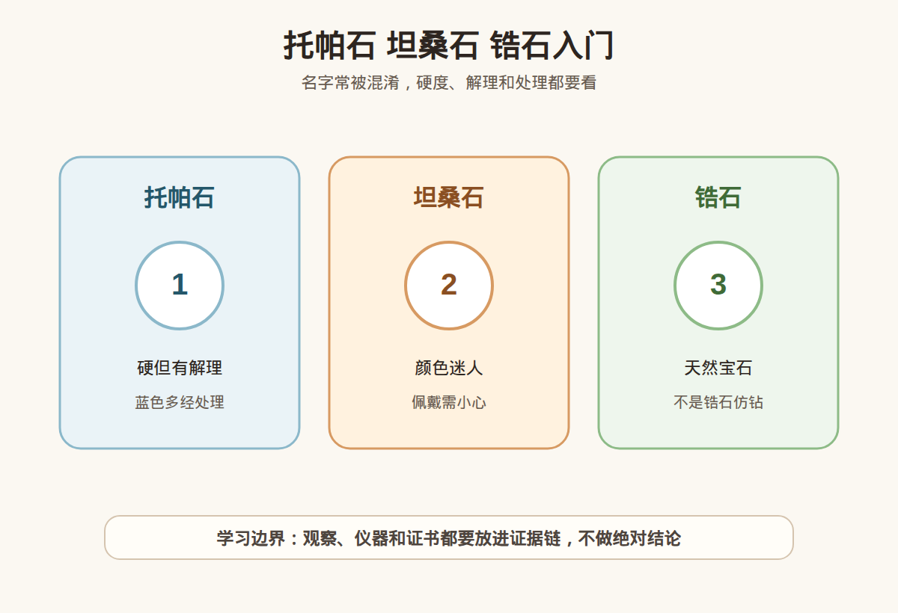

# 第 36 课：托帕石、坦桑石、锆石入门：易混点与保养

## 1. 本课核心笔记

### 1.1 本课重要结论

这一课先记住 6 个结论：

1. 托帕石、坦桑石、锆石是三类不同宝石，不能因为都可能呈蓝色、都能切成刻面，就把名称和价值逻辑混在一起。
2. 蓝色托帕石在市场上非常常见，常见成因是无色或浅色托帕石经过辐照、加热后获得稳定蓝色；这类处理应被如实说明。
3. 托帕石莫氏硬度约 8，抗划伤能力不错，但有一组完全解理，戒指、手链等容易磕碰的位置要特别谨慎。
4. 坦桑石是蓝紫色黝帘石，商业上热处理常见；硬度约 6-7，日常耐久性不如蓝宝石，更适合吊坠、耳饰或低频戒指。
5. 天然锆石色散高、火彩强，外观上容易被新手拿来和钻石比较，但它不是合成立方氧化锆，也不是钻石。
6. 购买这三类宝石时，材料名称、处理说明、证书字段、佩戴场景和售后规则要同时看，不能只听一个好听卖点。

一句话总结：

> 托帕石看处理和解理，坦桑石看热处理、颜色与耐久性，锆石要和钻石及立方氧化锆分清；新手可以学习观察，但高价购买必须回到证书、复检和佩戴风险。

### 1.2 为什么把这三种宝石放在一课

托帕石、坦桑石、锆石的共同难点不是它们真的很像，而是商业表达里经常把“蓝”“闪”“像钻”这类视觉感受放大。新手如果只看直播灯光和商品标题，很容易把不同层面的信息混在一起：材料名称、颜色成因、处理状态、耐久性、价格定位，本来应该分开确认，却被一句“高级蓝”“火彩像钻”“天然宝石”带过去。

这一课的学习目标是建立三个动作：第一，先确认它到底是什么材料；第二，追问颜色和外观是否经过常见处理；第三，把佩戴场景放进决策。宝石可以漂亮，也可以有处理；处理不必然等于不能买，但隐瞒处理、错写名称、把耐久性说得过满，都会让消费风险变高。

### 1.3 托帕石：蓝色常见，但不要误读成天然稀缺

托帕石的矿物名称常译为黄玉，英文 Topaz。它可以有无色、蓝色、黄色、橙色、粉色等颜色。入门消费里最常遇到的是蓝色托帕石，例如 Sky Blue、Swiss Blue、London Blue 等商业色调名称。蓝托帕价格跨度很大，但普通蓝托帕并不是“因为天然蓝色极稀有所以必然昂贵”的逻辑。

蓝色托帕石要记住两件事：其一，市场上大量蓝色托帕石与辐照、加热处理有关；其二，证书写“托帕石”只能说明材料类别，不能自动证明颜色天然成因。购买时应把“颜色是否处理”作为正常问题提出，而不是等付款后才发现商品描述和心理预期不一致。

托帕石的另一个关键是解理。它硬度约 8，比石英高，日常抗划伤能力不错；但托帕石有一组完全解理，受力方向不合适时可能劈裂。戒指、手链、叠戴和运动场景最容易让宝石边角受力。吊坠、耳饰受到撞击少，通常更适合新手。

| 项目 | 入门理解 | 购买时怎么问 |
| --- | --- | --- |
| 材料名称 | 托帕石/黄玉是独立宝石材料 | 证书名称写什么？是否与商品标题一致？ |
| 蓝色来源 | 蓝色常与辐照、加热有关 | 商家是否说明颜色处理？证书备注如何写？ |
| 耐久性 | 硬度较高，但有完全解理 | 是否适合做戒指？镶嵌能否保护边角？ |
| 价格逻辑 | 普通蓝托帕不宜按天然稀缺故事理解 | 价格主要对应尺寸、颜色、净度、切工还是品牌？ |
| 保养 | 防摔、防撞，避免高温和粗暴清洗 | 退换、维修、改圈、掉石规则是否写清？ |

托帕石表达红线：不把“天然托帕石”直接说成“天然蓝色托帕石”；不把“硬度 8”包装成“随便戴都不会坏”；不在没有证书和处理说明时，把高饱和蓝色讲成稀有收藏级；不建议用划玻璃、划金属等破坏方式验证硬度。

### 1.4 坦桑石：蓝紫色迷人，但耐久性要降一档看

坦桑石是蓝紫色黝帘石，因坦桑尼亚产地和商业推广而被大众熟悉。它的吸引力来自蓝、紫之间的色调变化，切磨好的坦桑石在不同光线下会有很强的颜色情绪。新手容易把它与蓝宝石放在同一个购物框里比较，但两者的矿物、硬度、稳定性、价格体系都不同。

坦桑石热处理非常常见，常用于改善或稳定蓝紫色外观。听到热处理不必立刻否定，但要确认商家是否如实说明，证书或商品页是否有对应备注，价格是否按处理后的商业品质成交。真正需要警惕的是把常见处理说成神秘稀缺，把普通颜色讲成顶级收藏。

坦桑石莫氏硬度约 6-7，日常佩戴要比蓝宝石温柔。它可以做戒指，但不建议新手把高价坦桑石戒指当成每日通勤、运动、做家务都不摘的耐造款。吊坠和耳饰更少碰撞，通常更友好。

| 维度 | 观察重点 | 消费边界 |
| --- | --- | --- |
| 颜色 | 蓝紫比例、饱和度、明暗 | 不只看一张强光图，最好看自然光和室内光 |
| 净度 | 裂隙、包体、台面干净度 | 明显裂隙会影响耐久和价格 |
| 切工 | 亮度、漏光、形状比例 | 颜色深不等于切工好 |
| 处理 | 热处理常见 | 商品描述、证书备注和销售话术要一致 |
| 佩戴 | 吊坠、耳饰优先；戒指需保护 | 避免撞击、蒸汽、超声波和高温骤变 |

### 1.5 锆石：天然锆石不是立方氧化锆，也不是钻石

锆石英文 Zircon，是天然宝石矿物。立方氧化锆英文 Cubic Zirconia，常缩写 CZ，是人工合成材料，常被用作钻石仿制品。中文里“锆石”两个字被混用，是许多误会的来源。准确说法应该分清：天然锆石是自然界形成的宝石矿物；合成立方氧化锆是人工材料；钻石则是碳元素宝石。三者不是同一种东西。

天然锆石色散高，切磨好的无色锆石火彩强，视觉上可能很闪。它也常有较高双折射，放大观察时刻面棱线可能出现重影。锆石硬度约 6-7.5，不同类型和状态有所差异，日常耐磨性不如钻石、蓝宝石、红宝石。蓝色锆石也常与热处理有关，购买时同样要问清。

| 名称 | 本质 | 入门辨别重点 | 消费提醒 |
| --- | --- | --- | --- |
| 天然锆石 | 天然宝石矿物 | 色散高，部分样品可见双折射表现 | 不是“假钻”的同义词 |
| 合成立方氧化锆 | 人工合成材料 | 常作钻石仿品，价格低 | 不应冒充天然锆石或钻石销售 |
| 钻石 | 天然或培育碳元素宝石 | 硬度 10，分级体系成熟 | 不能只凭火彩判断 |
| 蓝色托帕石 | 托帕石材料 | 常见辐照、加热蓝色 | 颜色商业名不等于天然稀缺 |
| 坦桑石 | 蓝紫色黝帘石 | 颜色蓝紫，硬度偏低 | 热处理常见，佩戴要温柔 |

### 1.6 保养、购买清单与消费边界

这三类宝石都可以购买和佩戴，但新手要把“好看”和“适合”分开。购买前至少确认 6 件事：商品名称是否清楚；证书是否对应实物；处理信息是否说明；佩戴场景是否匹配；售后是否写清；预算是否和风险承受能力一致。

日常保养可以这样记：托帕石防磕碰，尤其注意台面边角和腰棱；坦桑石避免撞击、骤冷骤热、蒸汽和超声波；锆石避免与更高硬度宝石混放，注意刻面磨花和镶口松动。清洁时优先使用温和肥皂水、软刷和软布，不把“能清洗”理解成“能粗暴清洗”。

消费红线：不说“蓝托帕都是天然蓝，所以贵”；不说“坦桑石就是蓝宝石平替，性质差不多”；不说“锆石就是便宜假钻”；不靠短视频画面给单颗石头做真假、处理、产地或价格结论；不承诺“越大越保值”“买了会升值”。

## 2. 必背知识卡

### 卡片 1：蓝色托帕石

市场常见蓝托帕多与辐照、加热处理有关。处理常见不等于不能买，但应如实说明，价格也应按相应市场逻辑理解。

### 卡片 2：托帕石解理

托帕石硬度约 8，抗划伤能力不错，但有完全解理。戒指、手链、叠戴和运动场景要防磕碰。

### 卡片 3：坦桑石热处理

坦桑石热处理常见，常用于改善或稳定蓝紫色。购买重点是材料名称、处理说明、颜色品质、证书和价格是否匹配。

### 卡片 4：坦桑石耐久性

坦桑石硬度约 6-7，日常耐久性不如蓝宝石。更推荐吊坠、耳饰；做戒指时要接受低频佩戴和保护性镶嵌。

### 卡片 5：天然锆石

天然锆石是独立天然宝石矿物，色散高、火彩强；它不是合成立方氧化锆，也不是钻石。

### 卡片 6：易混点处理

遇到相似外观或相似名字，先问材料名称、处理状态、证书字段、复检支持和售后规则。

## 3. 可交互作业

### 作业 1：三种宝石匹配题

请把下面消费描述对应到更需要重点关注的宝石，并说明理由：1. “颜色很蓝，商家说是天然托帕石，没有提颜色处理。”2. “蓝紫色很漂亮，想做每天戴的戒指。”3. “主播说锆石就是假钻，所以天然锆石不值得了解。”4. “预算不高，想买一件好看的吊坠，能接受常见处理。”

参考方向：第 1 条重点看托帕石，追问蓝色是否与辐照、加热有关；第 2 条重点看坦桑石耐久性，戒指要低频和保护镶嵌；第 3 条重点看锆石概念，天然锆石与合成立方氧化锆不同；第 4 条可以考虑蓝托帕、小件坦桑石或锆石吊坠，但要把处理、硬度、镶嵌和售后写入决策。

### 作业 2：购买追问清单

你在直播间看到一枚“伦敦蓝托帕戒指”，价格不低，主播强调“蓝得很高级”。请写出至少 5 个购买前问题。

参考方向：证书材料名称和编号能否核验；蓝色是否经过辐照、加热；主石尺寸、重量、镶嵌和裂隙情况；托帕石有解理，售后是否覆盖运输损伤、掉石和改圈风险；是否支持到货复检；价格是按材质、设计、品牌还是稀缺故事定价。

### 作业 3：自媒体表达改写

把这三句话改成更稳妥的小白学习表达：“蓝托帕这么蓝，一定很稀有。”“坦桑石就是便宜版蓝宝石。”“锆石都是假钻，不用学。”

参考改写：蓝托帕市场上很常见，蓝色常与辐照、加热处理有关，是否值得买要看证书、处理说明、品质和价格；坦桑石和蓝宝石是不同宝石，颜色可能都偏蓝，但硬度、耐久性和评价体系不同；天然锆石是独立宝石矿物，合成立方氧化锆才是常见钻石仿品之一。

## 4. 自媒体内容草稿

### 4.1 图文/短视频标题备选

- 我学珠宝第 36 课：蓝托帕、坦桑石、锆石别再混着讲
- 蓝托帕为什么常提处理？小白买之前先问这 5 件事
- 坦桑石很美，但真的适合天天戴戒指吗？
- 天然锆石不是立方氧化锆：一个名字误会讲清楚

### 4.2 短视频脚本

今天学珠宝第 36 课，我把三个容易混淆的宝石放在一起记：托帕石、坦桑石和锆石。蓝色托帕石很常见，很多蓝色来自辐照和加热处理；坦桑石蓝紫色漂亮，热处理也常见，但硬度约 6-7，不适合粗暴高频佩戴；天然锆石色散高、火彩强，却不是合成立方氧化锆，也不是钻石。我现在还是学习者，不对单件货做真假和估价结论。真正购买时，我会先确认材料名称、处理说明、证书、复检和售后，再决定是否下单。

### 4.3 图文结构

第 1 页：蓝托帕、坦桑石、锆石：三个小白易混点。第 2 页：蓝托帕常见辐照、加热，硬度高但有解理。第 3 页：坦桑石热处理常见，硬度偏低，适合温柔佩戴。第 4 页：天然锆石不是立方氧化锆，也不是钻石。第 5 页：购买清单：材料名称、处理说明、证书核验、佩戴场景、复检和售后。第 6 页：红线：不把蓝色说成天然稀缺，不把坦桑石说成蓝宝石替代品，不把天然锆石说成假钻。

### 4.4 配图与视频建议

本课保留这组基础视觉素材：

- [托帕石 坦桑石 锆石入门 PNG](../assets/lesson-36/topaz-tanzanite-zircon-care.png) / [SVG 源文件](../assets/lesson-36/topaz-tanzanite-zircon-care.svg)
- [第 36 课短视频分镜](../assets/lesson-36/video-shotlist.md)
- [第 36 课分屏视频脚本](../assets/lesson-36/split-screen-script.md)
- [第 36 课图文轮播稿](../assets/lesson-36/carousel-copy.md)

### 4.5 评论区互动问题

你以前有没有把“天然锆石”和“立方氧化锆”混在一起？如果你想买蓝色宝石，更在意颜色、耐久性，还是价格透明？

## 5. 学习档案更新

- 材料状态：已备课，待学习。
- 本课主题：托帕石、坦桑石、锆石入门：易混点与保养。
- 已掌握：蓝色托帕石常与辐照、加热处理有关；托帕石硬度较高但有完全解理；坦桑石热处理常见，硬度偏低；天然锆石色散高但不是钻石，也不是合成立方氧化锆。
- 需要复习：三种宝石的矿物名称、常见处理、耐久性差异，以及如何把“好看”转化成材料、证书、处理、佩戴场景和售后问题。
- 自媒体素材：本课适合做 1 条 60-90 秒短视频和 6 页图文轮播，表达时避免“假钻”“平替”“天然稀缺”等过度简化词作为结论。
- 下一课建议：珍珠入门：海水、淡水、Akoya、南洋和大溪地。
