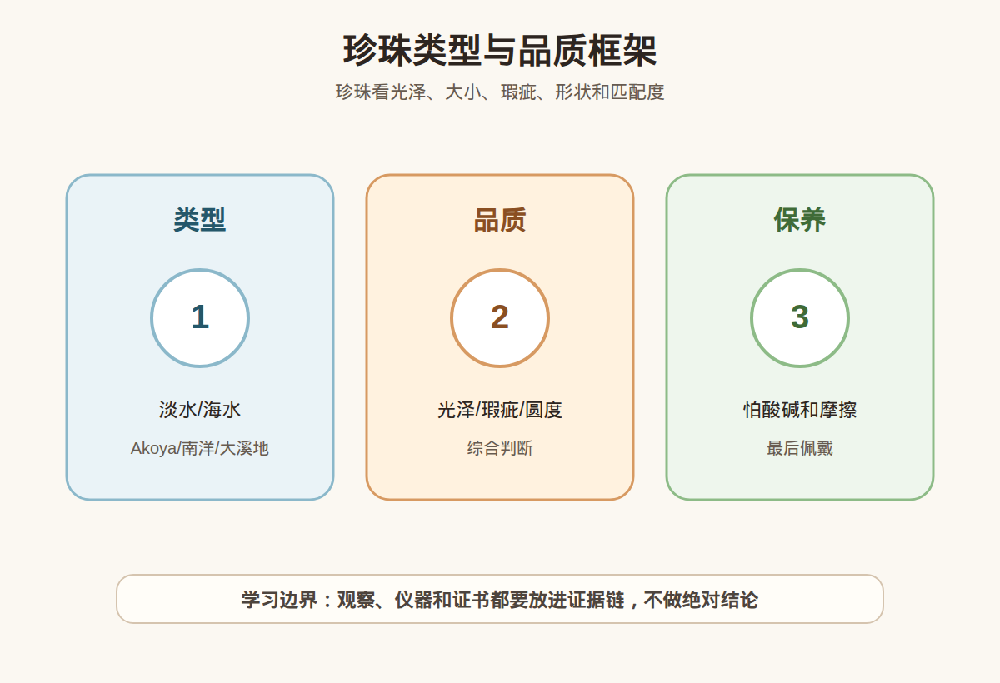

# 第 37 课：珍珠入门：海水、淡水、Akoya、南洋和大溪地

## 1. 本课核心笔记

### 1.1 本课重要结论

这一课先记住 6 个结论：

1. 珍珠是生物成因珠宝材料，评价逻辑和钻石、彩色宝石、翡翠都不一样。
2. 现在市场上的珍珠以养殖珍珠为主，天然珍珠非常少见；“养殖”不是低级词，而是主流供给方式。
3. 入门分类要先分淡水珍珠和海水珍珠，再理解 Akoya、南洋珠、大溪地珠等常见商业类型。
4. 珍珠品质不能只看圆不圆或大不大，还要看光泽、表皮、瑕疵、形状、颜色、大小和成串匹配度。
5. 珍珠含碳酸钙和有机质，怕酸、汗液、香水、强摩擦，也怕长期过度干燥。
6. 珍珠购买的安全边界是：低预算重佩戴，高预算重证书、匹配度、售后和保养，不把单一类型名当价值结论。

一句话总结：

> 珍珠看类型，更看光泽、表皮和匹配；养殖珍珠是市场主流，购买时要把美感、耐久、证书和保养规则一起纳入判断。

### 1.2 为什么珍珠要单独学习

前面学矿物宝石时，我们经常讨论硬度、折射率、解理、色散等概念。珍珠不一样，它来自贝类的生物活动，外层由一层层珍珠质组成。它的美感不是火彩越强越好，而是光泽、晕彩、表皮和整体协调感共同形成。

新手买珍珠常见的问题有三类：把海水珍珠理解成一定比淡水珍珠好；只看大小，不看光泽和表皮；买项链时只看单颗照片，不看整串颜色、大小、光泽和瑕疵是否匹配。这一课要把珍珠从“白白圆圆的珠子”拆成可提问、可比较、可保养的购买框架。

### 1.3 海水、淡水、Akoya、南洋、大溪地：先分类型，再看品质

珍珠分类可以很复杂，入门先抓住市场最常见的几个词。淡水珍珠多产于淡水贝类，形状、颜色、大小范围广，近年高品质淡水珠也可以很漂亮。海水珍珠包括 Akoya、南洋珠、大溪地珠等常见类型，不同类型有不同尺寸、颜色和审美方向。

| 类型 | 常见理解 | 典型特点 | 消费提醒 |
| --- | --- | --- | --- |
| 淡水珍珠 | 多产于淡水贝类 | 形状、颜色、大小范围广 | 不要因为“淡水”两个字直接判低端 |
| Akoya 珍珠 | 常见海水珍珠类型 | 常以较强光泽和经典白色系被熟知 | 重点看光泽、瑕疵和成串匹配 |
| 南洋珍珠 | 海水珍珠，常见白色、金色等 | 通常尺寸较大，气质华丽 | 大不等于好，表皮和光泽同样重要 |
| 大溪地珍珠 | 海水珍珠，常见黑、灰、绿等晕彩 | 颜色丰富，常有金属感或孔雀色调 | 颜色名不能替代证书和实物观察 |
| 异形珠 | 包括巴洛克等特殊形态 | 设计感强，审美差异大 | 要看结构、镶嵌和佩戴需求 |

海水和淡水是生长环境和养殖体系差异，不是绝对高低。低品质海水珠可能光泽弱、瑕疵明显；高品质淡水珠也可能非常细腻漂亮。真正比较时，要回到具体珠子，而不是比较标签。

### 1.4 珍珠品质：光泽是灵魂，匹配度决定整件首饰观感

珍珠常见评价维度可以用“光、皮、形、色、大、配”来记。光泽看表面反光是否明亮、锐利、有层次；表皮看点、坑、皱、划痕、斑；形状看圆、近圆、椭圆、巴洛克等；颜色看白、粉、银、金、黑、绿和晕彩；大小看毫米数；匹配度看项链或耳饰中多颗珍珠是否协调。

| 维度 | 看什么 | 入门判断 | 容易踩的坑 |
| --- | --- | --- | --- |
| 光泽 | 反光是否明亮、清晰、有层次 | 好光泽会让佩戴更显精神 | 只看强灯视频，忽略自然光 |
| 表皮/瑕疵 | 点、坑、皱、划痕、斑 | 瑕疵越少越难得，但完全无瑕很少 | 用“微瑕”掩盖明显瑕疵 |
| 形状 | 圆、近圆、椭圆、巴洛克 | 正圆经典，异形有设计感 | 只追正圆，忽略光泽和预算 |
| 颜色 | 白、粉、银、金、黑、绿、孔雀色等 | 要看肤色、搭配和品类特点 | 把商业色名当产地或价值保证 |
| 匹配度 | 大小、颜色、光泽、瑕疵是否协调 | 成串珍珠尤其重要 | 只看单颗特写，不看整串一致性 |

珍珠光泽不是简单的亮。好的珍珠光泽通常有清晰反光、柔和层次和由内而外的感觉。弱光泽珍珠可能发闷、发粉、像塑料。拍摄环境会明显影响光泽表现，所以最好要求自然光、室内普通光、近景和整体佩戴效果多种照片或视频。

### 1.5 养殖为主、处理说明和证书边界

珍珠市场以养殖珍珠为主。所谓养殖，是人工把贝类养在适合环境中，让贝类分泌珍珠质形成珍珠。它不是塑料珠，也不是假珍珠。天然珍珠指没有人为植入或诱导形成的珍珠，极少见，通常不应在普通直播间和低价商品中轻易相信“天然野生”故事。

购买时还要问是否染色或颜色处理，是否为覆膜、仿珠或贝珠，证书写的是珍珠、养殖珍珠还是其他材料。项链还要关心逐颗匹配、扣头材质、线材和售后换线。证书能帮助确认材料类别和部分处理信息，但不能替你判断所有审美价值。证书可以说明是养殖珍珠，却不能简单替代你对光泽、瑕疵、成串匹配和佩戴效果的判断。

### 1.6 保养、购买清单与红线

珍珠比很多矿物宝石更娇气，日常保养要温和。第一，最后佩戴：化妆、喷香水、涂护肤品之后再戴珍珠。第二，先摘后洗：洗手、洗澡、游泳、泡温泉、做饭、运动前摘下。第三，轻擦收纳：佩戴后用柔软微湿布轻擦汗液和油脂，再阴干收纳。第四，避免干燥暴晒：不要长期放在强光、高温、过度干燥环境。第五，分开存放：珍珠硬度较低，避免和钻石、彩宝、金属尖锐部位混放。第六，定期检查：珍珠项链要关注线是否松、扣头是否牢。

| 购买问题 | 为什么重要 |
| --- | --- |
| 是淡水、Akoya、南洋还是大溪地？ | 类型影响常见尺寸、颜色、价格和证书表达 |
| 是否养殖珍珠？ | 普通市场应以养殖为主，不轻信低价天然野生 |
| 光泽在自然光下如何？ | 强灯会美化反光，自然光更接近日常佩戴 |
| 瑕疵在哪些位置？ | 正面明显瑕疵和背面轻微瑕疵对价格影响不同 |
| 项链匹配度如何？ | 整串协调比单颗特写更重要 |
| 是否有证书和售后？ | 高价珍珠需要材料确认、复检和换线维修规则 |

表达红线：不说“海水珍珠一定比淡水珍珠好”；不说“无瑕”却不给足够清晰的瑕疵照片和退换规则；不把“天然野生”当普通商品卖点夸大；不承诺珍珠可以碰水、碰香水后毫无影响；不用滤镜强光视频替代真实光泽展示。

## 2. 必背知识卡

### 卡片 1：养殖珍珠

现代市场珍珠以养殖为主。养殖珍珠是主流珠宝材料，不等于假；天然珍珠非常少见，普通低价商品不应轻信天然野生故事。

### 卡片 2：淡水与海水

淡水和海水是类型差异，不是绝对高低。具体品质要看光泽、表皮、形状、颜色、大小和匹配度。

### 卡片 3：Akoya、南洋、大溪地

Akoya 常以经典光泽和白色系被熟知；南洋珠常见较大尺寸和白、金色系；大溪地珠常见黑灰绿等丰富晕彩。

### 卡片 4：光泽

光泽是珍珠品质的重要维度。好光泽应明亮、有层次，但会受光源和拍摄影响，购买要看多环境照片或视频。

### 卡片 5：匹配度

项链、手链、耳饰要看多颗珍珠之间的大小、颜色、光泽和瑕疵是否协调。单颗漂亮不等于整件协调。

### 卡片 6：保养

珍珠怕酸、汗液、香水、强摩擦和长期过度干燥。遵守最后佩戴、先摘后洗、轻擦收纳、分开存放。

## 3. 可交互作业

### 作业 1：概念判断

请判断下面说法是否准确，并说明理由：海水珍珠一定比淡水珍珠高级；养殖珍珠就是假珍珠；珍珠项链只要单颗珠子大，就一定更值得买；珍珠戴完后可以直接和钻石戒指放在一个袋子里。

参考方向：四句都不严谨。海水和淡水是类型差异，价值要看具体品质；养殖珍珠是主流，不等于仿珠；大小重要但光泽、瑕疵、匹配度同样关键；珍珠硬度较低，容易被更硬材料磨损，应单独柔软收纳。

### 作业 2：珍珠项链购买题

你想买一条送人的珍珠项链，商家只给强灯近景视频，并说“几乎无瑕”。请列出至少 6 个补充问题。

参考方向：它是淡水、Akoya、南洋还是其他类型；是否养殖珍珠，证书如何写；能否提供自然光、室内普通光和上身整体视频；瑕疵具体在哪些位置；整串大小、颜色、光泽是否匹配；扣头材质和线材如何；是否支持复检和退换。

### 作业 3：自媒体表达改写

把“海水珍珠吊打淡水珍珠”“这串看起来很圆，所以肯定贵”“珍珠不用保养，天天戴就会越来越亮”改成更稳妥的小白学习表达。

参考改写：海水和淡水是珍珠类型差异，不能直接决定高低；圆度是评价维度之一，价格还受光泽、瑕疵、大小、颜色、匹配度和证书影响；珍珠需要温和保养，应避免汗液、香水、酸碱、强摩擦和长期干燥，佩戴后轻擦再收纳。

## 4. 自媒体内容草稿

### 4.1 图文/短视频标题备选

- 我学珠宝第 37 课：买珍珠别只问海水还是淡水
- Akoya、南洋、大溪地到底怎么先入门？
- 珍珠光泽怎么看？小白先别被强灯视频带跑
- 珍珠保养红线：香水、汗液、干燥都要注意

### 4.2 短视频脚本

今天学珠宝第 37 课：珍珠。它和矿物宝石不一样，是生物成因珠宝材料。市场上的珍珠大多是养殖珍珠，养殖不是假，而是主流供给方式。淡水和海水不是绝对高低，Akoya、南洋、大溪地都是常见类型，但类型名只解决“它是什么”，不直接证明“一定好”。珍珠品质要看光泽、表皮瑕疵、形状、颜色、大小和匹配度。最后是保养：珍珠怕酸、汗液、香水、摩擦，也怕长期过度干燥。我的记法是最后佩戴，先摘后洗，戴完轻擦，单独收纳。

### 4.3 图文结构

第 1 页：买珍珠别只问海水还是淡水。第 2 页：养殖珍珠是主流，养殖不等于假。第 3 页：常见类型：淡水、Akoya、南洋、大溪地。第 4 页：品质维度：光泽、表皮和瑕疵、形状、颜色、大小、匹配度。第 5 页：保养：怕酸、汗液、香水、强摩擦和长期过度干燥。第 6 页：购买红线：不用类型名直接判高低，不用强灯视频替代实物观察。

### 4.4 配图与视频建议

本课保留这组基础视觉素材：

- [珍珠类型与品质框架 PNG](../assets/lesson-37/pearl-types-quality.png) / [SVG 源文件](../assets/lesson-37/pearl-types-quality.svg)
- [第 37 课短视频分镜](../assets/lesson-37/video-shotlist.md)
- [第 37 课分屏视频脚本](../assets/lesson-37/split-screen-script.md)
- [第 37 课图文轮播稿](../assets/lesson-37/carousel-copy.md)

### 4.5 评论区互动问题

你买珍珠时最先看的是光泽、大小、类型，还是价格？你有没有被“海水一定更好”这类说法影响过？

## 5. 学习档案更新

- 材料状态：已备课，待学习。
- 本课主题：珍珠入门：海水、淡水、Akoya、南洋和大溪地。
- 已掌握：珍珠是生物成因珠宝材料；市场以养殖珍珠为主；淡水、海水、Akoya、南洋、大溪地是入门必须区分的类型；珍珠品质要综合看光泽、表皮、瑕疵、形状、颜色、大小和匹配度；珍珠怕酸、汗液、香水、强摩擦和长期过度干燥。
- 需要复习：常见珍珠类型的市场特点，光泽和匹配度如何影响整件首饰观感，珍珠日常保养和售后换线问题。
- 自媒体素材：本课适合做 1 条“买珍珠别只问海水淡水”的短视频和 6 页图文轮播，内容表达要避免绝对排序和天然野生故事。
- 下一课建议：翡翠入门：种水色工和 A/B/C 货边界。
