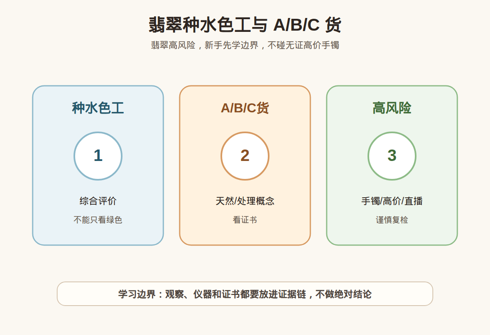

# 第 38 课：翡翠入门：种水色工和 A/B/C 货边界

## 1. 本课核心笔记

### 1.1 本课重要结论

这一课先记住 4 个结论：

1. 翡翠是重要玉石品类，评价体系和单晶宝石不同。
2. 种、水、色、工是入门常见评价维度。
3. A 货、B 货、C 货涉及天然和处理概念，必须看证书。
4. 翡翠手镯价格高、风险大，不适合新手凭直播间口头承诺购买。

一句话总结：

> 本课材料已备好，正式学习时重点区分“观察描述”和“购买结论”；高价货继续回到证书、复检和专业机构判断。

### 1.2 为什么学习这一课

这一课把前面学过的矿物学、宝石学仪器、证书和消费风险连接到具体品类或购买场景中。目标不是立刻做鉴定或估价，而是为后续正式学习准备一套清晰的概念框架和自媒体表达素材。

### 1.3 种水色工

综合评价 是这一课的核心观察点之一。学习时要把它放到具体品类、预算和证书语境中理解；不能只看绿色，但不能把单一信息点直接升级成鉴定、估价或产地结论。

### 1.4 A/B/C货

天然/处理概念 是这一课的核心观察点之一。学习时要把它放到具体品类、预算和证书语境中理解；看证书，但不能把单一信息点直接升级成鉴定、估价或产地结论。

### 1.5 高风险

手镯/高价/直播 是这一课的核心观察点之一。学习时要把它放到具体品类、预算和证书语境中理解；谨慎复检，但不能把单一信息点直接升级成鉴定、估价或产地结论。

### 1.6 消费边界

本课涉及的信息都只能作为学习和提问框架。真正购买时仍要看材料类别、证书、处理情况、预算、售后、复检支持和专业机构意见。不要用单一卖点做冲动决策。

## 2. 必背知识卡

### 卡片 1：种水色工

综合评价。消费翻译：不能只看绿色。

### 卡片 2：A/B/C货

天然/处理概念。消费翻译：看证书。

### 卡片 3：高风险

手镯/高价/直播。消费翻译：谨慎复检。

### 卡片 4：证据边界

观察、图片、视频、商家描述和单一证书字段都不是完整结论，需要放入证据链中理解。

## 3. 可交互作业

### 作业 1：概念判断

请回答下面问题，并尽量说明理由：

1. 本课中最容易被商家包装成卖点的是哪一个概念？
2. 这个概念能不能单独证明高价值？为什么？
3. 如果你看到相关商品，应该追问哪些证书或售后信息？
4. 这个品类更适合日常佩戴、礼物，还是学习样品？

### 作业 2：自媒体表达改写

把这句话改成更稳妥的小白学习表达：

> 这是 A 货翡翠，所以一定很贵。

建议改写：

> A 货只说明处理状态相关信息，不等于品质高或价格合理；还要看种水色工、证书、尺寸、瑕疵和市场价格。

### 作业 3：消费场景追问

如果在柜台、直播间或私域里听到类似说法，请至少追问：

1. 证书或检测依据是什么？
2. 是否说明处理、合成、仿制或其他限制？
3. 价格和预算是否匹配？
4. 是否支持复检和售后？

## 4. 自媒体内容草稿

### 4.1 图文/短视频标题备选

- 我学珠宝第 38 课：翡翠入门：种水色工和 A/B/C 货边界
- 珠宝小白先别急着下结论：这一课先看证据
- 这个知识点很基础，但能避开很多消费误区

### 4.2 短视频脚本

今天学珠宝第 38 课：翡翠入门：种水色工和 A/B/C 货边界。

我现在还是学习者，所以这节课不会做鉴定、估价或产地判断，而是先建立一个更稳妥的判断框架。

翡翠是重要玉石品类，评价体系和单晶宝石不同。

种、水、色、工是入门常见评价维度。

真正消费时，不能只听一个参数、一个故事、一个仪器反应或一张截图。高价货还是要看证书、核对样品，必要时复检或咨询专业机构。

### 4.3 图文结构

第 1 页：标题

- 翡翠入门：种水色工和 A/B/C 货边界

第 2 页：核心概念

- 翡翠是重要玉石品类，评价体系和单晶宝石不同。
- 种、水、色、工是入门常见评价维度。

第 3 页：为什么容易误解

- 商业话术常把一个信息点包装成完整结论。
- 新手容易把“观察描述”听成“专业判断”。

第 4 页：正确学习方式

- 先理解概念。
- 再看证据链。
- 最后明确风险和预算。

第 5 页：消费提醒

- 不做真假鉴定结论。
- 不做估价结论。
- 不做产地判断。
- 高价货看证书、复检和专业机构。

第 6 页：互动问题

- 你最想把这一课里的哪个点做成短视频？

### 4.4 配图、视频与分屏素材

本课已准备发布素材包：

- [翡翠种水色工与 A/B/C 货 PNG](../assets/lesson-38/jadeite-basics-abc.png) / [SVG 源文件](../assets/lesson-38/jadeite-basics-abc.svg)
- [第 38 课短视频分镜](../assets/lesson-38/video-shotlist.md)
- [第 38 课分屏视频脚本](../assets/lesson-38/split-screen-script.md)
- [第 38 课图文轮播稿](../assets/lesson-38/carousel-copy.md)

### 4.5 评论区互动问题

你在买珠宝时最容易被哪类说法打动？你希望我下一条把哪个概念拆成小白版？

## 5. 学习档案更新

- 材料状态：已备课，待后续正式学习。
- 本课主题：翡翠入门：种水色工和 A/B/C 货边界。
- 学习时重点确认：
- 翡翠是重要玉石品类，评价体系和单晶宝石不同。
- 种、水、色、工是入门常见评价维度。
- A 货、B 货、C 货涉及天然和处理概念，必须看证书。
- 翡翠手镯价格高、风险大，不适合新手凭直播间口头承诺购买。
- 学习后需要复习：
  - 本课关键术语。
  - 本课和证书、仪器、预算之间的关系。
  - 如何把观察描述和鉴定结论分开。
- 已准备自媒体素材：
  - 关键配图 PNG 和 SVG 源文件。
  - 60-90 秒短视频分镜。
  - 分屏视频脚本。
  - 6 页图文轮播稿。
- 学完本课后的下一课建议：第 39 课：和田玉与软玉入门：产状、油润感和证书。
