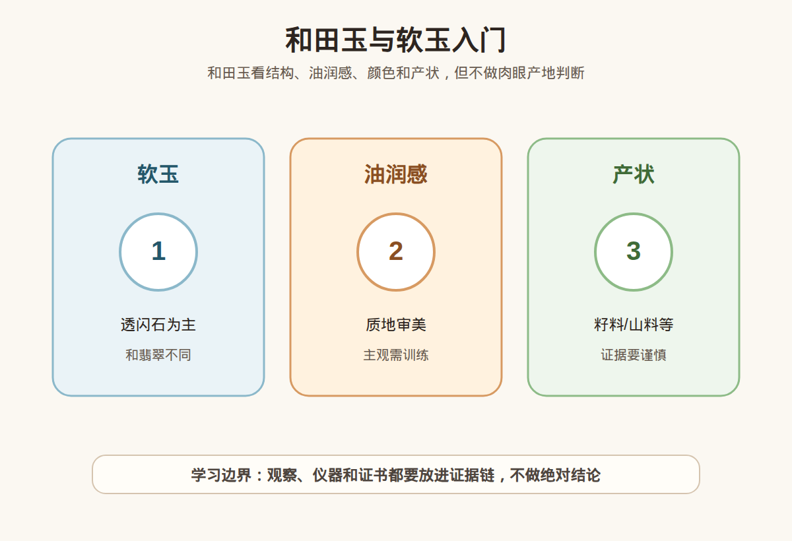

# 第 39 课：和田玉与软玉入门：产状、油润感和证书

## 1. 本课核心笔记

### 1.1 本课重要结论

这一课先记住 6 个结论：

1. 和田玉通常属于软玉体系，主要矿物成分为透闪石至阳起石系列，和翡翠的硬玉体系不同。
2. “软玉”不是说它很软，而是相对于硬玉翡翠的传统分类名称；软玉韧性好，但仍要避免摔碰和错误保养。
3. 山料、籽料、山流水料等产状概念很重要，但产状判断复杂，新手不应凭肉眼、皮色或故事给产地和产状下结论。
4. 油润感是和田玉常见审美描述，来自质地、结构、抛光、光线和触感等综合感受，不是单独的鉴定证据。
5. 证书能帮助确认材料名称和部分检测信息，但普通证书不一定解决产地、产状、年代和市场价值问题。
6. 消费红线是：不碰故事型无证高价货，不把“籽料”“羊脂”“老熟”“油润”当成无需证据的付款理由。

一句话总结：

> 和田玉入门先分清软玉与翡翠，再把产状话术、油润感、证书范围和价格风险分开；好看的描述可以学习，但不能替代证据。

### 1.2 为什么和田玉容易被故事带跑

和田玉的消费场景里，故事比参数更容易打动人：籽料、皮色、洒金皮、羊脂白、老熟、细腻、油润、名家工、传承、收藏。这些词有些确实对应审美和市场经验，但对新手来说，最危险的是把故事听成结论，把感受听成证据。

这一课要建立三条线：材料线，确认是不是软玉体系；审美线，学习细腻度、油润感、颜色和工艺；证据线，看证书、实物、复检和售后。三条线缺一条，高价购买都容易失衡。

### 1.3 软玉是什么：透闪石—阳起石系列

宝石学里，软玉通常指以透闪石至阳起石系列矿物为主的玉石材料。和田玉常属于软玉体系。这里的“软”不是日常语言里的容易划伤、容易坏，而是相对于翡翠硬玉的传统分类称呼。软玉莫氏硬度一般约 6-6.5，韧性较好，适合雕刻和佩戴，但仍然会有磕碰、裂纹、磨损和污染风险。

翡翠和和田玉的区别非常适合作为入门对照：

| 项目 | 和田玉/软玉 | 翡翠/硬玉 |
| --- | --- | --- |
| 主要矿物 | 透闪石至阳起石系列为主 | 硬玉为主，可含其他矿物 |
| 结构观感 | 常强调细腻、温润、油脂感 | 常强调种、水、色、工和通透感 |
| 常见颜色 | 白、青白、青、碧、墨、黄等 | 绿、紫、无色、白、红黄翡、墨等 |
| 硬度理解 | 约 6-6.5，韧性好但不等于不怕摔 | 约 6.5-7，集合体特征明显 |
| 消费风险 | 产状、皮色、羊脂等话术复杂 | A/B/C 货、种水色工和手镯风险突出 |

### 1.4 山料、籽料：产状概念要谨慎表达

山料、籽料、山流水料等词常被用来描述和田玉的产状或形成、搬运环境。籽料通常与河流搬运、磨圆、皮色等特征联系在一起，市场关注度高。但这也是话术风险最高的区域之一。

新手要记住：看到皮色、毛孔、形状，并不能单独证明籽料。皮色可能被处理或仿造，外形可能被修磨，照片和视频会受光线影响。即使是经验丰富的人，也需要结合实物、结构、皮色状态、磨圆特征、证据来源和市场经验综合判断。普通消费者更适合把“籽料”当作需要证据支持的销售主张，而不是付款前自己肉眼确认的结论。

| 话术 | 可以作为观察吗 | 能否单独证明 | 应该追问 |
| --- | --- | --- | --- |
| 有皮色 | 可以观察颜色分布和表面状态 | 不能单独证明籽料 | 皮色是否天然？证书或专业意见是否覆盖？ |
| 毛孔明显 | 可以作为表面特征观察 | 不能单独证明产状 | 是否有修磨、滚磨或后期处理可能？ |
| 羊脂级 | 是高强度商业卖点 | 不能替代证书和品质细节 | 白度、细度、油润、瑕疵、价格依据是什么？ |
| 老熟油润 | 可作审美描述 | 不能单独定价 | 自然光视频、结构近照、对比样品有没有？ |
| 新疆料/某产地 | 属于更高风险主张 | 新手不宜肉眼判断 | 证书是否检测产地？销售承诺是否写入凭证？ |

### 1.5 油润感、细腻度和工艺：观察描述要落到细节

和田玉常讲油润感。油润感可以理解为视觉和触感上的温润、柔和、细腻，不是表面真的涂油。它受到矿物颗粒细腻程度、结构致密程度、抛光质量、颜色、光线、佩戴状态等影响。学习时可以描述“看起来油润”“抛光柔和”“结构细腻”，但不能说“油润所以一定是真籽料”“摸着润所以一定高价”。

和田玉评价常见维度包括：细度、油润感、颜色、净度、工艺、尺寸、完整度和题材。雕件还要看工是否顺料、是否为了避裂而设计，线条是否干净，比例是否舒服。手串要看珠子大小、颜色和结构是否匹配。平安扣、无事牌要看厚度、边缘、抛光和瑕疵位置。

| 维度 | 观察语言 | 消费边界 |
| --- | --- | --- |
| 细度 | 结构细不细，颗粒感强不强 | 照片可能看不清，要看近景和自然光 |
| 油润感 | 光泽是否柔和温润 | 是审美描述，不是产状证据 |
| 颜色 | 白、青白、青、碧、墨等 | 白不等于一定好，颜色要结合细度和净度 |
| 净度 | 棉、僵、裂、脏、黑点 | 瑕疵位置影响佩戴和价格 |
| 工艺 | 线条、比例、抛光、题材 | 名家工要看证据，不只听署名故事 |
| 匹配 | 手串或套装的颜色结构协调 | 单颗漂亮不等于整串协调 |

### 1.6 证书、购买清单与红线

和田玉证书通常能帮助确认材料名称，例如是否为和田玉、软玉或其他玉石材料。但证书范围要看具体机构和具体项目，不要默认一张普通证书就证明产地、产状、羊脂等级、年代、名家工和市场价格。高价购买时，要把销售承诺写入订单或聊天记录：材料名称、产地/产状承诺、是否处理、证书编号、复检规则、退换条件。

购买清单：第一，看证书名称和编号；第二，看自然光整体视频和结构近照；第三，看瑕疵位置和是否有裂；第四，看尺寸、重量、厚度和工艺；第五，确认产状、产地、皮色等高风险主张是否有可验证证据；第六，确认复检不一致的处理方式；第七，避免超预算买故事；第八，不为转卖升值预期付款。

红线：不凭皮色定籽料；不凭油润感定产地；不把“羊脂”“老熟”“洒金皮”当无条件高价理由；不在没有证书和复检规则时购买高价货；不替别人做产地、产状和估价结论；不把和田玉和翡翠混称为同一种玉。

## 2. 必背知识卡

### 卡片 1：软玉

软玉通常以透闪石至阳起石系列矿物为主。和田玉常属于软玉体系，和翡翠硬玉体系不同。

### 卡片 2：软不等于脆弱

软玉的“软”是相对硬玉的传统分类名称，不是说日常特别软。它韧性好，但仍要防摔、防裂、防污染。

### 卡片 3：山料与籽料

产状概念重要但复杂。新手不能凭皮色、毛孔、外形肉眼判断籽料，更不能替别人背书。

### 卡片 4：油润感

油润感是质地、结构、抛光、光线和触感形成的审美描述，不是单独鉴定证据。

### 卡片 5：证书范围

证书能帮助确认材料类别，但不一定覆盖产地、产状、羊脂等级、年代、作者和市场价值。

### 卡片 6：和翡翠区别

和田玉多强调细腻温润，翡翠常讲种水色工。两者矿物体系、审美语言和消费风险不同。

## 3. 可交互作业

### 作业 1：概念判断

请判断：软玉就是很软很不耐戴；有皮色就是籽料；油润感好就能证明产地；证书写和田玉就一定证明它是高价籽料。

参考方向：四句都不准确。软玉是相对硬玉的分类名称；皮色不能单独证明籽料；油润感是审美观察，不是产地证据；证书通常确认材料类别，不自动证明高价产状和市场价值。

### 作业 2：高价和田玉追问题

看到一件标称“新疆籽料羊脂白”的高价挂件，你至少要问什么？

参考方向：证书名称、编号和检测范围；销售承诺是否写明产地/产状；皮色和毛孔是否有清晰自然光近照；是否支持复检且复检不符如何退；尺寸、重量、厚度、裂和瑕疵；工艺作者证据；价格依据；是否有完整付款凭证和售后规则。

### 作业 3：自媒体表达改写

把“看皮色就是籽料，肯定值钱”“摸着很油，产地肯定对”“和田玉比翡翠更养人所以闭眼买”改成稳妥表达。

参考改写：皮色只能作为观察特征，不能单独判断籽料或价值；油润感是审美描述，不能替代证书和专业判断；和田玉和翡翠是不同玉石体系，购买要看材料、品质、证书、预算和售后，不使用养生承诺做购买理由。

## 4. 自媒体内容草稿

### 4.1 图文/短视频标题备选

- 我学珠宝第 39 课：和田玉不是翡翠，软玉也不是很软
- 籽料、山料怎么听才不被故事带跑？
- 油润感是什么？它为什么不能单独证明价值
- 买高价和田玉前，我会先问这 8 件事

### 4.2 短视频脚本

今天学和田玉和软玉入门。第一，和田玉通常属于软玉体系，主要矿物是透闪石到阳起石系列，和翡翠的硬玉体系不同。第二，软玉不是说它特别软，而是传统分类名称。第三，籽料、山料这些产状词很重要，但新手不能靠皮色、毛孔和故事自己下结论。第四，油润感可以描述质地和观感，却不能单独证明产地或价格。高价购买要看证书范围、复检规则和售后承诺。我现在只做学习表达，不替单件货定产地、定产状或估价。

### 4.3 图文结构

第 1 页：和田玉不是翡翠，软玉也不是很软。第 2 页：软玉主要是透闪石至阳起石系列。第 3 页：山料、籽料是产状概念，新手不凭皮色下结论。第 4 页：油润感是观察描述，不是鉴定证据。第 5 页：证书要看检测范围，不默认覆盖产地和产状。第 6 页：红线是不碰故事型无证高价货，不承诺升值和养生。

### 4.4 配图与视频建议

本课保留这组基础视觉素材：

- [和田玉与软玉入门 PNG](../assets/lesson-39/nephrite-hetian-jade-basics.png) / [SVG 源文件](../assets/lesson-39/nephrite-hetian-jade-basics.svg)
- [第 39 课短视频分镜](../assets/lesson-39/video-shotlist.md)
- [第 39 课分屏视频脚本](../assets/lesson-39/split-screen-script.md)
- [第 39 课图文轮播稿](../assets/lesson-39/carousel-copy.md)

### 4.5 评论区互动问题

你听到“籽料”“羊脂”“油润”时，最想先弄懂哪个词？你觉得和田玉和翡翠最容易混淆的地方是什么？

## 5. 学习档案更新

- 材料状态：已备课，待学习。
- 本课主题：和田玉与软玉入门：产状、油润感和证书。
- 已掌握：和田玉通常属于软玉体系；软玉主要为透闪石至阳起石系列；山料和籽料等产状话术需要证据；油润感是观察描述；证书范围有限；和田玉与翡翠不是同一种材料。
- 需要复习：软玉和硬玉的区别，产状词的消费边界，油润感与细腻度的表达，证书能证明什么和不能证明什么。
- 自媒体素材：本课适合做“软玉不是很软”“籽料话术怎么听”“油润感不能当证据”三类内容。
- 下一课建议：珠宝预算与购买流程：从需求到复检到售后。
