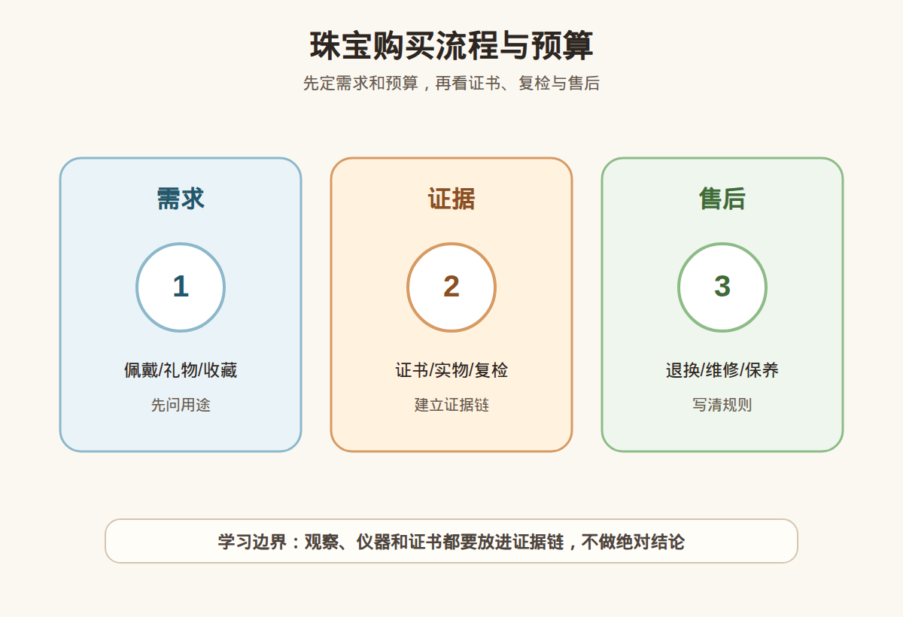

# 第 40 课：珠宝预算与购买流程：从需求到复检到售后

## 1. 本课核心笔记

### 1.1 本课重要结论

这一课先记住 6 个结论：

1. 珠宝购买要按需求、预算、品类、证据链、决策五步走，不要被款式、产地故事、直播节奏或限时优惠牵着走。
2. 预算不是只看能不能付款，还要包括复检费、维修费、改圈费、保养成本、退换风险和机会成本。
3. 证据链至少包括商品名称、证书、处理说明、实物影像、售后规则、复检约定和付款凭证。
4. 不同品类风险不同：钻石看分级和镶嵌，彩宝看处理和耐久，珍珠看光泽匹配和保养，翡翠和和田玉尤其要重视证书、复检和话术边界。
5. 高价购买要慢决策，不冲动下单，不替别人垫大额库存，不把升值或转卖作为新手购买理由。
6. 做自媒体或副业时，必须避免绝对鉴定、估价承诺、产地承诺、投资承诺和私下高压成交。

一句话总结：

> 珠宝购买不是“喜欢就冲”，而是先明确需求和预算，再选择品类，建立证书、处理、售后、复检组成的证据链，最后在红线内做决策。

### 1.2 为什么要把购买流程单独成课

学完很多宝石品类后，真正下单时最容易出错的不是知识完全不会，而是流程被打断。你本来想买日常佩戴耳钉，结果被“收藏级”“源头货”“今天最后一件”带到高价手镯；你本来只想买学习样品，结果听到“以后会涨”就超预算；你本来知道要看证书，却因为主播说“信我”就没有约定复检。

所以第 40 课不讲某一个宝石，而是把所有品类放进一个购买流程。流程的作用是让你在兴奋、稀缺、面子和恐惧错过之间，仍然能慢下来做检查。

### 1.3 五步购买流程：需求 → 预算 → 品类 → 证据链 → 决策

| 步骤 | 要回答的问题 | 做错会怎样 | 安全做法 |
| --- | --- | --- | --- |
| 需求 | 自戴、礼物、婚庆、收藏学习、拍内容？ | 需求不清会被高价卖点带跑 | 先写使用场景、佩戴频率、对方喜好和禁忌 |
| 预算 | 最高能花多少，亏损能承受多少？ | 只看付款能力，忽略复检和退换成本 | 设置上限、预留复检维修费，不借贷冲动买 |
| 品类 | 哪个材料更适合需求？ | 用错误品类满足需求，例如把娇气宝石当通勤戒指 | 按耐久性、保养、证书成熟度和审美选择 |
| 证据链 | 名称、处理、证书、实物、售后是否闭环？ | 付款后发现信息缺失，维权困难 | 下单前保存商品页、证书、聊天和售后承诺 |
| 决策 | 是否仍然值得买？是否有冷静期？ | 被限时优惠压迫，超预算成交 | 高价货隔夜决策，复检条件写清再付款 |

需求要具体。不要只写“想买一件珠宝”，要写“通勤每天戴的耳钉”“送妈妈的珍珠项链”“拍学习视频用的低价标本”“婚礼当天用的项链”。不同需求会改变品类选择和预算。每天戴的戒指要更看耐久和镶嵌；礼物要更看售后和尺寸；学习样品要重视标签清楚和价格可控；收藏预算则要更严格地看证据和退出风险。

预算要有三层：心理预算、硬上限、止损线。心理预算是愿意花的舒适金额；硬上限是无论话术多诱人都不超过的金额；止损线是发现证据不足时愿意放弃的点。珠宝不是生活必需品，不能用借贷、透支、挪用应急资金来购买。

### 1.4 完整购买清单：下单前逐项打勾

这一节是第 40 课最重要的工具。无论买的是托帕石、珍珠、翡翠、和田玉、钻石还是其他彩宝，都可以按下面清单走。

#### A. 需求与预算

1. 这件珠宝的用途是什么：自戴、礼物、婚庆、收藏、学习样品还是内容拍摄？
2. 佩戴频率是什么：每天、通勤、偶尔活动、只收藏展示？
3. 佩戴位置是什么：戒指、手镯、项链、吊坠、耳饰、胸针？位置越容易碰撞，越要看耐久性。
4. 预算上限是多少？是否包含证书、复检、邮费、保险、维修、改圈、换线和保养？
5. 如果复检不符或无法退货，最大可承受损失是多少？

#### B. 品类与耐久

1. 材料名称是否明确，商品标题、证书、发票或订单是否一致？
2. 这个品类是否适合目标佩戴场景，例如坦桑石和珍珠不适合粗暴高频佩戴，托帕石要注意解理，翡翠手镯要看纹裂。
3. 是否存在常见处理：蓝托帕辐照加热，坦桑石热处理，蓝锆石热处理，彩宝加热/扩散/充填，珍珠染色，翡翠 B/C 货等？
4. 处理是否被明确说明，价格是否按相应处理状态理解？
5. 保养要求是否能接受，例如珍珠防酸防干燥，欧泊防干裂，祖母绿防超声波，软玉防故事型高价。

#### C. 证书与实物核对

1. 证书机构是否可信，证书编号能否官网核验？
2. 证书照片、重量、尺寸、形状、颜色描述是否能对应实物？
3. 证书结论写的是材料名称、处理状态，还是只写商业名称？有没有备注？
4. 镶嵌货是否存在遮挡，证书是否说明检测限制？
5. 高价货是否支持到手复检？复检机构、期限、费用和结果不一致的处理方式是否写清？

#### D. 图片视频与沟通证据

1. 是否有自然光、室内普通光、强光、近景、远景、上身或上手视频？
2. 瑕疵是否单独拍清楚：裂、纹、坑、棉、黑点、磨损、掉皮、松动？
3. 是否保存商品页面、直播截图、聊天记录、证书图片、售后承诺和付款凭证？
4. 是否确认尺寸：戒指圈号、手镯圈口、项链长度、珠子直径、吊坠重量和厚度？
5. 是否确认金属材质、镶嵌牢固度、扣头、链子、证书和包装是否一起交付？

#### E. 售后与决策

1. 退换期几天，从签收还是付款开始计算？拆封、试戴、改圈、定制是否影响退换？
2. 复检不符谁承担费用和运费？如果证书与实物不符是否无条件退？
3. 维修、改圈、换线、清洗、保养如何收费？是否有书面规则？
4. 高价货是否经过隔夜冷静？是否咨询过不参与交易的第三方？
5. 如果不能转卖、不能升值、不能退货，你是否仍愿意为佩戴和审美付款？

### 1.5 证据链怎么判断够不够

证据链不是一张证书，也不是一句“支持复检”。它至少要形成闭环：商品是什么，是否处理，实物是否对应，价格按什么逻辑，出现争议如何解决。

| 证据 | 能解决什么 | 不能替代什么 |
| --- | --- | --- |
| 证书 | 材料名称、部分处理信息、样品基础信息 | 不能替代审美、佩戴舒适度和所有市场价值判断 |
| 实物影像 | 颜色、瑕疵、比例、佩戴效果 | 不能替代检测结论，灯光可能美化 |
| 处理说明 | 帮助理解价格和稳定性 | 不能只口头说，要体现在商品描述或凭证 |
| 售后规则 | 争议发生时怎么处理 | 不能只靠“放心买”这类安抚话术 |
| 复检约定 | 给高价货增加安全阀 | 不能拖到超过退货期才讨论 |
| 付款凭证 | 维权和售后依据 | 不能证明商品本身一定真实或值价 |

当证据链缺口太多时，最好的决策不是继续找理由下单，而是降低预算、换品类、换渠道或放弃。珠宝消费里，错过一件货通常不是灾难；买错一件高价货才可能长期后悔。

### 1.6 自媒体/副业边界与红线

如果你做珠宝学习账号或尝试副业，边界要比普通消费者更清楚。你可以分享学习笔记、拆解公开知识、整理购买清单、提醒证书和复检，但不能把自己包装成鉴定机构或估价师。

自媒体表达边界：第一，明确自己是学习者或内容整理者，不给单件货下真假、A 货、产地、产状、处理、估价结论；第二，引用资料要说明来源，不偷换成个人权威；第三，不使用“一眼假”“包真”“必涨”“源头最低”“闭眼冲”等绝对话术；第四，不用他人证书和图片做误导性背书；第五，不引导粉丝私下高价转账购买未经核验的货。

副业红线：不垫大额库存；不替朋友或粉丝做高价代购背书；不收钱做自己能力范围外的鉴定估价；不承诺投资回报、升值、回收和保本；不把处理货、仿品、残次货模糊销售；不隐瞒佣金、合作和利益关系；不把客户复检权利写得模糊；不因为成交压力省略风险提示。

如果确实要做低风险副业，可以从内容整理、学习资料、低价配饰审美分享、正规品牌导购体验、保养清单、证书核验流程教学开始。任何涉及高价实物交易、代购、寄售、回收、鉴定、估价、产地判断，都要等专业能力、资质、供应链、合同和售后体系成熟后再考虑。

## 2. 必背知识卡

### 卡片 1：五步流程

珠宝购买按需求、预算、品类、证据链、决策走。流程是为了防止被限时优惠、故事和情绪带跑。

### 卡片 2：预算三层

预算包括心理预算、硬上限和止损线，还要预留复检、维修、改圈、保养、邮费和退换成本。

### 卡片 3：证据链

证据链至少包括商品名称、证书、处理说明、实物影像、售后规则、复检约定和付款凭证。

### 卡片 4：高价慢决策

高价货要隔夜冷静，不冲动下单，不垫大额库存，不把升值和转卖作为新手购买理由。

### 卡片 5：售后写清

退换、维修、复检、运费、损伤责任和定制限制要写清，口头安抚不能替代规则。

### 卡片 6：副业红线

学习账号不能冒充鉴定机构，不做绝对真假、估价、产地、投资承诺，不私下推动高价无证交易。

## 3. 可交互作业

### 作业 1：流程排序

请把下面动作按安全购买顺序排序：付款；确定佩戴需求；核验证书和处理说明；设定预算上限；选择适合品类；约定复检和售后；隔夜冷静后决策。

参考方向：确定佩戴需求 → 设定预算上限 → 选择适合品类 → 核验证书和处理说明 → 约定复检和售后 → 隔夜冷静后决策 → 付款。实际购买可以有来回调整，但不能先付款再补证据。

### 作业 2：完整清单应用

你准备买一只 2 万元翡翠手镯，请写出至少 10 项下单前必须确认的信息。

参考方向：圈口、条宽、厚度、重量；自然光和室内光视频；纹裂和瑕疵位置；证书编号、照片和尺寸核对；是否 A 货的检测结论；是否支持复检；复检不符退货规则；运输保险和损伤责任；付款凭证和商品描述留存；试戴和拆封是否影响退换；预算是否包含复检和维修；是否经过隔夜冷静。

### 作业 3：自媒体/副业表达改写

把“我帮你一眼鉴定真假”“这批货闭眼冲，肯定升值”“你先转钱，我帮你垫货源”改成符合边界的表达。

参考改写：我只能分享学习观察和购买清单，不能替代专业检测，单件货请看证书和复检；珠宝不适合用升值承诺推动购买，是否下单应回到预算、需求和证据链；我不做高价垫资和私下代购，涉及交易应走清晰合同、正规凭证、复检和售后规则。

## 4. 自媒体内容草稿

### 4.1 图文/短视频标题备选

- 我学珠宝第 40 课：买珠宝前先过这张清单
- 需求、预算、证书、复检：小白购买流程一次讲清
- 做珠宝学习账号可以说什么，不能说什么？
- 高价珠宝为什么要隔夜冷静？

### 4.2 短视频脚本

今天学第 40 课：珠宝预算与购买流程。我给自己整理了五步：需求、预算、品类、证据链、决策。需求要先写清楚，是自戴、礼物、婚庆、学习样品还是内容拍摄；预算要有硬上限，还要算复检、维修、改圈和退换成本；品类要匹配佩戴场景，不要把娇气材料当通勤耐造款；证据链要包括证书、处理说明、实物视频、售后、复检和付款凭证；最后高价货要隔夜冷静。做自媒体也一样，我可以分享学习笔记和清单，但不能冒充鉴定机构，不能估价承诺，不能说必涨，不能推动私下高价交易。

### 4.3 图文结构

第 1 页：买珠宝前先过这张清单。第 2 页：第一步需求，写清用途和佩戴频率。第 3 页：第二步预算，设硬上限和止损线。第 4 页：第三步品类，按耐久、保养和证书成熟度选择。第 5 页：第四步证据链，证书、处理、实物、售后、复检、凭证缺一不可。第 6 页：第五步决策，高价隔夜冷静；副业不碰鉴定估价和升值承诺。

### 4.4 配图与视频建议

本课保留这组基础视觉素材：

- [珠宝购买流程与预算 PNG](../assets/lesson-40/jewelry-buying-workflow-budget.png) / [SVG 源文件](../assets/lesson-40/jewelry-buying-workflow-budget.svg)
- [第 40 课短视频分镜](../assets/lesson-40/video-shotlist.md)
- [第 40 课分屏视频脚本](../assets/lesson-40/split-screen-script.md)
- [第 40 课图文轮播稿](../assets/lesson-40/carousel-copy.md)

### 4.5 评论区互动问题

你买珠宝时最容易跳过哪一步：预算上限、证书核验、复检约定，还是售后规则？

## 5. 学习档案更新

- 材料状态：已备课，待学习。
- 本课主题：珠宝预算与购买流程：从需求到复检到售后。
- 已掌握：购买流程是需求、预算、品类、证据链、决策；预算要包括隐藏成本；证据链由证书、处理、售后、复检和凭证构成；高价货要慢决策；自媒体和副业不能越过鉴定、估价、产地和投资承诺边界。
- 需要复习：不同品类的耐久性和处理风险，证书核验方法，复检约定写法，售后和退换规则，副业合规边界。
- 自媒体素材：本课适合做“珠宝购买清单”和“副业红线”两类内容，尤其适合置顶作为账号边界说明。
- 下一课建议：珠宝自媒体选题库：学习笔记、避坑拆解和预算建议。
